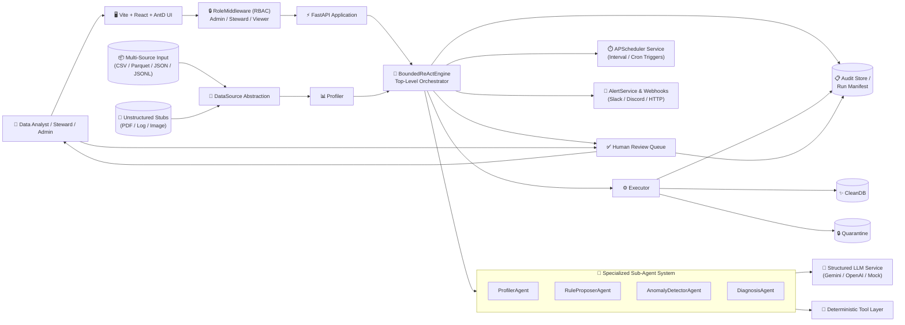
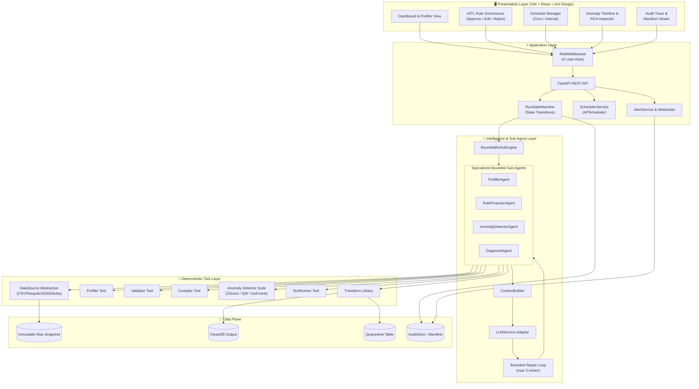
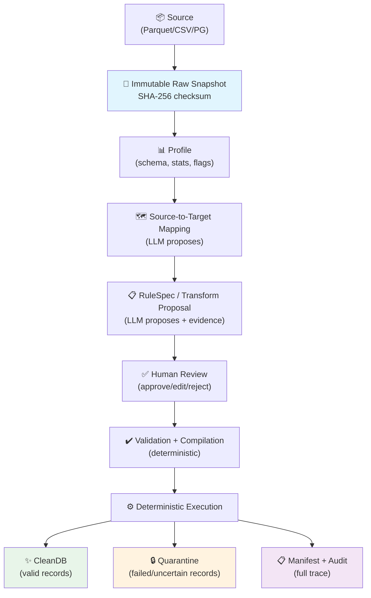
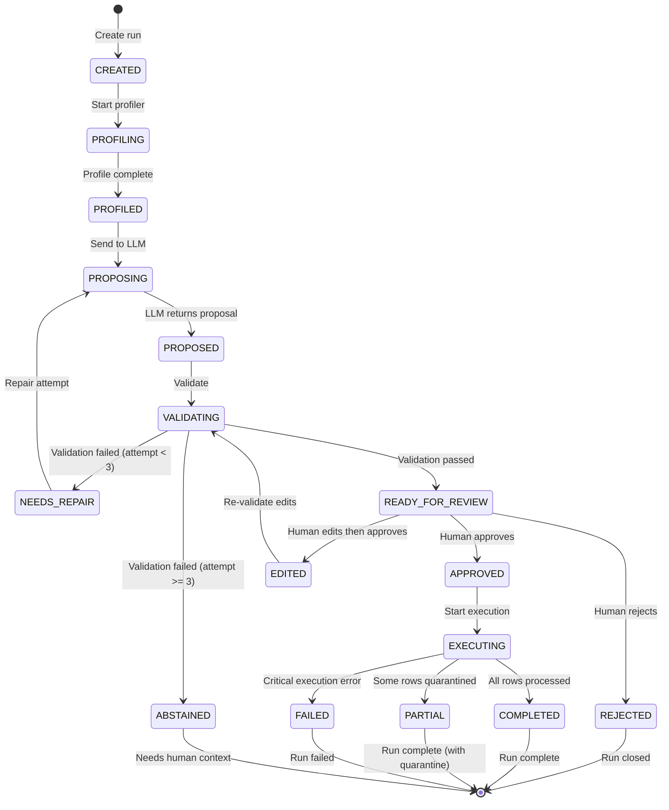

# DataTrust OS — v2 Architecture Document

> **Status:** Confirmed v2 Architecture Design  
> **Version:** v2.0  
> **Last updated:** 2026-08-01  

---

## 1. Principles & Scope

### 1.1 Architecture principles

| # | Principle | Implication |
|---|---|---|
| P1 | **Probabilistic proposal; deterministic execution** | LLM suggests rules/mappings; only approved, compiled plans run against data |
| P2 | **Human approval at risky boundaries** | Every transformation proposal passes through HITL before execution |
| P3 | **Immutable raw input** | Source data is snapshotted with checksum; never mutated |
| P4 | **Explicit module contracts** | Each module has typed input/output; no implicit coupling |
| P5 | **Structured output only** | LLM produces JSON conforming to schemas; no free-text mutations |
| P6 | **No arbitrary code execution** | LLM cannot run arbitrary Python/SQL; only whitelisted tool calls |
| P7 | **Every run has a manifest and trace** | Input checksums, operations, outputs, decisions — all recorded |
| P8 | **Fail closed: quarantine or abstain** | Unknown/uncertain records go to quarantine, not silently dropped |
| P9 | **Provider-agnostic LLM adapter** | Swap Gemini/GPT/Claude without changing orchestration logic |
| P10 | **Specialized Sub-Agent Decomposition** | Modular agents for profiling, rule proposal, anomaly detection, and root-cause diagnosis |
| P11 | **Multi-Source Data Abstraction** | Polymorphic `DataSource` for tabular (CSV, Parquet, JSON, JSONL) & non-tabular stubs |
| P12 | **Scheduled Monitoring & Governance** | Background `APScheduler` monitoring, `AlertService` webhooks, and `RoleMiddleware` RBAC |

### 1.2 v2 System Architecture Scope

**In scope (v2):**
- **Multi-Source Abstraction:** Polymorphic `DataSource` hierarchy supporting CSV, Parquet, JSON, and JSONL formats with `PDFSource`, `LogSource`, and `ImageSource` stubs.
- **Sub-Agent Decomposition:** 4 specialized sub-agents (`ProfilerAgent`, `RuleProposerAgent`, `AnomalyDetectorAgent`, `DiagnosisAgent`) operating with whitelisted tools and confidence thresholds.
- **Scheduled Monitoring & Alerts:** Background `APScheduler` integration (`SchedulerService`) with interval/cron triggers, `AlertService` for in-app notifications and HTTP webhook dispatch.
- **Statistical Anomaly Detection:** Tri-detector suite comprising `ZScoreDetector`, `IQRDetector`, and `IsolationForestDetector` for historical profile drift analysis.
- **Role-Based Access Control:** `RoleMiddleware` enforcing `Admin`, `Steward`, and `Viewer` permission boundaries.
- **Expanded Evaluation Harness:** `eval/benchmark.py` harness measuring Anomaly Precision/Recall, Root-Cause Accuracy, Scheduling SLA Compliance, and Human Minutes Saved.
- **Core Pipeline:** Immutable raw snapshots (SHA-256), deterministic profiling, target mapping, HITL approval queue, clean output + quarantine + cryptographic manifest.

---

## 2. System Context



**Actors & Roles:**
- **Admin:** Full system control, reset capabilities, schedule deletion, alert management.
- **Steward:** Reviews rule proposals, approves/edits/rejects transformations, configures schedules.
- **Viewer:** Read-only access to dashboards, clean datasets, audit traces, and anomaly reports.

---

## 3. Module Diagram




---

## 4. Module Contracts

### 4.1 Source Connector

```
Input:  ConnectionConfig { type: "parquet"|"csv"|"postgresql", path_or_uri: str, options: dict }
Output: RawSnapshot { snapshot_id: uuid, checksum_sha256: str, row_count: int, schema: list[Column], created_at: datetime }
```

**Behavior:** Read-only. Creates immutable copy. Never modifies source. Fails if checksum verification fails.

### 4.2 Profiler

```
Input:  RawSnapshot
Output: Profile {
  snapshot_id: uuid,
  columns: list[ColumnProfile {
    name: str, dtype: str, null_count: int, null_pct: float,
    unique_count: int, cardinality: float, min/max/mean/median/std,
    top_values: list[ValueCount], pattern_summary: str
  }],
  row_count: int, duplicate_count: int,
  cross_field_correlations: list[Correlation],
  candidate_keys: list[str],
  quality_flags: list[QualityFlag]
}
```

**Behavior:** Deterministic. No LLM. Pure statistics + heuristics. Sampling for tables > 1M rows.

### 4.3 Context Builder

```
Input:  Profile + TargetSchema (optional) + PreviousProposals (optional)
Output: StructuredPrompt { system: str, user: str, schema_context: str, examples: list }
```

**Behavior:** Assembles profile data into a prompt that requests structured JSON output. Includes few-shot examples. Never sends raw data rows to LLM — only metadata and aggregates.

### 4.4 Structured LLM Adapter

```
Input:  StructuredPrompt + OutputSchema (JSON Schema)
Output: LLMResponse { proposal: Proposal | null, confidence: float, uncertainty: list[str], token_usage: TokenUsage, provider: str, model: str, latency_ms: int }
```

**Behavior:** Provider-agnostic. Forces structured output (function calling / JSON mode). Returns `null` with abstention reason if confidence too low. Hard timeout (30s). Token budget cap.

### 4.5 Proposal

```
Proposal {
  proposal_id: uuid,
  run_id: uuid,
  mappings: list[FieldMapping { source: str, target: str, transform: str|null, confidence: float }],
  rules: list[RuleSpec {
    rule_id: uuid, target_field: str,
    family: "not_null"|"unique"|"range"|"format"|"cross_field"|"semantic",
    parameters: dict, severity: "error"|"warning"|"info",
    action: "quarantine"|"flag"|"drop"|"impute_default",
    failure_behavior: "fail_row"|"fail_batch"|"warn",
    evidence: str, confidence: float, source: "profiler"|"llm"|"human"
  }],
  transforms: list[TransformSpec { source_field: str, target_field: str, operation: str, params: dict }],
  requires_approval: bool,
  abstentions: list[Abstention { field: str, reason: str }]
}
```

### 4.6 Bounded Repair

```
Input:  ValidationFailure { proposal_id, failures: list[RuleFailure], attempt: int }
Output: RevisedProposal | Abstention
```

**Behavior:** Max 3 repair attempts. Each attempt gets structured failure feedback. If still failing after 3, abstains and flags for human review. Never invents data.

### 4.7 Validator

```
Input:  Proposal
Output: ValidationResult { valid: bool, errors: list[ValidationError], warnings: list[str] }
```

**Behavior:** Deterministic. Checks schema compatibility, type safety, range validity, referential integrity. No LLM.

### 4.8 Compiler

```
Input:  ValidatedProposal + ApprovalDecisions
Output: ExecutionPlan { plan_id: uuid, steps: list[ExecutionStep { operation, params, order }], estimated_rows: int }
```

**Behavior:** Deterministic. Converts approved rules into ordered execution steps. Each step is a whitelisted operation from the Transform Library.

### 4.9 Executor

```
Input:  ExecutionPlan + RawSnapshot
Output: ExecutionResult {
  plan_id: uuid, clean_rows: int, quarantined_rows: int, dropped_rows: int,
  errors: list[ExecutionError], duration_ms: int,
  output_checksum: str, manifest: RunManifest
}
```

**Behavior:** Deterministic. Idempotent (same input + plan = same output). Writes to CleanDB and Quarantine. Never modifies Raw.

### 4.10 Audit Store

```
AuditEvent {
  event_id: uuid, run_id: uuid, timestamp: datetime,
  actor: "system"|"llm"|"human", actor_id: str,
  action: str, target: str,
  before: json|null, after: json|null,
  evidence: str|null, reason: str|null
}
```

**Behavior:** Append-only. Every state transition, proposal, decision, and execution step recorded. No deletions.

### 4.11 Human Decision

```
HumanDecision {
  decision_id: uuid, proposal_id: uuid,
  actor: str, timestamp: datetime,
  decision: "approve"|"edit"|"reject",
  before: json, after: json,
  reason: str
}
```

### 4.12 Run Manifest

```
RunManifest {
  run_id: uuid, snapshot_id: uuid,
  input_checksum: str, output_checksum: str,
  target_schema_version: str,
  total_rows: int, clean_rows: int, quarantined_rows: int,
  operations: list[str], duration_ms: int,
  errors: list[str], tests_passed: int, tests_failed: int,
  model_version: str, prompt_version: str,
  created_at: datetime
}
```

---

## 5. Workflow Sequence

```mermaid
sequenceDiagram
    actor User
    participant UI as Guided UI
    participant API as FastAPI
    participant P as Profiler
    participant O as Orchestrator<br/>(State Machine)
    participant L as LLM Adapter
    participant V as Validator
    participant C as Compiler
    participant H as HITL Queue
    participant E as Executor
    participant D as CleanDB /<br/>Quarantine
    participant A as Audit Store

    User->>UI: 1. Connect/upload source
    UI->>API: Create run
    API->>A: Log: RUN_CREATED
    API->>P: Profile raw snapshot
    P-->>API: Profile + evidence
    API->>A: Log: PROFILED

    API->>O: Start mission
    O->>L: Structured mapping/rule request<br/>(profile + schema context)
    L-->>O: Proposal + confidence + abstentions
    O->>A: Log: PROPOSAL_RECEIVED
    O->>V: Validate proposal

    alt Valid
        V-->>O: Compiled-ready
    else Invalid / missing context
        V-->>O: Structured failure (which rules failed, why)
        O->>A: Log: VALIDATION_FAILED
        loop Max 3 repairs
            O->>L: Bounded repair (failure feedback)
            L-->>O: Revised proposal or abstention
            O->>V: Re-validate
        end
    end

    alt Still invalid after 3 repairs
        O->>A: Log: ABSTAINED
        O-->>UI: Show abstention + reason
    else Valid
        O->>H: Proposal + evidence + confidence
        H-->>UI: Review screen
        User->>UI: Approve / Edit / Reject per rule
        UI->>H: Decision + reason
        H->>A: Log: HUMAN_DECISION

        alt Approved (with possible edits)
            H->>C: Compile approved plan
            C-->>E: Execution plan
            E->>D: Execute deterministic transforms
            E->>A: Log: EXECUTION_COMPLETE + manifest
        else Rejected
            H->>A: Log: REJECTED
        end
    end

    API-->>UI: Results, metrics, trace link
```



---

## 6. Data Lifecycle



### Data stores

| Store | Mutability | Purpose |
|---|---|---|
| **Raw Snapshot** | Immutable | Exact copy of source at ingestion time |
| **Profiles / Contracts** | Append-only | Profiling results, target schema, RuleSpecs |
| **CleanDB** | Write-once per run | Valid records after transformation |
| **Quarantine** | Write-once per run | Records that failed rules or need context |
| **Audit** | Append-only | Every event, decision, and execution step |

### Error families (minimum 6)

1. **Null / missing** — required fields with no value
2. **Duplicate** — exact or fuzzy row duplicates
3. **Invalid format / type** — wrong dtype, malformed dates, bad encoding
4. **Outlier / range** — values outside business-plausible bounds
5. **Schema drift** — column additions/deletions/renames between runs
6. **Cross-field inconsistency** — logically contradictory values (e.g., tips > 0 for cash payments)

### Handling actions (whitelisted)

- **Quarantine** — move to quarantine table with reason
- **Flag** — keep in CleanDB with warning annotation
- **Drop** — remove row (only with explicit human approval)
- **Impute default** — fill with documented default value (only deterministic, never LLM-generated)
- **Abstain** — send to HITL for business context

### Prohibited actions

- Invent values
- Assume semantic meaning without evidence
- Silent coercion (e.g., cast string to int without flagging)
- Destructive unlogged mutation
- Arbitrary LLM-generated code

---

## 7. Agent / Tool / HITL Boundaries

### 7.1 What the LLM does

| Action | Structured output | Boundary |
|---|---|---|
| Interpret column semantics | `FieldMapping` JSON | Proposes only; human confirms |
| Propose quality rules | `RuleSpec` JSON | Max confidence; abstains if uncertain |
| Suggest transformations | `TransformSpec` JSON | Whitelisted operations only |
| Repair failed proposals | Revised `Proposal` JSON | Max 3 attempts; then abstains |
| Generate evidence text | `str` | Explains *why* a rule was proposed |

### 7.2 What the LLM NEVER does

- Execute code
- Modify data directly
- Generate SQL/Python to run
- Choose handling actions without human approval
- Invent missing values
- Access raw data rows (only metadata + aggregates)

### 7.3 What deterministic tools do

| Tool | Input | Output | LLM involved? |
|---|---|---|---|
| Profiler | Raw snapshot | Column stats, flags, candidates | No |
| Validator | Proposal | Pass/fail per rule | No |
| Compiler | Approved proposal | Execution plan | No |
| Test Runner | Plan + data | Pass/fail per test | No |
| Transform Library | Plan step + data | Transformed rows | No |
| Executor | Full plan + data | CleanDB + Quarantine | No |

### 7.4 HITL decision points

| Step | What user sees | Actions available |
|---|---|---|
| After profiling | Profile summary, quality flags | Acknowledge, add context |
| After LLM proposal | Each rule with evidence + confidence | Approve / Edit / Reject per rule |
| After validation failure | What failed and why | Edit rule, request re-proposal, skip |
| After execution | Results, clean/quarantine counts | Accept, rerun with edits, export |

### 7.5 Agent state machine



---

## 8. Runtime & Deployment

### 8.1 MVP stack (proposed, not confirmed)

| Component | Technology | Rationale |
|---|---|---|
| API | Python 3.11 + FastAPI + Pydantic | Type-safe, async, fast prototyping |
| Data processing | Polars (primary) + DuckDB (queries) | Fast, low-memory, no JVM |
| Database | DuckDB (file-based) | Zero infra for MVP; swap to PG later |
| State machine | `transitions` library | Lightweight, explicit states |
| LLM adapter | Custom wrapper | Provider-agnostic; structured output |
| UI | React (if time) / Streamlit (fallback) | Guided workflow, not chat |
| Testing | pytest + fixed seeds | Reproducible |
| Containerization | Docker Compose | Single-command deploy + reset |

### 8.2 Deployment topology (MVP)

```
┌─────────────────────────────────────────┐
│              Docker Compose              │
│                                          │
│  ┌──────────┐   ┌──────────────────────┐ │
│  │ UI       │   │ FastAPI Server       │ │
│  │ (React/  │──▶│ - State Machine      │ │
│  │ Streamlit│   │ - Profiler           │ │
│  │ :3000)   │   │ - LLM Adapter        │ │
│  └──────────┘   │ - Validator/Compiler │ │
│                  │ - Executor           │ │
│                  │ - Audit Logger       │ │
│                  │ (:8000)              │ │
│                  └────────┬─────────────┘ │
│                           │               │
│                  ┌────────▼─────────────┐ │
│                  │ DuckDB (file)        │ │
│                  │ - raw/               │ │
│                  │ - clean/             │ │
│                  │ - quarantine/        │ │
│                  │ - audit/             │ │
│                  └──────────────────────┘ │
└─────────────────────────────────────────┘
```

### 8.3 Reset & demo

```bash
# Full reset (< 60 seconds target)
./scripts/reset.sh

# Demo run
./scripts/demo.sh
```

Reset must:
- Drop all derived data (clean, quarantine, audit)
- Preserve raw snapshot
- Re-seed error-injected dataset
- Return system to CREATED state

---

## 9. Security, Failure & Rollback

### 9.1 Security boundaries

| Boundary | Control |
|---|---|
| LLM sees raw data? | **No.** Only metadata, aggregates, and sample values (PII-scrubbed) |
| LLM executes code? | **No.** Structured output only; deterministic tools execute |
| Secrets in logs? | **No.** API keys via env vars; audit logs contain only event metadata |
| Authentication? | Basic auth for MVP; not production RBAC |
| Network? | LLM API calls outbound only; no inbound except UI port |

### 9.2 Failure modes

| Failure | Behavior | Recovery |
|---|---|---|
| LLM timeout (> 30s) | Abort proposal; log timeout | Retry once; then abstain |
| LLM returns malformed JSON | Validation catches; log error | Repair attempt (max 3) |
| LLM returns confident but wrong | HITL catches at review | Human edits or rejects |
| Profiler crashes | Run fails; no data modified | Fix + re-run (raw is immutable) |
| Executor partial failure | Quarantine failed rows; complete others | Inspect quarantine; re-run |
| Database corruption | Run manifest has checksums | Restore from raw snapshot |
| Docker crashes | Restart container | Idempotent re-run |

### 9.3 Rollback

- **Before execution:** No data has been modified. Just discard proposal.
- **During execution:** Atomic per-batch. Incomplete batches → quarantine.
- **After execution:** CleanDB is per-run. Delete run output + re-run from raw snapshot.
- **Full reset:** `./scripts/reset.sh` drops everything except raw snapshot.

---

## 10. Evaluation Architecture

### 10.1 Three-way comparison

```
                    ┌──────────────────────────┐
                    │   Same Dataset            │
                    │   Same Error Injection    │
                    │   Same Target Schema      │
                    │   Same I/O Contract       │
                    └────┬───────┬────────┬─────┘
                         │       │        │
                    ┌────▼──┐ ┌──▼───┐ ┌──▼───┐
                    │  C0   │ │  C1  │ │  A1  │
                    │1-shot │ │Fixed │ │Bounded│
                    │chatbot│ │pipe- │ │agent │
                    │       │ │line  │ │      │
                    └───┬───┘ └──┬───┘ └──┬───┘
                        │        │        │
                    ┌───▼────────▼────────▼───┐
                    │   Same Evaluation        │
                    │   - Precision/Recall/F1  │
                    │   - Semantic rule recall  │
                    │   - Compile rate          │
                    │   - Correction time       │
                    │   - Cost (tokens/$)       │
                    │   - Bootstrap 95% CI      │
                    └────────────────────────────┘
```

### 10.2 Ground truth strategy

- **Clean control set:** Subset of FHVHV data verified as correct
- **Error injection:** Fixed-seed injection at 5%, 10%, 20% rates
- **Difficulty levels:** Easy (nulls, type errors), Medium (outliers, duplicates), Hard (cross-field, semantic)
- **Labels:** Row, column, error type, severity
- **No leakage:** Injection config never visible to LLM prompts

### 10.3 Agentic gate

| Metric | Threshold | Kill A1 if |
|---|---|---|
| Semantic-rule recall | C1 + 10pp | Below |
| **OR** correction time | C1 × 0.75 | Above |
| Precision | 80% | Below |
| Cost (tokens/$) | 2× C1 | Above |

---

## 11. MVP vs. Stretch

| Feature | MVP (Sprints 1–4) | Stretch (if time) | Post-program |
|---|---|---|---|
| Source connector | Parquet + CSV | PostgreSQL | Multi-source |
| Profiling | Schema + aggregates | Cross-column correlation | NL Q&A about profile |
| Mapping | LLM-proposed | Multi-table joins | — |
| Rules | 5+ families | Semantic rules via RAG | Domain rule packs |
| HITL | Approve/edit/reject | Batch approval | Mobile review |
| Execution | Single-pass | Incremental | Scheduled runs |
| Anomaly | — | Basic z-score/IQF | Production anomaly ML |
| UI | Guided workflow | Evidence drill-down | Dashboard |
| Auth | Basic | — | RBAC |
| Deploy | Docker Compose | — | Cloud Run / K8s |
| Evaluation | C0/C1/A1 benchmark | User timing study | Production metrics |

---

## 12. Open Decisions

> [!IMPORTANT]
> These require mentor input before Sprint 2.

| # | Decision | Options | Impact | Owner |
|---|---|---|---|---|
| OD-1 | LLM provider for demo | Gemini 2.5 Flash / GPT-4o-mini / Claude 3.5 Haiku | Cost, latency, structured output quality | Mentor |
| OD-2 | Database for MVP | DuckDB (zero infra) vs. PostgreSQL (production-like) | Deployment complexity vs. realism | Mentor |
| OD-3 | UI technology | React (richer) vs. Streamlit (faster to build) | Demo polish vs. development speed | Huyền + Mentor |
| OD-4 | Anomaly ML priority | Include in Sprint 4 vs. cut entirely | Scope vs. DATA-02 alignment | Mentor |
| OD-5 | Demo dataset | NYC FHVHV (public) vs. Vietnamese proxy data | Realism vs. data availability | Mentor |
| OD-6 | Agentic gate thresholds | 10pp recall / 25% time / 80% precision / 2× cost | Whether these are too strict or too lenient | Mentor |
| OD-7 | Business validation depth | Competitor landscape only vs. full user interviews | Time investment vs. evidence quality | Mentor |
| OD-8 | Two branches proving agentic | Semantic rule discovery + repair loop | Which flows best demonstrate A1 value | Mentor |

---

## 13. Repository Structure

```
/
├── README.md
├── ARCHITECTURE.md          ← this file
├── PLAN.md                  ← project plan
├── BUSINESS.md              ← business hypothesis
├── docs/
│   ├── project-charter.md
│   ├── data-card.md
│   ├── onboarding-pack.md
│   ├── decision-log.md
│   ├── mentor-reviews.md
│   └── evaluation-plan.md
├── schemas/
│   ├── target-schema.json
│   ├── rulespec.schema.json
│   ├── proposal.schema.json
│   ├── audit-event.schema.json
│   └── run-manifest.schema.json
├── data/
│   ├── raw/                 ← immutable snapshots
│   ├── injected/            ← error-injected versions
│   ├── clean-control/       ← verified clean subset
│   └── quarantine/          ← failed records
├── src/
│   ├── api/                 ← FastAPI routes
│   ├── orchestrator/        ← state machine + mission logic
│   ├── llm/                 ← provider-agnostic adapter
│   ├── tools/               ← profiler, validator, compiler, executor
│   ├── audit/               ← audit logger + manifest writer
│   └── ui/                  ← React or Streamlit
├── tests/
│   ├── unit/
│   ├── integration/
│   └── fixtures/
├── scripts/
│   ├── seed.sh
│   ├── reset.sh
│   └── demo.sh
├── docker-compose.yml
└── .env.example
```

---

## 14. Module Ownership

| Module | Primary | Reviewer |
|---|---|---|
| Source Connector | Dũng | Thanh |
| Profiler | Dũng | Ngân |
| Context Builder | Ngân | Thanh |
| LLM Adapter | Ngân | Dũng |
| Bounded Repair | Ngân | Thanh |
| Validator | Dũng | Ngân |
| Compiler | Dũng | Ngân |
| Executor | Dũng | Thanh |
| State Machine | Dũng | Ngân |
| HITL Queue | Huyền | Thanh |
| Audit Store | Huyền | Dũng |
| UI | Huyền | All |
| Error Injector | Thanh | Dũng |
| Evaluation | Thanh | Ngân |
| Data Card | Thanh | All |
| Target Schema | Ngân | Thanh |
