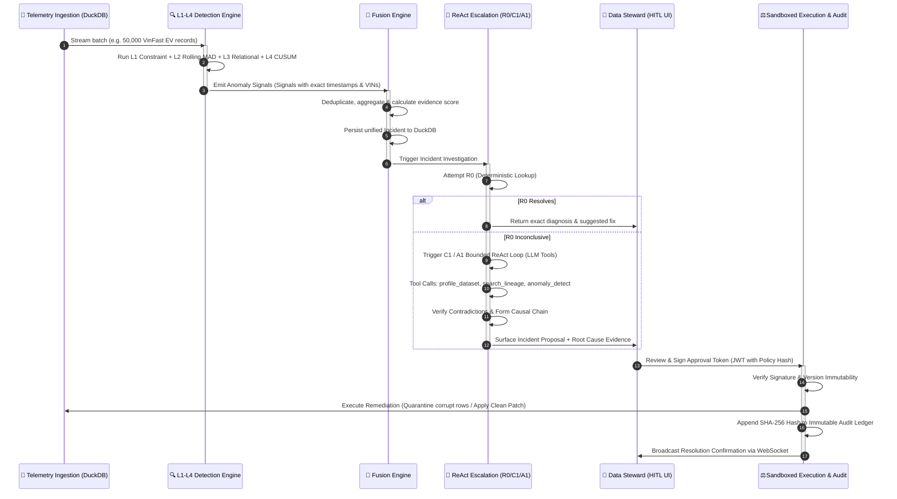
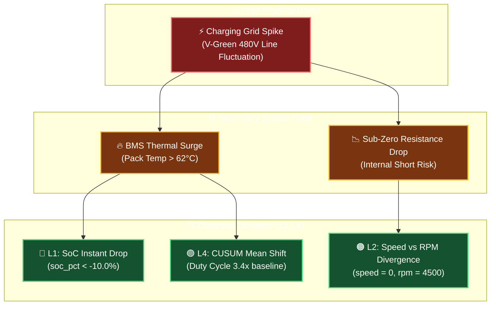

# 🏛️ DataTrust OS — Complete Master Architecture Specification (v5.0)

> **Document Status:** Authoritative System Architecture Specification  
> **Production Version:** v5.0 (Operational Trust Console)  
> **Live Deployment:** [https://t086.w9.nu](https://t086.w9.nu) | **API:** [https://t086-api.w9.nu](https://t086-api.w9.nu)  
> **Test Gate:** 461 Integration & Unit Tests Passing | 100% Deterministic CI/CD Gate

---

## 📌 Executive Summary & Design Mission

**DataTrust OS v5.0** is an enterprise **Autonomous Data Reliability & Causal Root Cause Analysis (RCA) Control Plane** designed specifically for high-throughput, mission-critical telemetry ecosystems (e.g. VinFast Electric Vehicles, V-GREEN Charging Networks, Xanh SM Ride-Hailing, and Customer Experience).

Unlike traditional data observability tools that merely notify users when metrics breach arbitrary thresholds, DataTrust OS implements a **Causal Evidence-Aware Pipeline**:
1. **Multi-Layer Detection (L1–L4)**: Catches deterministic violations, relative statistical anomalies, multivariate relational breaks, and temporal change-points.
2. **Fusion Engine**: Suppresses alert noise and admits correlated signals into a unified **Incident**.
3. **Escalation Ladder (R0 $\rightarrow$ C1 $\rightarrow$ A1)**: Resolves incidents using the cheapest, most deterministic mechanism first, escalating to Bounded ReAct LLM Agents only when non-linear investigation is required.
4. **Cryptographic Governance (HITL)**: Requires human-in-the-loop signed authorization before executing state mutations in a sandboxed environment.

---

## 🏗️ 1. Master System Architecture & Component Topology

```mermaid
flowchart TB
    subgraph Client["🖥️ Client Presentation Layer (React 19 + Vite + TypeScript)"]
        LP["Landing Page\n(/)"]
        ED["Executive Dashboard\n(/dashboard)"]
        OW["Operations Workspace\n(/operations/:view)"]
        ACW["Agent Chat Workspace\n(/workspace)"]
    end

    subgraph Gateway["🛡️ Ingress & Security Boundary"]
        CF["Cloudflare Zero Trust Tunnel\n(Argo QUIC)"]
        NGINX["Nginx Alpine Reverse Proxy\n(Port 3000 / Proxy API & WS)"]
        JWT["JWT Auth & RBAC Middleware\n(Admin | Data Steward | Auditor)"]
    end

    subgraph BackendCore["⚡ FastAPI Application Core (Python 3.13 + UV)"]
        ROUTER["API Router & Endpoints\n(/api/v1/...)"]
        WS_MGR["WebSocket Manager\n(Real-time State & Traces)"]
        SCHED["Background Streaming\n& Scheduler Service"]
    end

    subgraph AnomalyEngine["🔍 Multi-Layer Anomaly Detection (L1-L4)"]
        L1["L1: Deterministic Constraints\n(Null, Regex, Domain Bounds)"]
        L2["L2: Entity-Relative Stats\n(Zero-Leakage Rolling MAD / Z-Score)"]
        L3["L3: Relational Invariants\n(Multivariate Cross-Signal Models)"]
        L4["L4: Change-Point Detection\n(Online CUSUM & Offline PELT)"]
    end

    subgraph FusionEngine["🧠 Fusion Engine v5"]
        FUS["Evidence Admission & Deduplication"]
        INC[("Incident & Evidence Store")]
    end

    subgraph Orchestrator["🤖 ReAct Investigation & Escalation Ladder"]
        R0["R0: Deterministic RCA\n(0 token / Typed Diagnostic Lookup)"]
        C1["C1: 1-Pass Fixed LLM\n(Schema Validation + Evidence Trace)"]
        A1["A1: Bounded ReAct Agent\n(Dynamic Tool Selection + Contradiction Guard)"]
    end

    subgraph Governance["⚖️ Governance & Sandboxed Execution"]
        HITL["HITL Approval Gate\n(Cryptographic Hash Match)"]
        SB["Deterministic Execution Sandbox"]
        AUDIT["SHA-256 Cryptographic Audit Ledger"]
    end

    subgraph Storage["💾 Embedded Storage Engine"]
        DUCK[("DuckDB Database Engine\n(In-Process OLAP / Vector / JSON)")]
        DATASET[("Enterprise Telemetry Store\n(VinFast, V-Green, Xanh SM)")]
    end

    %% Client to Ingress
    Client -->|HTTPS / WSS| CF
    CF --> NGINX
    NGINX --> JWT
    JWT --> ROUTER
    NGINX -.->|WS Connection| WS_MGR

    %% Application Core to Engines
    ROUTER --> AnomalyEngine
    ROUTER --> Orchestrator
    SCHED --> AnomalyEngine
    WS_MGR -.->|Broadcast Event| Client

    %% Engine Flows
    AnomalyEngine --> FusionEngine
    FusionEngine --> INC
    INC --> Orchestrator
    Orchestrator --> Governance
    Governance --> SB
    SB --> AUDIT

    %% Data Access
    AnomalyEngine <--> DUCK
    Orchestrator <--> DUCK
    SB <--> DUCK
    DUCK <--> DATASET

    classDef primary fill:#1e293b,stroke:#38bdf8,stroke-width:2px,color:#f8fafc;
    classDef highlight fill:#0f172a,stroke:#ec4899,stroke-width:2px,color:#f8fafc;
    classDef engine fill:#0f172a,stroke:#10b981,stroke-width:2px,color:#f8fafc;
    class LP,ED,OW,ACW primary;
    class L1,L2,L3,L4,FUS,R0,C1,A1 engine;
    class HITL,SB,AUDIT highlight;
```

---

## 🔄 2. End-to-End Data Flow & Sequence

The lifecycle of an incident follows a strict 5-stage deterministic progression:

---

## 🧠 3. Causal Reasoning & Root Cause Analysis (RCA) Chain

### 3.1 Why Causal AI over Black-Box LLMs?
Standard LLMs hallucinate correlations as causes (e.g. assuming high battery temperature caused motor failure when both were caused by cooling pump voltage collapse). 

DataTrust OS v5 incorporates **Causal Directed Acyclic Graphs (DAG)** into its verification layer:

### 3.2 Competing Hypotheses Elimination Protocol
When analyzing incidents, the **A1 Bounded ReAct Agent** maintains explicit hypotheses:
1. **Hypothesis $H_A$ (Sensor Malfunction)**: Telemetry hardware faulty, physical vehicle unaffected.
2. **Hypothesis $H_B$ (Physical Component Degradation)**: Telemetry accurate, battery/inverter degraded.
3. **Hypothesis $H_C$ (Firmware/Pipeline Transformation Bug)**: Data corrupted during ETL/serialization.

The agent queries the `LineageTool` and `ProfilingTool` to search for **contradictory evidence**. If contradiction score exceeds threshold $0.4$, the hypothesis is refuted.

---

## ⚖️ 4. Architectural Tradeoffs & Design Decisions ("Why This Design?")

| Architectural Decision | Chosen Strategy | Alternative Rejected | Core Technical Rationale |
|---|---|---|---|
| **Storage Engine** | **Embedded DuckDB** (In-Process OLAP) | PostgreSQL / SQLite / Snowflake | 100x faster columnar scans on 50k-1M telemetry rows, zero client-server network latency, direct Apache Arrow / Pandas zero-copy integration. |
| **Detection Topology** | **4-Layer (L1–L4) Multi-Model** | Single End-to-End LLM / Single ML Model | Deterministic L1/L2 checks cost 0 tokens and execute in $<2\text{ms}$. DL models suffer from false positives and unexplainable drift. |
| **Investigation Escalation** | **Tiered Ladder: R0 $\rightarrow$ C1 $\rightarrow$ A1** | Unbounded Autonomous ReAct Loop | Eliminates runaway token loops, bounds latency to $<3\text{s}$ for 80% of common faults, minimizes LLM operating cost. |
| **State Mutation Policy** | **HITL Signed Cryptographic Gate** | Full Autonomous Self-Healing | Self-healing agents in production cause catastrophic cascade failures. High-stakes enterprise data requires explicit human sign-off with SHA-256 audit trails. |
| **Deployment Model** | **Docker Compose + Cloudflare Tunnel** | Public Direct IPv4 / Heavy Kubernetes | Secure reverse tunnel with zero open inbound firewall ports, seamless CDN/SSL termination via Cloudflare Edge, lightweight memory footprint ($<1\text{GB}$ RAM). |

---

## 🔒 5. Security, RBAC & Immutable Audit Ledger

### 5.1 Role-Based Access Control (RBAC) Matrix

| Role | Telemetry Viewing | Run Profiling & RCA | Approve & Execute Remediation | Modify Invariants / Rules |
|---|:---:|:---:|:---:|:---:|
| **Admin** | ✅ | ✅ | ✅ | ✅ |
| **Data Steward** | ✅ | ✅ | ✅ | ❌ |
| **Data Auditor** | ✅ | ✅ (Read-Only) | ❌ | ❌ |
| **Guest / Operator** | ✅ (Limited) | ❌ | ❌ | ❌ |

### 5.2 Cryptographic Execution Verification
When a remediation policy is approved:
1. System generates a canonical JSON representation of the proposed patch.
2. Generates SHA-256 hash: $H = \text{SHA256}(\text{IncidentID} + \text{PolicyPayload} + \text{Timestamp})$.
3. Data Steward signs request; backend verifies $H_{\text{request}} == H_{\text{db}}$ before writing to the database.
4. Mutation record is permanently appended to `audit_ledger` with state hash.
