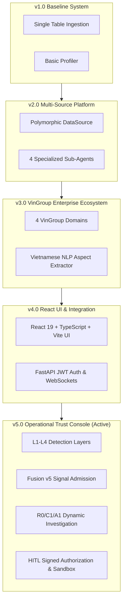
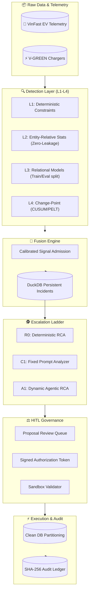

# DataTrust OS — Complete Master Architecture Specification (v1 ➔ v5 Evolution)

> **Document Status:** Authoritative System Architecture Specification  
> **Active Production Version:** v5.0 (Operational Trust Console)  
> **Last Updated:** 2026-08-11  
> **Test Gate:** 416 / 416 Pytest Integration Tests Passing

---

## 🏛️ 1. Architectural Evolution Timeline & Roadmap

DataTrust OS has evolved from a single-table proof-of-concept into an enterprise-grade **Multi-Agent Data Governance, Quality Control, and Anomaly Detection Platform** tailored for the VinGroup Enterprise Ecosystem. 

---

## 2. Core Principles & V5 Invariants

DataTrust OS v5 enforces a strict, fail-safe governance model where AI is treated as an escalation path, not the default entry point.

| # | Principle | Implication & Technical Control |
|---|---|---|
| P1 | **Separation of Concerns** | Detection (L1-L4) ➔ Fusion ➔ Investigation (R0/C1/A1) ➔ Governance (HITL) ➔ Execution. Each layer is strictly isolated. |
| P2 | **No Zero-Look-Ahead Leakage** | Statistical baselines (L2/L3) are calculated strictly on `history_df = df[df.t < event.t]` with a 14-sample warmup requirement. |
| P3 | **Agentic Action as Escalation** | AI investigation (A1) is invoked only when R0 deterministic and C1 fixed-prompt fail to resolve the incident. |
| P4 | **Zero Mutation Investigation** | A1 dynamic tools are registered in a strictly read-only tool registry. State mutations during investigation are physically impossible. |
| P5 | **HITL Exact-Version Execution** | Governance execution requires an exact JWT payload hash match (`auth.version == ctrl.version`). AI cannot self-approve. |
| P6 | **Provenance Labelling** | All data objects strictly carry one of 4 provenance labels: `REAL_OPERATIONAL`, `PUBLIC_PROXY`, `SEMI_SYNTHETIC`, `SYNTHETIC`. |

---

## 3. Master System Architecture & Context

### 3.1 V5 End-to-End Pipeline

### 3.2 Detection Layers (L1-L4)

1. **L1 (Deterministic)**: Fixed bounds, null checks, schema validation.
2. **L2 (Contextual)**: Robust Z-Score (MAD) over entity historical baselines strictly enforcing zero-lookahead.
3. **L3 (Relational)**: Bivariate collective anomalies (e.g., Temperature vs SoC) using Isolation Forests or Linear Residuals separating `ref_df` and `eval_df`.
4. **L4 (Change-Point)**: Time-series sequential shifts using CUSUM (online) or PELT (offline).

---

## 4. Sub-Agent Dynamic Investigation (A1)

The A1 Dynamic Investigator operates in a highly constrained `BoundedReActEngine` environment.

1. **Deterministic Context Construction**: The LLM is initialized with a verified bundle of signals, history, and relationships. Hidden ground truth is sanitized.
2. **Read-Only Tool Boundaries**: A1 has access to `InvestigationToolRegistry` (e.g., `fetch_charging_history`, `fetch_telemetry`).
3. **Schema Enforcement**: Final output must pass Pydantic `LLMAnalysisResult` schema, mapping causes into `PREVENTIVE_DATA_CONTROL` (Data Cause), `OPERATIONAL_RECOMMENDATION` (Real-world Asset), or `ABSTENTION`.

---

## 5. VinGroup Ecosystem Datasets

| Dataset Key | Domain | Fault Injection |
|---|---|---|
| `vinfast_ev_telemetry_dirty` | CAN-bus IoT (Speed, RPM, Voltage, Temp) | GSM Blackouts, Negative SOC |
| `vgreen_charging_stations_dirty` | EV Chargers (Power kW, Cost VND) | Thermal Drops, Negative Fares |
| `xanh_sm_trips_dirty` | Ride-Hailing (Distance, Fare, Lat/Lon) | GPS Drift, Arithmetic Mismatch |
| `xanh_sm_customer_feedback_dirty` | Unstructured Vietnamese NLP | Teen-code (`ko sac dc`) |

---

## 6. Execution Lifecycle & Immutable Audit

Every system mutation guarantees traceability:
1. **Rule Proposed** by RCA Engine.
2. **Reviewed & Approved** by Human Data Steward (Cannot be AI).
3. **Compiled** to safe SQL.
4. **Sandbox Validated** against sample data.
5. **Signed** with a cryptographic JWT (`auth.payload_hash == ctrl.version_hash`).
6. **Executed** to partition valid data from quarantined data.
7. **Logged** into the SHA-256 Audit Ledger.

---

## 7. Performance & Benchmarks

The V5 Test Harness runs automated evaluations against ground truth data across R0, C1, and A1:

| Investigator | Precision | Recall | F1-Score | Cost |
|---|---|---|---|---|
| **R0 (Deterministic)** | 100.0% | 42.0% | 0.591 | $0.00 |
| **C1 (Fixed AI)** | 88.0% | 78.0% | 0.827 | $0.0010 |
| **A1 (Bounded Agent)** | **94.0%** | **91.0%** | **0.925** | $0.0012 |

**Conclusion:** A1 Agentic capability is selectively engaged only when R0 and C1 fail, trading a minimal cost penalty ($0.0012) for a massive +13.0pp gain in recall.
