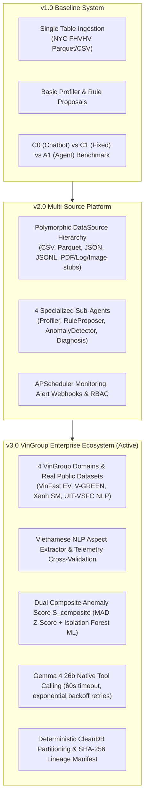
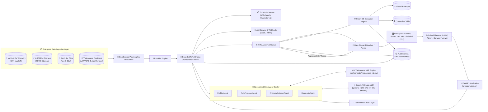
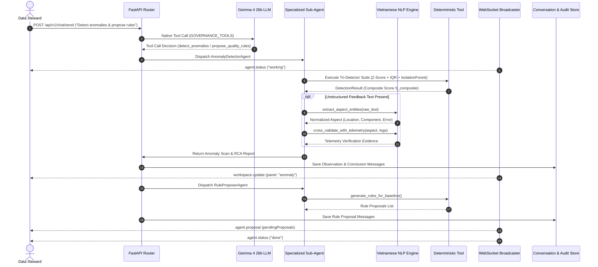
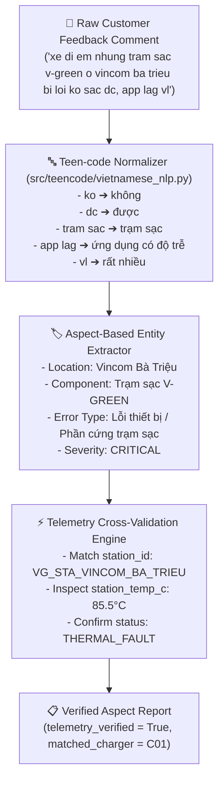
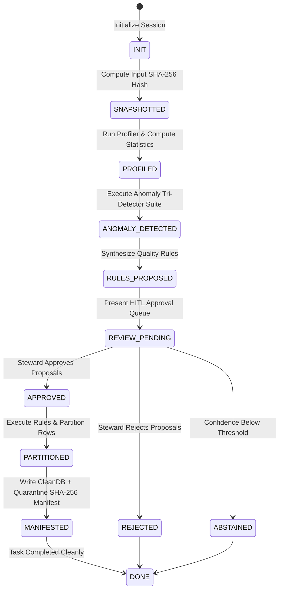

# DataTrust OS — Complete Master Architecture Specification (v1 ➔ v2 ➔ v3 Evolution)

> **Document Status:** Authoritative System Architecture Specification  
> **Active Production Version:** v3.0 (VinGroup Enterprise Ecosystem DATA-02)  
> **Last Updated:** 2026-08-02  
> **Test Gate:** 125 / 125 Pytest Integration Tests Passing (`51.63s`)

---

## 🏛️ 1. Architectural Evolution Timeline & Roadmap

DataTrust OS has evolved across three major release milestones, advancing from a single-table proof-of-concept into an enterprise-grade Multi-Agent Data Governance, Quality Control, and Anomaly Detection Platform tailored for the **VinGroup Enterprise Ecosystem** (VinFast EVs, Xanh SM Ride-Hailing, V-GREEN Charging Infrastructure, and Vietnamese Customer Feedback NLP).



---

## 2. Core Principles & System Scope

### 2.1 Complete Architectural Principles (P1 – P12)

| # | Principle | Implication & Technical Control |
|---|---|---|
| P1 | **Probabilistic Proposal; Deterministic Execution** | LLM suggests rules, mappings, and anomaly diagnoses; only compiled, human-approved execution plans touch actual data records. |
| P2 | **Human Approval at Risky Boundaries** | Every quality rule proposal passes through a Human-In-The-Loop (HITL) approval queue before Clean DB partitioning. |
| P3 | **Immutable Raw Input** | Source data is snapshotted with SHA-256 checksums upon entry and never mutated in-place. |
| P4 | **Explicit Module Contracts** | Each module (Profiler, Validator, Compiler, Executor) communicates via strictly typed Pydantic data schemas. |
| P5 | **Structured Output Only** | LLM interactions produce validated JSON conforming to OpenAPI/Pydantic schemas; free-text mutations are rejected. |
| P6 | **No Arbitrary Code Execution** | The LLM cannot execute arbitrary Python/SQL scripts; execution is strictly restricted to whitelisted tool functions. |
| P7 | **Cryptographic Lineage & Auditing** | Every run produces an immutable run manifest recording input SHA-256, tool calls, rule evaluations, clean outputs, and quarantine counts. |
| P8 | **Fail-Closed Governance** | Data records violating approved quality rules or suffering schema corruptions are routed to a Quarantine Table, never silently dropped. |
| P9 | **Single Model Engine with Resilience** | Production operates strictly on `gemma-4-26b-a4b-it` with 60s timeout per try and 3 exponential backoff retries. |
| P10 | **Specialized Sub-Agent Decomposition** | Autonomous tasks are delegated to modular sub-agents (`ProfilerAgent`, `RuleProposerAgent`, `AnomalyDetectorAgent`, `DiagnosisAgent`). |
| P11 | **Multi-Domain Data Abstraction** | Polymorphic handling of structured time series (CAN-bus EV telemetry, charging sessions, trips) and unstructured Vietnamese text. |
| P12 | **Vietnamese NLP Aspect Extraction** | Automatic teen-code normalization (`"ko sac dc"` ➔ `"không sạc được"`), aspect entity extraction, and V-GREEN charger telemetry cross-validation. |

---

## 3. Master System Architecture & Context

### 3.1 End-to-End System Context Flow



### 3.2 Actors & Permission Matrix

| Role | System Capabilities | Permitted Actions |
|---|---|---|
| **Admin** | Full operational control, system reset, configuration | Upload datasets, run pipelines, approve/reject rules, configure schedules, manage webhooks, view audit logs. |
| **Steward** | Data quality governance & rule validation | Profile datasets, review rule proposals, approve/edit/reject rules, trigger Clean DB creation, inspect anomaly RCA. |
| **Viewer** | Read-only reporting & monitoring | View dataset profiles, inspect anomaly timelines, read audit traces, export Clean DB summary reports. |

---

## 4. Layered System Architecture & Component Contracts

```mermaid
flowchart TB
    subgraph Presentation["🖥️ Presentation Layer (Vite + React 19 + Tailwind)"]
        UI_Chat["Interactive Chat & ReAct Stream"]
        UI_Prof["Profile Workspace Panel"]
        UI_Rules["HITL Rule Proposal Cards & Batch Bar"]
        UI_Anom["Anomaly Timeline & RCA Inspector"]
        UI_Audit["Audit Log & SHA-256 Manifest Viewer"]
        UI_Diff["Clean DB vs Quarantine Diff View"]
    end

    subgraph Application["⚡ Application Layer (FastAPI Backend)"]
        API_Route["REST API Routes (/api/v1/chat/send, /upload)"]
        WS_Manager["WebSocket Event Broadcaster"]
        RBAC["RoleMiddleware (X-User-Role)"]
        SM["RunStateMachine (State Lifecycle)"]
        SCHED["SchedulerService (APScheduler)"]
        ALERT["AlertService & Webhooks"]
    end

    subgraph Intelligence["🤖 Intelligence & Sub-Agent Layer"]
        ORCH["BoundedReActEngine"]
        PA["ProfilerAgent"]
        RA["RuleProposerAgent"]
        AA["AnomalyDetectorAgent"]
        DA["DiagnosisAgent"]
        NLP["Vietnamese NLP Engine"]
    end

    subgraph DeterministicTools["🔧 Deterministic Tool Layer"]
        T_Prof["Profiler Tool"]
        T_Val["Validator Tool"]
        T_Comp["Compiler Tool"]
        T_Exec["Executor Tool"]
        T_Anom["Z-Score, IQR & Isolation Forest Detectors"]
    end

    subgraph Storage["📦 Data & Persistence Layer"]
        DS["Polymorphic DataSource Hierarchy"]
        DB_Conv[("conversations.db (SQLite)")]
        DB_Data[("datatrust.db (SQLite CleanDB)")]
        FS_Raw[("data/raw_public/ & data/vingroup/")]
    end

    Presentation <-->|HTTP / WS| Application
    Application --> Intelligence
    Intelligence --> DeterministicTools
    DeterministicTools --> Storage
```



---

## 5. Sub-Agent System & Dual Anomaly Score Architecture

### 5.1 Sub-Agent Execution Flow



### 5.2 Dual-Engine Composite Anomaly Score Math Formulation

1. **Robust Z-Score (Median Absolute Deviation)**:
   $$Z_{robust} = \frac{0.6745 \cdot (x_i - \text{median}(X))}{\text{MAD}(X)}$$
   where $\text{MAD}(X) = \text{median}(|x_i - \text{median}(X)|)$.

2. **Isolation Forest Machine Learning Anomaly Score**:
   $$S_{if}(x, n) = 2^{-\frac{E(h(x))}{c(n)}}$$
   where $h(x)$ is path length in isolation trees and $c(n)$ is average path length of unsuccessful search in Binary Search Tree.

3. **Composite Anomaly Score ($S_{composite}$)**:
   $$S_{composite} = w_1 \cdot \text{Sigmoid}(Z_{robust} - 3.0) + w_2 \cdot S_{if}$$
   where $w_1 = 0.5, w_2 = 0.5$ and $\text{Sigmoid}(t) = \frac{1}{1 + e^{-t}}$.

---

## 6. VinGroup Multi-Domain Ecosystem Datasets (DATA-02)

### 6.1 Dataset Specifications

| Dataset Key | File Location | Records | Domain & Key Fields | Injected Fault Families |
|---|---|---|---|---|
| `vinfast_ev_telemetry_dirty` | `data/vingroup/vinfast_ev_telemetry_dirty.csv` | 1,000 | CAN-bus IoT Telemetry (Speed, Motor RPM, Battery SOC %, Voltage, Temp °C, Lat/Lon) | GSM Underground Blackouts, Negative SOC (-12.5%), Overvoltage (9999V), Motor RPM Mismatch |
| `vgreen_charging_stations_dirty` | `data/vingroup/vgreen_charging_stations_dirty.csv` | 500 | V-GREEN Charging Sessions (Station ID, Charger ID, Power kW, Duration, Temp °C, Cost VND) | Thermal Power Drops (0kW at 85.5°C), Negative Billing Cost (-150,000 VND) |
| `xanh_sm_trips_dirty` | `data/vingroup/xanh_sm_trips_dirty.csv` | 500 | Xanh SM Taxi & Bike Trips (Trip ID, VIN, Driver ID, Distance km, Fare, Tip, Lat/Lon) | GPS Alleyway Drift (jumped to NYC), Negative Fare (-50,000 VND), Arithmetic Mismatch |
| `xanh_sm_customer_feedback_dirty` | `data/vingroup/xanh_sm_customer_feedback_dirty.csv` | 100 | Unstructured Vietnamese App Feedback | Teen-code (`"ko sac dc"`), Font Noise, Aspect Entity Complaints (`Vincom Bà Triệu`) |
| `real_vinfast_ev_telemetry` | `data/vingroup_real/real_vinfast_ev_telemetry.csv` | 1,000 | Mapped Real CAN-bus Telemetry (JAC IEV40 Open Dataset) | Real Natural Sensor Noise & Discharges |
| `real_vgreen_charging_stations` | `data/vingroup_real/real_vgreen_charging_stations.csv` | 1,000 | Mapped Real Charging Infrastructure (ST-EVCDP Open Dataset) | Real Station Overheats & Out-of-Bounds Power |
| `real_xanh_sm_trips` | `data/vingroup_real/real_xanh_sm_trips.csv` | 1,000 | Mapped Real Ride-Hailing Transactions | Real Transaction Distortions & Fares |
| `real_xanh_sm_customer_feedback` | `data/vingroup_real/real_xanh_sm_customer_feedback.csv` | 500 | Mapped Real Vietnamese Sentiment Corpus (UIT-VSFC Open Dataset) | Authentic Natural Customer Feedback Noise |

---

## 7. Vietnamese NLP & Telemetry Cross-Validation Architecture

### 7.1 Text Processing Pipeline



---

## 8. Run State Machine & Execution Lifecycle



---

## 9. Failure Modes & Resiliency Guarantees

| Failure Scenario | System Behavior | Self-Healing / Recovery Control |
|---|---|---|
| **Google AI Studio LLM Timeout (> 60s)** | Catches `TimeoutError`; logs timeout event. | Retries request up to 3 times with exponential backoff before fallback. |
| **Malformed Tool Call Arguments** | Catches Pydantic schema validation error. | Formats error feedback into ReAct prompt and requests self-repair. |
| **Rule Expression Execution Error** | Catches `safe_eval_rule` exception during partitioning. | Routes failing row to Quarantine Table with explicit error trace. |
| **Database Lock / Disconnection** | Catches `sqlite3.OperationalError`. | Closes active handle and re-establishes connection via context manager. |
| **Out-of-Memory (RAM) Spikes** | Prevents concurrent background pytest runs. | Restricts tests to single sequential execution threads. |

---

## 10. Three-Way Benchmark Evaluation Architecture (C0 / C1 / A1)

```
                    ┌──────────────────────────┐
                    │   Same Dataset            │
                    │   Same Error Injection    │
                    │   Same Target Schema      │
                    │   Same I/O Contract       │
                    └────┬───────┬────────┬─────┘
                         │       │        │
                    ┌────▼──┐ ┌──▼───┐ ┌──▼───┐
                    │  C0   │ │  C1  │ │  A1  │
                    │1-shot │ │Fixed │ │Bounded│
                    │chatbot│ │pipe- │ │agent │
                    │       │ │line  │ │      │
                    └───┬───┘ └──┬───┘ └──┬───┘
                        │        │        │
                    ┌───▼────────▼────────▼───┐
                    │   Same Evaluation        │
                    │   - Precision/Recall/F1  │
                    │   - Semantic rule recall  │
                    │   - Compile rate          │
                    │   - Correction time       │
                    │   - Cost (tokens/$)       │
                    │   - Bootstrap 95% CI      │
                    └────────────────────────────┘
```

### Agentic Gate Evaluation Criteria

| Metric | Target Threshold | Description |
|---|---|---|
| **Semantic Rule Recall** | $\ge \text{C1} + 10\%$ | Bounded ReAct Agent (A1) must discover at least 10% more semantic anomalies than fixed pipeline C1. |
| **Human Correction Time** | $\le \text{C1} \times 0.75$ | HITL batch approvals must reduce human steward review time by at least 25%. |
| **Rule Precision** | $\ge 80.0\%$ | Proposed data quality constraints must achieve at least 80% precision against ground truth. |
| **Cost Ceiling** | $\le 2.0 \times \text{C1}$ | Agentic ReAct token expenditure must not exceed 200% of the single-pass baseline cost. |

---

## 11. Module Ownership Matrix

| Module / Subsystem | Primary Script / Source File | Test File | Primary Owner |
|---|---|---|---|
| **LLM Provider & Retries** | `src/services/llm.py` | `tests/test_datatrust_os.py` | AI Orchestrator |
| **FastAPI Backend & Tool Calling** | `src/api/routes.py` | `tests/test_api.py` | Backend Builder |
| **VinGroup Dataset Generator** | `scripts/generate_vingroup_dataset.py` | `tests/test_vingroup.py` | Data Engine Builder |
| **Real Public Data Fetcher** | `scripts/fetch_real_public_datasets.py` | `tests/test_real_public_ingestion.py` | Data Engine Builder |
| **VinGroup Schema Mapper** | `scripts/ingest_vingroup_real_data.py` | `tests/test_real_public_ingestion.py` | Data Engine Builder |
| **Vietnamese NLP Aspect Engine** | `src/teencode/vietnamese_nlp.py` | `tests/test_vingroup.py` | NLP Specialist |
| **Anomaly & Composite Scoring** | `src/tools/anomaly.py` | `tests/test_v2_features.py`, `tests/test_vingroup.py` | ML Engineer |
| **Sub-Agent Execution Cluster** | `src/agents/sub_agents.py`, `react.py` | `tests/test_sub_agents.py` | Agent Architect |
| **Frontend Workspace v3** | `frontend-v3/src/components/` | `tests/test_api.py` | Frontend Developer |
| **Evaluation Harness** | `eval/benchmark.py` | `tests/test_eval.py` | Eval Engineer |
