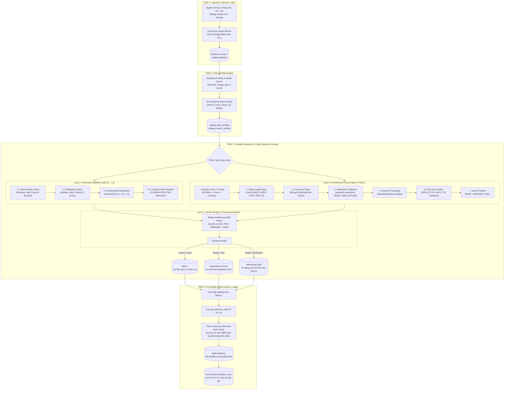

# DataTrust OS — Kiến Trúc & Tài Liệu Kỹ Thuật Pipeline Kiểm Soát Tuân Thủ Dữ Liệu Chuẩn IPO

> **Dự án:** DataTrust OS — Phase 2 VSF (VinFast / GSM Global 3-Zone Pilot: VN, EU, US)  
> **Tiêu chuẩn tuân thủ:** Luật Bảo vệ dữ liệu cá nhân số 91/2025/QH15 & Nghị định 356/2025/NĐ-CP (hiệu lực 01/01/2026), EU GDPR, US CCPA/CPRA, IFRS 15 / SOX 404, ISO 8000, ISO 26262 ASIL-D & UN ECE R100.  
> **Công nghệ lõi:** Apache Airflow 2.x, PostgreSQL 16 (Multi-Schema), Python 3.14 / FastAPI, React 19 / TypeScript / Vite.

---

## 1. Tổng Quan Hệ Thống

**DataTrust OS Pipeline** là hệ sinh thái điều phối và kiểm soát dữ liệu tự động, khép kín từ tầng tiếp nhận dữ liệu thô (Bronze) đến phân tích chất lượng, xử lý bảo vệ quyền riêng tư (PII), thẩm tra tuân thủ đa quyền tài phán (Jurisdiction-Aware), định tuyến 3 làn (Silver / Quarantine / Warning), và phát hành sổ cái bằng chứng kiểm toán số hóa bất biến (Immutable Hash-Chained Audit Ledger).

### 1.1. Mục Tiêu Cốt Lõi
1. **Bảo toàn tính chính xác thương mại (Commercial Assurance):** Chống cuốc xe ảo, doanh thu âm hoặc cự ly phi thực tế theo chuẩn **IFRS 15** và **SOX Section 404**.
2. **Tuân thủ quy định bảo vệ dữ liệu cá nhân (Privacy by Design):** Tự động che mờ (masking) số điện thoại, băm (hashing) định danh tài xế có salt, làm tròn tọa độ GPS theo **Luật 91/2025/QH15 & Nghị định 356/2025/NĐ-CP** và **GDPR Art. 5**.
3. **Phát hiện dị thường kỹ thuật & vật lý (Sensor Reliability):** Giám sát nhiệt độ pin xe điện, tỷ lệ pin SoC, sai lệch công tơ Modbus trụ sạc qua 4 tầng kiểm tra kỹ thuật (L1 Deterministic → L2 Robust Z-score → L3 Multivariate Regression → L4 Change Point Detection).
4. **Bằng chứng kiểm toán không thể chối bỏ (Auditability & Lineage):** Mỗi lượt chạy sinh mã băm chuỗi liên tục (continuous hash-chaining) và chữ ký số lưu trữ độc lập tại bảng `audit.evidence`.
5. **Cơ chế Human-in-the-Loop (HITL):** Cho phép Chuyên viên Vận hành (Admin) và Kiểm toán viên (Auditor) thẩm định đề xuất quy tắc, bật/tắt rule, chỉnh sửa biểu thức và phê duyệt ngoại lệ kiểm toán.

---

## 2. Sơ Đồ Kiến Trúc Luồng Tổng Thể (End-to-End Architecture)

Luồng pipeline vận hành tuần tự qua 4 nhiệm vụ (Tasks) chính, trong đó **Task 3** thực thi song song hai làn thẩm tra độc lập trước khi hội tụ để định tuyến:



---

## 3. Chi Tiết Từng Bước Thực Thi Trong Pipeline

### 3.1. Task 1: Tiếp Nhận Dữ Liệu Thô (Ingestion & Bronze Layer)

* **Mã nguồn:** [`dags/reset_and_ingest_bronze.py`](file:///E:/Phase2_VSF/dags/reset_and_ingest_bronze.py)
* **Operator Airflow:** [`task_1_truncate_and_ingest_bronze`](file:///E:/Phase2_VSF/dags/datatrust_adaptive_pipeline_dag.py#L192)
* **Chức năng:**
  - Thiết lập và khởi tạo schema `bronze` và schema `catalog`.
  - **Hỗ trợ chạy linh hoạt theo tham số `dataset_id`:**
    - Nếu `dataset_id = "ride_hailing_xanh_sm_trips"` (hoặc bất kỳ bảng nào trong 8 bảng): Chỉ xóa và nạp đúng 1 bảng được chọn, tối ưu thời gian chạy.
    - Nếu `dataset_id = "ALL"`: Tự động lặp qua và nạp đầy đủ 8 bảng trong danh mục.
  - Quản lý 8 bảng cốt lõi trong PostgreSQL:
    1. `bronze.ride_hailing_xanh_sm_trips` (6,902 bản ghi chuyến đi Xanh SM toàn cầu).
    2. `bronze.synthetic_ev_telemetry_ved_ref` (57,600 gói tin cảm biến telemetry xe điện).
    3. `bronze.acn_charging_mapped` (912 phiên sạc trụ sạc thông minh).
    4. `bronze.dim_customers` (5,106 hồ sơ khách hàng).
    5. `bronze.dim_drivers` (60 hồ sơ tài xế đối tác GSM).
    6. `bronze.fleet_index` (60 phương tiện VinFast pilot).
    7. `bronze.feedback_pii` (30 phản hồi văn bản tự do chứa PII).
    8. `bronze.synthetic_feedback_scenario_driven` (16 kịch bản phản hồi thử nghiệm).
  - Cập nhật số dòng (`row_count`), số cột (`column_count`) và siêu dữ liệu vào bảng danh mục `catalog.datasets`.

---

### 3.2. Task 2: Hồ Sơ Dữ Liệu & Điểm Sức Khỏe (Data Profiling Engine)

* **Mã nguồn:** [`dags/profiler_engine.py`](file:///E:/Phase2_VSF/dags/profiler_engine.py)
* **Operator Airflow:** [`task_2_data_profiling`](file:///E:/Phase2_VSF/dags/datatrust_adaptive_pipeline_dag.py#L229)
* **Chức năng:**
  - Tính toán các chỉ số thống kê trên từng cột: `null_count`, `null_percentage`, `distinct_count`, `min_value`, `max_value`, `mean`, `stddev`.
  - **Quét cờ nhạy cảm PII (PII Sensitivity Flags):**
    - Nhận diện các trường PII theo regex và ngữ nghĩa: Số điện thoại (`PHONE`), Email (`EMAIL`), Căn cước công dân (`CITIZEN_ID`), Tên cá nhân (`PERSON_NAME`).
    - *Nguyên tắc thiết kế:* Việc chứa PII là cờ cảnh báo quản trị (Governance Risk Flag), **không làm giảm điểm chất lượng dữ liệu kỹ thuật**.
  - **Tính điểm sức khỏe có trọng số (`health_score` từ 0 - 100):**
    $$\text{Health Score} = 100 - (w_{\text{null}} \times P_{\text{null}} + w_{\text{type}} \times P_{\text{type\_err}})$$
    Trong đó: $w_{\text{null}} = 0.5$, $w_{\text{type}} = 0.5$.
  - Lưu trữ kết quả phân tích cấu trúc vào `catalog.table_profiles` và `catalog.column_profiles`.

---

### 3.3. Task 3: Thẩm Tra Song Song & Định Tuyến 3 Làn (Parallel Evaluation & Routing)

Task 3 được bọc trong một `TaskGroup('task_3_parallel_evaluation')` gồm 3 bước phối hợp:

```
task_3a_run_lane_a (Lane A) ──┐
                              ├──> task_3c_run_lane_c (Lane C: Merge & Route)
task_3b_run_lane_b (Lane B) ──┘
```

#### A. Lane A: Bộ Kiểm Tra Kỹ Thuật & Dị Thường Cảm Biến 4 Tầng (L1 - L4)
* **Mã nguồn:** [`src/detectors/detector_suite.py`](file:///E:/Phase2_VSF/src/detectors/detector_suite.py) và [`dags/parallel_evaluation_engine.py`](file:///E:/Phase2_VSF/dags/parallel_evaluation_engine.py#L65).
* **Đặc tính:** Kiểm tra độc lập với chính sách, tập trung vào tính toàn vẹn kỹ thuật, độ tin cậy phần cứng và chuỗi thời gian:
  1. **L1 · Deterministic Check:**
     - Kiểm tra schema, kiểu dữ liệu, các trường bắt buộc không được NULL.
     - Kiểm tra dải giá trị vật lý (ví dụ: SoC pin $[0, 100]\%$, điện áp trụ sạc $> 0$).
  2. **L2 · Statistical Outlier:**
     - Sử dụng Median, MAD (Median Absolute Deviation) và Robust Z-Score ($|z| > 3.0$).
     - Phát hiện các điểm dị thường đột xuất trong công suất nạp, vận tốc di chuyển.
  3. **L3 · Multivariate Correlation:**
     - Hồi quy tuyến tính đa biến tính sai số phần dư ($y = ax + b$).
     - Phát hiện sai lệch tương quan giữa điện năng tiêu thụ và quãng đường di chuyển.
  4. **L4 · Time-Series Change Point Detection:**
     - Áp dụng giải thuật CUSUM và PELT để phát hiện dịch chuyển chế độ vận hành (Regime Shift) hoặc hiện tượng drift dữ liệu theo cửa sổ trượt.

---

#### B. Lane B: Động Cơ Chính Sách Phân Cấp (Hierarchical Policy Engine - 7 Bước)
* **Mã nguồn:** [`backend/engine/hierarchical_policy_processor.py`](file:///E:/Phase2_VSF/backend/engine/hierarchical_policy_processor.py)
* **Cấu hình địa hạt:** [`backend/engine/jurisdiction_config.py`](file:///E:/Phase2_VSF/backend/engine/jurisdiction_config.py)
* **Quy trình 7 bước bắt buộc:**
  ```
  Resolve Zone/Country ──> Chọn Policy ──> Pre-check ──> Xác định Treatment ──> Generic Processing ──> Post-check ──> Verdict
  ```

| Bước | Tên Bước | Chi Tiết Nghiệp Vụ & Căn Cứ Pháp Lý |
| :--- | :--- | :--- |
| **1** | **Resolve Zone/Country** | Phân giải chuỗi thẩm quyền: `['GLOBAL', zone, country]` từ `JurisdictionHierarchyConfig` (Ví dụ: `VN -> VN`, `EU -> DE/FR`, `US -> US-NY/US-CA`). |
| **2** | **Select Policy** | Lựa chọn các bộ chính sách có hiệu lực: Luật 91/2025/QH15 & NĐ 356/2025/NĐ-CP (VN), GDPR (EU), CCPA (US), IFRS 15 / SOX 404 (Thương mại). |
| **3** | **Pre-check Rules** | **Kiểm tra trước khi xử lý dữ liệu thô:**<br/>• Kiểm tra tọa độ điểm đón có nằm trong ranh giới giấy phép khai thác của quốc gia sở tại (Ví dụ: VN vĩ độ $8.0 \le \text{lat} \le 24.0$). Nếu vi phạm $\rightarrow$ Đánh dấu `FAIL` và không chuyển đổi dữ liệu.<br/>• Kiểm tra cờ tiền tệ chưa đối soát ngân hàng $\rightarrow$ Đánh dấu `WARNING`. |
| **4** | **Determine Treatment** | Động cơ sinh danh sách xử lý bắt buộc `required_treatments` dạng khai báo từ bảng CSDL `policy.data_treatment_rules`:<br/>• SĐT khách hàng $\rightarrow$ `MASK` (prefix 3, suffix 2).<br/>• Email khách hàng $\rightarrow$ `MASK` (prefix 2, suffix 4).<br/>• Mã định danh tài xế $\rightarrow$ `HASH` (SHA-256 kèm salt bí mật).<br/>• Tọa độ đón khách GPS $\rightarrow$ `ROUND` (làm tròn 2 chữ số thập phân). |
| **5** | **Generic Processing** | Thực thi chuyển đổi dữ liệu thông qua [`OperationRegistry`](file:///E:/Phase2_VSF/backend/engine/operation_registry.py#L6): Module xử lý dùng chung, không hardcode theo bảng hay cột. |
| **6** | **Post-check Rules** | **Kiểm tra tuân thủ sau khi dữ liệu đã qua Treatment:**<br/>• **IFRS 15 / SOX 404:** Cước phí `fare_amount > 0` và cự ly `trip_distance_km >= 0.1` km.<br/>• **An toàn Pin EV:** Nhiệt độ cell pin `battery_temp_c <= 65°C` (IEC 62660-1).<br/>• **Chuẩn đo lường V-GREEN:** Sai lệch công tơ trụ sạc và BMS $\le 3\%$.<br/>• **Thẩm định PII:** Xác nhận trường SĐT đã được che mờ và có chứa ký tự `'*'`. |
| **7** | **Lane B Verdict** | Tổng hợp kết quả: Trả về `LaneBVerdict` (`status`: PASS / WARNING / FAIL, `treated_record`, `failure_reasons`, `compliance_evidence`). |

---

#### C. Thư Viện Thao Tác Chuẩn Hóa (Generic Operation Registry)
* **Mã nguồn:** [`backend/engine/operation_registry.py`](file:///E:/Phase2_VSF/backend/engine/operation_registry.py)
* **Các phương thức xử lý được đăng ký:**
  - `mask_value(val, prefix_len=3, suffix_len=2, mask_char='*')`: Che mờ chuỗi ký tự.
  - `hash_value(val, algorithm='sha256', salt_ref='gsm_driver_salt_2026')`: Băm một chiều có salt bảo mật.
  - `round_numeric(val, decimals=2)`: Làm tròn tọa độ địa lý.
  - `generalize_value(val, method='bucket', level=10)`: Khái quát hóa dải số liệu phục vụ $k$-anonymity.
  - `remove_value(val)` / `redact_value(val)`: Triệt tiêu trường dữ liệu nhạy cảm.

---

#### D. Lane C: Hợp Lưu Kết Quả & Bộ Định Tuyến 3 Làn (Verdict Merger & Router)
* **Mã nguồn:** [`backend/engine/verdict_merger_and_router.py`](file:///E:/Phase2_VSF/backend/engine/verdict_merger_and_router.py)
* **Hàm điều phối:** [`execute_lane_c_merge_and_persist()`](file:///E:/Phase2_VSF/dags/parallel_evaluation_engine.py#L159)
* **Ma trận phối hợp A/B (Combination Matrix) & Thứ tự ưu tiên:**
  Quy tắc ưu tiên tuyệt đối được áp dụng: **`FAIL > WARNING > PASS`**.

| Kết quả Lane A | Kết quả Lane B | Phán Quyết Cuối (Final Verdict) | Làn Định Tuyến (Target Lane) | Hành Động Hệ Thống |
| :---: | :---: | :---: | :---: | :--- |
| **PASS** | **PASS** | **`PASS`** | 🟢 **Silver Lane** | Ghi bản ghi sạch đã qua xử lý bảo vệ PII vào `silver.*`. |
| **FAIL** | **FAIL** | **`FAIL`** | 🔴 **Quarantine Lane** | Cách ly bản ghi vi phạm kép vào `quarantine.records` (Lưu nguyên trạng raw JSON để điều tra). |
| **FAIL** | **PASS** | **`FAIL`** | 🔴 **Quarantine Lane** | Lỗi cảm biến/kỹ thuật nghiêm trọng $\rightarrow$ Cách ly an toàn. |
| **PASS** | **FAIL** | **`FAIL`** | 🔴 **Quarantine Lane** | Vi phạm pháp lý/chính sách PII/doanh thu $\rightarrow$ Chặn vào Silver, cách ly vào Quarantine. |
| **WARNING** | **PASS** | **`WARNING`** | 🟡 **Warning Lane** | Đưa vào `warning.records` với cơ chế **Controlled Storage (tự động che mờ PII)**. |
| **PASS** | **WARNING** | **`WARNING`** | 🟡 **Warning Lane** | Đưa vào `warning.records` để theo dõi và đối soát. |

---

### 3.4. Task 4: Sổ Cái Bằng Chứng Kiểm Toán Bất Biến (Immutable Audit Evidence Ledger)

* **Mã nguồn:** [`dags/datatrust_adaptive_pipeline_dag.py`](file:///E:/Phase2_VSF/dags/datatrust_adaptive_pipeline_dag.py#L360)
* **Chức năng:**
  1. Thu thập toàn bộ chỉ số thực thi từ Task 3 (`scanned_count`, `silver_count`, `quarantine_count`, `warning_count`).
  2. **Truy vấn mã băm gần nhất (`previous_hash`)** từ bảng `audit.evidence`. Nếu là bản ghi khởi nguyên, sử dụng mã genesis `GENESIS_EVIDENCE_HASH_GSM_IPO_2026`.
  3. **Tính toán Continuous SHA-256 Evidence Hash:**
     $$\text{evidence\_hash} = \text{SHA256}(\text{previous\_hash} : \text{run\_id} : \text{dataset\_id} : \text{metrics\_json})$$
     Mỗi bằng chứng phụ thuộc mật mã vào bằng chứng trước đó. Nếu bất kỳ ai chỉnh sửa dữ liệu quá khứ, toàn bộ chuỗi băm sẽ bị phá vỡ lập tức.
  4. Ghi nhận chữ ký số `SIG-AIRFLOW-3LANE-GSM-IPO-2026` và toàn bộ bằng chứng vào bảng `audit.evidence`.
  5. Cập nhật trạng thái hoàn thành vào `orchestration.pipeline_runs`.

---

## 4. Bảng Danh Mục Cơ Sở Dữ Liệu PostgreSQL

Hệ thống tổ chức dữ liệu thành 6 schema chức năng riêng biệt:

| Schema | Bảng Dữ Liệu | Mục Đích Lưu Trữ |
| :--- | :--- | :--- |
| `bronze` | `ride_hailing_xanh_sm_trips`<br/>`synthetic_ev_telemetry_ved_ref`<br/>`acn_charging_mapped`, ... | Dữ liệu thô ban đầu, nạp từ nguồn và được làm mới ở Task 1. |
| `silver` | `ride_hailing_xanh_sm_trips`<br/>`synthetic_ev_telemetry_ved_ref`<br/>`generic_clean_records` | Dữ liệu thương mại sạch đạt chuẩn, PII đã được che mờ/băm/làm tròn an toàn, sẵn sàng cho khai thác BI và kế toán. |
| `quarantine` | `records` | Bản ghi vi phạm bị cách ly, lưu trữ nguyên vẹn `raw_record_json`, `violation_rule_id`, `violation_reason`, `lineage_hash`. |
| `warning` | `records` | Bản ghi mang cảnh báo thống kê/độ trôi, áp dụng **Controlled Storage: PII được che mờ trước khi lưu**. |
| `policy` | `compliance_rules`<br/>`data_treatment_rules` | **Nguồn chân lý duy nhất (Single Source of Truth)** cho các quy tắc tuân thủ và cấu hình xử lý dữ liệu. |
| `audit` | `evidence` | Sổ cái kiểm toán bất biến chứa mã băm liên kết (hash chain), chữ ký số và dữ liệu chứng minh phục vụ IPO. |
| `catalog` | `datasets`<br/>`columns`<br/>`table_profiles`<br/>`column_profiles` | Siêu dữ liệu danh mục, chỉ số thống kê và điểm sức khỏe dữ liệu. |
| `orchestration` | `pipeline_runs` | Lịch sử thực thi pipeline, liên kết DAG Airflow và khối lượng dữ liệu qua từng làn. |

---

## 5. Cơ Chế Human-in-the-Loop (HITL) & Quản Lý Rules

Nhằm đảm bảo tuân thủ nguyên tắc quản trị dữ liệu cấp doanh nghiệp, hệ thống áp dụng cơ chế phân quyền RBAC và phê duyệt hai lớp:

1. **Phân Quyền Vai Trò:**
   - **Lead Data Platform / Admin:** Có quyền thực thi chạy pipeline, chỉnh sửa biểu thức quy tắc xử lý (`expression_display`), cập nhật tham số (`params_json`), phê duyệt áp dụng rule (`Approve`), từ chối rule (`Reject`), bật/tắt rule (`Toggle`) và phê duyệt ngoại lệ kiểm toán (`Override Quarantine`).
   - **Senior Auditor (Big 4 / IPO Assurance):** Quyền xem xét bằng chứng độc lập (Read-Only Viewer), yêu cầu AI sinh bộ kịch bản kiểm toán (`Audit Test Cases`), kiểm tra tính toàn vẹn của chuỗi băm `audit.evidence`.
2. **Đồng Bộ Hai Chiều Với PostgreSQL:**
   - Khi Admin bấm Phê duyệt/Bật/Tắt trên giao diện, frontend gọi qua API FastAPI (`/api/rules/treatments/{id}/approve`, `toggle`).
   - Backend cập nhật trực tiếp vào bảng `policy.data_treatment_rules`.
   - Lượt chạy pipeline Airflow tiếp theo sẽ tự động truy vấn bản ghi có `status = 'active'` mới nhất từ cơ sở dữ liệu.

---

## 6. Hướng Dẫn Vận Hành & Kiểm Tra

### 6.1. Chạy Kiểm Thử Toàn Diện (Pytest Test Suite)
Hệ thống đi kèm bộ kiểm thử 44 test cases tự động bao phủ Task 1, Task 2, Task 3 và Task 4:
```powershell
.\.venv\Scripts\pytest tests/ -v
# Kết quả yêu cầu: 44 passed in ~49s
```

### 6.2. Kích Hoạt Pipeline Qua Apache Airflow UI
1. Mở giao diện Airflow: `http://localhost:8080` (Tài khoản: `airflow` / Mật khẩu: `airflow`).
2. Chọn DAG **`datatrust_adaptive_pipeline`**.
3. Bấm **Trigger DAG w/ config**:
   - Chọn bảng muốn chạy trong dropdown `dataset_id` (Ví dụ: `ride_hailing_xanh_sm_trips` hoặc `ALL`).
   - Bấm **Trigger** và theo dõi sơ đồ thực thi Graph View.

### 6.3. Kích Hoạt Qua Giao Diện DataTrust OS Frontend
1. Mở trình duyệt: `http://localhost:5173`.
2. Truy cập tab **Lần chạy (Runs)** hoặc **Tổng quan (Overview)**.
3. Chọn bảng dữ liệu từ dropdown và bấm **Chạy pipeline**.
4. Chuyển sang tab **Kết quả (Results)** để kiểm tra:
   - **Dashboard KPI:** Tỷ lệ phân bổ qua 3 làn.
   - **Cách Ly (Quarantine):** Danh sách bản ghi vi phạm kèm nguyên nhân gốc (RCA).
   - **Cảnh Báo (Warnings):** Các bản ghi cảnh báo đã được che mờ PII an toàn.
   - **Hồ Sơ Chất Lượng:** Bảng profiling chi tiết 8 datasets.
   - **Sổ Cái Bằng Chứng:** Xem chuỗi mã băm SHA-256 liên tục và xác thực tính toàn vẹn mật mã.
