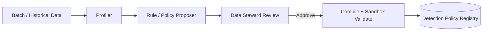
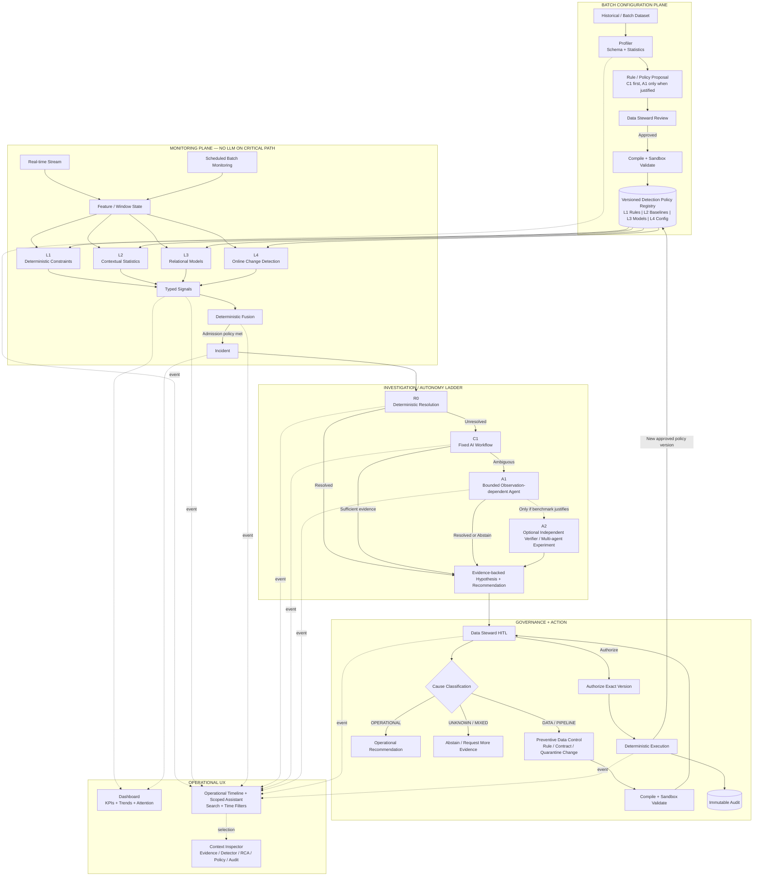
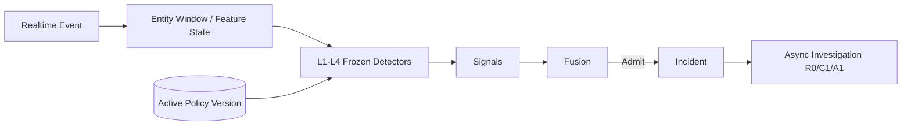
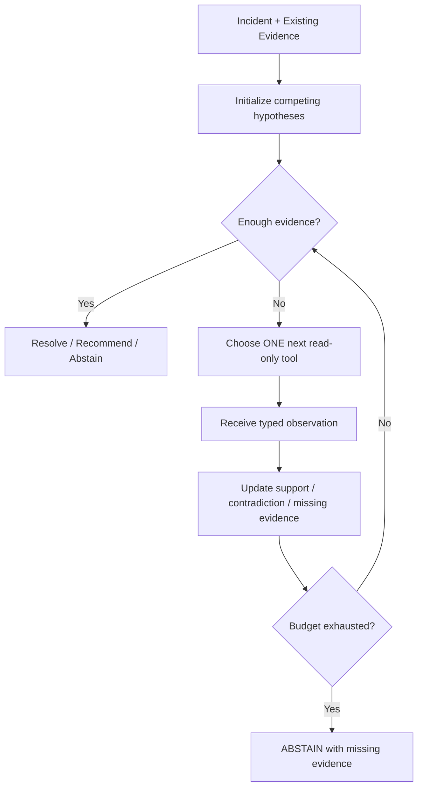

# DataTrust OS v5.1 — Architecture, Refactor, UX, and Theming Plan

**Status:** Proposed implementation plan  
**Date:** 2026-08-12  
**Primary user:** Data Steward  
**Source repositories reviewed:** `P-086-5(1)` and `P-086-UI_design`  
**North-star decision:** Keep the reliability/control architecture of v5, adopt the interaction model of the UI-design branch, and remove the misleading fixed six-agent pipeline from the production path.

---

## 0. Executive decision

DataTrust OS should become an **event-driven data reliability control plane with a conversational operational workspace**, not a chat application that happens to run data-quality tools and not a theatrical six-agent chain.

The target product has five distinct concerns:

1. **Batch configuration plane** — profile historical/batch data and create versioned detection policies.
2. **Continuous monitoring plane** — evaluate real-time and scheduled batch data with frozen, approved L1-L4 detection artifacts.
3. **Incident plane** — fuse signals into incidents before spending AI cost.
4. **Investigation and governance plane** — escalate R0 -> C1 -> A1, optionally A2, then require HITL before any control or execution change.
5. **Operational UX plane** — dashboard + searchable/filterable operational timeline + scoped assistant + contextual right-side inspector.

The handwritten architecture is valid, but it represents only the **Batch Rule/Policy Authoring subflow**, not all of v5.

---

## 1. Grill: decisions that must be accepted before refactoring

These are stop-ship architecture questions. If the team disagrees with any of them, resolve that disagreement before adding more UI or agents.

### 1.1 Stop calling the production core a fixed “6-agent ReAct loop”

The current UI-design branch describes:

`Orchestrator -> Profiler -> Anomaly Detector -> Diagnosis -> Rule Proposer -> Executor`

That is not the strongest v5 architecture. It collapses deterministic/statistical detectors, investigation, governance, and execution into anthropomorphic agents. It also contradicts the v5 ADR direction that autonomy must be earned by benchmark evidence.

**Decision:** Production architecture vocabulary becomes:

- detector/service/system component for deterministic functions;
- R0 for deterministic investigation;
- C1 for fixed AI workflow;
- A1 for bounded dynamic agent;
- A2 only for an optional multi-agent experiment.

The UI may still feel conversational, but it must label actors truthfully.

### 1.2 “Real-time only checks predefined rules” is too narrow if v5 still claims L1-L4

If real-time processing only checks rules created by Rule Proposer, then real-time monitoring is effectively L1-only. A value can remain inside a legal range while becoming abnormal relative to its entity history, relational model, or recent regime.

**Decision:** Real-time never authors rules and never runs an LLM in the critical path, but it may score against **frozen approved artifacts for L1-L4**:

- L1: deterministic rules/constraints;
- L2: historical baselines and robust statistics;
- L3: frozen relational model/version;
- L4: approved online change-point state/configuration, e.g. CUSUM.

Offline PELT remains a batch calibration/validation mechanism.

### 1.3 Chat cannot be the system of record

The current frontend parses JSON back out of chat text in `frontend/src/stores/chatStore.ts` to reconstruct profile/anomaly/rule state. That is backwards.

**Decision:** Domain state is persisted as typed entities and typed workflow events. The timeline/chat UI is a **projection** of that state.

Authority order:

`Database -> immutable evidence/audit -> REST snapshot -> WebSocket event -> frontend cache -> rendered timeline`

Never:

`chat text -> parse JSON -> infer domain state`.

### 1.4 One session per database is the wrong primary identity

A Data Steward works on projects, incidents, entities, datasets, controls, and time windows. A database is only one scope.

**Decision:** Sessions have explicit scope:

- `PROJECT`
- `INCIDENT`
- `DATASET`
- optionally `ENTITY`

A session can reference a database/dataset, but must not be defined by “one session = one DB”.

### 1.5 “Accept & Execute” in one click violates the governance thesis

The UI-design branch currently presents an attractive one-click action. It is incompatible with the stronger v5 control model.

**Decision:** Separate:

`Review -> Approve -> Compile -> Sandbox Validate -> Authorize exact version -> Execute`

High-risk execution must never be inferred from a chat command.

### 1.6 Do not expose raw chain-of-thought

`src/api/routes/__init__.py` currently saves strings such as `Thought: ...` from ReAct steps and broadcasts them to chat.

**Decision:** Replace raw thoughts with a structured, safe execution summary:

- action selected;
- tool called;
- evidence IDs used;
- result/status;
- uncertainty/abstention;
- elapsed time and cost where useful.

The user needs traceability, not hidden reasoning text.

### 1.7 If A1 cannot beat C1, ship C1

This is already one of the strongest ideas in v5 and must remain non-negotiable.

**Decision:** A1 is admitted only if it materially improves the benchmark under safety/cost/latency guardrails. A2 is disabled by default and is never implemented merely to make the architecture look “more multi-agent”.

### 1.8 Do not ship fake operational metrics

The UI-design branch contains simulated metrics such as “98.6% RCA Accuracy” and hard-coded throughput/agent status. The v5 repo also contains sample signals and seeded fallback incidents.

**Decision:** Every production/default metric must be one of:

- measured;
- explicitly marked demo/synthetic;
- absent with an honest empty state.

No unlabeled fabricated accuracy, MTTR, cost saving, event rate, incident count, or test-pass claim.

---

## 2. Canonical v5.1 architecture

### 2.1 The paper flow: keep it, but name it correctly

The simplest interpretation of the handwritten flow is the **Batch Policy Authoring Flow**:



This is a good, simple v5 subflow. It is not the whole runtime architecture.

### 2.2 Full v5.1 flow



### 2.3 Architecture invariants

1. **Batch is the only input to policy authoring.**
2. **Real-time never creates a new rule inline.** It only evaluates frozen approved detector artifacts.
3. **A real-time anomaly may create an incident that later proposes a new preventive control**, but this is asynchronous and governed.
4. **Fusion is deterministic.** LLMs do not decide whether raw signals become incidents.
5. **R0/C1/A1 are investigation tiers, not a chain of permanent specialist personas.**
6. **All writes require governance.** AI tools remain read-only until a structured proposal reaches the authorization pipeline.
7. **Every user-visible AI claim must point to evidence IDs.**
8. **Every detector result must record detector/policy/model version.**

---

## 3. Canonical autonomy vocabulary

The repo currently has naming drift around C0/R0. Fix this before more evaluation work.

| Tier | Canonical v5.1 meaning | LLM | Dynamic tool choice | Multi-agent | Production default |
|---|---|---:|---:|---:|---:|
| **R0** | Deterministic investigation / known-pattern resolution | No | No | No | Yes |
| **C1** | Fixed evidence bundle -> one structured AI analysis -> schema/evidence validation | Yes | No | No | Yes |
| **A1** | Bounded investigator choosing the next read-only tool from observations | Yes | Yes | No | Conditional |
| **A2** | Independent verifier or specialist multi-agent experiment | Yes | Yes | Yes | No |
| **C0** | Legacy compatibility name only; remove from product vocabulary | N/A | N/A | N/A | No |

### Required repo changes

- Update `docs/architecture/decision-log.md` so it no longer defines C0 as a one-shot LLM while `src/agents/baselines.py` defines C0 as an alias of R0.
- Deprecate `BaselineC0` in `src/agents/baselines.py`.
- Benchmark reports must use `R0`, `C1`, `A1`, `A2` only.
- If historical results use `C0`, add a migration/display alias in evaluation code, not a new production tier.

---

## 4. Current repo audit and disposition

### 4.1 What to keep

| Area | Keep | Reason |
|---|---|---|
| `src/reliability/detectors/l1_rules.py` | Yes | Correct L1 direction |
| `src/reliability/detectors/l2_contextual.py` | Yes, verify tests | Core contextual detector |
| `src/reliability/detectors/l3_relational.py` | Yes, verify frozen-model semantics | Core relational detector |
| `src/reliability/detectors/l4_changepoint.py` | Yes, separate online/offline roles | CUSUM + PELT are useful but serve different runtime paths |
| `src/reliability/fusion/*` | Yes | Correct deterministic admission layer |
| `src/reliability/models/*` | Yes, normalize naming | Strong typed-domain direction |
| `src/reliability/investigation/r0.py` | Yes | Correct deterministic first tier |
| `src/reliability/investigation/c1.py` | Yes | Correct fixed baseline |
| `src/reliability/governance/*` | Yes, persist it | Strong governance model but currently needs storage consolidation |
| `frontend/src/pages/ExecutiveDashboard.tsx` | Keep concepts/components | Dashboard remains a major product surface |
| UI-design branch session/time-filter/right-panel concepts | Keep interaction model | Stronger operational UX than the current page split |

### 4.2 What to refactor

| Current | Problem | Target |
|---|---|---|
| `frontend/src/App.tsx` manual hash state | React Router is installed but not actually used | Real route tree with URL-addressable project/workspace/filter state |
| `frontend/src/stores/chatStore.ts` JSON extraction | Domain state inferred from message prose | Typed event + server-state query model |
| `frontend/src/services/websocket.ts` CoT parsing | Parses reasoning strings and synthesizes confidence | Typed `WorkflowEvent` envelope |
| `src/api/routes/__init__.py::/chat/send` | Global ReAct engine can trigger workflow tools directly | Scoped assistant endpoint that reads domain state and creates proposals only |
| `src/services/conversation_store.py` | Message-only model, weak scope | Session + timeline/event store |
| `src/reliability/investigation/a1.py` | Precomputes a candidate tool plan before observations | True observation-dependent choose/observe/update loop |
| `src/reliability/governance/preventive_controls.py` | Important state held in process memory | Repository-backed persistent controls/versions/authorizations |
| WebSocket broadcast model | Session-centric and not sufficiently domain-scoped | Project/incident/user subscriptions with sequence/resync |

### 4.3 What to remove or quarantine as legacy

- `src/orchestrator/orchestrator.py` fixed profiler/anomaly/diagnosis/rule/executor chain from the production path.
- Duplicate ReAct implementations under `src/agents/*` and `src/orchestrator/*` after the canonical A1 path is complete.
- “6-Agent ReAct Loop” claims in UI copy and documentation.
- Agent personality/status colors that imply deterministic engines are autonomous AI agents.
- Global chat actions that directly clean/execute data.
- Raw `Thought:` rendering.
- Static/fake UI metrics and status indicators.
- Any direct SQL/Python editing path for executable controls.

Do not delete legacy code until replacement paths have regression tests. Move it under an explicit `legacy/` or archive path first if needed.

---

## 5. Backend target structure

A cleaner package boundary should look approximately like this:

```text
src/
  reliability/
    detection/
      l1.py
      l2.py
      l3.py
      l4.py
      runtime.py
    policy/
      models.py
      registry.py
      compiler.py
      calibration.py
    fusion/
      engine.py
      policy.py
    incidents/
      models.py
      repository.py
      service.py
    investigation/
      r0.py
      c1.py
      a1.py
      a2.py          # optional/feature-flagged only
      tools.py
      models.py
    governance/
      controls.py
      authorizations.py
      executor.py
    events/
      models.py
      repository.py
      publisher.py
  api/
    v1/
      projects.py
      dashboard.py
      timeline.py
      sessions.py
      signals.py
      incidents.py
      investigation.py
      policies.py
      controls.py
      audit.py
      assistant.py
      evaluation.py
```

The exact file moves can be incremental. The important part is the ownership boundary: detection, investigation, governance, and UX events must not be mixed inside one chat route.

---

## 6. Detection Policy Registry

The handwritten `Rule Registry` should become a broader **Detection Policy Registry**.

A policy version is an immutable bundle containing the artifacts needed to score data without LLM calls:

```text
PolicyVersion
├── L1 deterministic RuleSpecs
├── L2 baseline statistics / window config
├── L3 frozen model reference + feature schema
├── L4 online threshold/state configuration
├── provenance
├── source snapshot IDs
├── compiler version
├── content hash
├── approval metadata
└── effective time
```

### 6.1 Policy lifecycle

```text
DRAFT
-> PROPOSED
-> REVIEW_PENDING
-> APPROVED
-> COMPILED
-> SANDBOX_VALIDATED
-> AUTHORIZED
-> ACTIVE
-> SUPERSEDED | REVOKED
```

A user edit creates a **new version**. It never mutates an active version in place.

### 6.2 Real-time policy update behavior

1. Compile/validate the new version off-path.
2. Approve and authorize it.
3. Atomically switch the active policy pointer.
4. New events use the new `policy_version_id`.
5. In-flight events finish on the previous version or follow a documented cutover rule.
6. Every signal records the exact policy/model version used.

---

## 7. Real-time and batch runtime behavior

### 7.1 Real-time

**Critical-path requirement:** no LLM and no Rule Proposer.



Runtime expectations:

- L1 is stateless or near-stateless where possible.
- L2 uses only observations prior to the scored timestamp.
- L3 uses a frozen model/version and matching feature schema.
- L4 online path uses incremental state such as CUSUM.
- PELT is not run per event; use it in offline/batch validation or recalibration.
- Signals are idempotent for the same source event + detector version where feasible.

### 7.2 Scheduled batch monitoring

Scheduled batch monitoring may run all L1-L4 detectors and can use offline algorithms such as PELT where appropriate. It still emits the same `Signal` schema and enters the same Fusion -> Incident path.

### 7.3 Policy authoring remains batch-only

The policy-authoring pipeline may consume historical windows, uploaded files, snapshots, or warehouse extracts. It must not learn a new rule synchronously from a single streaming event.

---

## 8. A1 refactor: make it a real bounded investigator

The current `src/reliability/investigation/a1.py` builds `candidate_order` and `tool_plan` before executing the tools. That is bounded, but it is not strongly observation-dependent.

### 8.1 Target loop



### 8.2 Hard bounds

A1 must enforce:

- max tool calls;
- max model calls;
- max tokens;
- wall-clock timeout;
- max hypothesis revisions;
- domain-scoped tool allowlist;
- read-only tool contract;
- evidence-reference validation;
- no direct control mutation;
- explicit abstention.

### 8.3 UI trace contract

Do not show raw reasoning. Emit events such as:

```json
{
  "event_type": "INVESTIGATION_TOOL_COMPLETED",
  "actor_kind": "AI",
  "actor_id": "A1",
  "summary": "Checked recent charging history",
  "tool_name": "fetch_charging_history",
  "evidence_refs": ["ev_..."],
  "result_status": "SUPPORTS_OPERATIONAL_CAUSE"
}
```

---

## 9. Domain event model: foundation of the new UI

Create a canonical `WorkflowEvent` / `TimelineEvent` model.

### 9.1 Required fields

```text
event_id
sequence_number
project_id
incident_id? 
session_id?
entity_ids[]
phase
actor_kind
actor_id
event_type
severity?
summary
payload_json
evidence_refs[]
created_at
correlation_id
causation_id?
```

### 9.2 Actor kinds

```text
HUMAN
DETECTOR
SYSTEM
AI
EXECUTOR
INTEGRATION
```

### 9.3 Phases

```text
INGEST
PROFILE
DETECT
FUSE
INVESTIGATE
REVIEW
VALIDATE
AUTHORIZE
EXECUTE
AUDIT
```

### 9.4 Initial event types

```text
SNAPSHOT_INGESTED
PROFILE_COMPLETED
POLICY_PROPOSED
POLICY_APPROVED
POLICY_ACTIVATED
SIGNAL_CREATED
INCIDENT_ADMITTED
INCIDENT_UPDATED
INVESTIGATION_STARTED
R0_RESOLVED
C1_COMPLETED
A1_TOOL_STARTED
A1_TOOL_COMPLETED
HYPOTHESIS_UPDATED
INVESTIGATION_ABSTAINED
RECOMMENDATION_CREATED
CONTROL_PROPOSED
CONTROL_APPROVED
SANDBOX_VALIDATED
AUTHORIZATION_ISSUED
EXECUTION_STARTED
EXECUTION_COMPLETED
EXECUTION_FAILED
USER_MESSAGE
ASSISTANT_MESSAGE
```

This event stream becomes the source for the operational timeline, recent activity, session counts, phase filtering, and live updates.

---

## 10. Persistence changes

`src/db/schema.sql` still declares itself “DataTrust OS v4.0 Schema DDL”. Correct this through a migration, not an unsafe manual reset.

### 10.1 Add or normalize these tables

#### `signals`
Persist L1-L4 signals; do not return hard-coded values from `src/api/routes/signals.py`.

Key fields:

```text
signal_id PK
project_id
source_event_id / snapshot_id
entity_ids JSON
layer
detector_name
detector_version
policy_version_id
signal_type
metric_or_relationship
score
severity
time_window JSON
evidence_refs JSON
provenance
created_at
```

#### `policy_versions`

```text
policy_version_id PK
project_id
version
status
source_snapshot_ids JSON
artifact_manifest_hash
created_by
approved_by
created_at
approved_at
effective_at
supersedes_version_id
```

#### `detector_artifacts`

```text
artifact_id PK
policy_version_id
layer
artifact_type
artifact_version
config_json
model_uri_or_blob_ref
feature_schema_json
content_hash
created_at
```

#### `workflow_events`
Use the event schema from Section 9 and index:

- `(project_id, sequence_number)`
- `(incident_id, sequence_number)`
- `(session_id, created_at)`
- `(project_id, phase, created_at)`
- `(project_id, event_type, created_at)`

#### `sessions`

```text
session_id PK
project_id
scope_type
scope_id
title
created_by
created_at
last_activity_at
archived_at?
```

#### `investigation_runs`
Persist mode, bounds, outcome, cost/latency, and exact evidence set.

#### controls / versions / authorizations
Move process-memory authority from `global_control_manager` into persistent repositories. An in-memory cache may remain, but it cannot be authoritative.

### 10.2 Messages

Keep `messages` only if it serves real human/assistant content. System events belong in `workflow_events`.

---

## 11. API refactor

Canonical namespace remains `/api/v1`.

### 11.1 Dashboard

```text
GET /projects/{project_id}/dashboard?from=&to=&timezone=
```

Return measured summaries only:

- open incidents;
- critical incidents;
- signals by L1-L4;
- incident statuses;
- pending approvals;
- affected entities;
- monitoring run health;
- provenance coverage;
- trend series.

### 11.2 Timeline

```text
GET /projects/{project_id}/timeline
    ?from=
    &to=
    &cursor=
    &limit=
    &phase=
    &event_type=
    &layer=
    &severity=
    &incident_id=
    &entity_id=
    &q=
```

Use cursor pagination, not a hard 100-message limit for long-running projects.

### 11.3 Sessions

```text
GET  /projects/{project_id}/sessions?scope_type=&scope_id=&from=&to=&q=
POST /projects/{project_id}/sessions
GET  /sessions/{session_id}
GET  /sessions/{session_id}/timeline
POST /sessions/{session_id}/messages
```

### 11.4 Incidents

Keep and strengthen:

```text
GET  /projects/{project_id}/incidents
GET  /incidents/{incident_id}
GET  /incidents/{incident_id}/evidence
GET  /incidents/{incident_id}/timeline
POST /incidents/{incident_id}/investigate?mode=R0|C1|A1
GET  /incidents/{incident_id}/hypotheses
GET  /incidents/{incident_id}/recommendations
```

A missing incident returns 404. A project with no incidents returns `[]`. Do not synthesize a fallback incident.

### 11.5 Policies

```text
POST /projects/{project_id}/policy-proposals
GET  /projects/{project_id}/policies
GET  /policies/{policy_version_id}
POST /policies/{policy_version_id}/review
POST /policies/{policy_version_id}/compile
POST /policies/{policy_version_id}/sandbox
POST /policies/{policy_version_id}/activate
```

### 11.6 Assistant

Replace the global action-oriented `/chat/send` semantics with a scoped assistant:

```text
POST /sessions/{session_id}/assistant
```

Input includes the current explicit scope. Assistant tools are read-only. If the user requests a write, the assistant creates a structured **proposal**, then the governance workflow handles the write.

---

## 12. WebSocket model

Keep WebSocket for live operational updates; do not make it the authoritative state store.

### 12.1 Subscription scopes

A connection must be authenticated and may subscribe to:

```text
project:{project_id}
incident:{incident_id}
session:{session_id}
user:{user_id}
```

### 12.2 Envelope

```json
{
  "type": "workflow.event",
  "project_id": "proj_...",
  "sequence_number": 1842,
  "event": { "...": "WorkflowEvent" }
}
```

### 12.3 Reconnect behavior

On reconnect:

1. client sends/knows last received sequence;
2. REST fetches missed events after that sequence;
3. client resumes live subscription;
4. no event state is reconstructed from prose.

---

## 13. Frontend information architecture

The current three-page split (`Project Control Room`, `Incident Workspace`, `Executive Dashboard`) should be simplified.

### 13.1 Primary navigation

```text
Overview
Workspace
Policies & Controls
Audit
Evaluation
Settings   (optional)
```

### 13.2 Route tree

Use the already-installed React Router instead of manual `window.location.hash` state.

```text
/projects/:projectId/overview
/projects/:projectId/workspace
/projects/:projectId/workspace?incident=:incidentId&session=:sessionId
/projects/:projectId/policies
/projects/:projectId/audit
/projects/:projectId/evaluation
```

Encode shareable filters in query parameters where practical:

```text
?range=7d&layers=L2,L3&severity=HIGH,CRITICAL&phase=INVESTIGATE
```

### 13.3 Server state versus UI state

Recommended split:

- **TanStack Query** for REST server state, caching, refetch/invalidation, and paginated timeline data.
- **Zustand** only for local UI state such as selected timeline event, inspector visibility/width, density preference, draft composer state, and theme.
- **WebSocket** invalidates or incrementally updates relevant query caches.

Delete the need for `autoRepairJson`, `extractObservationJsons`, and `syncWorkspaceFromMessages` from `chatStore.ts`.

---

## 14. New Workspace UX

The UI-design branch has the right interaction idea. Rebuild it in React using real APIs; do not port its mock engine.

### 14.1 Desktop structure

```text
┌──────────────────────────────────────────────────────────────────────────────┐
│ Project / global filters / time range / search / connection health          │
├──────────────────────┬───────────────────────────────────┬───────────────────┤
│ LEFT                 │ CENTER                            │ RIGHT             │
│                      │                                   │                   │
│ Scope + sessions     │ Operational Timeline             │ Context Inspector │
│ Incidents            │ + scoped assistant messages      │                   │
│ Saved filters        │ + event cards                    │ Evidence          │
│ Recency groups       │                                   │ Detector detail   │
│                      │ Composer at bottom                │ RCA / hypothesis  │
│                      │                                   │ Policy / audit    │
└──────────────────────┴───────────────────────────────────┴───────────────────┘
```

Suggested desktop sizing, adjustable after usability testing:

- left rail: 280-320 px;
- center: flexible, minimum approximately 640 px;
- right inspector: 380-460 px, resizable/collapsible.

### 14.2 Do not render every event as a chat bubble

Use two visual grammars:

**Human/assistant conversation**
- conventional message block;
- citations/evidence references;
- proposed actions shown as explicit cards.

**System workflow activity**
- compact typed timeline cell/card;
- phase badge;
- actor badge;
- timestamp;
- one-line result;
- expand for evidence, metadata, model/version, tool call summary.

Example:

```text
14:32:08  [L3 DETECTOR] [HIGH]
Relationship residual exceeded frozen-model threshold
VIN-123 · model l3-trip-v12 · 3 evidence refs
```

This preserves the “multi-actor chat” feel without pretending deterministic detectors are autonomous people.

### 14.3 Actor labels

Recommended labels:

```text
[L1 DETECTOR]
[L2 DETECTOR]
[L3 DETECTOR]
[L4 DETECTOR]
[FUSION]
[R0]
[C1 AI]
[A1 AI]
[A2 VERIFIER]    # only when enabled
[DATA STEWARD]
[EXECUTOR]
[SYSTEM]
```

Avoid agent avatars and personality colors unless an entity is genuinely an autonomous agent.

---

## 15. Timeline, history, filters, and search

This is a core product feature, not decoration.

### 15.1 Quick time controls

Keep the UI-design branch concept:

```text
Today | 3d | 7d | This Week | This Month | Custom
```

Add:

- absolute date/time range;
- explicit timezone indicator;
- oldest/newest-first toggle;
- “Live” mode that pins to incoming events;
- pause live scrolling without pausing ingestion.

### 15.2 Filters

Support combined filters:

```text
phase
actor kind
L1-L4 layer
severity
incident status
entity/VIN/station
policy/control ID
provenance
event type
text search
```

Filter state should be encoded in the URL so a steward can share the exact operational view.

### 15.3 Session list

Group sessions by recency instead of by database identity:

```text
Updated today
Yesterday
This week
This month
Older
```

For each item show:

- title;
- scope icon/type;
- scope name/ID;
- last updated;
- unread/new-event count where reliable;
- incident severity/status when incident-scoped.

Allow filtering by project, incident, dataset, entity, and date range.

### 15.4 Search behavior

Search must cover structured identifiers and text:

- incident IDs;
- evidence IDs;
- VIN/entity IDs;
- policy/control IDs;
- detector names;
- message/timeline summaries.

Prefer server-side search for history beyond the current loaded page.

---

## 16. Right-side Context Inspector

This is one of the strongest ideas from the UI-design branch. Make it selection-driven rather than fixed mock tabs.

### 16.1 Dynamic panels by selected event

#### Signal selected

```text
Overview
Detector Detail
Evidence
Entity Context
Provenance
```

Show:

- layer;
- severity separately;
- metric/relationship;
- observed value;
- expected/baseline value;
- threshold/model version;
- time window;
- evidence IDs.

#### Incident selected

```text
Overview
Signals
Evidence
Timeline
Impact
```

#### Investigation event selected

```text
Hypotheses
Supporting Evidence
Contradicting Evidence
Missing Evidence
Tool Activity
Bounds / Cost / Latency
```

#### Policy/control selected

```text
Rule / Config
Version Diff
Compiler Output
Sandbox Result
Approval
Authorization
Execution / Rollback
```

### 16.2 Pinning

Allow “Pin inspector” so the user can scroll the timeline while keeping a selected incident/evidence object visible.

### 16.3 Pinned artifact tabs (hybrid inspector)

Locked 2026-08-19: keep the current four tabs as **pinned artifact views** of the same `run_id` / `dataset_key` state. Do not treat them as a second source of truth.

```text
Inspector (selection-driven, default)
  + pinned: Traces | Profiler | Rules & HITL | Split DB
```

- Selecting a timeline/trace cell fills the inspector (actor, one-line result, evidence IDs, tool I/O).
- Tabs stay for mentor muscle memory and for pinning an artifact while the timeline scrolls.
- HITL queue on the Rules tab is scoped to the current `dataset_key` / `run_id`.
- Empty traces stay empty. Never synthesize a VinGroup story, token counts, or SHA-256 hashes.

### 16.4 Steward Trace Card

Default (steward) view — no raw chain-of-thought:

```text
#N  [C1 AI]  profile_dataset     842ms   380 tok
Done: Sampled 50,000 rows. 14 range flags on soc_pct.
Evidence: ev_014…                 [Open in chat] [Pin]
▾ Tool I/O
```

Rules:

- `Done` is derived from `tool_output` / `observation` counts. No hardcoded “12 anomalies”.
- Optional “Technical detail” may show thought for instructors. Default hides it.
- Jump-to-chat must scroll the live `.chat-stream` message (`data-msgid`).
- Map API fields: `tool_name`→tool, `tokens_used`→tokens, `observation`→Done.
- Live append via WebSocket `agent.trace`. Status: RUNNING / FAILED / COMPLETED.

A steward must answer from the right panel without leaving it: what ran, what it found, which evidence, what waits on me, what approval changes.

---

## 17. Dashboard design

The dashboard remains important and should answer operational questions quickly.

### 17.1 First screen questions

1. Is the project healthy now?
2. What changed in the selected time range?
3. What needs human attention?
4. Which L1-L4 layers are contributing signals?
5. Which incidents are worsening or unresolved?
6. Are controls awaiting approval or execution?
7. What is measured versus demo/synthetic?

### 17.2 Recommended modules

**Top KPI row — limit it**

- Open incidents
- Critical/high incidents
- Pending human reviews
- Affected entities
- Last successful monitoring run

**Main analysis**

- linked L1-L4 signal trend;
- incident status/severity trend;
- top affected entities;
- incident queue requiring action;
- monitoring/runtime health;
- provenance coverage.

**Recent activity**

- compact subset of the same canonical workflow events used by Workspace.

### 17.3 Linked filters

A dashboard time/entity/project filter should update all linked charts and tables. Drilling into an incident should open Workspace with the same filter context.

### 17.4 Evaluation metrics stay separate

Research metrics such as RCA precision/recall, A1-vs-C1 benchmark gain, and cost should live under **Evaluation**, unless a dashboard value is a current measured production metric.

---

## 18. Theming: “Operational Trust”, not “futuristic command center”

The UI-design branch is visually memorable, but neon/glass effects should not define the new product. The target should feel like a modern observability/reliability console: dense, calm, precise, and auditable.

### 18.1 Visual principles

Use:

- quiet graphite/navy or neutral surfaces;
- thin borders;
- restrained shadows;
- strong typographic hierarchy;
- data-first density;
- semantic tokens;
- limited accent color;
- subtle motion for state change only.

Avoid:

- glowing neon borders;
- glass blur behind dense text;
- persistent pulsing animations;
- gradients with no semantic meaning;
- excessive agent avatars;
- “AI thinking” theater;
- monospaced font for normal prose.

### 18.2 Semantic token groups

```text
SURFACE
--canvas
--surface-primary
--surface-secondary
--surface-elevated
--surface-hover

BORDER
--border-subtle
--border-default
--border-strong

TEXT
--text-primary
--text-secondary
--text-muted
--text-inverse

BRAND / TRUST
--trust-primary
--trust-hover
--focus-ring

STATUS
--status-info
--status-success
--status-warning
--status-critical

AI
--ai-assist
--ai-assist-subtle

LAYERS
--layer-l1
--layer-l2
--layer-l3
--layer-l4

PROVENANCE
--prov-real
--prov-public
--prov-semi-synthetic
--prov-synthetic
```

Do not hard-code feature colors inside components.

### 18.3 L1-L4 color rule

Layer color is categorical, not severity.

Do not encode:

`red = L1` while also using red = critical.

Prefer an accessible categorical sequence and always show the visible `L1/L2/L3/L4` label/icon. Severity gets its own badge and icon.

Example:

```text
[L3] Relationship anomaly       [HIGH]
```

not a color-only meaning.

### 18.4 Light + dark

Support both themes through the same tokens.

Light mode matters for classroom/projector/demo use. Dark mode should be optimized for sustained operational viewing.

### 18.5 Density

Implement at least two density modes through spacing tokens:

- Comfortable
- Compact

Operational timelines and tables benefit from compact mode; approval forms may remain comfortable.

### 18.6 Motion

Use motion for:

- newly arriving event highlight;
- inspector transition;
- status transition;
- optimistic/confirmed mutation feedback.

Respect `prefers-reduced-motion`. Do not animate “working” continuously when a static status plus elapsed time is clearer.

---

## 19. AI UX rules

### 19.1 Evidence before confidence

Do not lead with a numeric confidence badge unless that confidence is calibrated and the team has tested whether users interpret it correctly.

Prefer:

- supporting evidence;
- contradictory evidence;
- missing evidence;
- data provenance;
- explanation of why the hypothesis was proposed;
- explicit abstention.

### 19.2 AI is assistive, not authoritative

Every AI recommendation card must show:

```text
What is being proposed?
Why?
Which evidence supports it?
What evidence contradicts it?
What will change if approved?
Can it be rolled back?
Who must approve it?
```

### 19.3 High-risk actions

The assistant may create a draft/proposal, but the interface must move the user into a structured governance card for approval. Do not execute from free-form text.

### 19.4 Graceful failure

If evidence is insufficient, show:

```text
Status: Insufficient evidence
Missing: charging-session history from 14:00-15:00
Next safe action: request/fetch this evidence
```

This is better than a low-quality confident diagnosis.

### 19.5 Upload auto-run contract

Locked 2026-08-19: after a steward uploads a file (or starts the live VinGroup demo), the orchestrator auto-runs **only** this prefix:

```
register_dataset → profile → detect (frozen L1–L4 if a policy exists, else L1 + “no approved policy”) → propose rules
STOP at HITL
```

Do **not** auto-clean, quarantine, compile, authorize, or execute. Clean is a later gated step after Review → Approve → Compile → Sandbox → Authorize exact version.

Orchestrator first message (template):

- dataset name, row/col counts, provenance (`user_upload` | `demo` | `real` | …);
- measured findings (counts from this run);
- number of drafted rules;
- explicit “nothing written to clean/quarantine”.

Right panel: Traces while running; switch to Rules when proposals exist.

---

## 20. Specific frontend file plan

### `frontend/src/App.tsx`

- Replace manual hash-switch routing.
- Create a real route/layout hierarchy.
- Add persistent navigation and project context.

### `frontend/src/pages/ExecutiveDashboard.tsx`

- Rename/reframe to `OverviewPage` if desired.
- Connect all metrics to canonical dashboard APIs.
- Add linked time/entity filters.
- Remove any non-measured claims.

### `frontend/src/pages/ProjectControlRoom.tsx`

- Decompose useful components.
- Merge operational detail into new `WorkspacePage` and overview metrics into `OverviewPage`.
- Deprecate the standalone “Control Room” route to avoid duplicate concepts.

### `frontend/src/pages/IncidentWorkspace.tsx`

- Evolve into incident-scoped mode of the general Workspace.
- Preserve deep evidence/hypothesis/recommendation functionality.

### `frontend/src/stores/chatStore.ts`

Delete the content-parsing architecture:

- `autoRepairJson`
- `extractAllValidJsons`
- `extractObservationJsons`
- `syncWorkspaceFromMessages`

Replace with small UI stores:

```text
workspaceUiStore
- selectedEventId
- inspectorOpen
- inspectorWidth
- liveMode
- density
- composerDraft
```

### `frontend/src/services/websocket.ts`

- Remove chain-of-thought parsing.
- Accept typed workflow events.
- Track sequence number.
- Reconcile on reconnect.
- Invalidate/update server-state queries.

### New component families

```text
components/navigation/
components/dashboard/
components/workspace/
  ScopeSidebar
  SessionList
  TimelineFilterBar
  TimelineFeed
  TimelineEventCard
  HumanMessage
  AssistantMessage
  AssistantComposer
  ContextInspector
  EvidencePanel
  DetectorPanel
  HypothesisPanel
  PolicyDiffPanel
  AuditPanel
components/shared/
  LayerBadge
  SeverityBadge
  ProvenanceBadge
  EmptyState
  ErrorState
  TimeRangePicker
```

---

## 21. Specific backend file plan

### `src/main.py`

- Update application/version naming from 4.2.0 to the actual v5.1 target.
- Ensure all canonical v1 routers are explicit and no old route silently shadows them.

### `src/api/routes/signals.py`

- Remove `sample_signals` from normal operation.
- Read from `SignalRepository`.
- Keep demo seed data behind an explicit demo command/flag only.

### `src/api/routes/incidents.py`

- Remove auto-seeded fallback incident behavior.
- Persist and retrieve only real/demo-labeled incidents.
- Investigation endpoints should emit timeline events.

### `src/api/routes/__init__.py`

- Break up the monolith.
- Remove global `/chat/send` as workflow orchestrator.
- Do not register write-capable tools directly into a general chat ReAct engine.
- Move assistant behavior to scoped `assistant.py`.

### `src/services/conversation_store.py`

- Keep for user/assistant messages or replace with `SessionRepository` + `TimelineRepository`.
- Add scope-aware session metadata and server-side filters.

### `src/reliability/investigation/a1.py`

- Replace precomputed `tool_plan` with iterative selection based on the latest structured hypothesis state.
- Emit typed tool/evidence events.

### `src/agents/baselines.py`

- Canonicalize R0/C1/A1/A2 vocabulary.
- Deprecate C0.
- Keep benchmark adapters separate from production orchestration.

### `src/orchestrator/orchestrator.py`

- Remove from production imports.
- Archive as legacy after parity tests pass.

### `src/reliability/governance/preventive_controls.py`

- Replace in-memory authoritative dictionaries with repository persistence.
- Preserve exact-version authorization invariants.

### `src/db/schema.sql`

- Stop labeling schema as v4.
- Add migration-backed v5.1 tables described above.

---

## 22. UI-design branch migration policy

### Take these concepts

- dashboard prominence;
- three-column operational workspace;
- left-side session navigation;
- Today / 3d / 7d / This Week / This Month filters;
- rich central stream;
- contextual right-side inspector;
- visible HITL review cards;
- clear Clean vs Quarantine outcomes where applicable.

### Do not take these semantics

- fixed six-agent production architecture;
- one session = one database identity;
- neon/glass as the primary visual language;
- fake “agent health” for deterministic services;
- fake 98.6% RCA accuracy;
- hard-coded request rates;
- direct SQL/Python edit-and-execute;
- “Accept & Execute” single-step governance;
- static 7-step mission flow as the universal backend process.

Rebuild the good concepts as React components over v5 APIs instead of transplanting the static HTML/JS runtime.

---

## 23. Testing plan

### 23.1 Architecture contract tests

- real-time scoring path makes zero LLM calls;
- policy authoring accepts batch/historical input only;
- every signal contains policy/detector version;
- Fusion is deterministic for identical input signals;
- no control executes without valid authorization bound to exact version/hash;
- user edit invalidates prior authorization;
- missing incident never causes a synthetic production incident to appear.

### 23.2 L2/L3/L4 correctness

- L2 no future leakage;
- L3 train/reference window strictly separated from score window;
- L4 CUSUM online state is reproducible;
- PELT remains offline/batch path;
- detector artifacts are immutable/versioned.

### 23.3 A1 tests

- next tool changes based on prior observation;
- contradictory evidence changes hypothesis state;
- missing evidence can cause abstention;
- budget termination is deterministic and visible;
- tool allowlist is enforced;
- write tools are unavailable;
- invalid evidence IDs fail validation.

### 23.4 Timeline/event tests

- monotonic sequence per project stream;
- project/incident/session filtering correct;
- reconnect backfills missed events;
- duplicate WebSocket deliveries are idempotently rendered;
- event actor/phase/type validated.

### 23.5 Frontend tests

- URL filters restore the same view;
- timeline quick filters and custom range agree with server queries;
- selecting an event updates the inspector without parsing text;
- dashboard drill-down preserves context;
- no hidden-reasoning string is shown;
- empty states work without demo data;
- light/dark themes pass contrast tests;
- keyboard navigation and visible focus work;
- critical actions require confirmation/governance state.

### 23.6 Accessibility target

Target **WCAG 2.2 AA** for the app. In particular:

- visible keyboard focus;
- target size/spacing consistent with 2.5.8;
- no color-only status communication;
- reflow at narrow widths;
- accessible names for icon-only controls;
- charts have table/text alternatives where needed.

---

## 24. Research benchmark and product claim gate

Keep research evaluation separate from operational monitoring.

### R0/C1/A1 benchmark dimensions

- root-cause classification precision/recall/F1;
- evidence precision / evidence grounding rate;
- abstention quality;
- missing-evidence identification;
- correction time;
- latency;
- token/API cost;
- tool calls;
- unsafe-action rate;
- unsupported-claim rate.

### A1 admission

A1 should be enabled by default only if it beats C1 under the agreed value criterion without violating precision, cost, latency, or safety guardrails.

### A2 admission

Implement A2 only if A1 error analysis reveals a repeatable failure class that an independent verifier/specialist design is expected to fix and the experiment shows that it actually does.

---

## 25. Implementation sequence

### Wave 0 — Architecture truth reset

**Priority: P0**

- freeze canonical v5.1 vocabulary;
- update ADR/decision log for R0/C1/A1/A2;
- rename the paper flow as Batch Policy Authoring;
- remove 6-agent claims from active docs/UI copy;
- define `WorkflowEvent` schema;
- define policy registry contract;
- flag all fake/demo values.

**Exit:** one architecture diagram and one vocabulary are used across code, README, demo, and mentor presentation.

### Wave 1 — Persistence and fake-data removal

**Priority: P0**

- add `signals`, `workflow_events`, `sessions`, `policy_versions`, `detector_artifacts`, `investigation_runs`;
- persist controls/authorizations;
- replace sample signals;
- remove seeded fallback incidents;
- explicit demo seed command;
- version/schema labels updated.

**Exit:** a fresh system honestly renders empty state; demo state is explicitly seeded/labeled.

### Wave 2 — Policy registry + runtime split

**Priority: P0**

- implement versioned detection policy registry;
- compile batch-created artifacts;
- separate authoring from monitoring;
- real-time path loads frozen L1-L4 artifacts;
- add policy version to signals.

**Exit:** a streaming event can be scored without any LLM/Rule Proposer call.

### Wave 3 — Investigation cleanup

**Priority: P0/P1**

- strengthen R0 and C1 contracts;
- refactor A1 to observation-dependent loop;
- remove raw thought broadcasting;
- emit evidence-backed typed events;
- deprecate C0;
- A2 remains off.

**Exit:** one incident can be traced from signals through R0/C1/A1 with all evidence IDs and bounds visible.

### Wave 4 — API + event stream

**Priority: P1**

- add dashboard/timeline/session APIs;
- split monolithic chat route;
- scoped assistant endpoint;
- scoped WebSocket subscriptions;
- cursor pagination and reconnect backfill.

**Exit:** frontend no longer needs to parse message content to reconstruct domain state.

### Wave 5 — Frontend shell and state refactor

**Priority: P1**

- use real React Router;
- add TanStack Query for server state;
- reduce Zustand to UI state;
- create persistent project layout/navigation;
- implement time/filter URL state.

**Exit:** reload/share URL restores project, page, scope, time range, and filters.

### Wave 6a — Honesty pass (mentor-visible, before full Wave 6)

**Priority: P0**

Locked 2026-08-19.

- delete `AgentTracesTab` synthesis and hardcoded Done strings;
- map real `/traces/{session}` fields (`tool_name`, `observation`, `tokens_used`);
- connect `agentSocket` and append `agent.trace`;
- fix Jump-to-chat (`.chat-stream` + `data-msgid`);
- scope HITL queue to `dataset_key`;
- time pills filter traces/messages (or stay hidden — no fake hashes);
- New Chat: Run VinGroup demo + Replay fixture + Upload;
- upload / live demo auto-run stops at HITL (§19.5);
- honest actor labels (§27.1);
- no unlabeled 99% health / 12-anomaly / SHA-256 theater.

**Exit:** empty session shows empty traces; demo is labeled; a judge can finish the 90s story without bringing a file.

### Wave 6 — Operational Workspace

**Priority: P1**

- build session/sidebar from UI-design concept;
- build typed timeline feed;
- human/assistant messages distinct from system events;
- build dynamic right inspector;
- implement live mode + history filters + search.

**Exit:** the UI-design interaction model is present, but every visible item comes from canonical v5 state/events.

### Wave 7 — Dashboard + theming

**Priority: P1/P2**

- dashboard hierarchy cleanup;
- linked filters/drill-down;
- semantic theme tokens;
- light/dark;
- compact/comfortable density;
- remove neon/glass/pulse excess;
- accessibility pass.

**Exit:** dashboard and workspace share one design system and one event/domain model.

### Wave 8 — Governance UX + evaluation

**Priority: P1**

- policy diff;
- sandbox result;
- authorization detail;
- execution manifest;
- rollback visibility;
- measured benchmark page;
- A1 admission decision;
- optional A2 experiment only after error analysis.

**Exit:** demo proves safety and evidence, not just visual automation.

---

## 26. Definition of Done

### Architecture

- [ ] One canonical v5.1 flow used everywhere.
- [ ] Batch policy authoring separated from monitoring.
- [ ] No LLM in real-time critical path.
- [ ] Realtime supports frozen L1-L4 artifacts if v5 claims L1-L4 realtime reliability.
- [ ] Fusion precedes AI investigation.
- [ ] R0/C1/A1/A2 taxonomy is consistent.

### Backend

- [ ] No production sample signals/fallback incidents.
- [ ] Signals persisted.
- [ ] Policy versions/artifacts persisted.
- [ ] Controls/authorizations persisted.
- [ ] Workflow events persisted and scoped.
- [ ] A1 is observation-dependent and bounded.
- [ ] No raw chain-of-thought exposed.

### Frontend

- [ ] Dashboard is clear and metric-driven.
- [ ] Workspace has left session/history rail, center timeline, right inspector.
- [ ] Today/3d/7d/This Week/This Month/custom filters work server-side.
- [ ] Sessions filter/search by scope and recency.
- [ ] Timeline state is typed, not parsed from prose.
- [ ] Dashboard drill-down opens the correct workspace context.
- [ ] Light/dark + compact/comfortable supported.
- [ ] No fake metrics in normal mode.

### Governance

- [ ] No direct “Accept & Execute” shortcut.
- [ ] No arbitrary executable SQL/Python from the assistant.
- [ ] Exact-version authorization required.
- [ ] Every execution creates an auditable manifest/event.

### Research

- [ ] R0/C1/A1 evaluated on the same corpus.
- [ ] A1 claim is removed if the benchmark gate fails.
- [ ] A2 is optional and evidence-driven.

---

## 27. Recommended demo story after refactor

A coherent demo should follow one incident end to end:

1. Open **Overview** and show measured project health, L1-L4 trend, and one incident requiring attention.
2. Click the incident; **Workspace** opens with the same time/entity context.
3. Timeline shows the causal sequence:
   - L2/L4 signal;
   - Fusion admission;
   - R0 unresolved;
   - C1 analysis;
   - A1 tool/evidence event only if needed.
4. Select each phase; the right inspector shows exact detector/evidence/model details.
5. Show AI conclusion with supporting, contradictory, and missing evidence.
6. If cause = operational, show operational recommendation and stop there.
7. If cause = data/pipeline, show a preventive control proposal.
8. Data Steward reviews version diff and sandbox result.
9. Explicitly authorize exact version.
10. Deterministic executor applies it and creates an audit event.
11. Return to Overview and show the new active policy version and measured state change.

This story is much stronger than “six agents talked to each other and then cleaned the data.”

### 27.1 Demo Harness (judges with no file)

Locked 2026-08-19. New Chat exposes three entries. Dead “Connect Plugin” / “Download Desktop App” buttons are replaced.

| Entry | Behavior | Provenance badge |
|---|---|---|
| **Run VinGroup demo** (default) | Live tools on bundled `data_new/db/vingroup_pilot.db` (`dataset_key=vingroup_pilot`) | `DEMO · bundled` |
| **Replay recorded session** | Play `fixtures/demo/steward_session.jsonl` — no LLM | `DEMO · simulation` |
| **Upload your file** | Same auto-run contract as §19.5 | `USER` |

Replay clock: 8–12s per beat, pause on HITL. Same governance card as live mode. Banner always visible: **DEMO / SIMULATION — not production metrics**.

Do not use `pipelineStore` TB/Kafka fiction or `usePipelineRun` 7-step theater as the official demo.

Actor labels in chat/traces (locked): **Orchestrator** (sole narrator), **L1–L4 DETECTOR**, **R0**, **C1 AI**, **A1 AI**, **DATA STEWARD**, **EXECUTOR**, **SYSTEM**. No six-agent personality names.

---

## 28. Current external UX/architecture research used for this plan

Research checked on 2026-08-12. The goal is not to copy another product; it is to use current, battle-tested interaction principles instead of trend-only visuals.

### Operational timeline and incident workspace

**Datadog Incident Timeline** describes the timeline as the primary source of incident work, with typed cells added chronologically for changes, tasks, notes, integrations, and messages. This strongly supports a typed operational timeline rather than making every system event look like a chat message.  
https://docs.datadoghq.com/incident_response/incident_management/investigate/timeline/

**PagerDuty Incidents** emphasizes prioritized open incidents plus status/urgency filters and recent activity. This supports a dashboard that ranks attention rather than presenting decorative metrics.  
https://support.pagerduty.com/main/docs/navigate-the-incidents-page

### Time-range investigation

**Grafana** treats time-range filtering as a core investigation operation and supports presets/absolute ranges, sorting, search, log levels, deduplication, and context. This supports the proposed Today/3d/7d/week/month/custom timeline controls.  
https://grafana.com/docs/learning-paths/elasticsearch-logs/filter-by-time-range/  
https://grafana.com/docs/grafana/latest/visualizations/explore/logs-integration/

### Dashboard hierarchy

**IBM Carbon Dashboard guidance** recommends strong hierarchy, limiting nonessential metrics, consistent color assignments, whitespace, and interactive exploration with linked charts/filters.  
https://carbondesignsystem.com/data-visualization/dashboards/

### Semantic tokens and accessible chart color

**Atlassian Design System** recommends design tokens based on semantic meaning rather than literal color values. Its data-visualization guidance recommends accessible categorical chart tokens and explicitly warns against relying on color alone.  
https://atlassian.design/tokens/design-tokens  
https://atlassian.design/foundations/color/data-visualization-color

### Human-AI trust and explanations

**Google PAIR People + AI Guidebook**, third edition updated in 2025, emphasizes appropriate user autonomy, trust/explanations, evolving safety, and control. Its explainability guidance notes that numeric confidence can be difficult for users to interpret, which supports leading with evidence and limitations rather than an uncalibrated “98.6% confidence” badge.  
https://pair.withgoogle.com/guidebook/  
https://pair.withgoogle.com/guidebook-v2/chapters/explainability-trust/

**IBM AI Explainability** recommends reviewable decision processes and explanations of recommendations and data used.  
https://www.ibm.com/design/ai/ethics/explainability/

**Microsoft HAX** provides validated human-AI interaction guidance around making clear why the system acted, allowing correction/dismissal, and helping users recover when AI is wrong.  
https://www.microsoft.com/en-us/research/publication/guidelines-for-human-ai-interaction/

### Accessibility

**WCAG 2.2** is the accessibility target. In particular, target-size minimum guidance calls for 24 x 24 CSS px targets or sufficient spacing, and focus guidance requires visible focus treatment.  
https://www.w3.org/TR/WCAG22/  
https://www.w3.org/WAI/WCAG22/Understanding/target-size-minimum.html

### Frontend architecture

**React Router current documentation** supports Data Mode with loaders/actions/pending states. Since React Router is already installed in the repo, the current manual hash switch should be replaced with the actual router instead of adding another routing library.  
https://reactrouter.com/start/modes

**TanStack Query current documentation** explicitly separates asynchronous server state from client state and provides caching/invalidation primitives. This fits the target split: TanStack Query for API entities, Zustand for local workspace UI state.  
https://tanstack.com/query/latest/docs/framework/react/guides/queries  
https://tanstack.com/query/latest/docs/framework/react/guides/query-invalidation

---

## 29. Final architecture statement

Use this wording consistently in README, mentor material, and demo narration:

> **DataTrust OS v5.1 is an evidence-grounded data reliability control plane. Approved deterministic/statistical L1-L4 detectors continuously create typed signals; deterministic Fusion converts meaningful signal combinations into incidents; investigation escalates from R0 to C1 and only then to bounded A1 when additional evidence gathering is justified. Human approval and exact-version authorization remain mandatory before any preventive data control is executed. The Data Steward works through a dashboard and a filterable operational timeline with a scoped AI assistant and contextual evidence inspector.**

And use this shorter product-level flow when a diagram must stay simple:

```text
Batch history -> Profile -> Propose/Approve Detection Policy -> Policy Registry
                                                       |
Realtime / Batch monitoring -> L1-L4 -> Signals -> Fusion -> Incident
                                                       |
                                              R0 -> C1 -> A1
                                                       |
                                                Human Review
                                               /            \
                                  Data Control               Operational Action
                                       |                           |
                              Validate/Authorize              Recommendation
                                       |
                              Deterministic Execute
```

That is the v5.1 architecture to refactor toward.
