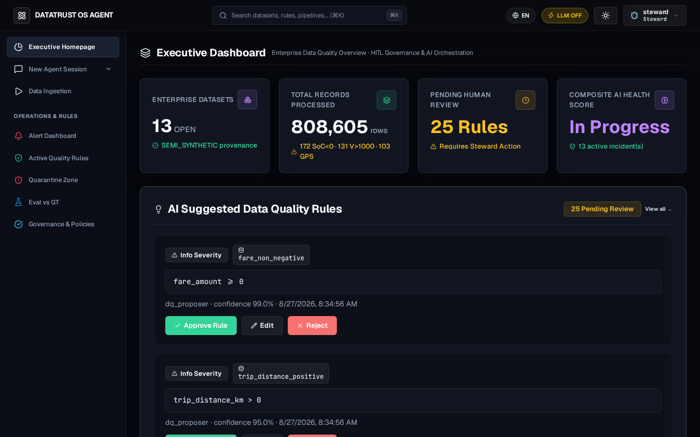
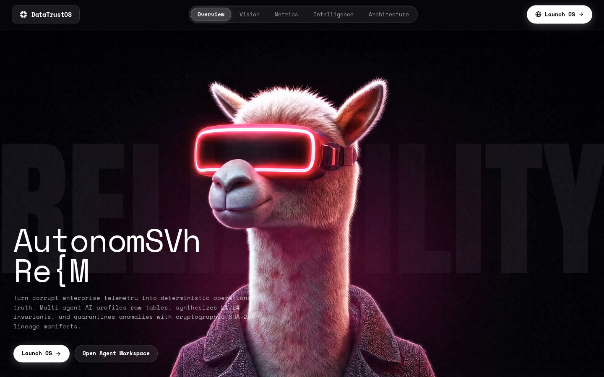
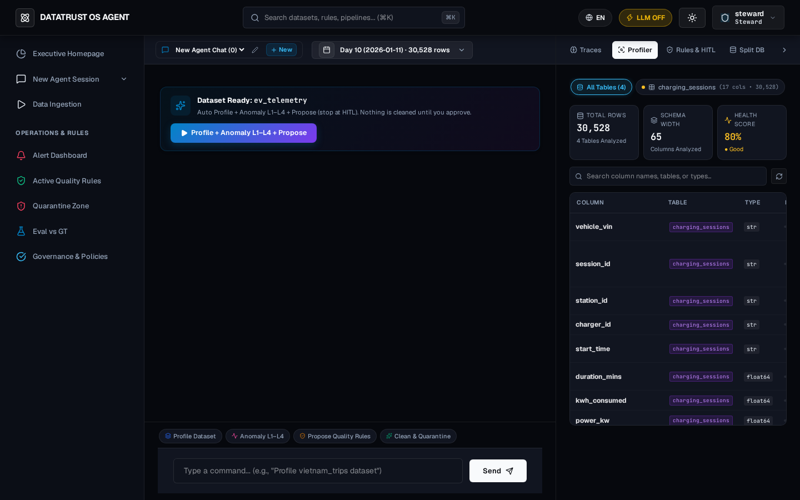
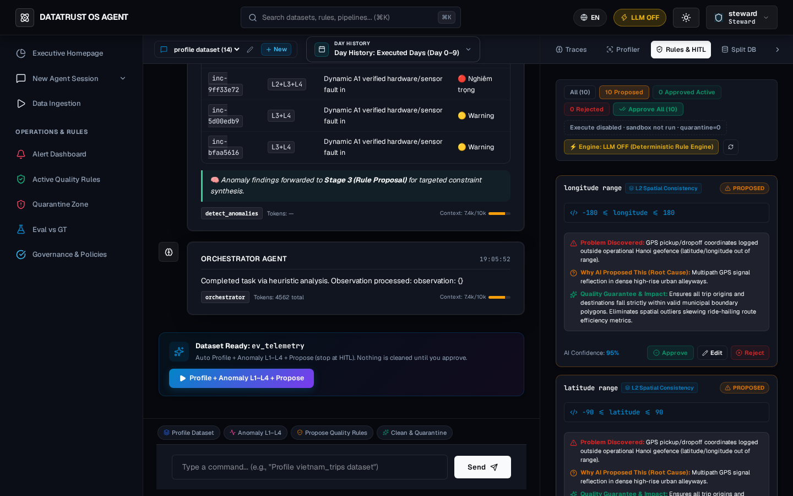
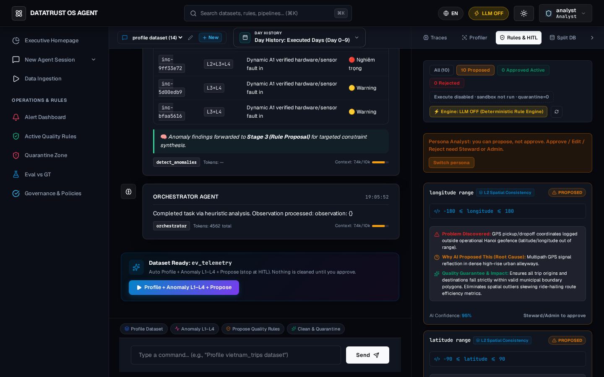
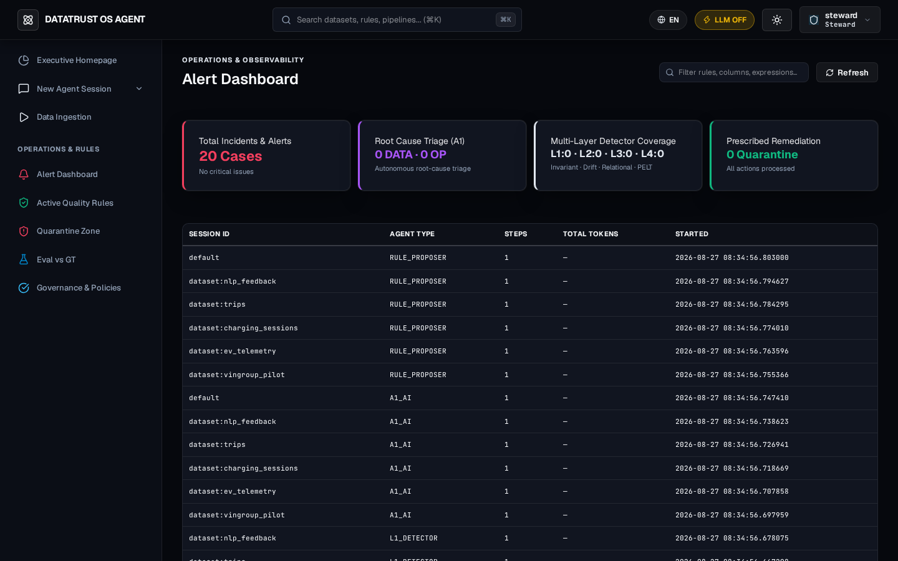
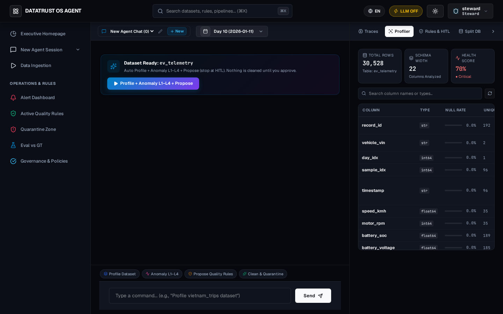
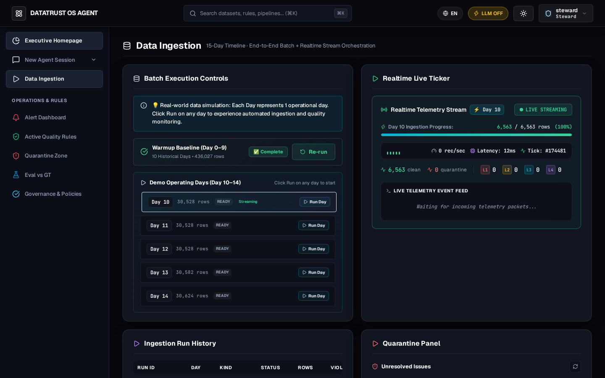

# DataTrust OS v5 — Operational Trust Console

Governed data-quality + causal RCA for VinGroup-style telemetry (EV / charging / trips), with **Human-in-the-Loop** and **dataset ACL**.

| | |
|---|---|
| **Production** | https://t086.w9.nu · API https://t086-api.w9.nu/health |
| **Staging** | https://d086.w9.nu · status https://d086.w9.nu/status-report.html |
| **Health** | `GET /health` → **200** (`status:ok`) |
| **Tip** | `6308ec4` — PR [#40](https://github.com/AI20K-Build-Phase-Cohort-3/P-086/pull/40) dataset ACL |



## Screenshots

| | |
|---|---|
| Landing |  |
| Workspace |  |
| HITL Steward |  |
| HITL Analyst (no Approve) |  |
| Ops traces |  |
| LLM OFF |  |
| Ingestion |  |

## Features

- Landing ingest → promote → warehouse day COUNT  
- L1–L4 detection · fusion · R0/C1/A1 RCA  
- HITL propose / approve / remember / sandbox preview / Steward execute  
- Roles: Admin · Steward · Analyst · Viewer (+ `steward_a`/`steward_b` ACL)  
- LLM provider ON/OFF honest UX (#39)

## Quick start

### Docker

```bash
git clone https://github.com/AI20K-Build-Phase-Cohort-3/P-086.git
cd P-086
cp .env.example .env   # fill secrets locally
docker compose up -d --build
# UI http://localhost:3000 · API http://localhost:8000/docs
```

### Native (uv + pnpm)

```bash
uv venv && source .venv/bin/activate && uv sync
uv run uvicorn src.main:app --host 0.0.0.0 --port 8000 --reload
# other terminal
cd frontend && pnpm install && pnpm dev
```

## Env var **names** only

See `.env.example`. Typical: `LLM_PROVIDER`, `GROQ_API_KEY`, `OPENAI_API_KEY`, `GOOGLE_API_KEY`, `APP_ENV`, `APP_PORT`, `DUCKDB_PATH`, `CORS_ORIGINS`, `LANGCHAIN_TRACING_V2`, `LANGCHAIN_API_KEY`, `LANGCHAIN_PROJECT`, `AI_LOG_DIR`, `AI_LOG_SERVER`, `AI_LOG_API_KEY`, `SENTRY_DSN`, `CF_TUNNEL_KEY`.

## Tree

```
P-086/
├── src/                 # FastAPI, HITL, agents, ingestion
├── frontend/            # React 19 + Vite
├── tests/               # pytest (~757 collected)
├── eval/                # GT / detector / RCA evals
├── docs/                # architecture, ai-logs, journal, worklog, evaluation, pitch/video stubs
├── landing_data/        # day parquet SoT
├── docker-compose.yml
└── .github/workflows/   # CI + release
```

## Tech stack

Python 3.13 · FastAPI · DuckDB · React 19 · Vite · TypeScript · pnpm · uv · Docker · Cloudflare Tunnel · GitHub Actions

## Docs (BTC)

| Doc | Link |
|---|---|
| Architecture | [docs/architecture.md](docs/architecture.md) |
| AI Logs | [docs/ai-logs.md](docs/ai-logs.md) |
| Evaluation | [docs/evaluation.md](docs/evaluation.md) |
| Journal | [docs/journal.md](docs/journal.md) |
| Worklog | [docs/worklog.md](docs/worklog.md) |
| Pitch outline | [docs/pitch-deck.md](docs/pitch-deck.md) *(user → PDF)* |
| Video stub | [docs/video-demo.md](docs/video-demo.md) *(user → YouTube)* |
| Master arch | [ARCHITECTURE.md](ARCHITECTURE.md) |
| Status report | https://d086.w9.nu/status-report.html |

## Team

| Role | Name |
|---|---|
| **[PLACEHOLDER]** | **[FILL]** |

## Tests

```bash
uv run pytest tests/ -q
uv run ruff check src/
pnpm --dir frontend run build
```

## License / cohort

AI20K Build Phase Cohort 3 · Project **P-086**
