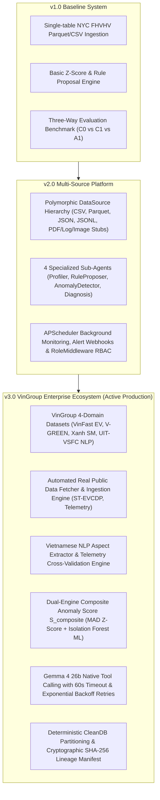
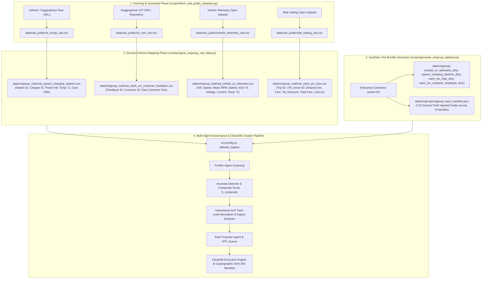

# 🤖 DataTrust OS v3 — Enterprise VinGroup Ecosystem Data Governance Platform (DATA-02)

**DataTrust OS** is an AI-augmented Multi-Agent Data Governance, Quality Control, Rule Synthesis, and Anomaly Detection platform built for the **VinGroup Enterprise Ecosystem** (VinFast EVs, Xanh SM Ride-Hailing, V-GREEN Charging Infrastructure, and Vietnamese Customer Feedback NLP).

> 📖 **Master Architecture Specification:** [ARCHITECTURE.md](file:///home/shayneeo/Downloads/Documents/Coding/AI_in_Action/P-086/ARCHITECTURE.md)  
> 📦 **Master Dataset Catalog & Lineage:** [data/README.md](file:///home/shayneeo/Downloads/Documents/Coding/AI_in_Action/P-086/data/README.md)  
> 📝 **Developer Implementation Notes:** [implementation-notes.md](file:///home/shayneeo/Downloads/Documents/Coding/AI_in_Action/P-086/implementation-notes.md)  
> 📋 **Work Log:** [WORKLOG.md](file:///home/shayneeo/Downloads/Documents/Coding/AI_in_Action/P-086/WORKLOG.md)  
> 🧪 **Pytest Verification:** 125 / 125 Integration Tests Passing (`51.53s`)

---

## 🏛️ 1. Architectural Evolution (v1.0 ➔ v2.0 ➔ v3.0)



---

## 🌐 2. Data Sources & Data Processing Pipelines

### 2.1 Authoritative Data Sources & Repositories

DataTrust OS ingests and governs 4 core data domains derived from open-source research repositories cited in Section 2 of the project research report:

1. **EV Infrastructure (V-GREEN Proxy)**:
   - **Repository / Source**: [IntelligentSystemsLab/ST-EVCDP (GitHub)](https://github.com/IntelligentSystemsLab/ST-EVCDP)
   - **Original Description**: Spatial-temporal charging session dataset covering 24,798 charging plugs.
   - **Mapped Key**: `real_vgreen_charging_stations` (`data/vingroup_real/real_vgreen_charging_stations.csv`).

2. **Vietnamese Sentiment & Aspect NLP (Xanh SM App Proxy)**:
   - **Repository / Source**: [uitnlp/vietnamese_students_feedback (HuggingFace)](https://huggingface.co/datasets/uitnlp/vietnamese_students_feedback)
   - **Original Description**: UIT-VSFC Vietnamese customer & student sentiment/aspect corpus.
   - **Mapped Key**: `real_xanh_sm_customer_feedback` (`data/vingroup_real/real_xanh_sm_customer_feedback.csv`).

3. **EV Telemetry IoT (VinFast VF e34/VF 5/VF 8/VF 9 Proxy)**:
   - **Repository / Source**: [Vehicle Energy & Telemetry Dataset (JAC IEV40 Open Dataset)](https://github.com/yashdev01/vehicle-energy-and-telemetry-dataset)
   - **Original Description**: High-frequency CAN-bus time series (Speed, Motor RPM, Battery SOC %, Voltage, Current, Temperature).
   - **Mapped Key**: `real_vinfast_ev_telemetry` (`data/vingroup_real/real_vinfast_ev_telemetry.csv`).

4. **Ride-Hailing & Logistics (Xanh SM Taxi & Bike Proxy)**:
   - **Repository / Source**: [Ride Hailing Transaction Dataset (Kaggle)](https://www.kaggle.com/datasets/galihwardiana/ride-hailing-transaction)
   - **Original Description**: Trip transaction logs (Distance km, Fare, Tip, Discount, Pickup Lat/Lon).
   - **Mapped Key**: `real_xanh_sm_trips` (`data/vingroup_real/real_xanh_sm_trips.csv`).

---

### 2.2 End-to-End Data Processing Pipeline



---

## 🎯 3. Detailed Feature Breakdown

### 3.1 Vietnamese NLP Aspect Extractor Engine (`src/services/vietnamese_nlp.py`)

- **Teen-code Normalization**: Maps slang (`"ko"`, `"dc"`, `"tram sac"`, `"app lag"`, `"vl"`) into standard Vietnamese text (`"không"`, `"được"`, `"trạm sạc"`, `"ứng dụng có độ trễ"`, `"rất nhiều"`).
- **Aspect Entity Extraction**: Extracts `Location` (`Vincom Bà Triệu`, `Royal City`, `Landmark 81`), `Component` (`Trạm sạc V-GREEN`, `Pin xe VinFast`), and `Error Type`.
- **Telemetry Cross-Validation**: Cross-validates complaints with structured V-GREEN charger logs (`Station temperature 85.5°C, status THERMAL_FAULT`).

---

### 3.2 Dual-Engine Composite Anomaly Score (`src/tools/anomaly.py`)

$$S_{composite} = w_1 \cdot \text{Sigmoid}(Z_{robust} - 3.0) + w_2 \cdot S_{isolation\_forest}$$

- **Robust Z-Score (MAD)**: Prevents outlier masking using Median Absolute Deviation.
- **Isolation Forest ML**: Unsupervised multidimensional anomaly detection using scikit-learn tree ensembles.

---

### 3.3 Single Model Engine with Resilience (`src/services/llm.py`)

- Enforces strictly `gemma-4-26b-a4b-it` model via Google AI Studio API.
- 60s timeout per attempt with 3 exponential backoff retries.
- Passes native `GOVERNANCE_TOOLS` schema for native function calling (`profile_dataset`, `detect_anomalies`, `propose_quality_rules`, `diagnose_root_cause`, `clean_database`, `list_datasets`).

---

## ⚡ 4. Quick Start & Developer Guide

### Step 1: Setup Environment
```bash
# Create and activate Python virtual environment
python3.11 -m venv .venv
source .venv/bin/activate

# Install dependencies in editable mode
pip install -e ".[dev]"
```

### Step 2: Ingest Datasets
```bash
# Generate VinGroup enterprise test datasets
python scripts/generate_vingroup_dataset.py

# Ingest and map real public datasets (ST-EVCDP, UIT-VSFC, Telemetry, Ride Hailing)
python scripts/fetch_real_public_datasets.py
python scripts/ingest_vingroup_real_data.py
```

### Step 3: Run Backend & UI
```bash
# Start FastAPI backend
uvicorn src.main:app --reload --port 8000

# Access Web Dashboard UI v3
# http://localhost:8000/v3
```

### Step 4: Execute Test Suite
```bash
# Run 125 integration and unit tests
.venv/bin/python -m pytest tests/ -v
```

---

## 📁 5. Repository Structure & Module Map

```
├── data/
│   ├── raw_public/                # Raw downloaded public datasets (ST-EVCDP, UIT-VSFC, etc.)
│   ├── vingroup/                  # Generated VinGroup 4-domain test dataset bundle
│   ├── vingroup_real/             # Mapped real VinGroup enterprise datasets
│   └── conversations.db           # SQLite persistent chat history store
├── frontend-v3/                   # Modern React 19 + Vite + Tailwind CSS Workspace Panel
│   ├── src/components/hitl/       # HITL Approval cards & batch action bar
│   ├── src/components/workspace/  # Profile, Rule, Anomaly, Audit, Diff Workspaces
│   └── dist/                      # Compiled frontend assets
├── scripts/
│   ├── generate_vingroup_dataset.py # Generates VinGroup 4-domain test datasets
│   ├── fetch_real_public_datasets.py # Ingests public datasets (ST-EVCDP, UIT-VSFC)
│   └── ingest_vingroup_real_data.py # VinGroup domain schema mapper
├── src/
│   ├── api/routes.py              # FastAPI endpoints & tool calling router
│   ├── services/
│   │   ├── llm.py                 # Gemma 4 26b LLM provider with retries & tool calls
│   │   ├── vietnamese_nlp.py      # Teen-code normalization & aspect extraction
│   │   ├── conversation_store.py  # SQLite chat message persistence
│   │   └── ws_manager.py          # Real-time WebSocket event broadcaster
│   ├── tools/anomaly.py           # Z-Score, IQR, Isolation Forest & Composite Anomaly Score
│   └── config.py                  # Settings & dataset_registry
└── tests/                         # Pytest test suite (125 unit & integration tests)
    ├── test_api.py                # API & Chat endpoint integration tests
    ├── test_vingroup.py           # VinGroup dataset & NLP tests
    └── test_real_public_ingestion.py # Real public dataset ingestion tests
```

---

## 🛠️ 6. Guidelines for Coworkers & Future AI Agent Sessions

1. **Model Enforcement**: Always use `gemma-4-26b-a4b-it` in `GoogleAIStudioLLM` with 60s timeout per call. Do NOT add model fallbacks.
2. **Git Workflow Rule**: Do NOT execute `git push` automatically. Always stage and commit changes locally (`git commit -m "..."`), and wait for the user to explicitly command "push".
3. **Pytest Gate**: Always run `.venv/bin/python -m pytest tests/ -v` to verify zero regressions before declaring task completion.
