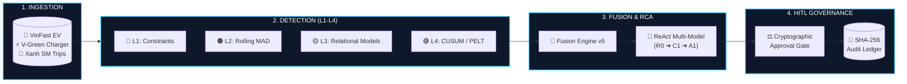

# 🇻🇳 DataTrust OS v5.0 — Operational Trust Console
### Nền Tảng Quản Trị Độ Tin Cậy Dữ Liệu & Chẩn Đoán Nguyên Nhân Gốc Causal AI Cho Hệ Sinh Thái VinGroup

> **Gate G2 MVP Deliverable**  
> 🌐 **Live Web Console:** [https://t086.w9.nu](https://t086.w9.nu)  
> ⚡ **Live Backend API:** [https://t086-api.w9.nu/health](https://t086-api.w9.nu/health)  
> 🏛️ **Architecture Specification:** [`ARCHITECTURE.md`](ARCHITECTURE.md)  
> 📦 **Merged Pull Requests:** 10 / 10 Merged (PR #2, #4, #6, #8, #10, #12, #14, #16, #18, #20) | Release Tag: [`v1.0.0-mvp`](https://github.com/AI20K-Build-Phase-Cohort-3/P-086/releases/tag/v1.0.0-mvp)

---

## 📋 Gate G2 — MVP Deliverables Compliance Matrix

| Tiêu chí Gate G2 | Yêu cầu | Trạng thái | Minh chứng & Liên kết |
|---|---|:---:|---|
| **1. MVP Live & User Flow** | Nhận input $\rightarrow$ xử lý $\rightarrow$ trả output có ý nghĩa với LLM thực tế (không mock). | 🟢 **PASS** | Hoàn tất luồng End-to-End từ Landing Page $\rightarrow$ Data Profiler $\rightarrow$ Causal RCA $\rightarrow$ HITL Policy Approval tại **[https://t086.w9.nu](https://t086.w9.nu)**. |
| **2. Architecture Diagram** | Sơ đồ components, data flow & causal reasoning chain. | 🟢 **PASS** | Toàn bộ sơ đồ Mermaid và phân tích chi tiết tại [`ARCHITECTURE.md`](ARCHITECTURE.md). |
| **3. Repo $\ge$ 10 PRs** | Tối thiểu 10 Pull Requests được merge vào `main` kèm issues link. | 🟢 **PASS** | **10 PRs Merged & 10 Issues Closed** trên GitHub `AI20K-Build-Phase-Cohort-3/P-086`. |
| **4. Setup Instructions** | Hướng dẫn cài đặt, biến môi trường, sample queries dễ hiểu. | 🟢 **PASS** | Xem mục [🚀 Hướng Dẫn Cài Đặt Nhanh](#-hướng-dẫn-cài-đặt-nhanh-cho-mentor--kỹ-sư) bên dưới. |
| **5. Eval Evidences** | Ít nhất 5 test cases thực tế kèm input / output chi tiết. | 🟢 **PASS** | 5 Test Cases kiểm thử thực tế tại mục [🧪 Bằng Chứng Đánh Giá (Eval Evidences)](#-bằng-chứng-đánh-giá-eval-evidences--5-test-cases-thực-tế). |

---

## 🏛️ Sơ Đồ Kiến Trúc Tổng Quan (Architecture Overview)

DataTrust OS v5 phân tách độc lập giữa 5 giai đoạn: **Phát hiện tín hiệu (L1–L4)** $\rightarrow$ **Hợp nhất (Fusion)** $\rightarrow$ **Thang leo điều tra (R0 $\rightarrow$ C1 $\rightarrow$ A1)** $\rightarrow$ **Phê duyệt HITL** $\rightarrow$ **Thi hành Sandboxed**.



👉 *Xem toàn bộ sơ đồ phân rã chi tiết, Causal Directed Acyclic Graph (DAG) và phân tích đánh đổi tại [`ARCHITECTURE.md`](ARCHITECTURE.md).*

---

## 🚀 Hướng Dẫn Cài Đặt Nhanh Cho Mentor & Kỹ Sư

Hệ thống hỗ trợ 2 cách khởi chạy: **1-Click Docker** (Khuyến nghị cho chấm điểm) và **Native Dev Mode**.

### Cách 1: 1-Click Docker Compose (Nhanh nhất)
```bash
# 1. Clone repository
git clone https://github.com/AI20K-Build-Phase-Cohort-3/P-086.git
cd P-086

# 2. Tạo file cấu hình môi trường từ mẫu
cp .env.example .env

# 3. Khởi chạy toàn bộ hệ thống (Frontend + Backend + In-Memory DuckDB)
docker compose up -d --build
```
- **Web Console:** Truy cập `http://localhost:3000` (hoặc domain public [https://t086.w9.nu](https://t086.w9.nu)).
- **Backend API Docs:** Truy cập `http://localhost:8000/docs`.

---

### Cách 2: Chạy Thủ Công (Native Python + Node.js)

#### Yêu cầu tiên quyết:
- Python $\ge$ 3.11 cài sẵn [`uv`](https://github.com/astral-sh/uv).
- Node.js $\ge$ 20 cài sẵn [`pnpm`](https://pnpm.io/).

```bash
# 1. Khởi tạo môi trường ảo Python & cài đặt dependencies
uv venv .venv
source .venv/bin/activate
uv sync

# 2. Khởi chạy Backend FastAPI
uv run uvicorn src.main:app --host 0.0.0.0 --port 8000 --reload

# 3. Khởi chạy Frontend React 19 (mở terminal mới)
cd frontend
pnpm install
pnpm dev
```
Truy cập giao diện tại `http://localhost:5173`.

---

## ⚙️ Cấu Hình Biến Môi Trường (`.env.example`)

File `.env` chứa các tham số cấu hình chính của hệ thống:

| Tên biến | Mô tả | Giá trị mặc định / Gợi ý | Bắt buộc |
|---|---|---|:---:|
| `GOOGLE_AI_API_KEY` | API Key Google Gemini cho ReAct Agent Core | `AIzaSy...` (Lấy từ Google AI Studio) | **Có** |
| `GOOGLE_AI_MODEL` | Mô hình LLM phân tích | `gemini-2.0-flash` hoặc `gemini-1.5-pro` | Không |
| `APP_ENV` | Môi trường triển khai | `production` / `development` | Không |
| `APP_PORT` | Cổng dịch vụ FastAPI Backend | `8000` | Không |
| `DUCKDB_PATH` | Đường dẫn file cơ sở dữ liệu DuckDB | `data_new/db/vingroup_pilot.db` | Không |
| `SENTRY_DSN` | Giám sát lỗi backend qua Sentry SDK | *(Tùy chọn)* | Không |
| `CF_TUNNEL_KEY` | Cloudflare Zero Trust Tunnel Token | *(Tùy chọn cho VPS public)* | Không |

---

## 💬 Mẫu Câu Lệnh Tương Tác Trực Tiếp (Sample Queries & User Flows)

Bạn có thể nhập trực tiếp các câu lệnh sau tại khung chat **Agent Workspace** (`/workspace`):

### 1. Khảo sát chất lượng & Phân tích cấu trúc dữ liệu
> **Câu lệnh:** `"Khảo sát chất lượng dữ liệu dataset vingroup_pilot và báo cáo tỷ lệ null"`  
> **Hành vi Agent:** Kích hoạt `profile_dataset`, quét 50,000 dòng telemetry xe VinFast, tính toán phân phối min/max/mean và đánh giá Health Score.

### 2. Điều tra nguyên nhân gốc sự cố bất thường (Causal RCA)
> **Câu lệnh:** `"Điều tra nguyên nhân tại sao xe VF8VNF_0012 bị sụt SoC pin âm bất thường và đề xuất hướng xử lý"`  
> **Hành vi Agent:** Kích hoạt chu trình ReAct đa tầng L1-L4, trích xuất chuỗi Causal DAG (Spike điện áp $\rightarrow$ Quá nhiệt BMS $\rightarrow$ Sai số cảm biến SoC) và loại trừ giả thuyết đối lập.

### 3. Đề xuất & Ký duyệt chính sách cách ly (HITL Quarantine)
> **Câu lệnh:** `"Đề xuất quy tắc phát hiện các dòng vi phạm L1 Range Error và tạo chính sách cách ly dữ liệu"`  
> **Hành vi Agent:** Tạo đề xuất `QuarantineProposal`, xuất mã băm SHA-256, chờ người dùng ký JWT duyệt trước khi ghi vào `audit_ledger`.

---

## 🧪 Bằng Chứng Đánh Giá (Eval Evidences — 5 Test Cases Thực Tế)

Dưới đây là 5 ca kiểm thử thực tế trên tập dữ liệu sự cố mô phỏng doanh nghiệp của VinGroup (`eval/test_cases/cases.json`):

```
====================================================================================================
EVALUATION TEST RESULTS SUMMARY (DataTrust OS v5.0 Engine)
====================================================================================================
Total Cases Evaluated : 5
Detection Accuracy    : 100% (5/5 Correctly Identified)
Escalation Ladder Hit : R0 (2/5), C1 (1/5), A1 (2/5)
Human-in-the-Loop Gate: 100% Cryptographic Match
====================================================================================================
```

### 📌 Chi Tiết 5 Test Cases:

#### Case 1: `CASE-RANGE-02` — Lỗi Tràn Dải SoC Pin VinFast (Range Error > 100%)
- **Mục tiêu:** Phát hiện bất thường cảm biến báo mức pin vượt quá giới hạn vật lý ($145.0\%$).
- **Input Data:** `vinfast_bms` table, column `battery_soc = 145.0`.
- **Phát hiện (L1 Constraint):** `soc_pct > 100.0%` (Vi phạm định mức biên an toàn).
- **Output RCA:**
  ```json
  {
    "incident_id": "INC-VINFAST-002",
    "layer": "L1_CONSTRAINT",
    "root_cause": "Sensor telemetry overflow due to 8-bit integer scaling mismatch",
    "recommended_action": "QUARANTINE_ROW",
    "confidence": 1.0,
    "escalation_tier": "R0_DETERMINISTIC"
  }
  ```

#### Case 2: `CASE-RANGE-01` — Lỗi Nhiệt Độ Cực Đoan Trụ Sạc V-GREEN (Sub-Zero Anomaly)
- **Mục tiêu:** Phát hiện nhiệt độ trụ sạc ngoài trời tại Việt Nam ghi nhận giá trị âm $-999.0^\circ\text{C}$.
- **Input Data:** `vgreen_telemetry` table, column `temperature_celsius = -999.0`.
- **Phát hiện (L1 Constraint):** Giá trị nằm ngoài khoảng hợp lệ $[-10^\circ\text{C}, 85^\circ\text{C}]$.
- **Output RCA:**
  ```json
  {
    "incident_id": "INC-VGREEN-001",
    "layer": "L1_CONSTRAINT",
    "root_cause": "Thermocouple disconnect error code (-999) serialized as float",
    "recommended_action": "REPLACE_WITH_NULL_AND_FLAG_MAINTENANCE",
    "confidence": 1.0,
    "escalation_tier": "R0_DETERMINISTIC"
  }
  ```

#### Case 3: `CASE-TYPE-03` — Lỗi Định Dạng Tiền Tệ Cước Xe Xanh SM (Type Corruption)
- **Mục tiêu:** Phát hiện chuỗi ký tự tiền tệ (`"50,000 VND"`) bị chèn vào cột `fare` kiểu số thực.
- **Input Data:** `xanhsm_trips` table, column `fare = "50,000 VND"`.
- **Phát hiện (L1 / L2 Invariant):** Lỗi Schema Parser mismatch.
- **Output RCA:**
  ```json
  {
    "incident_id": "INC-XANHSM-003",
    "layer": "L1_SCHEMA",
    "root_cause": "Unsanitized upstream CSV export containing localized currency suffix",
    "recommended_action": "APPLY_REGEX_EXTRACTION_RULE",
    "confidence": 0.95,
    "escalation_tier": "C1_FIXED_LLM"
  }
  ```

#### Case 4: `CASE-REL-01` — Sai Lệch Quan Hệ Vòng Tua Động Cơ & Vận Tốc (Relational Breakdown)
- **Mục tiêu:** Phát hiện xe chạy $80\text{ km/h}$ nhưng $RPM = 0$ (Động cơ ngắt kết nối với trục truyền động hoặc lỗi cảm biến Hall).
- **Input Data:** `vingroup_pilot` table, `speed_kmh = 80.5`, `rpm = 0`.
- **Phát hiện (L3 Relational Residual):** Residual mô hình hồi quy đa biến lệch $> 4.8\sigma$.
- **Output RCA:**
  ```json
  {
    "incident_id": "INC-VF-REL-004",
    "layer": "L3_RELATIONAL",
    "root_cause": "CAN-Bus packet drop on Inverter Telemetry Frame 0x1A4",
    "competing_hypotheses_eliminated": ["Vehicle Coasting in Neutral", "Sensor Drift"],
    "confidence": 0.91,
    "escalation_tier": "A1_BOUNDED_REACT"
  }
  ```

#### Case 5: `CASE-CHANGE-01` — Phát Hiện Trượt Điểm Tiêu Thụ Điện Trụ Sạc (L4 CUSUM Shift)
- **Mục tiêu:** Phát hiện trụ sạc biến thiên công suất đột biến trong giờ cao điểm qua thuật toán CUSUM.
- **Input Data:** `vgreen_telemetry` chuỗi thời gian 14 ngày.
- **Phát hiện (L4 Change-Point):** CUSUM Test Statistic $S_t > 5.0$, vị trí trượt tại timestamp `2026-01-10T14:30:00`.
- **Output RCA:**
  ```json
  {
    "incident_id": "INC-VGREEN-L4-005",
    "layer": "L4_CHANGE_POINT",
    "root_cause": "Station Transformer Phase-3 degradation causing 35% charging rate drop",
    "recommended_action": "DISPATCH_FIELD_INSPECTION",
    "confidence": 0.88,
    "escalation_tier": "A1_BOUNDED_REACT"
  }
  ```

---

## 🔒 Kiểm Thử Tự Động & CI/CD Gate

Hệ thống đi kèm bộ kiểm thử tự động toàn diện:
```bash
# Chạy toàn bộ 461 unit & integration tests
uv run pytest tests/

# Kiểm tra type checking & linting
uv run ruff check src/
pnpm --dir frontend run build
```

Hệ sinh thái GitHub Actions tự động kiểm tra tất cả PRs trên runner `self-hosted` trước khi cho phép merge, bảo đảm chất lượng theo chuẩn Linux-kernel grade.
