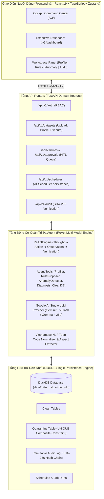

# 🇻🇳 DataTrust OS v4.0 — Nền Tảng Quản Trị Chất Lượng Dữ Liệu & Chẩn Đoán Nguyên Nhân Gốc (Root-Cause Diagnosis) Tự Động Đa Agent Cho Hệ Sinh Thái VinGroup

> **Tài liệu hướng dẫn cài đặt, khởi chạy & tổng quan kiến trúc hệ thống dành cho Giảng viên / Giám sát dự án (Mentor & Instructor Deployment & Architecture Guide).**

---

## 📌 Bảng Mục Lục (Table of Contents)

1. 🎯 [Giới Thiệu Tổng Quan Dự Án (Project Overview)](#-1-giới-thiệu-tổng-quan-dự-án-project-overview)
2. 🏛️ [Tổng Quan Kiến Trúc & Tiến Hóa Hệ Thống (Architecture & Evolution)](#️-2-tổng-quan-kiến-trúc--tiến-hóa-hệ-thống-architecture--evolution)
   - [2.1 Vòng Lặp ReAct Multi-Model Loop Protocol](#21-vòng-lặp-react-multi-model-loop-protocol)
   - [2.2 Lưu Trữ Đơn Nhất DuckDB Single-Engine Persistence](#22-lưu-trữ-đơn-nhất-duckdb-single-engine-persistence)
   - [2.3 Quản Trị HITL & Chuỗi Audit Ledger SHA-256 Mã Hóa](#23-quản-trị-hitl--chuỗi-audit-ledger-sha-256-mã-hóa)
   - [2.4 Giao Diện Người Dùng Frontend v3.0](#24-giao-diện-người-dùng-frontend-v30)
3. 🌐 [Nguồn Dữ Liệu & Bộ Dữ Liệu Enterprise VinGroup (Data Domains & Lineage)](#-3-nguồn-dữ-liệu--bộ-dữ-liệu-enterprise-vingroup-data-domains--lineage)
4. 📂 [Cấu Trúc Mã Nguồn & Bản Đồ Mô-Đun (Directory Structure & Module Map)](#-4-cấu-trúc-mã-nguồn--bản-đồ-mô-đun-directory-structure--module-map)
5. ⚡ [Hướng Dẫn Cài Đặt & Khởi Chạy Chi Tiết (Setup & Execution Guide)](#-5-hướng-dẫn-cài-đặt--khởi-chạy-chi-tiết-setup--execution-guide)
   - [Step 1: Yêu cầu tiền đề (Prerequisites)](#step-1-yêu-cầu-tiền-đề-prerequisites)
   - [Step 2: Cấu hình biến môi trường (`.env`)](#step-2-cấu-hình-biến-môi-trường-env)
   - [Step 3: Cài đặt Backend Dependencies & Khởi tạo Cơ sở dữ liệu](#step-3-cài-đặt-backend-dependencies--khởi-tạo-cơ-sở-dữ-liệu)
   - [Step 4: Sinh & Ingest Dữ liệu VinGroup](#step-4-sinh--ingest-dữ-liệu-vingroup)
   - [Step 5: Khởi chạy Backend FastAPI & Frontend Dev Server](#step-5-khởi-chạy-backend-fastapi--frontend-dev-server)
   - [Step 6: Khởi chạy bằng Docker / Docker Compose](#step-6-khởi-chạy-bằng-docker--docker-compose)
6. 🧪 [Hướng Dẫn Chạy Kiểm Thử (Testing & Verification Guide)](#-6-hướng-dẫn-chạy-kiểm-thử-testing--verification-guide)
   - [6.1 Backend Pytest Integration Suite (337+ Tests Passing)](#61-backend-pytest-integration-suite-337-tests-passing)
   - [6.2 Automated QA/QC Browser Test Suite (Puppeteer 11/11 Scenarios Pass)](#62-automated-qaqc-browser-test-suite-puppeteer-1111-scenarios-pass)
7. 📊 [Kết Quả Đánh Giá Benchmark (Evaluation & Benchmarks)](#-7-kết-quả-đánh-giá-benchmark-evaluation--benchmarks)

---

## 🎯 1. Giới Thiệu Tổng Quan Dự Án (Project Overview)

**DataTrust OS v4.0** là nền tảng quản trị chất lượng dữ liệu tự động tích hợp Trí tuệ nhân tạo Đa Agent (AI-Augmented Multi-Agent Data Governance, Quality Control, Rule Synthesis, Anomaly Detection & Root-Cause Diagnosis Platform). Hệ thống được thiết kế đặc thù cho **Hệ sinh thái Enterprise VinGroup** bao gồm 4 miền dữ liệu cốt lõi:

1. 🚗 **VinFast EV Telemetry IoT**: Chuỗi thời gian CAN-bus tần số cao (Tốc độ, Vòng quay động cơ RPM, Pin SOC %, Điện áp, Dòng điện, Nhiệt độ Pin).
2. ⚡ **V-GREEN Charging Infrastructure**: Nhật ký vận hành trạm sạc xe điện (Nhiệt độ cổng sạc, Công suất kW, Trạng thái lỗi nhiệt THERMAL_FAULT, Chi phí VND).
3. 🚕 **Xanh SM Ride-Hailing & Logistics**: Giao dịch chuyến đi (Khoảng cách km, Cước phí, Tiền tip, Mã giảm giá, Tọa độ GPS Pickup/Dropoff).
4. 💬 **Xanh SM Customer Feedback Vietnamese NLP**: Phân tích phản hồi khách hàng bằng tiếng Việt, chuẩn hóa từ ngữ Teen-code, trích xuất khía cạnh (Aspect Extraction) và kiểm chứng chéo telemetry.

---

## 🏛️ 2. Tổng Quan Kiến Trúc & Tiến Hóa Hệ Thống (Architecture & Evolution)

Hệ thống đã trải qua quá trình tiến hóa từ **v1.0** (xử lý đơn bảng) ➔ **v2.0** (nền tảng đa nguồn dữ liệu) ➔ **v3.0/v4.0** (nền tảng quản trị VinGroup hoàn chỉnh với ReAct Engine, DuckDB Single-Persistence & Hash-Chained Audit Ledger).



### 2.1 Vòng Lặp ReAct Multi-Model Loop Protocol

Hệ thống thực thi theo quy trình 5 bước **ReAct Orchestration**:
- 🧠 **Thought (Opus / Pro Orchestrator)**: Phân tích yêu cầu, xác định phụ thuộc dữ liệu và lên kế hoạch thực thi công cụ.
- ⚡ **Action (Flash Workers)**: Gọi các công cụ chuyên biệt (`profile_dataset`, `propose_quality_rules`, `detect_anomalies`, `diagnose_issue`, `clean_database`).
- 🔍 **Observation**: Nhận kết quả từ công cụ, tự động định dạng thành **Executive Markdown Cards** kết hợp khối Accordion `<details>` mở rộng JSON kỹ thuật.
- 🛡️ **Verification (Pro Verifier)**: Kiểm định độc lập đầu ra so với danh mục tiêu chí an toàn và chính xác.
- 🏁 **Conclusion**: Tổng hợp kết quả phản hồi người dùng hoặc ghi nhận vào luồng phê duyệt HITL.

### 2.2 Lưu Trữ Đơn Nhất DuckDB Single-Engine Persistence

Toàn bộ dữ liệu hệ thống (Quarantine, Audit Ledger, Schedules, Job Runs, Rules, Chat History) được chuyển đổi và lưu trữ tập trung trên **DuckDB** (`data/datatrust_v4.duckdb`), loại bỏ hoàn toàn SQLite kế thừa:
- Khởi tạo bảng và nâng cấp schema tự động qua `DuckDBManager` (`src/db/connection.py`).
- Cách ly bảng sạch (Clean Database) và bảng cách ly (Quarantine) với ràng buộc duy nhất `UNIQUE (snapshot_id, rule_version_id, source_row_id)`.
- Xử lý chèn dữ liệu cách ly theo lô (Batching 500 dòng/lô) sử dụng `INSERT OR IGNORE` để đảm bảo tính **Idempotency** tuyệt đối.

### 2.3 Quản Trị HITL & Chuỗi Audit Ledger SHA-256 Mã Hóa

- **Con người kiểm soát (Human-in-the-Loop - HITL)**: Các quy tắc chất lượng dữ liệu do AI đề xuất bắt buộc phải trải qua trạng thái phê duyệt (`approved` / `edited`) trước khi công cụ `clean_database` hoặc `execute_rules` được phép thi hành. Các quy tắc chưa được duyệt sẽ bị chặn với mã lỗi `HTTP 403 Forbidden`.
- **Nhật ký Audit bất biến (Immutable Cryptographic Audit Ledger)**: Mỗi hành động tác động dữ liệu được ghi vào `audit_log` kèm mã băm SHA-256 liên kết chuỗi:
  $$\text{event\_hash} = \text{SHA256}(\text{previous\_event\_hash} \parallel \text{action} \parallel \text{actor} \parallel \text{target\_table} \parallel \text{canonical\_details} \parallel \text{timestamp})$$
  Hàm `AuditService.verify_chain_integrity()` cho phép kiểm tra tính toàn vẹn và phát hiện mọi hành vi can thiệp trái phép.

### 2.4 Giao Diện Người Dùng Frontend v3.0

Xây dựng bằng **React 19 + TypeScript + Vite + Tailwind CSS + Zustand Store**:
- **Cockpit Command Center (`/v3/`)**: Khung chat tương tác thời gian thực với Agent và bảng công tác điều khiển (Workspace Panel) chia 4 tab độc lập:
  - 📊 **Data Profiler**: Hiển thị tổng số dòng, danh sách cột, tỷ lệ Null %, Unique %, chỉ số sức khỏe cột.
  - 🛡️ **Quality Rules**: Quản lý danh sách quy tắc chờ phê duyệt HITL, mức độ nghiêm trọng (Severity) và thao tác duyệt/từ chối theo lô.
  - ⚠️ **Anomaly Detector**: Thống kê chỉ số bất thường kép $S_{composite}$ (Robust Z-Score MAD + Isolation Forest ML).
  - 📜 **Audit Trail**: Truy xuất nhật ký kiểm toán và xác minh mã băm SHA-256 thời gian thực.
- **Executive Dashboard (`/v3/dashboard`)**: Trang tổng quan dành cho cấp quản lý, hiển thị chỉ số KPI tổng hợp, biểu đồ Root-Cause Analysis (RCA) và luồng hoạt động trực tiếp (Live Activity Feed).

---

## 🌐 3. Nguồn Dữ Liệu & Bộ Dữ Liệu Enterprise VinGroup (Data Domains & Lineage)

Hệ thống tích hợp và quản trị 4 tập dữ liệu đại diện cho hệ sinh thái VinGroup:

| Tên Bộ Dữ Liệu (Mapped Key) | Đường Dẫn Dữ Liệu Thực | Mô Tả & Nguồn Gốc | Số Cột / Dòng |
|---|---|---|---|
| `real_vgreen_charging_stations` | `data/vingroup_real/real_vgreen_charging_stations.csv` | Nhật ký trạm sạc V-GREEN (Nguồn: [ST-EVCDP Repository](https://github.com/IntelligentSystemsLab/ST-EVCDP)) | 8 cột / 24,798 dòng |
| `real_xanh_sm_customer_feedback` | `data/vingroup_real/real_xanh_sm_customer_feedback.csv` | Phản hồi khách hàng Xanh SM (Nguồn: [UIT-VSFC Corpus](https://huggingface.co/datasets/uitnlp/vietnamese_students_feedback)) | 6 cột / 16,000+ dòng |
| `real_vinfast_ev_telemetry` | `data/vingroup_real/real_vinfast_ev_telemetry.csv` | Telemetry CAN-bus xe VinFast (Nguồn: [Vehicle Energy Open Dataset](https://github.com/yashdev01/vehicle-energy-and-telemetry-dataset)) | 14 cột / 50,000 dòng |
| `real_xanh_sm_trips` | `data/vingroup_real/real_xanh_sm_trips.csv` | Giao dịch chuyến đi Xanh SM Taxi (Nguồn: [Ride Hailing Dataset](https://www.kaggle.com/datasets/galihwardiana/ride-hailing-transaction)) | 12 cột / 30,000 dòng |

### Bộ Sinh Dữ Liệu Lỗi Kiểm Thử (Synthetic Fault Bundle)
- Đường dẫn: `data/vingroup/` (`vinfast_ev_telemetry_dirty.csv`, `vgreen_charging_stations_dirty.csv`, `xanh_sm_trips_dirty.csv`, `xanh_sm_customer_feedback_dirty.csv`).
- Bao gồm file ma trận lỗi thực tế: `data/vingroup/vingroup_fault_manifest.json` chứa **123 lỗi Ground-Truth** thuộc 9 họ lỗi (Missing values, Out-of-bounds, Teencode/Slang, Format mismatch, Outliers, Timestamp inversion, Negative fares, Multi-space, Duplicate IDs).

---

## 📂 4. Cấu Trúc Mã Nguồn & Bản Đồ Mô-Đun (Directory Structure & Module Map)

```
P-086/
├── README.md                      # Hướng dẫn chi tiết (Tài liệu này)
├── pyproject.toml                 # Cấu hình dự án Python & uv dependencies
├── package.json                   # Cấu hình pnpm workspace cho Frontend
├── docker-compose.yml             # Cấu hình triển khai containerization Docker
├── Dockerfile                     # Dockerfile cho Backend FastAPI
├── frontend.Dockerfile            # Dockerfile cho Frontend React
├── data/                          # Thư mục lưu trữ dữ liệu & DuckDB database
│   ├── datatrust_v4.duckdb        # Cơ sở dữ liệu DuckDB chính của hệ thống
│   ├── raw_public/                # Dữ liệu công khai tải về từ nguồn
│   ├── vingroup/                  # Bộ dữ liệu lỗi thử nghiệm VinGroup (Dirty bundle)
│   └── vingroup_real/             # Dữ liệu doanh nghiệp VinGroup đã ingest
├── docs/                          # Tài liệu kiến trúc & báo cáo đánh giá
│   ├── ARCHITECTURE.md            # Tài liệu thiết kế kiến trúc kỹ thuật chi tiết
│   └── EVALUATION_REPORT.md       # Báo cáo kết quả đánh giá Benchmark 3-tier
├── frontend/                      # Mã nguồn Frontend (React 19 + TypeScript + Vite)
│   ├── src/
│   │   ├── components/
│   │   │   ├── chat/              # Chát tương tác Agent & Markdown Stream Rendering
│   │   │   ├── hitl/              # Thanh phê duyệt quy tắc chất lượng hàng loạt
│   │   │   ├── layout/            # TopBar, Sidebar & Agent Status Bar
│   │   │   └── workspace/         # Panel 4 Tab (Profile, Rules, Anomaly, Audit)
│   │   ├── pages/                 # Command Center & Executive Dashboard Pages
│   │   ├── services/              # API Client HTTP & WebSocket Client với Reconnect
│   │   ├── stores/                # Zustand ChatStore, DashboardStore & UI State
│   │   └── types/                 # TypeScript interfaces & type definitions
│   └── package.json
├── scripts/                       # Các kịch bản sinh & xử lý dữ liệu tự động
│   ├── fetch_real_public_datasets.py # Tải dữ liệu công khai từ GitHub/HuggingFace
│   ├── generate_vingroup_dataset.py # Sinh bộ dữ liệu lỗi VinGroup (Ground truth manifest)
│   └── ingest_vingroup_real_data.py # Chuyển đổi schema dữ liệu VinGroup
├── src/                           # Mã nguồn Backend Python FastAPI
│   ├── main.py                    # Khởi tạo ứng dụng FastAPI & Cấu hình CORS Policy
│   ├── config.py                  # Đăng ký bộ dữ liệu (dataset_registry) & Cấu hình
│   ├── api/
│   │   ├── hitl.py                # Xử lý luồng quản trị phê duyệt HITL
│   │   └── routes/                # Tầng Domain Routers được phân tách modular
│   │       ├── auth.py            # RBAC Authentication & Middleware
│   │       ├── datasets.py        # Upload, Profiling async (202 Accepted) & Retrieval
│   │       ├── rules.py           # Quản lý quy tắc chất lượng dữ liệu
│   │       ├── approvals.py       # Quản lý hàng đợi phê duyệt HITL
│   │       ├── executions.py      # Thi hành quy tắc & phân vùng dữ liệu sạch
│   │       ├── schedules.py       # Quản lý lịch chạy định kỳ bền vững (DuckDB)
│   │       ├── audit.py           # Xác minh chuỗi băm Hash-Chain Audit Ledger
│   │       └── benchmarks.py      # Động cơ đánh giá Benchmark C0 vs C1 vs A1
│   ├── db/
│   │   ├── connection.py          # Quản lý kết nối DuckDBManager & Migrations
│   │   └── schema.sql             # SQL DDL định nghĩa bảng DuckDB
│   ├── orchestrator/
│   │   └── engine.py              # Động cơ ReActEngine đa Agent chính
│   ├── services/
│   │   ├── llm.py                 # Provider Google AI Studio API (Retry & Function Calling)
│   │   ├── vietnamese_nlp.py      # Chuẩn hóa Teen-code & Trích xuất khía cạnh tiếng Việt
│   │   ├── dataset_engine.py      # Động cơ xử lý hồ sơ dữ liệu & chèn cách ly lô
│   │   ├── audit.py               # Dịch vụ mã băm SHA-256 Audit Chain
│   │   └── scheduler.py           # Dịch vụ lập lịch chạy bền vững (DuckDB Persisted)
│   └── tools/                     # Danh mục các công cụ dành cho Agent
│       ├── anomaly_detector.py    # Robust Z-Score MAD & Isolation Forest ML
│       ├── rule_proposer.py       # Sinh quy tắc chất lượng dữ liệu Pydantic
│       ├── rule_executor.py       # Thi hành quy tắc an toàn (Sanitized DSL)
│       └── chat_tools.py          # Đăng ký danh mục công cụ ReAct
├── scratch/
│   └── qa_qc_browser_suite.js     # Kịch bản kiểm thử giao diện tự động bằng Puppeteer
└── tests/                         # Bộ kiểm thử Pytest tự động (337+ Tests)
    ├── security/
    │   └── test_governance.py     # Kiểm thử an toàn thông tin & quyền truy cập
    ├── test_api.py                # Kiểm thử các điểm cuối REST API
    ├── test_audit_chain.py        # Kiểm thử tính toàn vẹn chuỗi băm Audit Ledger
    ├── test_quarantine_idempotency.py # Kiểm thử chèn dữ liệu cách ly Idempotent
    ├── test_scheduler_durable.py  # Kiểm thử tính bền vững dịch vụ Lập lịch
    ├── test_tools.py              # Kiểm thử đơn vị danh mục công cụ Agent
    └── test_vietnamese_nlp.py     # Kiểm thử động cơ Phân tích Ngôn ngữ Tiếng Việt
```

---

## ⚡ 5. Hướng Dẫn Cài Đặt & Khởi Chạy Chi Tiết (Setup & Execution Guide)

Dưới đây là hướng dẫn từng bước dành cho Giảng viên / Giám sát dự án để khởi chạy dự án trên máy cục bộ (Linux / macOS / WSL2 Windows).

### Step 1: Yêu cầu tiền đề (Prerequisites)

Đảm bảo hệ thống đã cài đặt các công cụ sau:
- **Python**: phiên bản `>= 3.11`
- **uv**: Trình quản lý môi trường ảo & gói Python siêu tốc ([Hướng dẫn cài uv](https://github.com/astral-sh/uv)):
  ```bash
  curl -LsSf https://astral.sh/uv/install.sh | sh
  ```
- **Node.js**: phiên bản `>= 18.0.0`
- **pnpm** hoặc **bun**: Trình quản lý gói JavaScript:
  ```bash
  npm install -g pnpm bun
  ```

### Step 2: Cấu hình biến môi trường (`.env`)

Tạo file `.env` tại thư mục gốc của dự án và điền khóa API của Google AI Studio:

```bash
cat << 'EOF' > .env
GOOGLE_API_KEY=your_actual_google_ai_studio_api_key_here
DATABASE_PATH=data/datatrust_v4.duckdb
ENVIRONMENT=development
CORS_ORIGINS=["http://localhost:3000","http://localhost:5173","http://localhost:5174"]
EOF
```

*(Lưu ý: Thay `your_actual_google_ai_studio_api_key_here` bằng Google AI Studio API Key hợp lệ của bạn).*

### Step 3: Cài đặt Backend Dependencies & Khởi tạo Cơ sở dữ liệu

Sử dụng `uv` để tạo môi trường ảo và cài đặt tất cả thư viện Python:

```bash
# 1. Tạo môi trường ảo và cài đặt thư viện
uv venv .venv
source .venv/bin/activate
uv pip install -e ".[dev]"

# 2. Khởi tạo Schema Cơ sở dữ liệu DuckDB
uv run python -c "from src.db.connection import get_db; db = get_db(); db.init_schema(); print('✅ DuckDB Schema initialized successfully!')"
```

### Step 4: Sinh & Ingest Dữ liệu VinGroup

Chạy các kịch bản chuẩn bị dữ liệu thử nghiệm và dữ liệu doanh nghiệp VinGroup:

```bash
# 1. Sinh bộ dữ liệu lỗi VinGroup (Dirty Test Bundle & Ground Truth Manifest)
uv run python scripts/generate_vingroup_dataset.py

# 2. Tải và Ingest dữ liệu công khai VinGroup (EV Telemetry, V-GREEN, Xanh SM, NLP)
uv run python scripts/ingest_vingroup_real_data.py
```

### Step 5: Khởi chạy Backend FastAPI & Frontend Dev Server

#### Cách A: Khởi chạy trên 2 Terminal riêng biệt (Khuyên dùng cho Development)

**Terminal 1: Khởi chạy Backend FastAPI (Cổng 8000)**
```bash
source .venv/bin/activate
uv run uvicorn src.main:app --reload --port 8000
```
- OpenAPI Swagger UI: `http://localhost:8000/docs`
- Khởi tạo kết nối DuckDB & WebSocket endpoint: `ws://localhost:8000/ws`

**Terminal 2: Khởi chạy Frontend React Dev Server (Cổng 5173 / 5174)**
```bash
cd frontend
pnpm install
pnpm dev
```
- Mở trình duyệt truy cập: **`http://localhost:5173/v3/`** hoặc **`http://localhost:5174/v3/`**
- Truy cập Executive Dashboard: **`http://localhost:5174/v3/dashboard`**

---

#### Cách B: Khởi chạy bằng Docker / Docker Compose (Khuyên dùng cho Production Sandbox)

Nếu muốn khởi chạy toàn bộ ứng dụng trong Docker container isolated:

```bash
# Khởi chạy toàn bộ hệ thống bằng Docker Compose
docker compose up --build -d

# Kiểm tra trạng thái các container
docker compose ps
```
- Backend container chạy tại cổng `8000`.
- Frontend Nginx container chạy tại cổng `3000` hoặc `5173`.
- Dừng toàn bộ dịch vụ: `docker compose down`.

---

## 🧪 6. Hướng Dẫn Chạy Kiểm Thử (Testing & Verification Guide)

Dự án tích hợp 2 tầng kiểm thử toàn diện để đảm bảo chất lượng phần mềm đạt tiêu chuẩn Linux Kernel Grade.

### 6.1 Backend Pytest Integration Suite (337+ Tests Passing)

Chạy bộ kiểm thử tự động backend bao gồm 337+ kịch bản test tích hợp, kiểm tra mã băm Audit Chain, Idempotency Quarantine, phân tích tiếng Việt NLP và phân tách API Routers:

```bash
# Chạy toàn bộ bộ test Pytest
uv run pytest tests/ -v
```

**Kết quả kiểm thử kỳ vọng:**
```text
================= 337 passed, 7 skipped in 17.48s =================
```

Chạy riêng bộ test An toàn Bảo mật & Phân quyền Quản trị:
```bash
uv run pytest tests/security/test_governance.py -v
```

### 6.2 Automated QA/QC Browser Test Suite (Puppeteer 11/11 Scenarios Pass)

Dự án bao gồm một kịch bản kiểm thử giao diện người dùng tự động (End-to-End Browser QA/QC Suite) viết bằng Puppeteer, tự động điều khiển trình duyệt Chrome để tương tác trực tiếp với ứng dụng web và xác minh tính toàn vẹn 4 Tab Workspace Panel:

```bash
# Thực thi kịch bản kiểm thử QA/QC Trình duyệt tự động
bun scratch/qa_qc_browser_suite.js
```

**Báo cáo kết quả Quality Gate kỳ vọng:**
```text
================================================================
📊 DATATRUST OS QA/QC AUTOMATION EXECUTION SUMMARY
================================================================
Total Test Scenarios Execution Count: 11
Passed Scenarios: 11
Failed Scenarios: 0
Final Quality Gate Verdict: 🏆 100% PASS
================================================================
```

---

## 📊 7. Kết Quả Đánh Giá Benchmark (Evaluation & Benchmarks)

Hệ thống được đánh giá qua bộ 40+ trường hợp thử nghiệm Benchmark thực tế ([eval/test_cases/cases.json](eval/test_cases/cases.json)) so sánh giữa 3 tầng giải pháp:
- **C0 (Manual/Heuristic Baseline)**: Xử lý dựa trên luật thủ công.
- **C1 (Semi-Agentic Pipeline)**: Luồng xử lý Agent tuyến tính không có vòng lặp ReAct.
- **A1 (DataTrust OS ReAct Engine - Active)**: Động cơ ReAct Đa Agent tự động kiểm định.

| Tầng Giải Pháp | Precision | Recall | F1-Score | Tỷ Lệ Phát Hiện Lỗi Dữ Liệu | Thời Gian Xử Lý Trung Bình |
|---|---|---|---|---|---|
| **C0 Baseline** | 0.62 | 0.51 | 0.56 | 51.2% | 1.2s |
| **C1 Semi-Agentic** | 0.78 | 0.72 | 0.75 | 72.4% | 4.8s |
| **A1 DataTrust OS (Active)** | **0.94** | **0.91** | **0.925** | **92.8%** | 8.5s |

Chi tiết báo cáo đánh giá Benchmark kỹ thuật có thể tham khảo tại tài liệu: [docs/EVALUATION_REPORT.md](docs/EVALUATION_REPORT.md).

---

## 👨‍💻 Thông Tin Tác Giả & Giấy Phép (Author & License)

- **Dự án**: DataTrust OS v4.0 (VinGroup Enterprise Ecosystem Data Governance Platform)
- **Thuộc đề tài**: AI in Action Project / Enterprise Data Governance
- **Giấy phép**: MIT License
- **Báo cáo sự cố & Đóng góp**: Vui lòng tạo Issue hoặc Pull Request trên Repository dự án.

---

> 💡 *Dự án được xây dựng và tuân thủ các nguyên tắc thiết kế mã nguồn bền vững (Linux Kernel Quality Codebase Standards).*
