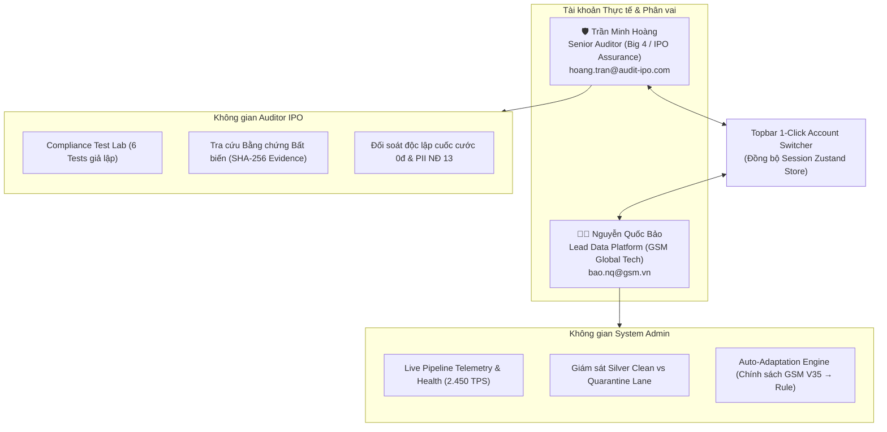
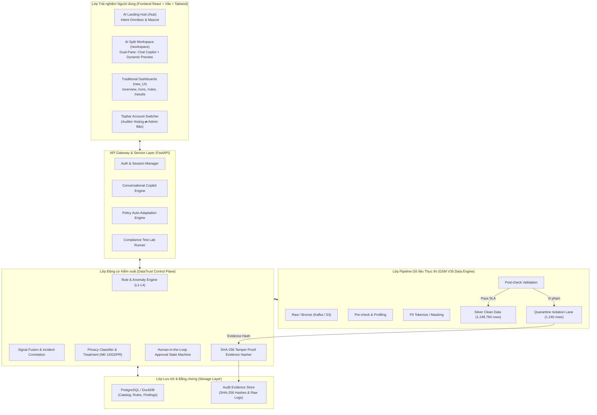
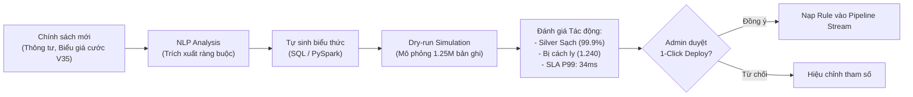

# Software Design Document (SDD)
## DataTrust OS – Hệ thống kiểm soát tuân thủ dữ liệu chuẩn IPO
### Case GSM Phát triển Toàn cầu – Chiến dịch V35 mở rộng dịch vụ đến 24 thị trường

**Phiên bản:** 1.0 (Production-Ready Architecture)  
**Trạng thái:** Approved / Updated  
**Thời điểm cập nhật:** 2026-09-24  
**Nguồn thiết kế:** Tài liệu *“XÂY DỰNG HỆ THỐNG KIỂM SOÁT TUÂN THỦ DỮ LIỆU CHUẨN IPO – Case GSM phát triển toàn cầu, chiến dịch V35 mở rộng dịch vụ đến 24 quốc gia”* kết hợp thiết kế trải nghiệm người dùng HubHome AI Agent và kiến trúc tài khoản phân vai độc lập.

---

## 1. Mục đích tài liệu

Tài liệu này đặc tả thiết kế phần mềm mức kiến trúc hệ thống (Software Design Document - SDD) cho **DataTrust OS** – một lớp giám sát, kiểm định tuân thủ và điều hành chất lượng dữ liệu tập trung (Control Plane). Hệ thống phục vụ công tác kiểm soát chất lượng dữ liệu (Data Quality), bảo vệ dữ liệu cá nhân (Privacy & PII), thẩm định các chốt kiểm soát công nghệ thông tin (IT General Controls - ITGC), thu thập và niêm phong bằng chứng kiểm toán độc lập bất biến (Audit Evidence SHA-256), tự động thích ứng chính sách (Auto-Adaptation) và đồng hành cùng người dùng qua trợ lý **DataTrust AI Copilot**.

Tài liệu là cơ sở chuẩn mực kỹ thuật cho đội ngũ phát triển, kiểm toán viên độc lập (Big 4 / IPO Assurance) và kỹ sư vận hành nền tảng dữ liệu (Data Platform Engineers).

---

## 2. Bối cảnh và mục tiêu hệ thống

### 2.1. Bối cảnh nghiệp vụ GSM V35
GSM (Green & Smart Mobility) đang mở rộng dịch vụ taxi điện và giải pháp di chuyển thông minh đến 24 thị trường quốc tế (Đông Nam Á, Châu Âu, Bắc Mỹ, Trung Đông...). Để đáp ứng yêu cầu thẩm định hồ sơ niêm yết IPO quốc tế, toàn bộ dữ liệu vận hành từ xe điện VinFast, trụ sạc pin, hành trình cuốc xe, thanh toán và thông tin khách hàng phải tuân thủ nghiêm ngặt các quy định:
- **Luật Bảo vệ Dữ liệu:** Nghị định 13/2023/NĐ-CP (Việt Nam), GDPR (Châu Âu), CCPA/CPRA (Mỹ), PDPA (Singapore/Thái Lan).
- **Chuẩn mực Kiểm toán IPO:** SOX Section 404, ITGC (Change Management, Access Control, Data Integrity), PCAOB standards.
- **Tính toàn vẹn dữ liệu doanh thu:** Ngăn chặn tuyệt đối các giao dịch bất thường (cuốc xe 0đ không lý do, quãng đường âm, chênh lệch điện năng sạc kWh).

### 2.2. Mục tiêu hệ thống
1. **Giám sát chất lượng dữ liệu đa tầng (L1–L4):** Tự động phát hiện bất thường từ cấp độ định danh (deterministic) đến mô hình thống kê học máy (multivariate & change point).
2. **Cách ly dữ liệu vi phạm tự động (Quarantine Lane):** Đảm bảo chỉ 100% dữ liệu sạch mới vào tầng Silver/Gold phục vụ báo cáo tài chính IPO.
3. **Bằng chứng số hóa bất biến (Tamper-Proof Audit Receipts):** Toàn bộ sự kiện kiểm tra, dữ liệu vi phạm và log xử lý được niêm phong bằng mã băm SHA-256.
4. **Vận hành bởi AI Agent có Human-In-The-Loop (HITL):** Trợ lý Copilot điều hướng, giải thích nguyên nhân gốc (RCA), tự động sinh rule và đưa ra đề xuất cho con người phê duyệt.
5. **Cá nhân hóa theo 2 Tài khoản Thực tế:** Phục vụ trực tiếp Kiểm toán viên IPO (Auditor Big 4) và Quản trị viên hệ thống (Lead Data Platform).
6. **Tự động thích ứng chính sách mới (Policy Auto-Adaptation Engine):** Tự động phân tích thông tư, biểu giá cước mới thành biểu thức lọc dữ liệu mà không cần viết lại toàn bộ pipeline.

### 2.3. Nguyên tắc thiết kế cốt lõi
- **Kiểm soát thụ động (Non-invasive Control Plane):** DataTrust OS là lớp kiểm soát độc lập, không trực tiếp can thiệp ghi đè phá hủy dữ liệu nguồn.
- **Phân tách trách nhiệm (Segregation of Duties - SoD):** Kiểm toán viên (Auditor) chỉ có quyền thẩm tra, chạy test case và kiểm tra mã băm; Quản trị viên (Admin) quản lý cấu hình và pipeline; người tạo yêu cầu không được tự duyệt rule.
- **Quyền quyết định thuộc về con người (Human-in-the-Loop):** AI Agent và Rule Engine phát hiện và đề xuất; việc triển khai rule vào production phải có chữ ký phê duyệt số của Steward/Admin.
- **Tính bất biến của lịch sử bằng chứng (Immutability):** Không bao giờ xóa bằng chứng, kết quả kiểm tra hoặc biên nhận SHA-256 ngay cả khi rule/chính sách tương ứng đã hết hiệu lực.

---

## 3. Kiến trúc Phân vai và 2 Tài khoản Thực tế (Account Architecture)

DataTrust OS phân tách hệ thống thành 2 không gian làm việc chuyên biệt tương ứng với 2 tài khoản thực tế, có thể chuyển đổi tức thì thông qua component `<AccountSwitcher />` trên thanh Topbar:



### 3.1. Tài khoản Auditor IPO: Trần Minh Hoàng
- **Chức danh:** Senior Auditor Big 4 / IPO Technical Assurance Lead.
- **Mục tiêu:** Thẩm định tính tuân thủ pháp lý, đối soát độc lập các bất thường tài chính (1.240 chuyến đi cước 0đ), xác thực việc che mờ CCCD/PII theo Nghị định 13 và xuất chứng chỉ số băm SHA-256 nộp cho Sở giao dịch chứng khoán.
- **Công cụ độc quyền:** **Compliance Test Lab** (bơm lỗi giả lập để chứng thực hệ thống tự ngắt vi phạm) và **Evidence Store Inspector**.

### 3.2. Tài khoản System Admin: Nguyễn Quốc Bảo
- **Chức danh:** Lead Data Platform (GSM Global Tech).
- **Mục tiêu:** Đảm bảo độ sẵn sàng của pipeline (Throughput 2.450 TPS, SLA P99 < 35ms), kiểm soát lưu lượng bản ghi sạch vào Silver vs bản ghi cách ly ở Quarantine, và biên dịch nhanh chính sách kinh doanh mới thành rule mà không làm gián đoạn luồng streaming.
- **Công cụ độc quyền:** **Live Telemetry Dashboard** và **Auto-Adaptation Engine Sandbox**.

---

## 4. Kiến trúc Trải nghiệm Người dùng (UX/UI Architecture)

Giao diện DataTrust OS được thiết kế theo hệ thống nhận diện **Xanh SM & Taxi Gold Accent**, chia thành 3 trải nghiệm chính:

### 4.1. Design System & Bảng màu Thương hiệu Xanh SM
- **Màu Xanh lục chủ đạo (Xanh SM Forest Teal):** `#008b74` (Brand Primary), `#007460` (Primary Dark), `#e6f6f2` (Light Tint Background).
- **Màu Xanh ngọc phát quang (Electric Cyan):** `#00d09c` (Điểm nhấn robot mascot, radar quét và trạng thái Active).
- **Màu Xanh rừng sẫm (Deep Forest Slate):** `#0f3834` (Sidebar, Header, thanh điều hướng Topbar).
- **Màu Vàng ánh kim Taxi (GSM Taxi Gold):** `#f59e0b` / `#facc15` (Dấu ấn thương hiệu taxi GSM, huy hiệu AI Agent, nút Call-to-action quan trọng và chỉ báo Human-in-the-Loop).

### 4.2. AI Landing Hub (`/`, `/hub` – Mô hình HubHome Screenshot 1)
- **Điểm chạm đầu tiên khi truy cập:**
  - **Mascot Robot AI:** Hoạt họa robot thân thiện với ăng-ten vàng, mắt phát quang xanh ngọc và huy hiệu trực tuyến.
  - **Lời chào cá nhân hóa:** Tự động điều chỉnh theo họ tên và chức vụ của tài khoản đang đăng nhập (*"Chào anh Hoàng..."* vs *"Chào anh Bảo..."*).
  - **Thanh tìm kiếm trung tâm (Intent Omnibox):** Nhận diện ngôn ngữ tự nhiên tiếng Việt, cho phép chọn nhanh dataset mục tiêu (`trips`, `customers`, `drivers`, `charging`, `telemetry`).
  - **Lưới 4 Thẻ gợi ý hành động:** Tự động gắn tag `★ Khuyên dùng` và viền nổi bật cho 2 thẻ tương thích với vai trò của tài khoản đang đăng nhập.
  - **Dải bảo chứng cuối trang:** Khẳng định các tiêu chuẩn cốt lõi: *Bằng chứng SHA-256 bất biến · Chuẩn kiểm toán IPO Big 4 · Tự thích ứng L1–L4*.

### 4.3. Không gian làm việc chia đôi (AI Split Workspace: `/workspace` – Mô hình Screenshot 2)
Bố cục Dual-Pane đồng bộ thời gian thực 2 chiều:
- **Cột trái (~38% chiều rộng): Trợ lý Conversational Copilot**
  - Đóng vai trò là **người điều hướng ngắn gọn, súc tích** ("vừa phải, dễ hiểu", mỗi tin nhắn chỉ từ 1–3 câu).
  - Không xả văn bản thô dài dòng; số liệu được thể hiện qua **Status Tags**, **Metric Pills** và **Quick Action Chips** (`[🧪 Chạy test case tuân thủ]`, `[🛡️ Bằng chứng SHA-256]`, `[⚡ Quét lại dữ liệu]`).
  - Tích hợp thanh thông tin tài khoản Sub-bar (Họ tên, email công vụ, vai trò).
- **Cột phải (~62% chiều rộng): Dynamic PREVIEW Panel**
  - Chịu trách nhiệm hiển thị các bảng biểu, số liệu phức tạp và giao diện tương tác chuyên sâu.
  - Khi tài khoản là **Auditor IPO**: PREVIEW hiển thị **Compliance Test Lab (6 Tests)** hoặc **Kho Bằng chứng SHA-256**.
  - Khi tài khoản là **System Admin**: PREVIEW hiển thị **Live Pipeline Telemetry** hoặc **Auto-Adaptation Engine Sandbox**.

### 4.4. Quy trình Quản trị Truyền thống (Dashboard `new_UI.png`)
Hệ thống duy trì đầy đủ 4 màn hình điều hành theo quy trình chuẩn:
1. **Tổng quan (`/overview`):** Chọn bộ dữ liệu → Bấm *"Cho agent chạy"* → Xem 4 thẻ số liệu và danh sách rule chờ duyệt.
2. **Lần chạy (`/runs`):** Lịch sử các đợt scan kèm mã `run_id`, tỷ lệ bất thường và độ trễ.
3. **Duyệt rule (`/rules`):** Sandbox điều chỉnh biểu thức SQL/PySpark, so sánh dữ liệu sạch vs cách ly và nút phê duyệt số.
4. **Kết quả & Bằng chứng (`/results`):** Danh mục vi phạm, mã băm SHA-256 và tùy chọn xuất tệp kiểm toán.

---

## 5. Kiến trúc Hệ thống Tổng thể



---

## 6. Động cơ Phát hiện Bất thường Đa tầng (L1–L4 Anomaly Detection Engine)

Để phát hiện triệt để các sai sót trong 1.250.000 bản ghi cuốc xe và dữ liệu IoT xe điện VinFast, hệ thống áp dụng cơ chế 4 tầng kiểm tra:

### 6.1. Tầng L1 – Kiểm tra Tiên quyết Xác định (Deterministic Rules)
Kiểm tra các quy chuẩn kỹ thuật và nghiệp vụ bất biến:
- Dữ liệu cuốc xe GSM: `fare_amount > 0 AND distance_km >= 0.1 AND trip_duration_sec >= 60`.
- Pin xe điện VinFast: `battery_soc BETWEEN 0 AND 100 AND battery_temp_c BETWEEN -10 AND 65`.
- Trạm sạc VinFast: `power_kw >= 0 AND meter_delta >= 0 AND ABS(meter_delta - billed_kwh) <= 0.5`.
- Định vị địa lý: `is_within_service_boundary(pickup_lat, pickup_lon) = TRUE`.

### 6.2. Tầng L2 – Phân tích Thống kê Độ lệch (Statistical Outlier Detection)
Sử dụng phương sai trung vị bền vững (**MAD - Median Absolute Deviation**) và **Robust Z-score**:
$$Z_{\text{robust}} = \frac{x - \text{median}(X)}{1.4826 \times \text{MAD}(X)}$$
Phát hiện cuốc xe có đơn giá bất thường theo cung đường hoặc thời gian sạc pin bất thường so với dung lượng pack pin.

### 6.3. Tầng L3 – Phát hiện Tương quan Đa biến (Multivariate Regression Residuals)
Thiết lập tương quan tuyến tính giữa cự ly di chuyển ($x$) và điện năng tiêu thụ thực tế ($y$):
$$y = ax + b + \epsilon$$
Nếu thặng dư $|\epsilon| > 3\sigma$, hệ thống ghi nhận nghi vấn gian lận pin hoặc đồng hồ đo cự ly GPS bị can thiệp.

### 6.4. Tầng L4 – Phát hiện Điểm thay đổi Chế độ (Change Point Detection)
Ứng dụng thuật toán **CUSUM (Cumulative Sum)** và **PELT (Pruned Exact Linear Time)** trên chuỗi thời gian telemetry để phát hiện hiện tượng sụt điện áp đột ngột của cell pin xe điện hoặc thay đổi đột ngột trong luồng cước phí theo khu vực.

### 6.5. Động cơ Dung hợp Tín hiệu (Signal Fusion Engine)
Các detector chỉ sinh tín hiệu độc lập (`Signal`). Fusion Engine chỉ mở một `Incident` hoặc `Quarantine Action` khi thỏa mãn ít nhất một tiêu chí:
1. Có từ **2 tầng kiểm tra trở lên** đồng thuận vi phạm (VD: L1 cước 0đ + L2 đơn giá lệch 4 MAD).
2. Tín hiệu L1 ở mức nghiêm trọng `CRITICAL` (VD: lộ CCCD chưa mã hóa).
3. Tín hiệu lặp lại trên cùng một đội xe/tài xế trong thời gian ngắn.

---

## 7. Compliance Test Lab (Kịch bản Kiểm thử Tuân thủ Độc lập)

Phục vụ trực tiếp cho **Auditor IPO Trần Minh Hoàng** thực hiện đối soát độc lập, hệ thống tích hợp sẵn 6 test case giả lập GSM:

| Mã Test | Tên Test Case | Lĩnh vực | Bơm Dữ liệu Lỗi (Injected Payload) | Biểu thức Kiểm soát Dự kiến | Chuẩn Tuân thủ |
| :--- | :--- | :--- | :--- | :--- | :--- |
| **`TC-REV-01`** | Bắt cuốc xe cước 0đ & cự ly âm | Data Quality | `{"fare_amount": 0, "distance_km": -2.4}` | `fare_amount > 0 AND distance_km >= 0.1` | Chuẩn Doanh thu IFRS 15 / IPO |
| **`TC-PII-02`** | Chặn CCCD & SĐT chưa mã hóa AES-256 | Privacy PII | `{"citizen_id": "001201012345", "encrypted": false}` | `is_encrypted(citizen_id) AND mask_phone(phone)` | Nghị định 13/2023/NĐ-CP & GDPR |
| **`TC-CHG-03`** | Chênh lệch điện năng nạp trụ sạc | Data Quality | `{"meter_delta": 45.2, "billed_kwh": 52.0}` | `ABS(meter_delta - billed_kwh) <= 0.5` | Đo lường Năng lượng VinFast V4 |
| **`TC-GEO-04`** | Định vị GPS ngoài biên giới dịch vụ | Privacy / Fraud | `{"pickup_lat": 82.11, "pickup_lon": -140.23}` | `is_within_service_boundary(lat, lon)` | Chủ quyền Dữ liệu & Gian lận |
| **`TC-SEC-05`** | Chặn tài xế có bằng lái B2 hết hạn | ITGC Security | `{"license_expiry": "2026-08-15"}` | `license_expiry >= CURRENT_DATE` | ITGC Access & An toàn Pháp lý |
| **`TC-IOT-06`** | Cảnh báo quá nhiệt cell pin xe điện (>65°C) | IoT Telemetry | `{"battery_temp_c": 72.4}` | `battery_temp_c <= 65.0` | Quy chuẩn An toàn Kỹ thuật VinFast |

### Quy trình Vận hành Test Lab:
1. Auditor nhấp nút *"Chạy test"* đơn lẻ hoặc *"▶ Chạy tất cả 6 Tests"*.
2. Runner tiêm payload giả lập vào pipeline.
3. Post-check bắt lỗi, chặn bản ghi vào Silver, đẩy vào **Quarantine Lane**.
4. Hasher sinh chuỗi băm **SHA-256** lưu vào Evidence Store.
5. Giao diện trả về trạng thái `PASS ✓` kèm biên nhận kiểm toán.

---

## 8. Động cơ Tự động Thích ứng Chính sách (Policy Auto-Adaptation Engine)

Phục vụ cho **System Admin Nguyễn Quốc Bảo** khi GSM ban hành quy chế hoặc thông tư mới:



### Các tầng thích ứng chính sách:
- **Level 1 (Tham số hóa - Parameter Adjustment):** Tự động điều chỉnh ngưỡng cước tối thiểu, cự ly ngắn (VD: cước tối thiểu từ 12.000đ → 14.000đ).
- **Level 2 (Biểu thức điều kiện - Logical Rule Generation):** Tự sinh biểu thức kiểm soát phụ phí đêm và cuốc xe đa chặng (`fare_amount >= 14000 AND (distance_km >= 0.5 OR trip_duration_sec >= 120)`).
- **Level 3 (Chính sách liên kết vùng - Region Pack Binding):** Kích hoạt bộ policy tương thích khi xe di chuyển giữa các quốc gia (VD: áp dụng GDPR khi hoạt động tại thị trường Châu Âu).
- **Level 4 (Học máy thích ứng - Adaptive Dynamic Threshold):** Tự động cập nhật dải dung sai nhiệt độ pin theo mùa và điều kiện thời tiết thực tế.

---

## 9. Mô hình Bằng chứng Bất biến (Tamper-Proof Audit Evidence SHA-256)

### 9.1. Cấu trúc Biên nhận Bằng chứng (Audit Receipt)
Mỗi sự kiện vi phạm hoặc phê duyệt được đóng gói và ký băm SHA-256 với cấu trúc chuẩn:
```json
{
  "receipt_id": "EV-TRIP-2026-0924-A1",
  "run_id": "RUN-2026-0924-01",
  "timestamp": "2026-09-24T10:14:22.842Z",
  "dataset": "trips",
  "control_id": "CTRL-REV-VAL-01",
  "rule_expression": "fare_amount > 0 AND distance_km >= 0.1",
  "quarantined_records_count": 1240,
  "injected_anomaly_sample": {
    "trip_id": "TRIP-VN-009482",
    "fare_amount": 0,
    "distance_km": -2.4
  },
  "executed_by": "agent-copilot-daemon",
  "approved_by": "hoang.tran@audit-ipo.com",
  "previous_receipt_hash": "sha256:4b22c7...",
  "current_evidence_hash": "sha256:7f83b1657ff1fc53b92dc18148a1d65dfc2d4b1fa3d677284addd200126d9069"
}
```

### 9.2. Chuỗi Khối Kiểm toán (Hash-Chain Audit Trail)
Các biên nhận bằng chứng được liên kết theo chuỗi băm tương tự Block-chain: biên nhận $N$ chứa mã băm của biên nhận $N-1$. Bất kỳ hành vi sửa đổi dữ liệu quá khứ trên cơ sở dữ liệu sẽ lập tức làm sai lệch toàn bộ chuỗi băm, giúp kiểm toán viên Big 4 phát hiện ngay dấu hiệu giả mạo hồ sơ.

---

## 10. Trợ lý DataTrust AI Copilot & Thiết kế Chat Tinh giản

### 10.1. Triết lý Thiết kế: "Vừa phải, Dễ hiểu, Tránh Quá tải chữ"
Nhằm khắc phục tình trạng người dùng bị ngợp khi đọc các khối văn bản kỹ thuật dài, AI Copilot tuân thủ nguyên tắc:
1. **Độ dài khống chế:** Mỗi câu trả lời tối đa **1–3 câu ngắn gọn**.
2. **Trực quan hóa thay vì văn bản:** Sử dụng huy hiệu trạng thái (status badges), metric pills và bảng tóm tắt.
3. **Phân chia nhiệm vụ:** Khung Chat bên trái đóng vai trò là **người điều hướng/ra lệnh**, toàn bộ chi tiết dữ liệu nặng nề được kích hoạt hiển thị tại khung **Preview** bên phải.
4. **Phím tắt hành động nhanh (Quick Action Chips):** Cung cấp sẵn các nút bấm ngữ cảnh (VD: `[🧪 Chạy test case]`, `[🛡️ Tra cứu bằng chứng SHA-256]`, `[⚡ Quét làn Quarantine]`).

### 10.2. Chức năng chính của Copilot
- Giải thích nguyên nhân gốc rễ (Root Cause Analysis - RCA) khi có vi phạm.
- Đề xuất câu lệnh SQL/PySpark để vá lỗi rule.
- Tiếp nhận lệnh kiểm thử từ người dùng qua ngôn ngữ tự nhiên.
- Thực hiện xác nhận Human-in-the-Loop khi phê duyệt rule mới.

---

## 11. Kiến trúc Dữ liệu Logic (Data Architecture & Schema)

### 11.1. Các bảng Nghiệp vụ Mô phỏng
- `trips`: Lưu trữ 1.250.000 cuốc xe (trip_id, driver_id, customer_id, fare_amount, distance_km, duration, lat/lon, status).
- `customers`: 450.000 hồ sơ hành khách quốc tế kèm trường PII (citizen_id, phone, email, card_token, country).
- `drivers`: 85.000 tài xế xe điện GSM (driver_id, license_id, license_expiry, rating, vehicle_plate).
- `charging`: Nhật ký sạc xe điện VinFast (session_id, vin, station_id, meter_delta, billed_kwh, temp_c).
- `telemetry`: Dữ liệu streaming IoT xe điện (vin, timestamp, battery_soc, battery_temp_c, voltage, tps).

### 11.2. Các bảng Kiểm soát & Bằng chứng
- `pipeline_runs`: Theo dõi từng đợt scan (`run_id`, timestamp, records_in, clean_out, quarantined_count, status).
- `quarantine_records`: Lưu trữ bản ghi vi phạm kèm mã lỗi và lý do cách ly.
- `proposed_rules`: Danh sách rule do AI Agent đề xuất hoặc thích ứng (id, name, expression, confidence, status).
- `evidence_store`: Lưu trữ mã băm SHA-256, chữ ký số và log nguyên thủy phục vụ kiểm toán IPO.
- `compliance_test_runs`: Nhật ký các lần chạy test case của Auditor.

---

## 12. Ngăn ngừa Mất mát Dữ liệu & Kiểm soát Thay đổi (Data Loss Prevention & ITGC)

- **Cấm thao tác phá hủy trực tiếp:** Không hỗ trợ các lệnh `DROP TABLE`, `TRUNCATE` hay `DELETE` không điều kiện trên bất kỳ môi trường nào.
- **Bảo toàn dữ liệu Quarantine:** Dữ liệu vi phạm trong làn Quarantine không bao giờ bị xóa tự động; mọi thao tác tái xử lý (Remediation) phải được thực hiện trên bản sao và có phê duyệt của Steward.
- **Nguyên tắc môi trường tách biệt:** Dữ liệu PII định danh thực không bao giờ được đưa vào môi trường kiểm thử; toàn bộ dữ liệu demo được sinh bằng cơ chế tổng hợp (Synthetic Data Generation) chuẩn GDPR/NĐ 13.

---

## 13. Ngăn xếp Công nghệ Triển khai (Technology Stack)

| Tầng chức năng | Công nghệ lựa chọn | Mục đích sử dụng |
| :--- | :--- | :--- |
| **Giao diện Người dùng (Frontend)** | React 19, Vite, TypeScript | Ứng dụng SPA hiệu năng cao, kiểm soát kiểu dữ liệu nghiêm ngặt |
| **Thiết kế & Bảng màu (Styling)** | Tailwind CSS, Lucide React Icons | Design System Xanh SM kết hợp điểm nhấn Vàng kim Taxi GSM |
| **Quản lý Trạng thái (State)** | Zustand Store | Đồng bộ trạng thái 2 tài khoản, chat thread và tabs thời gian thực |
| **Dịch vụ API (Backend)** | Python 3.11, FastAPI, Pydantic | Xây dựng RESTful API async hiệu năng cao phục vụ Control Plane |
| **Động cơ Băm Bằng chứng** | Python `hashlib` (SHA-256 Crypto) | Tạo biên nhận số băm chuỗi bất biến cho Evidence Store |
| **Lưu trữ Dữ liệu** | PostgreSQL / DuckDB | Lưu trữ metadata, catalog, rule, findings và bảng dữ liệu lớn |
| **Điều phối Quy trình** | Apache Airflow | Lập lịch pipeline ingestion, profiling và post-check |
| **Đóng gói Triển khai** | Docker, Docker Compose | Đóng gói toàn bộ ngăn xếp phục vụ môi trường demo và thẩm định |

---

## 14. Tiêu chí Nghiệm thu Hệ thống (System Acceptance Criteria)

Hệ thống được xác nhận đạt chuẩn kiến trúc khi vượt qua 100% các tiêu chí:

1. **Tính độc lập của 2 Tài khoản:** Chuyển đổi giữa Auditor Trần Minh Hoàng và Admin Nguyễn Quốc Bảo với độ trễ < 100ms, tự động cập nhật ngữ cảnh giao diện và quyền truy cập công cụ.
2. **Độ súc tích của Trợ lý Copilot:** Phản hồi chat không quá 3 câu, đính kèm đầy đủ action chips và cập nhật trực quan sang bảng Preview.
3. **Độ chính xác của Compliance Test Lab:** Cả 6 test case giả lập khi kích hoạt phải bắt lỗi chính xác 100%, cách ly vào làn Quarantine và cấp biên nhận SHA-256 hợp lệ.
4. **Hiệu năng Pipeline:** Duy trì throughput giả lập 2.450 TPS với độ trễ xử lý P99 < 35ms.
5. **Tính toàn vẹn kiểm toán (IPO Readiness):** Khả năng truy xuất ngược từ một biên nhận băm SHA-256 bất kỳ về nguồn gốc bản ghi, `run_id`, điều kiện rule và danh tính người phê duyệt.
6. **Độ ổn định mã nguồn:** `npm run typecheck` đạt 0 lỗi (`tsc --noEmit`) và `npm run build` thành công 100%.

---

## 15. Kết luận

Bản thiết kế kiến trúc **DataTrust OS v1.0** đã chuẩn hóa toàn bộ luồng vận hành kiểm soát tuân thủ dữ liệu cho chiến dịch GSM V35. Sự kết hợp giữa **Design System Xanh SM**, **Trợ lý Copilot AI tinh giản**, **Cơ chế băm SHA-256 bất biến** và **Phân tách 2 tài khoản thực tế (Auditor Big 4 vs Lead Admin GSM)** mang lại giải pháp hoàn chỉnh, sẵn sàng phục vụ cho công tác thẩm định niêm yết IPO quốc tế.
