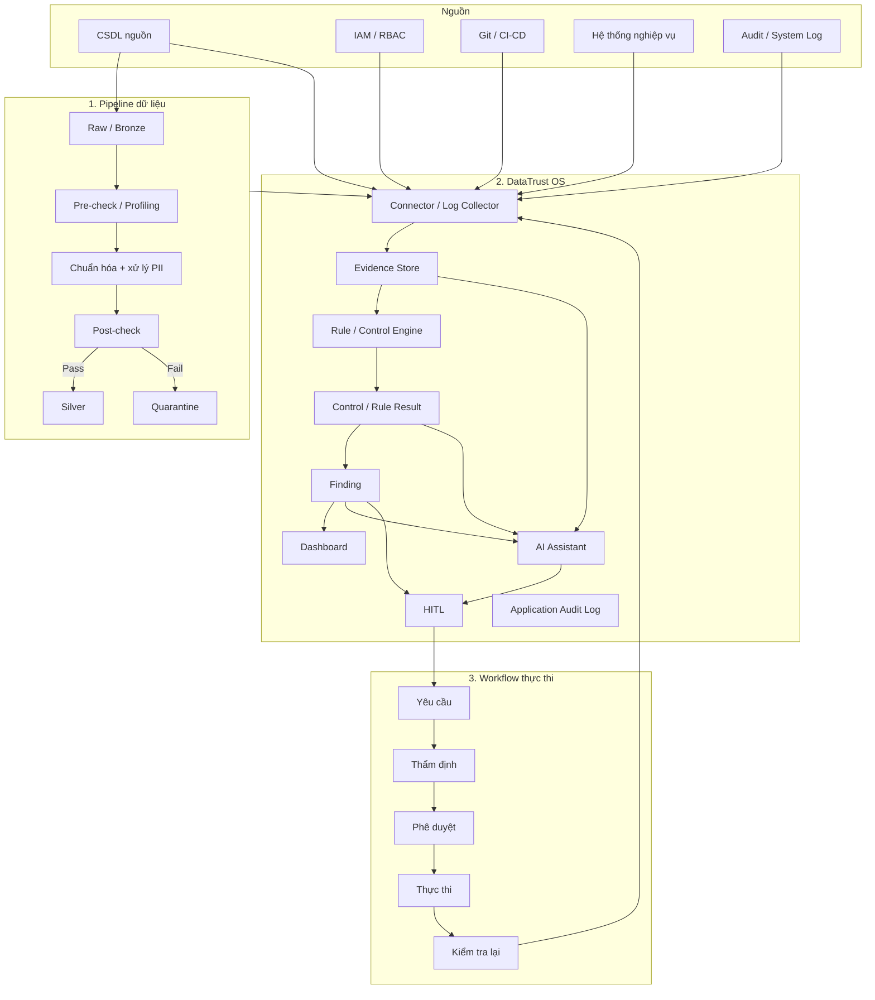
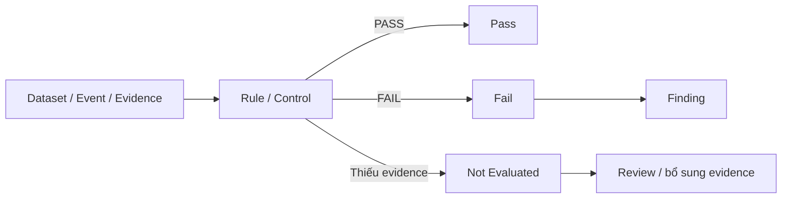
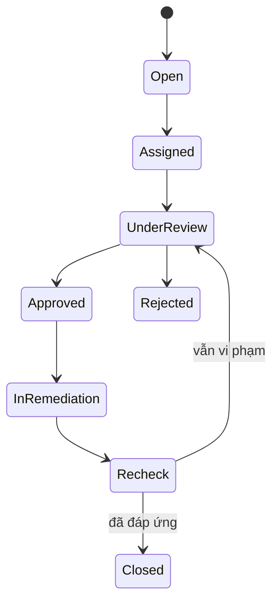
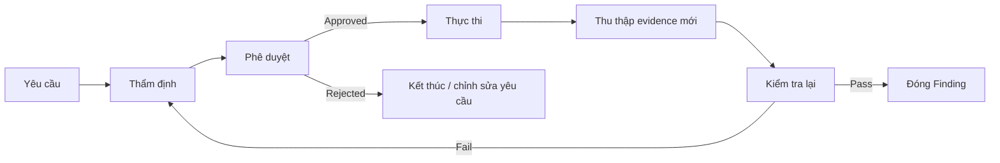
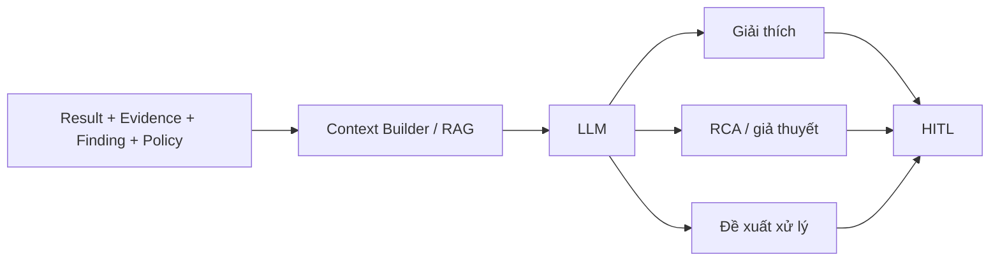
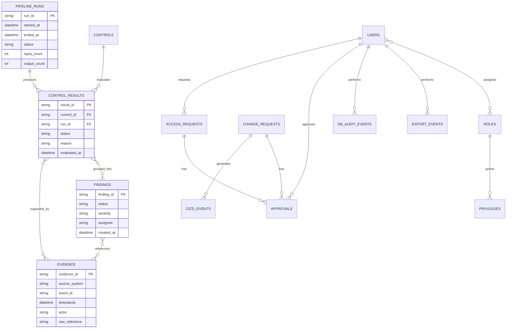
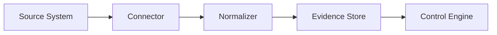
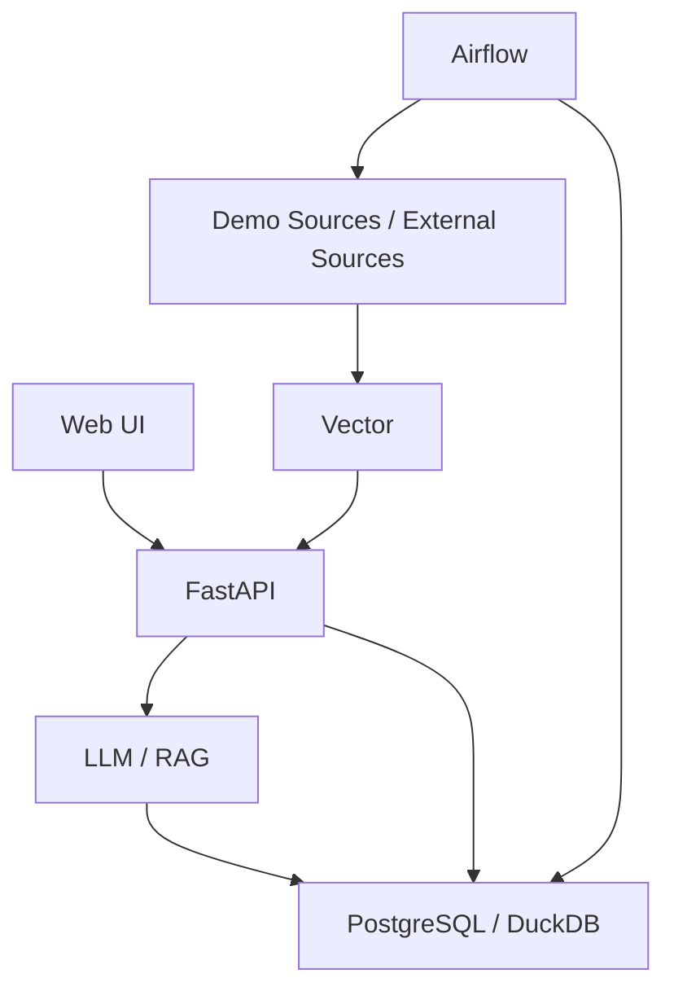

# Software Design Document (SDD)
## DataTrust OS – Hệ thống kiểm soát tuân thủ dữ liệu chuẩn IPO

**Phiên bản:** 0.1  
**Trạng thái:** Draft  
**Nguồn thiết kế:** Tài liệu “XÂY DỰNG HỆ THỐNG KIỂM SOÁT TUÂN THỦ DỮ LIỆU CHUẨN IPO – Case GSM phát triển toàn cầu, chiến dịch V35 mở rộng dịch vụ đến 24 quốc gia”

---

## 1. Mục đích tài liệu

Tài liệu này mô tả thiết kế phần mềm mức hệ thống cho **DataTrust OS** – một lớp giám sát và kiểm soát dữ liệu tập trung phục vụ kiểm soát chất lượng dữ liệu, bảo vệ dữ liệu cá nhân, thu thập audit evidence, kiểm tra một số control ITGC, quản lý finding và hỗ trợ phân tích bằng AI.

SDD tập trung vào:

- Kiến trúc tổng thể.
- Các module chính và trách nhiệm của từng module.
- Luồng dữ liệu và luồng kiểm soát.
- Mô hình dữ liệu logic.
- Cơ chế rule, evidence, result, finding và HITL.
- Phân quyền người dùng.
- Thiết kế AI Assistant.
- Khả năng mở rộng policy theo vùng/quốc gia.
- Công nghệ triển khai dự kiến.

---

## 2. Bối cảnh và mục tiêu hệ thống

### 2.1. Bối cảnh

DataTrust OS được thiết kế cho bối cảnh doanh nghiệp vận hành dịch vụ tại nhiều quốc gia, trong đó dữ liệu phải đáp ứng đồng thời các yêu cầu về:

- Data Quality.
- Privacy & Data Protection.
- IT General Controls (ITGC).
- Auditability và khả năng truy vết.
- Human-in-the-Loop đối với các hành động quan trọng.

Trong phạm vi MVP, hệ thống sử dụng dữ liệu mô phỏng cho ứng dụng đặt xe đa quốc gia. Dữ liệu khách hàng, tài xế và dữ liệu định danh trong môi trường demo là dữ liệu giả lập.

### 2.2. Mục tiêu

Hệ thống cần:

1. Giám sát chất lượng dữ liệu và phát hiện bất thường.
2. Phân loại và xử lý dữ liệu cá nhân theo policy.
3. Thu thập log/metadata và chuẩn hóa thành evidence.
4. Đối chiếu evidence với rule/control.
5. Sinh kết quả kiểm tra `Pass`, `Fail`, hoặc `Not Evaluated`.
6. Tổng hợp vi phạm thành Finding.
7. Hỗ trợ phê duyệt và xử lý qua HITL.
8. Hỗ trợ người dùng giải thích và phân tích vấn đề bằng AI Assistant.
9. Lưu lại đầy đủ lịch sử xử lý phục vụ audit và truy vết.

### 2.3. Nguyên tắc thiết kế cốt lõi

- DataTrust OS là **lớp giám sát và kiểm soát**, không trực tiếp thay đổi hệ thống nguồn.
- Các hành động có khả năng thay đổi dữ liệu/quyền truy cập phải đi qua workflow riêng có phê duyệt.
- Evidence phải có khả năng liên kết tới `run_id`, `control_id`, request hoặc đối tượng liên quan.
- Rule Engine đưa ra kết quả kiểm soát; AI Assistant không thay thế Rule Engine.
- Quyết định quan trọng phải có Human-in-the-Loop.
- Không xóa lịch sử evidence, finding và phê duyệt chỉ vì rule/policy đã ngừng sử dụng.

---

## 3. Phạm vi MVP

### 3.1. Trong phạm vi

| Nhóm chức năng | Phạm vi MVP |
|---|---|
| Data Quality | Profiling; xem dữ liệu mẫu theo quyền; định nghĩa và chạy rule; lưu kết quả theo dataset và `run_id`. |
| Privacy & Data Protection | Phân loại PII; masking/tokenization; kiểm tra dữ liệu sau xử lý; quarantine dữ liệu vi phạm. |
| ITGC & Evidence | Thu thập metadata về access, approval, deployment và job; liên kết log gốc với kết quả kiểm soát. |
| Finding & HITL | Gom vi phạm thành finding; phân công; duyệt/từ chối đề xuất; lưu lịch sử xử lý. |
| AI Assistant | Giải thích result/evidence; tóm tắt finding; phân tích nguyên nhân khả dĩ; đề xuất hướng xử lý; hỏi đáp bằng LLM + RAG. |
| Quản trị ứng dụng | JWT authentication; RBAC; phân quyền theo role và phạm vi dataset; audit log thao tác quan trọng. |

### 3.2. Ngoài phạm vi mặc định của MVP

- Tự động sửa dữ liệu trực tiếp trên hệ thống nguồn.
- Tự động thay đổi quyền truy cập trên hệ thống nguồn.
- Triển khai CDC thời gian thực bắt buộc.
- Thay con người ra quyết định trong các bước kiểm soát quan trọng.

Kafka và Debezium chỉ cần khi muốn kiểm chứng CDC hoặc thu thập sự kiện gần thời gian thực.

---

## 4. Kiến trúc tổng thể

Hệ thống được chia thành ba luồng chính:

1. **Pipeline xử lý dữ liệu**
2. **Lớp giám sát và kiểm soát DataTrust OS**
3. **Workflow phê duyệt và thực thi**



---

## 5. Thành phần hệ thống

### 5.1. Orchestration Layer

**Công nghệ dự kiến:** Apache Airflow

Trách nhiệm:

- Điều phối pipeline ingestion.
- Gọi các bước pre-check, profiling, privacy treatment, post-check.
- Sinh và duy trì `run_id`.
- Theo dõi trạng thái job.
- Ghi số lượng bản ghi và kết quả từng bước.
- Liên kết kết quả pipeline với evidence/control result.

### 5.2. Data Ingestion Layer

Trách nhiệm:

- Nhận dữ liệu từ CSDL nguồn hoặc bộ dữ liệu demo.
- Ghi dữ liệu ban đầu vào Raw/Bronze.
- Đính metadata nguồn và thông tin run.
- Chuyển dữ liệu sang bước profiling và kiểm tra.

### 5.3. Profiling Service

Thu thập tối thiểu:

- Schema.
- Tên cột.
- Primary key.
- Data type.
- Null rate.
- Min/max.
- Distinct count.
- Duplicate statistics.

**Output:** `ProfileResult`.

Profiling chỉ mô tả dữ liệu, chưa kết luận dữ liệu có sự cố.

### 5.4. Data Quality & Anomaly Detection Engine

Hệ thống phát hiện bất thường theo nhiều tầng:

#### L1 – Deterministic Validation

Rule cố định, ví dụ:

- `battery_soc BETWEEN 0 AND 100`
- `battery_temp_c BETWEEN -10 AND 85`
- `battery_voltage >= 0`
- `station_temp_c BETWEEN -10 AND 85`
- `power_kw >= 0`
- `kwh_consumed >= 0`
- `trip_distance_km > 0`
- `fare_amount >= 0`

#### L2 – Statistical Outlier Detection

Sử dụng:

- Median.
- MAD.
- Robust Z-score.

Mục tiêu: phát hiện giá trị lệch đáng kể so với lịch sử.

#### L3 – Multivariate Anomaly Detection

Sử dụng Linear Regression residual:

`y = ax + b`

Mục tiêu: phát hiện quan hệ bất thường giữa nhiều trường dữ liệu.

#### L4 – Change Point Detection

Sử dụng:

- CUSUM.
- PELT.

Mục tiêu: phát hiện thay đổi chế độ trên chuỗi thời gian.

### 5.5. Fusion Engine

Detector chỉ sinh `Signal`.

Fusion Engine gom các Signal:

- Cùng thực thể.
- Cùng dự án.
- Nằm gần nhau theo thời gian.

Incident được mở khi thỏa ít nhất một điều kiện:

1. Có từ hai tầng trở lên đồng thuận.
2. Có tín hiệu L1 mức CRITICAL.
3. Tín hiệu lặp trên nhiều thực thể liên quan.
4. L2 kéo dài hoặc có severity HIGH/CRITICAL.
5. Có cụm HIGH/CRITICAL hoặc từ ba tín hiệu trở lên.

LLM không được dùng để quyết định mở Incident.

### 5.6. Privacy Classification Service

Input:

- `ProfileResult`.
- Data Catalog tĩnh.

Output theo từng cột phải mô tả tối thiểu:

- `table`
- `column`
- `data_category`
- `is_personal_data`
- `pii_class`
- `pii_role`
- `proposed_treatment`
- `review_status`
- `mask_on_export`
- `mask_on_llm`
- `retention_sla_days`
- `after_sla_action`
- `applicable_laws`
- `recommended_controls`
- `evidence_refs`

`pii_class` gồm:

- `none`
- `regular`
- `sensitive`

Classifier xác định cách nhận diện và cách xử lý dữ liệu; không tự gán trực tiếp một điều khoản pháp lý như một kết luận duy nhất.

### 5.7. Privacy Treatment Engine

Các hành động có thể gồm:

- Keep.
- Keep Restricted.
- Pseudonymize.
- Generalize.
- Mask on export.
- Mask on LLM.
- Anonymize.
- Quarantine.

Dữ liệu sau treatment phải đi qua post-check trước khi được đưa vào Silver.

### 5.8. Policy Pack Engine

Policy được đóng gói theo vùng.

Ví dụ:

- EU pack.
- VN pack.
- US pack.

Mỗi pack có:

- Điều kiện kích hoạt.
- Danh sách control.
- `control_id`.
- `law_ref`.
- Rule xử lý.
- Test hồi quy.

#### Thêm vùng mới

```text
Vùng mới
→ Tạo policy pack đầy đủ
→ Định nghĩa điều kiện kích hoạt
→ Thêm control/rule
→ Chạy regression test:
   1. Chỉ vùng mới
   2. Vùng mới + vùng cũ
   3. Chỉ vùng cũ
```

#### Xóa/ngừng một vùng

- Đánh dấu control là `deprecated`.
- Không xóa catalog row.
- Không xóa Finding/Evidence/HITL lịch sử.
- Không xóa rule đang có Finding mở.
- Khi retired, engine ngừng nạp rule đó ở lần chạy mới.

---

## 6. Rule Engine

### 6.1. Loại rule

Hệ thống có ba nhóm rule chính:

1. Data Quality / Anomaly Rule.
2. Privacy / Policy Rule.
3. ITGC Control Rule.

### 6.2. Trạng thái kết quả

Mỗi rule/control trả về:

- `PASS`
- `FAIL`
- `NOT_EVALUATED`

`NOT_EVALUATED` được dùng khi thiếu dữ liệu hoặc thiếu evidence để đưa ra kết luận.

### 6.3. Luồng xử lý



---

## 7. ITGC Control Design

### 7.1. Access Control

Nguyên tắc:

- Chỉ cấp quyền khi có nhu cầu thực tế.
- Quyền gắn với cá nhân cụ thể.
- Không cấp tài khoản dùng chung.
- Quyền phải phù hợp chức danh và thời điểm đảm nhiệm.
- Khi đổi vị trí phải xin phê duyệt lại.
- Nếu không thay đổi, tối đa 12 tháng phải rà soát lại.
- Quyền truy cập dữ liệu cá nhân nhạy cảm cần phê duyệt phù hợp.

Evidence có thể gồm:

- User.
- Role.
- Privilege.
- Access request.
- Approval.
- HR event.
- Access log.

### 7.2. Data Export Control

Yêu cầu:

- Nêu rõ phạm vi trường dữ liệu.
- Nêu mục đích.
- Nêu nơi lưu.
- Nêu thời hạn sử dụng.
- Dữ liệu chứa PII mặc định phải masking khi xuất.
- 100% lệnh export cần được ghi log.

Evidence:

- Export request.
- Approval.
- Export event.
- Dataset scope.
- Actor.
- Timestamp.

### 7.3. Change Management

Yêu cầu:

- Mọi thay đổi phải có RFC.
- Không deploy trực tiếp ngoài CI/CD.
- Người viết mã, người phê duyệt và người triển khai Production phải tách biệt.
- Deploy chỉ được thực hiện sau approval hợp lệ.
- Có test evidence.
- Major/Emergency change cần rollback plan.
- Evidence thay đổi nên được thu tự động.

Evidence:

- RFC/ticket.
- Commit.
- Pull Request.
- Reviewer.
- Approval.
- Security scan result.
- Test result.
- Deployment log.
- Environment.
- Rollback plan.

### 7.4. Incident Management

Yêu cầu:

- Một sự cố có một ticket/mã duy nhất.
- Giữ nguyên bằng chứng.
- Không xóa/sửa log.
- Có timeline xuyên suốt từ phát hiện tới đóng.
- Thao tác xử lý cần được ghi nhận.

---

## 8. Evidence Model

### 8.1. Nhóm evidence

- Access Control.
- Database Activity.
- Change Management.
- Data Pipeline & Data Quality.
- Finding & HITL.

### 8.2. Thuộc tính chuẩn

Mỗi evidence/event nên có tối thiểu:

```text
event_id
timestamp
source_system
actor            # nếu nguồn cung cấp
event_type
object_type
object_id
run_id           # nếu liên quan pipeline
control_id       # nếu liên quan control
request_id       # nếu liên quan workflow
raw_reference    # tham chiếu log gốc
metadata
```

### 8.3. Nguyên tắc

- Evidence phải truy ngược được về nguồn.
- Không sửa nội dung evidence gốc sau khi ingest.
- Có thể chuẩn hóa metadata nhưng cần giữ tham chiếu tới raw source.
- Evidence mới sau bước remediation phải được ingest lại để xác minh trạng thái thực tế.

---

## 9. Finding & HITL

### 9.1. Finding

Finding được tạo từ một hoặc nhiều kết quả kiểm soát liên quan.

Thuộc tính logic:

```text
finding_id
title
description
status
severity
control_ids[]
result_ids[]
evidence_ids[]
assignee
created_at
updated_at
resolution
```

### 9.2. Vòng đời



### 9.3. HITL

Các tác vụ yêu cầu HITL gồm:

- Duyệt/từ chối hướng xử lý.
- Duyệt rule trước khi áp dụng.
- Duyệt remediation.
- Duyệt xử lý dữ liệu nhạy cảm.
- Duyệt các thay đổi quyền.
- Duyệt ngoại lệ.

Nguyên tắc SoD:

- Người tạo yêu cầu không được tự phê duyệt yêu cầu của mình.
- Với quy trình nhạy cảm, requester, approver và executor có thể phải là ba người độc lập.

---

## 10. Workflow phê duyệt và thực thi



Các action có thể gồm:

- Cấp/thu hồi quyền.
- Xử lý lại dữ liệu trong Quarantine.
- Công bố dữ liệu.
- Làm sạch dữ liệu.
- Áp dụng treatment privacy.

Trong MVP, bước thực thi có thể được mô phỏng hoặc thực hiện thủ công.

---

## 11. AI Assistant

### 11.1. Vai trò

AI Assistant hỗ trợ phân tích nhưng không đưa ra quyết định kiểm soát cuối cùng.

### 11.2. Input context

AI có thể sử dụng:

- Result.
- Evidence.
- Finding.
- Policy.
- Rule.
- Tài liệu nội bộ qua RAG.

### 11.3. Chức năng

- Giải thích tại sao rule/control Fail.
- Giải thích trạng thái Not Evaluated.
- Tóm tắt finding.
- Tóm tắt evidence liên quan.
- Hỗ trợ Root Cause Analysis.
- Sinh giả thuyết nguyên nhân.
- Gán mức confidence cho giả thuyết.
- Đề xuất hướng xử lý.
- Hỏi đáp bằng ngôn ngữ tự nhiên.

### 11.4. Luồng AI



### 11.5. Ràng buộc

- AI không sửa dữ liệu nguồn.
- AI không cấp quyền.
- AI không tự đóng finding.
- Confidence của AI không được coi là bằng chứng chắc chắn.
- Rule Engine vẫn là nguồn xác định trạng thái control.

---

## 12. Role & RBAC

### 12.1. Vai trò trong DataTrust OS

| Role | Trách nhiệm |
|---|---|
| Admin | Quản lý tài khoản, connector và cấu hình hệ thống. |
| Steward | Quản lý/duyệt policy, rule; xem evidence; phê duyệt xử lý finding. |
| Analyst | Theo dõi kết quả; phân tích finding; đề xuất hướng xử lý. |
| Viewer | Xem dashboard, result và evidence trong phạm vi được cấp. |

### 12.2. Vai trò nghiệp vụ

- Người yêu cầu.
- CBLĐ khối.
- Data Owner.
- Bộ phận Kiểm soát Dữ liệu.
- GĐ Kiểm soát Dữ liệu.
- PTGĐ Khối KD&VH.
- ANBM / VinSOC.
- Phòng Nhân sự.

### 12.3. Authentication

Cơ chế dự kiến:

- JWT authentication.
- RBAC theo role.
- Dataset scope.
- Audit log cho hành động quan trọng.

---

## 13. Mô hình dữ liệu logic

### 13.1. Dữ liệu nghiệp vụ mô phỏng

- `customers`
- `drivers`
- `trips`
- `data_catalog`
- `region_policy`

### 13.2. Dữ liệu audit và control

- `users`
- `roles`
- `privileges`
- `access_requests`
- `approvals`
- `hr_events`
- `db_audit_events`
- `export_events`
- `change_requests`
- `cicd_events`
- `pipeline_runs`
- `control_results`
- `evidence`
- `findings`

### 13.3. ERD logic đề xuất



> Ghi chú: tài liệu nguồn chưa định nghĩa schema vật lý đầy đủ cho từng bảng. ERD trên thể hiện quan hệ logic phục vụ thiết kế; tên field chi tiết cần được chốt ở bước database design.

---

## 14. Pipeline dữ liệu

### 14.1. Luồng chính

```text
CSDL nguồn
→ Raw/Bronze
→ Pre-check
→ Profiling
→ Privacy Classification
→ Privacy Treatment
→ Post-check
→ Silver hoặc Quarantine
```

### 14.2. Run tracking

Mỗi lần pipeline chạy có `run_id`.

Theo `run_id`, hệ thống cần theo dõi:

- Thời gian bắt đầu/kết thúc.
- Dataset.
- Số lượng record đầu vào.
- Số lượng record đầu ra.
- Số record vào Quarantine.
- Trạng thái từng task.
- Rule/control result.
- Evidence liên quan.

---

## 15. Quarantine Design

Dữ liệu vi phạm không bị xóa ngay.

Quarantine dùng để:

- Tách record lỗi khỏi clean dataset.
- Lưu lý do vi phạm.
- Gắn rule/control gây fail.
- Gắn `run_id`.
- Cho phép review.
- Cho phép xử lý lại sau approval.

Luồng:

```text
Fail
→ Quarantine
→ Analyst review
→ Steward approve
→ Remediation / Reprocess
→ Post-check
→ Silver hoặc tiếp tục Quarantine
```

---

## 16. Audit Trail

Các hành động quan trọng trong DataTrust OS cần được audit.

Tối thiểu:

- Ai thực hiện.
- Hành động gì.
- Đối tượng nào.
- Thời điểm.
- Trước/sau thay đổi nếu phù hợp.
- Request/finding/control liên quan.

Tài liệu nguồn cũng định hướng sử dụng SHA-256 để hỗ trợ phát hiện lịch sử audit bị chỉnh sửa.

Thiết kế chi tiết cơ chế hash-chain cần được chốt riêng ở mức implementation.

---

## 17. Logical API Boundaries

Tài liệu nguồn xác định FastAPI cho backend/API nhưng chưa quy định endpoint cụ thể. Có thể chia API theo domain như sau:

```text
/auth
/users
/roles
/datasets
/pipeline-runs
/profiling
/rules
/controls
/control-results
/evidence
/findings
/approvals
/privacy
/connectors
/ai
/audit
```

Đây là **phân ranh logic**, không phải danh sách endpoint đã được tài liệu nguồn phê duyệt.

---

## 18. Connector Design

Nguồn có thể kết nối:

- Database.
- IAM / RBAC.
- Git.
- CI/CD.
- Application logs.
- Audit logs.
- Data pipeline.
- HR event source.

Connector ưu tiên cơ chế read-only.

Output connector cần được normalize trước khi đưa vào Evidence Store.



---

## 19. Công nghệ dự kiến

| Nhóm | Công nghệ | Vai trò |
|---|---|---|
| Orchestration | Apache Airflow | Lập lịch và điều phối pipeline |
| Database | PostgreSQL / DuckDB | Lưu demo data, metadata, evidence, result, finding |
| Streaming / CDC | Kafka, Debezium | Thu thập thay đổi gần thời gian thực khi cần |
| Log collection | Vector | Thu thập/chuyển log sang evidence layer |
| Backend | Python, FastAPI | API, rule engine, connector, service |
| Data processing | Python, SQL | Profiling, DQ, masking/tokenization |
| AI | LLM + RAG | Giải thích, RCA, tóm tắt, đề xuất |
| Deployment | Docker | Đóng gói môi trường demo |

---

## 20. Deployment View

MVP có thể triển khai bằng Docker theo mô hình:



Kafka/Debezium là optional trong MVP batch.

---

## 21. Yêu cầu bảo mật và kiểm soát

- JWT authentication.
- RBAC.
- Dataset-level scope.
- Segregation of Duties.
- Read-only connector khi có thể.
- Không dùng dữ liệu Production/DLCN thật cho môi trường dev/test theo nguyên tắc Change Management trong tài liệu.
- Audit log thao tác quan trọng.
- Không xóa evidence lịch sử.
- Mask PII trước khi export khi policy yêu cầu.
- Có cơ chế hạn chế dữ liệu gửi vào LLM theo `mask_on_llm`.

---

## 22. Observability

Tối thiểu cần theo dõi:

- Pipeline status.
- Task failure.
- Số record đầu vào/đầu ra.
- Quarantine count.
- Rule Pass/Fail/Not Evaluated.
- Finding count theo severity/status.
- Connector error.
- Evidence ingestion error.
- AI request/error.
- Approval workflow status.

Dashboard tập trung phục vụ quan sát trạng thái tuân thủ và xử lý vấn đề.

---

## 23. Error Handling

### 23.1. Thiếu dữ liệu/evidence

Không mặc định coi là Fail.

Trạng thái:

`NOT_EVALUATED`

### 23.2. Pipeline error

- Ghi trạng thái task.
- Gắn với `run_id`.
- Không đưa dữ liệu chưa qua kiểm tra vào Silver.
- Lưu evidence lỗi nếu có.

### 23.3. Connector error

- Không làm sai lệch evidence hiện có.
- Ghi rõ nguồn không thể kiểm tra.
- Control phụ thuộc evidence đó có thể chuyển sang `NOT_EVALUATED`.

---

## 24. Dữ liệu kiểm thử

Demo dataset cần có đủ ba nhóm:

1. Dữ liệu đạt yêu cầu → `PASS`.
2. Dữ liệu có vi phạm → `FAIL` + Finding.
3. Dữ liệu thiếu evidence → `NOT_EVALUATED`.

Các tình huống kiểm thử nên bao phủ:

- Data Quality.
- PII regular.
- PII sensitive.
- Access Control.
- Export.
- Change Management.
- Pipeline failure.
- Missing evidence.
- HITL approve/reject.
- Finding reopen/recheck.

---

## 25. Tiêu chí chấp nhận mức hệ thống

MVP được xem là đạt thiết kế khi có thể chứng minh xuyên suốt:

```text
Source
→ Pipeline / Connector
→ Evidence
→ Rule / Control
→ Result
→ Finding
→ HITL
→ Remediation
→ Recheck
→ Audit Trail
```

Và người dùng có thể truy vết ngược từ Finding về:

- Control.
- Result.
- Evidence.
- Raw event/source.
- Run hoặc request liên quan.
- Người xử lý/phê duyệt.

---

## 26. Các điểm chưa được tài liệu nguồn chốt

Các nội dung sau cần đặc tả thêm trước khi triển khai production:

- API contract chi tiết.
- Database schema vật lý đầy đủ.
- Cơ chế mapping connector theo từng hệ thống thực.
- Cách lưu raw evidence và thời hạn retention.
- Cơ chế mã hóa dữ liệu at-rest/in-transit.
- Cơ chế secret management.
- SLA hệ thống.
- SLO/SLI.
- Khả năng scale theo volume.
- Disaster Recovery.
- Backup/restore.
- Cơ chế versioning rule/policy.
- Cách tính severity.
- Cơ chế grouping Result → Finding.
- Prompt, guardrail và evaluation cho AI Assistant.
- Cơ chế hash-chain audit chi tiết.
- Quy trình release/deployment của chính DataTrust OS.

---

## 27. Tóm tắt thiết kế

DataTrust OS được xây dựng như một **control plane quan sát và kiểm chứng**, thay vì một hệ thống trực tiếp sửa đổi nguồn.

Mô hình cốt lõi:

```text
Source
→ Event / Metadata
→ Evidence
→ Control / Rule
→ Result
→ Finding
→ HITL
→ Controlled Action
→ New Evidence
→ Recheck
```

Pipeline dữ liệu và control engine cùng sử dụng `run_id`, evidence và audit trail để tạo khả năng truy vết từ dữ liệu đầu vào đến quyết định xử lý cuối cùng.

AI Assistant chỉ hỗ trợ giải thích, tổng hợp, RCA và đề xuất; quyết định kiểm soát vẫn do rule/control và người có thẩm quyền đảm nhiệm.
