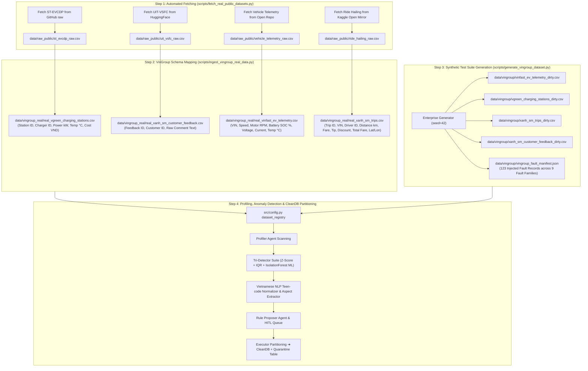

# DataTrust OS — Master Benchmark & Enterprise Dataset Catalog (v1 ➔ v2 ➔ v3)

> **Document Status:** Authoritative Data Lineage, Repositories, Schemas & Ingestion Pipelines  
> **Target Domain:** VinGroup Enterprise Ecosystem (VinFast EV, Xanh SM Ride-Hailing, V-GREEN Infrastructure, Vietnamese NLP Feedback)  
> **Last Updated:** 2026-08-02  

---

## 🌐 1. Authoritative Data Sources & Repositories

DataTrust OS ingests and governs 4 core data domains derived from open-source research repositories cited in Section 2 of the project research report:

| Domain | Dataset Key | Source Repository / URL | License | Original Description | Mapped Enterprise Dataset |
|---|---|---|---|---|---|
| **EV Infrastructure** | `real_vgreen_charging_stations` | [ST-EVCDP (GitHub)](https://github.com/IntelligentSystemsLab/ST-EVCDP) | MIT / Open | Spatial-temporal charging session dataset covering 24,798 charging plugs in Shenzhen | `data/vingroup_real/real_vgreen_charging_stations.csv` |
| **Vietnamese NLP** | `real_xanh_sm_customer_feedback` | [UIT-VSFC (HuggingFace)](https://huggingface.co/datasets/uitnlp/vietnamese_students_feedback) | CC-BY-NC 4.0 | UIT-VSFC Vietnamese customer & student sentiment/aspect corpus | `data/vingroup_real/real_xanh_sm_customer_feedback.csv` |
| **EV Telemetry IoT** | `real_vinfast_ev_telemetry` | [Vehicle Energy & Telemetry (GitHub)](https://github.com/yashdev01/vehicle-energy-and-telemetry-dataset) | Open Access | High-frequency CAN-bus time series (Speed, Motor RPM, Battery SOC %, Voltage, Current, Temp °C) | `data/vingroup_real/real_vinfast_ev_telemetry.csv` |
| **Ride-Hailing** | `real_xanh_sm_trips` | [Ride Hailing Transactions (Kaggle)](https://www.kaggle.com/datasets/galihwardiana/ride-hailing-transaction) | Open Access | Trip transaction logs (Distance km, Fare, Tip, Discount, Pickup Lat/Lon) | `data/vingroup_real/real_xanh_sm_trips.csv` |
| **Legacy NYC Trips** | `nyc_fhvhv` | [NYC TLC FHVHV Jan 2024](https://www.nyc.gov/site/tlc/about/tlc-trip-record-data.page) | Public Domain | 19.6M Uber/Lyft NYC trip records | `data/raw/nyc_fhvhv_2024_01.parquet` |
| **Legacy SEA Demand**| `grab_sea_demand` | [Grab AI for SEA Challenge 2019](https://grab.com/sg/aiforsea/) | Competition | Mobility demand geohash time series | `data/raw/grab_sea_demand/` |

---

## ⚡ 2. Step-by-Step Data Processing & Ingestion Pipelines



---

## 📁 3. Data Directory Architecture

```
data/
├── raw/                                # Legacy L1 & L2 raw datasets
│   ├── nyc_fhvhv_2024_01.parquet       # 19.6M Uber/Lyft NYC trips
│   └── grab_sea_demand/                # Grab demand by geohash (4.2M rows)
├── raw_public/                         # Fetched raw open-source datasets (L6)
│   ├── st_evcdp_raw.csv                # Raw ST-EVCDP charging station dataset
│   ├── uit_vsfc_raw.csv                # Raw UIT-VSFC Vietnamese NLP feedback corpus
│   ├── vehicle_telemetry_raw.csv       # Raw JAC IEV40 CAN-bus time series
│   └── ride_hailing_raw.csv            # Raw ride-hailing transaction dataset
├── weather/                            # L3 Weather context
│   ├── hcmc_weather_2024.json           # Raw weather API JSON
│   └── hcmc_weather_2024.parquet        # 8,784 hourly weather records
├── synthetic/                          # L4 Synthetic baseline datasets
│   ├── vietnam_trips.parquet            # 50K clean Vietnam ride-hailing trips
│   ├── vietnam_trips_dirty.parquet      # 50K dirty trips + 14,450 injected faults
│   └── fault_manifest.json             # L4 ground truth fault manifest
├── vingroup/                           # L5 VinGroup Enterprise Test Bundle (DATA-02)
│   ├── vinfast_ev_telemetry_dirty.csv  # 1,000 CAN-bus IoT telemetry records
│   ├── vgreen_charging_stations_dirty.csv # 500 V-GREEN charging session records
│   ├── xanh_sm_trips_dirty.csv         # 500 Xanh SM taxi/bike trip records
│   ├── xanh_sm_customer_feedback_dirty.csv # 100 unstructured text comments
│   └── vingroup_fault_manifest.json    # Ground truth record of 123 injected faults
├── vingroup_real/                      # L6 Mapped Real VinGroup Datasets
│   ├── real_vinfast_ev_telemetry.csv   # 1,000 mapped real EV telemetry records
│   ├── real_vgreen_charging_stations.csv # 1,000 mapped real ST-EVCDP station records
│   ├── real_xanh_sm_trips.csv          # 1,000 mapped real ride-hailing records
│   └── real_xanh_sm_customer_feedback.csv # 500 mapped real UIT-VSFC feedback records
├── conversations.db                    # SQLite database for persistent chat streams
└── README.md                           # Master Data Catalog (This file)
```

---

## 📊 4. Detailed Schemas & Field Contracts

### 4.1 VinGroup EV Telemetry (`vinfast_ev_telemetry_dirty` & `real_vinfast_ev_telemetry`)

| Column Name | Type | Unit / Format | Description & Business Rules |
|---|---|---|---|
| `record_id` | string | `EV_REC_XXXX` | Unique telemetry record primary key |
| `vehicle_vin` | string | `VF8VNF...` / `VF9_REAL...` | Vehicle Identification Number |
| `timestamp` | string | ISO-8601 | Telemetry log timestamp (Invalid timestamps indicate basement blackout) |
| `speed_kmh` | float | km/h ($0.0 - 180.0$) | Vehicle ground speed |
| `motor_rpm` | int | RPM ($0 - 15000$) | Electric motor revolutions per minute |
| `battery_soc` | float | Percentage ($0.0 - 100.0\%$) | Battery State of Charge ($< 0\%$ indicates BMS sensor fault) |
| `battery_voltage` | float | Volts ($300.0 - 450.0\text{V}$) | Pack voltage ($> 9000\text{V}$ indicates CAN-bus overvoltage spike) |
| `battery_current` | float | Amperes ($0.0 - 250.0\text{A}$) | Pack current discharge |
| `battery_temp_c` | float | Celsius ($20.0 - 60.0^\circ\text{C}$) | Battery module temperature |
| `latitude` | float | WGS84 Lat | Vehicle latitude coordinate (`null` during GSM basement blackout) |
| `longitude` | float | WGS84 Lon | Vehicle longitude coordinate (`null` during GSM basement blackout) |
| `accel_z` | float | $\text{m/s}^2$ | 3-axis vertical accelerometer |

---

### 4.2 V-GREEN Charging Stations (`vgreen_charging_stations_dirty` & `real_vgreen_charging_stations`)

| Column Name | Type | Unit / Format | Description & Business Rules |
|---|---|---|---|
| `session_id` | string | `CHG_SESS_XXXX` | Unique charging session identifier |
| `station_id` | string | `VG_STA_XXXX` | V-GREEN station identifier (e.g. `VG_STA_VINCOM_BA_TRIEU`) |
| `charger_id` | string | `C_XX` | Individual charger plug identifier |
| `vehicle_vin` | string | `VF...` | Connected VinFast vehicle VIN |
| `start_time` | string | ISO-8601 | Charging session initiation timestamp |
| `duration_mins` | float | Minutes | Active charging session duration |
| `power_kw` | float | kW ($30.0 - 250.0\text{kW}$) | Charging power ($0\text{kW}$ with high temp indicates thermal fault) |
| `kwh_consumed` | float | kWh | Total energy transferred |
| `station_temp_c` | float | Celsius ($20.0 - 90.0^\circ\text{C}$) | Charger cabinet temperature ($> 80^\circ\text{C}$ triggers thermal cutoff) |
| `cost_vnd` | float | VND | Charging session cost ($< 0$ indicates billing ledger defect) |
| `status` | string | Enum | Status (`COMPLETED`, `THERMAL_FAULT`, `POWER_DROP`) |

---

### 4.3 Xanh SM Ride-Hailing Trips (`xanh_sm_trips_dirty` & `real_xanh_sm_trips`)

| Column Name | Type | Unit / Format | Description & Business Rules |
|---|---|---|---|
| `trip_id` | string | `XANH_TRIP_XXXX` | Unique trip identifier |
| `vehicle_vin` | string | `VF...` | Assigned Xanh SM vehicle VIN |
| `driver_id` | string | `DRV_XANH_XXX` | Driver identifier |
| `pickup_datetime` | string | ISO-8601 | Passenger pickup timestamp |
| `trip_miles` | float | Miles / km | Total trip distance |
| `fare_amount` | float | VND | Base fare amount ($< 0$ indicates negative fare defect) |
| `tip_amount` | float | VND | Passenger tip amount |
| `discount_amount` | float | VND | Promotional discount amount |
| `total_fare` | float | VND | Net fare ($\text{fare} + \text{tip} - \text{discount}$; mismatch indicates ledger error) |
| `pickup_latitude` | float | WGS84 Lat | Pickup latitude (NYC coords indicate alleyway GPS drift) |
| `pickup_longitude` | float | WGS84 Lon | Pickup longitude |
| `vehicle_type` | string | Enum | Vehicle category (`VF_5_TAXI`, `VF_e34_TAXI`, `FELIZ_S_BIKE`) |

---

### 4.4 Unstructured Customer Feedback (`xanh_sm_customer_feedback_dirty` & `real_xanh_sm_customer_feedback`)

| Column Name | Type | Description & NLP Extractor Processing |
|---|---|---|
| `feedback_id` | string | Unique feedback record identifier |
| `customer_id` | string | Customer account identifier |
| `timestamp` | string | ISO-8601 comment submission timestamp |
| `raw_comment_text` | string | Unstructured Vietnamese feedback text containing teen code (`"ko sac dc"`, `"app lag vl"`) |
| `extracted_location` | string | Location entity extracted by NLP (`Vincom Bà Triệu`, `Royal City`, `Landmark 81`) |
| `extracted_component` | string | Component entity extracted by NLP (`Trạm sạc V-GREEN`, `Pin xe VinFast`, `Ứng dụng di động`) |
| `extracted_error_type` | string | Error classification (`Lỗi thiết bị / Phần cứng trạm sạc`, `Lỗi ứng dụng di động`) |
| `severity_level` | string | Severity rating (`CRITICAL`, `WARNING`, `INFO`) |

---

## 🎯 5. Real-World Vietnam Fault Injection Suite (9 Fault Families)

The dataset suite embeds 9 real-world fault families for benchmarking Precision/Recall:

1. **GSM Underground Basement Blackouts**: Loss of GPS coordinates and corrupted ISO-8601 timestamps when vehicles enter Vincom basement parking.
2. **Battery BMS Negative Sensor Defects**: Unphysical negative Battery State of Charge (SOC: $-12.5\%$).
3. **CAN-Bus Overvoltage Spikes**: Extreme electrical voltage spikes ($9999\text{V}$).
4. **Motor RPM Mismatches**: Unrealistic sensor readings (Speed $= 0\text{km/h}$ while Motor RPM $= 14,500$).
5. **V-GREEN Thermal Power Drops**: Sudden power drop to $0\text{kW}$ when station cabinet temperature exceeds $85.5^\circ\text{C}$.
6. **Negative Cost / Billing Defects**: Glitched negative charging fees and trip fares ($-150,000\text{ VND}$).
7. **GPS Alleyway Drift**: GPS coordinates jumping to foreign bounding boxes due to dense urban alleyways.
8. **Arithmetic Ledger Mismatches**: Total fare mismatches where $\text{total\_fare} \neq \text{fare} + \text{tip} - \text{discount}$.
9. **Unstructured Teen-Code Noise**: Slang and missing accents in customer app feedback (`"ko sac dc"`, `"app lag vl"`).
