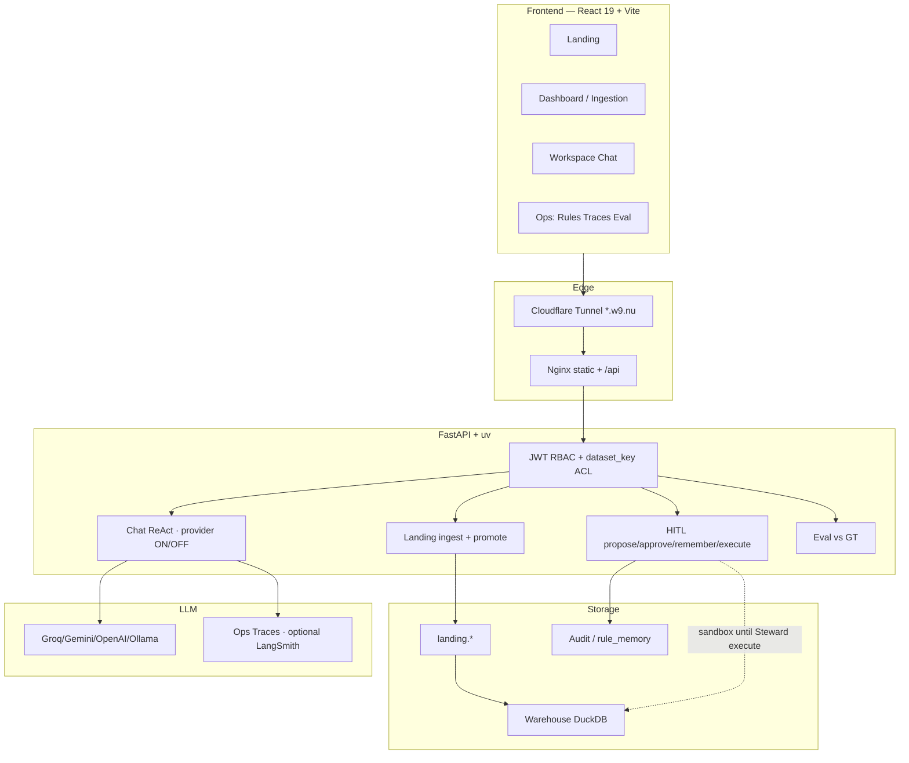

# DataTrust OS — Architecture (BTC)

> Live: [https://t086.w9.nu](https://t086.w9.nu) · Staging: [https://d086.w9.nu](https://d086.w9.nu) · Health `/health` → 200  
> Tip: `6308ec4` (PR #40 dataset ACL) · Detail: [`ARCHITECTURE.md`](../ARCHITECTURE.md)

## Context

**DataTrust OS** — Operational Trust Console for VinGroup-style telemetry (EV / charging / trips).  
Pipeline: **ingest → L1–L4 detect → fuse → RCA/agent → HITL → sandboxed execute**.

## Mermaid — runtime

## Roles + ACL (Phase 2 · #40)

| Principal | Scope |
|---|---|
| Steward (global) | Cross-dataset demo |
| steward_a / steward_b | `dataset_key` A=`ev_telemetry` · B=`trips` — A↛B |
| Analyst / Viewer | Dataset-scoped |
| Admin | **Names + aggregate only**; 403 on row/HITL/ingest detail; Reset OK; **no execute** |

## Export

GitHub Mermaid OK. Optional PNG via [mermaid.live](https://mermaid.live) for pitch slides.
