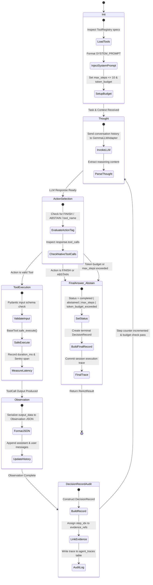
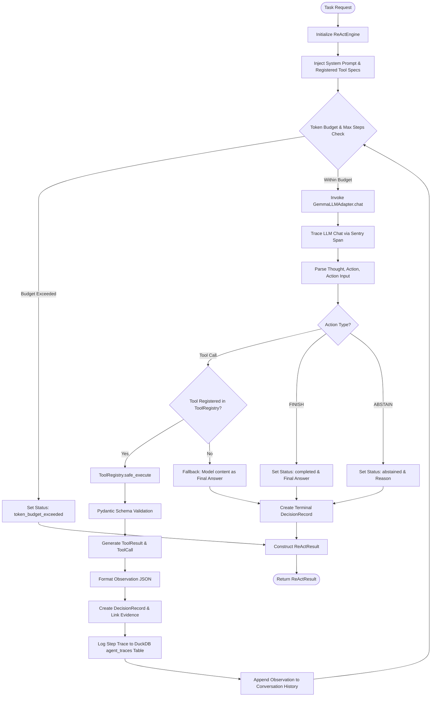

# DataTrust OS v4 — AI Orchestration & ReAct Engine Architecture

## 1. Executive Summary & Architectural Overview

The AI Orchestration layer of **DataTrust OS v4** forms the cognitive control plane responsible for autonomous data quality profiling, anomaly detection, root-cause diagnosis, and rule execution across the VinGroup Electric Vehicle (EV) ecosystem (comprising **VinFast EV Telemetry**, **VGreen Charging Stations**, **Xanh SM Taxi Trips**, and **Customer Feedback** streams).

At the core of this architecture is `ReActEngine` (`src/orchestrator/engine.py`), a dynamic Reasoning + Acting (ReAct) loop orchestrator. The engine interfaces directly with:
- **`GemmaLLMAdapter`** (`src/services/llm.py`): The primary LLM adapter connecting to `gemma-4-26b-a4b-it` via Google AI Studio API under a strict zero-fallback operational policy and 60-second execution timeout.
- **`DecisionRecord`** (`src/orchestrator/engine.py`): A structured decision logging and evidence-grounding data model enforcing traceability between model assertions and raw dataset evidence.
- **`ToolRegistry`** & **`BaseTool`** (`src/tools/base.py`): A strongly typed tool execution environment built on Pydantic `ToolResult` data contracts, input/output schema validation, latency instrumentation, and error isolation.

```
┌────────────────────────────────────────────────────────────────────────────────────────┐
│                                   DataTrust OS v4                                      │
│                               AI Orchestration Engine                                  │
└──────────────────────────────────────────┬─────────────────────────────────────────────┘
                                           │
                    ┌──────────────────────┴──────────────────────┐
                    ▼                                             ▼
       ┌────────────────────────┐                    ┌────────────────────────┐
       │     ReActEngine        │                    │    GemmaLLMAdapter     │
       │ (src/orchestrator/     │◀──────────────────▶│  (gemma-4-26b-a4b-it   │
       │  engine.py)            │                    │   Google AI Studio API)│
       └────────────┬───────────┘                    └────────────────────────┘
                    │
        ┌───────────┴───────────┐
        ▼                       ▼
┌───────────────┐       ┌───────────────┐
│ ToolRegistry  │       │DecisionRecord │
│ (Pydantic     │       │ (Evidence     │
│  ToolResult)  │       │  Grounding)   │
└───────────────┘       └───────────────┘
```

---

## 2. ReAct Engine Loop (`ReActEngine`)

### 2.1 ReAct State Diagram

The following Mermaid `stateDiagram-v2` details the state transitions of `ReActEngine` throughout a task execution lifecycle:



### 2.2 Execution Flow Diagram



### 2.3 Detailed Step-by-Step Breakdown

1. **`Init` (Initialization)**:
   - Accepts task string and optional context dictionary.
   - Instantiates `GemmaLLMAdapter` and `ToolRegistry` (if not provided).
   - Generates the system prompt using `SYSTEM_PROMPT.format(tool_list=..., max_steps=...)`.
   - Enforces a hard upper bound on step iterations: `max_steps = min(max_steps, 10)` to prevent unbounded execution loops.
   - Sets total token budget (`token_budget = 10000` default).

2. **`Thought` (Reasoning Phase)**:
   - Dispatches full message history to `self.llm.chat(messages, tools=tool_specs)`.
   - Sentry instrumentation wraps the call in a telemetry span (`op="llm.chat"`).
   - Extracts reasoning string from `Thought:` prefix in model response or content block.

3. **`Action Selection`**:
   - Checks dual-mode tool invocation:
     - **Native Function Calling**: Parses `response.tool_calls` returned by Gemini SDK `GenerateContentConfig(tools=...)`.
     - **Text-Based Parsing**: Parses structured output matching `Action: <tool_name | FINISH | ABSTAIN>` and `Action Input: <JSON>`.
   - Strips system prefixes such as `default_api:` if present.

4. **`Tool Execution`**:
   - Finds matching `BaseTool` instance in `ToolRegistry`.
   - Invokes `ToolRegistry.execute(action_name, action_input)` which routes through `safe_execute()`.
   - Validates input arguments against Pydantic `input_schema`.
   - Measures latency (`duration_ms`) and catches runtime exceptions, mapping errors into structured `ToolResult` objects (`status="error"`).

5. **`Observation`**:
   - Converts `tool_result.output_data` to a formatted JSON string.
   - Appends model output to message history as `assistant` role.
   - Appends observation to message history as `user` role (`Observation: <JSON>`).

6. **`DecisionRecord Audit`**:
   - Constructs a `DecisionRecord` detailing the selected action, evidence references (`evidence_refs=["step_N"]`), confidence score (e.g. `0.9`), and rationale.
   - Logs complete step metadata into the DuckDB `agent_traces` table via `self._log_trace(session_id, step)`.

7. **`Final Answer / Abstain` (Termination Gates)**:
   - **`FINISH`**: Sets `result.status = "completed"`, assigns `result.final_answer = step.thought`, creates a final `DecisionRecord` (confidence `1.0`).
   - **`ABSTAIN`**: Sets `result.status = "abstained"`, assigns `result.final_answer = step.thought`, creates an explicit abstaintion record (confidence `0.8`).
   - **Step Limit / Token Budget Exceeded**: Automatically breaks loop and sets status to `max_steps` or `token_budget_exceeded`.

---

## 3. LLM Adapter Specifications (`GemmaLLMAdapter`)

### 3.1 Core Adapter Specifications

The `GemmaLLMAdapter` (`src/services/llm.py`) serves as the production integration interface for Google AI Studio API model endpoints.

| Specification Parameter | Technical Value / Policy |
|---|---|
| **Primary Model Target** | `gemma-4-26b-a4b-it` (Configured via `AI_MODEL` / `GOOGLE_AI_MODEL` env vars) |
| **API Provider** | Google AI Studio (`google-genai` SDK v1.0+) |
| **API Key Resolution Order** | Explicit parameter $\rightarrow$ `GOOGLE_AI_API_KEY` $\rightarrow$ `GEMINI_API_KEY` $\rightarrow$ `GOOGLE_API_KEY` $\rightarrow$ `AI_STUDIO_API_KEY` $\rightarrow$ `Settings.ai_studio_api_key` |
| **Request Timeout** | **60 seconds** strict HTTP execution timeout per generate content call |
| **Fallback Policy** | **Zero-Fallback Policy**: Hard refusal to fallback to mock, heuristic, or lower-tier models during production errors. Raises `LLMUnavailableException` to preserve diagnostic integrity. |
| **Sampling Temperature** | `0.1` (Deterministic reasoning for data quality analysis) |
| **Max Output Tokens** | `4096` tokens per turn |
| **SDK Bug Fix Patch** | Dynamic monkey-patch on `google.genai._api_client.BaseApiClient.aclose` preventing uninitialized `_async_httpx_client` teardown exceptions |

### 3.2 Exception Hierarchy

```python
class LLMUnavailableException(Exception):
    """Raised when the LLM service or provider is unavailable or fails."""
    pass

class StructuredOutputInvalidException(Exception):
    """Raised when structured JSON output from LLM fails validation or parsing."""
    pass
```

### 3.3 Core Methods & Capabilities

```python
class GemmaLLMAdapter:
    def __init__(self, api_key: str | None = None, model: str | None = None): ...
    
    def chat(
        self, 
        messages: list[dict], 
        tools: list[dict] | None = None
    ) -> LLMResponse:
        """Sends multi-turn messages and optional OpenAI-style tool declarations 
        to Gemini models via Google AI Studio API."""

    def structured_output(self, prompt: str, schema: dict) -> dict:
        """Enforces JSON schema adherence with regex code-block extraction fallback.
        Raises StructuredOutputInvalidException if JSON deserialization fails."""

    def generate_structured(
        self, 
        prompt: str, 
        response_model: Any = None, 
        schema: Any = None, 
        system_prompt: str = ""
    ) -> Any:
        """Generates Pydantic-validated output using model_json_schema() and model_validate()."""

    def _convert_tools(self, openai_tools: list[dict]) -> list:
        """Translates OpenAI function schemas into Google genai types.Tool and FunctionDeclaration."""
```

### 3.4 `LLMResponse` Data Contract

```python
@dataclass
class LLMResponse:
    content: str = ""
    tool_calls: list[dict] = field(default_factory=list)
    finish_reason: str = ""  # 'stop' or 'tool_call'
    tokens_used: int = 0
```

---

## 4. Decision Log & Grounding (`DecisionRecord`)

### 4.1 Field Definitions & Schema

The `DecisionRecord` class (`src/orchestrator/engine.py`) provides structured decision tracking and evidence attribution for every action taken by `ReActEngine`.

```python
@dataclass
class DecisionRecord:
    """Structured decision log record for ReAct step execution."""
    selected_action: str
    decision_id: str = field(default_factory=lambda: str(uuid.uuid4())[:8])
    claim: str = ""
    evidence_refs: list[str] = field(default_factory=list)
    contradicting_evidence_refs: list[str] = field(default_factory=list)
    source_query_hashes: list[str] = field(default_factory=list)
    confidence_method: str = "heuristic_grounding"
    confidence: float = 1.0
    alternative_considered: str | None = None
    stop_continue_reason: str = ""
```

### 4.2 Detailed Field Explanations

| Field | Type | Description & Usage |
|---|---|---|
| `decision_id` | `str` | Unique 8-character hex identifier generated per decision event (e.g. `"a1b2c3d4"`). |
| `selected_action` | `str` | Name of the tool invoked (`profile_dataset`, `execute_rules`), or control action (`FINISH`, `ABSTAIN`, `FINISH_DEFAULT`). |
| `claim` | `str` | Natural language statement or assertion being validated (e.g., *"VinFast battery telemetry dataset contains 4.2% null SoC values"*). |
| `evidence_refs` | `list[str]` | Array of evidence pointers linking back to step observations or artifact IDs (e.g., `["step_0", "artifact_dq_profile_99"]`). |
| `contradicting_evidence_refs` | `list[str]` | Array of pointers to observations that refute or contradict the assertion, enabling balanced multi-perspective auditing. |
| `source_query_hashes` | `list[str]` | SHA-256 hashes of SQL queries or data retrieval invocations used to obtain supporting evidence, ensuring cryptographic reproducibility. |
| `confidence_method` | `str` | Methodology used to calculate confidence (`"heuristic_grounding"`, `"bayes_factor"`, `"rule_weight"`). |
| `confidence` | `float` | Grounding confidence score normalized in range $[0.0, 1.0]$. Values below $0.7$ trigger automated warning annotations. |
| `alternative_considered` | `str \| None` | Description of alternative actions or hypotheses evaluated before selecting `selected_action`. |
| `stop_continue_reason` | `str` | Explicit justification for why the engine decided to continue stepping or terminate the loop. |

### 4.3 Database Audit Log Lineage (`agent_traces`)

Every step and associated `DecisionRecord` is persisted to DuckDB under the `agent_traces` table:

```sql
CREATE TABLE IF NOT EXISTS agent_traces (
    id VARCHAR PRIMARY KEY,
    session_id VARCHAR NOT NULL,
    agent_type VARCHAR NOT NULL,
    step_index INTEGER NOT NULL,
    thought TEXT,
    action VARCHAR,
    tool_name VARCHAR,
    tool_input TEXT,
    tool_output TEXT,
    observation TEXT,
    tokens_used INTEGER DEFAULT 0,
    duration_ms INTEGER DEFAULT 0,
    created_at TIMESTAMP DEFAULT CURRENT_TIMESTAMP
);
```

---

## 5. Tool Registry & Execution Contracts (`ToolRegistry` & `ToolResult`)

### 5.1 `ToolResult` Pydantic Contract

The `ToolResult` model (`src/tools/base.py`) standardizes the return interface across all system tools:

```python
from typing import Literal, Optional
from pydantic import BaseModel, Field

class ToolResult(BaseModel):
    status: Literal["success", "error", "abstained"]
    output_data: dict = Field(default_factory=dict)
    error_message: Optional[str] = None
    evidence_artifact_id: Optional[str] = None
```

### 5.2 `ToolCall` Dataclass

`ToolCall` records an execution event with timing and validation state:

```python
@dataclass
class ToolCall:
    tool_name: str
    input_data: dict
    output_data: dict
    success: bool
    error: str | None = None
    duration_ms: int = 0
    call_id: str = field(default_factory=lambda: str(uuid.uuid4())[:8])
    timestamp: str = field(default_factory=lambda: datetime.now().isoformat())
    result: ToolResult | None = None
```

### 5.3 `BaseTool` Abstraction

All tools inherit from `BaseTool` (`src/tools/base.py`), which implements automated schema creation, input/output validation, error boundary wrapping, and function calling serialization.

```python
class BaseTool(ABC):
    name: str = ""
    description: str = ""
    input_schema: dict | Type[BaseModel] = {}
    output_schema: dict | Type[BaseModel] = {}
    target_workflow_state: Optional[Any] = None

    @abstractmethod
    def execute(self, input_data: dict) -> dict | ToolResult | BaseModel:
        """Core tool logic implementation."""
        ...

    def validate_input(self, input_data: dict) -> dict:
        """Validates input against input_schema using Pydantic."""
        ...

    def validate_output(self, output_data: dict) -> dict:
        """Validates output against output_schema using Pydantic."""
        ...

    def safe_execute(self, input_data: dict) -> ToolCall:
        """Executes tool with input/output validation, timing, and error mapping."""
        ...

    def to_function_spec(self) -> dict:
        """Serializes tool schema into OpenAI/Gemini function specification format."""
        ...
```

### 5.4 `ToolRegistry` Lifecycle

```python
class ToolRegistry:
    def __init__(self):
        self._tools: dict[str, BaseTool] = {}

    def register(self, tool: BaseTool) -> None:
        """Registers a tool instance. Throws ValueError on name collision."""
        if tool.name in self._tools:
            raise ValueError(f"Tool name collision: tool '{tool.name}' is already registered.")
        self._tools[tool.name] = tool

    def get(self, name: str) -> BaseTool:
        """Retrieves registered tool by name or raises KeyError."""
        if name not in self._tools:
            raise KeyError(f"Unknown tool: {name}. Available: {list(self._tools.keys())}")
        return self._tools[name]

    def list_tools(self) -> list[dict]:
        """Returns OpenAI-compatible function specs for all registered tools."""
        return [t.to_function_spec() for t in self._tools.values()]

    def execute(self, name: str, input_data: dict) -> ToolCall:
        """Retrieves tool by name and runs safe_execute()."""
        tool = self.get(name)
        return tool.safe_execute(input_data)
```

---

## 6. Registered DataTrust Tools Matrix

The table below outlines key operational tools registered within the DataTrust OS v4 tool ecosystem:

| Tool Name | Class & Module | Primary Purpose | Input Key Fields | Output Key Fields |
|---|---|---|---|---|
| `profile_dataset` | `ProfilerTool`<br>`src/tools/dq/profiler_tool.py` | Generates statistical data quality profiles (null count, min/max, uniqueness) | `dataset_key`, `sample_size` | `total_rows`, `column_profiles`, `missing_matrix` |
| `execute_rules` | `RuleExecutorTool`<br>`src/tools/rule_executor.py` | Compiles and executes DQ SQL validation rules against target dataset | `dataset_key`, `rules: list[dict]` | `passed_count`, `failed_count`, `quarantine_row_ids` |
| `detect_anomalies` | `AnomalyDetectorTool`<br>`src/tools/anomaly.py` | Identifies distribution drift and outliers across EV telemetry metrics | `current_profile`, `baseline_profile` | `anomalies: list[dict]`, `severity_score` |
| `diagnose_issue` | `DiagnosisTool`<br>`src/tools/base.py` | Conducts root-cause analysis on flagged data quality anomalies | `anomaly_id`, `context_data` | `root_cause`, `confidence`, `suggested_action` |
| `search_docs` | `AlgoliaSearchTool`<br>`src/tools/algolia_tool.py` | Queries technical documentation index via Algolia Search API | `query: str`, `top_k: int` | `hits: list[dict]`, `nbHits` |

---

## 7. Operational Best Practices & Guardrails

1. **Strict Step Constraints**: Always cap `max_steps <= 10` per ReAct run to eliminate runaway execution loops and context overflow.
2. **Token Budget Supervision**: Monitor token usage per step (`tokens_used`). Terminate gracefully with `status="token_budget_exceeded"` when token consumption reaches threshold (`10,000` tokens).
3. **Zero-Fallback Enforcement**: Never bypass `GemmaLLMAdapter` errors with silent fallbacks. All model errors must surface as `LLMUnavailableException` for audit transparency.
4. **Complete Traceability**: Ensure every tool call returns a `ToolResult` and generates a `DecisionRecord` linked to `evidence_refs` for regulatory compliance in EV operations.
