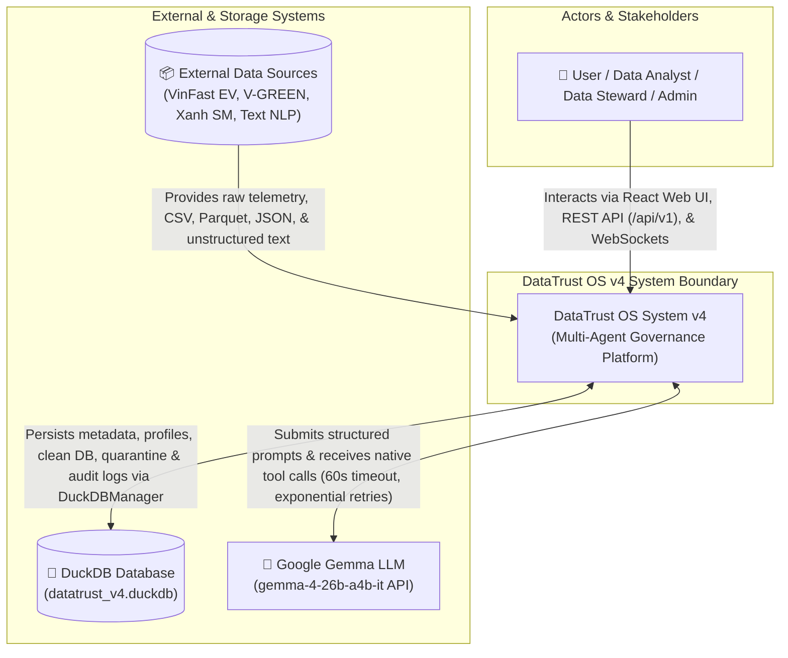
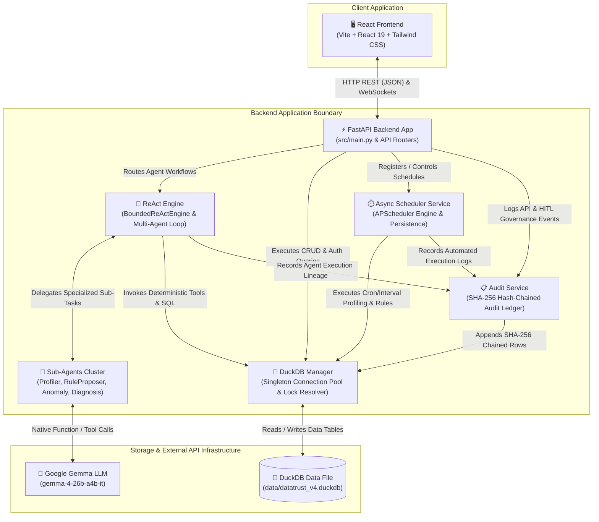
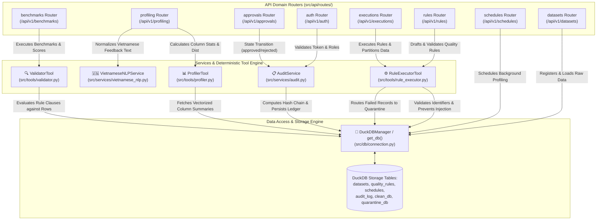
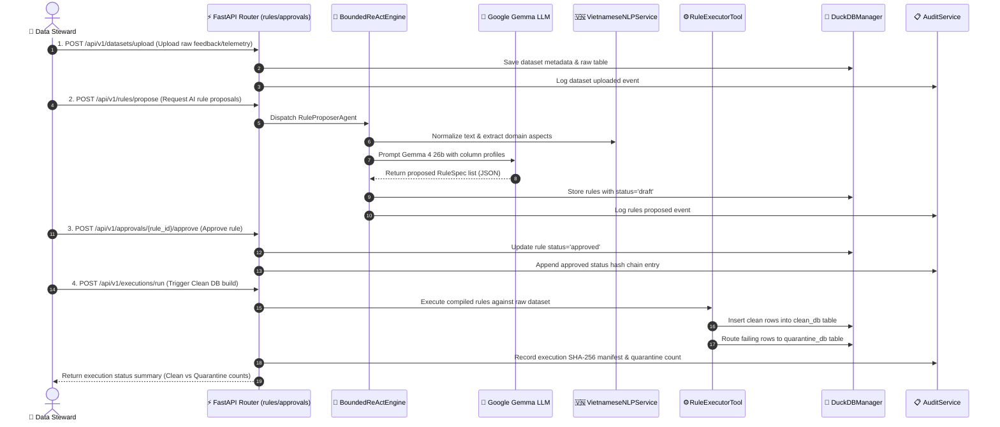

# DataTrust OS v4 — C4 System Architecture Specification

> **Document Status:** Authoritative Architectural Specification  
> **System Name:** DataTrust OS v4 (VinGroup Enterprise Ecosystem DATA-02)  
> **Last Updated:** 2026-08-09  
> **Architecture Model:** C4 Model (Context, Container, Component)  

---

## 🏛️ Executive Architecture Overview

**DataTrust OS v4** is an enterprise-grade, multi-agent data governance, quality control, anomaly detection, and automated data processing platform. Designed specifically for complex ecosystem requirements (including VinFast EV Telemetry, V-GREEN Charging Infrastructure, Xanh SM Ride-Hailing Trips, and Vietnamese Customer Feedback NLP), DataTrust OS v4 establishes a strict boundary between **probabilistic AI decision-making** and **deterministic data execution**.

The architectural philosophy adheres to 4 primary pillars:
1. **Probabilistic Proposal; Deterministic Execution:** Large Language Models (LLMs) propose rules, classify anomalies, and diagnose root causes, but only compiled, safe AST/SQL execution engines touch raw dataset records.
2. **Human-In-The-Loop (HITL) Governance Gate:** Proposed quality rules pass through explicit approval state transitions (`draft` ➔ `pending_approval` ➔ `approved` / `rejected`) before affecting clean dataset partitioning.
3. **Fail-Closed Quarantine Routing:** Invalid, corrupt, or rule-violating records are systematically routed to an immutable `quarantine` table with granular failure diagnostics, preventing dirty data propagation.
4. **Cryptographic Hash-Chained Audit Ledger:** Every state change, execution run, and approval decision generates a SHA-256 hash-chained audit record linking `previous_event_hash` to guarantee tamper-evident lineage tracking.

---

## 1. C4 Level 1: System Context Diagram

The **System Context Diagram** illustrates how human actors and external systems interact with DataTrust OS v4 as a high-level governance boundary.

### 1.1 Actors & Responsibilities

- **Data Analyst / Data Steward / Admin (`User`):**
  - **Data Steward / Admin:** Manages dataset onboarding, configures background schedules, reviews AI-proposed data quality rules in the HITL approval queue, inspects anomaly Root Cause Analyses (RCA), and triggers execution pipelines.
  - **Data Analyst / Viewer:** Inspects profiling metrics, queries clean data, monitors system health, views audit trails, and exports performance benchmarks.
- **DataTrust OS System v4 (`SystemCore`):**
  - The central multi-agent governance platform orchestrating REST requests, WebSocket events, automated background scheduling, rule compilation, anomaly scoring, and audit chainer services.

### 1.2 External & Storage Systems Boundaries

- **Google Gemma LLM (`GemmaLLM`):**
  - **Interface:** Google AI Studio REST API utilizing model `gemma-4-26b-a4b-it` with native tool-calling capabilities.
  - **Boundary Constraints:** Invoked strictly with 60-second execution timeouts and 3-stage exponential backoff retry policy. Communication strictly uses structured JSON inputs/outputs via Pydantic schemas. Free-text database mutation commands are forbidden.
- **DuckDB Database (`DuckDB`):**
  - **Interface:** Local embedded relational analytical database storage file located at `data/datatrust_v4.duckdb`.
  - **Boundary Constraints:** High-performance vectorized analytical queries, SQL schema management (`src/db/schema.sql`), atomic table transactions, and dataset storage across `datasets`, `quality_rules`, `schedules`, `audit_log`, `clean_db`, and `quarantine_db`.
- **External Data Sources (`DataSources`):**
  - **Interface:** File-system files and streaming feeds from VinFast CAN-bus telemetry, V-GREEN charging station metrics, Xanh SM trip logs, and UIT-VSFC / App Store Vietnamese customer feedback datasets.

---

## 2. C4 Level 2: Container Diagram

The **Container Diagram** explodes the DataTrust OS v4 system boundary to show the runtime containers, services, data stores, and their high-level communication patterns.

### 2.1 Container Responsibilities & Interaction Boundaries

| Container Name | Technology Stack | Core Responsibilities | Interaction Boundaries |
|---|---|---|---|
| **React Frontend** | Vite, React 19, Tailwind CSS | Provides the single-page web interface (Workspace Panel v3). Renders interactive datasets, statistical profiling cards, HITL rule approval queues, anomaly timeline visualization, and real-time WebSocket notifications. | Communicates exclusively with **FastAPI Backend App** over HTTPS REST (`/api/v1/*`) and WebSocket connections (`/ws`). Passes `X-User-Role` headers for client RBAC role switching. |
| **FastAPI Backend App** | FastAPI, Uvicorn, Python 3.13, Pydantic | Acts as the primary HTTP API gateway and application coordinator. Handles authentication, dataset ingestion metadata, request validation, CORS, Role-Based Access Control (RBAC middleware), and WebSocket broadcasting. | Receives requests from **React Frontend**. Dispatches workflows to **ReAct Engine**, queries **DuckDB Manager**, configures **Async Scheduler Service**, and emits security events to **Audit Service**. |
| **ReAct Engine** | Python, `BoundedReActEngine`, LangChain / Custom ReAct | Orchestrates autonomous reasoning loops (`Thought` ➔ `Action` ➔ `Observation`). Coordinates sub-agent delegation (`ProfilerAgent`, `RuleProposerAgent`, `AnomalyDetectorAgent`, `DiagnosisAgent`) with step limits (max 10 iterations). | Calls **Google Gemma LLM** for structured decisions and dispatches execution tasks to **DuckDB Manager** and deterministic tool functions. |
| **Sub-Agents Cluster** | Python 3.13, Modular Agent Classes | Four specialized sub-agents handling modular tasks: `ProfilerAgent` (statistical summarization), `RuleProposerAgent` (synthesizing quality rules), `AnomalyDetectorAgent` (dual Z-score + Isolation Forest calculation), and `DiagnosisAgent` (root-cause diagnosis). | Ingests data context from **ReAct Engine**, calls **Google Gemma LLM** for domain inference, and returns Pydantic-structured outputs. |
| **DuckDB Manager** | Python `duckdb`, `threading.Lock`, Thread-Local Storage | Singleton class `DuckDBManager` managing DuckDB connection lifecycle, thread-local connection allocation, concurrency lock retries (handling `Could not set lock` with read-only fallback), and SQL schema migrations. | Reads and writes directly to `datatrust_v4.duckdb` file. Serves as the single database access layer for API routers, tools, and background services. |
| **Async Scheduler Service** | APScheduler `BackgroundScheduler`, DuckDB | Manages automated background profiling and quality rule verification tasks. Persists cron and interval schedule definitions in DuckDB (`schedules` table) and reloads active tasks on startup. | Triggered by **FastAPI Backend App**. Periodically invokes **DuckDB Manager** to execute quality pipelines and appends records via **Audit Service**. |
| **Audit Service** | Python `hashlib`, Cryptographic SHA-256 | Implements a tamper-evident audit ledger. Generates SHA-256 digests combining `previous_event_hash`, `action`, `actor`, `target_table`, `target_id`, `canonical_details`, and `timestamp`. | Invoked by **FastAPI Backend App**, **ReAct Engine**, and **Scheduler Service** to record immutable audit rows in DuckDB. |

---

## 3. C4 Level 3: Component Diagram

The **Component Diagram** details the internal modular breakdown of the **FastAPI Backend App**, highlighting the 8 API Domain Routers and core deterministic tools/services (`RuleExecutorTool`, `VietnameseNLPService`, and `AuditService`).

### 3.1 Component Breakdown & Detailed Responsibilities

#### A. API Domain Routers (`src/api/routes/`)

1. **`auth` Router (`auth.py`):**
   - **Path:** `/api/v1/auth`
   - **Responsibilities:** Manages user authentication sessions, token validation, and role identification (`admin`, `steward`, `viewer`). Enforces RBAC permissions via `RoleMiddleware`.
2. **`datasets` Router (`datasets.py`):**
   - **Path:** `/api/v1/datasets`
   - **Responsibilities:** Handles dataset registration, file uploading (CSV, Parquet, JSON, JSONL), dataset previewing, schema extraction, and polymorphic dataset registration in DuckDB.
3. **`profiling` Router (`profiling.py`):**
   - **Path:** `/api/v1/profiling`
   - **Responsibilities:** Triggers and retrieves statistical data profiling jobs (missing value counts, data types, min/max/mean/std, quantiles, distinct values) and invokes `VietnameseNLPService` for text field aspect extraction.
4. **`rules` Router (`rules.py`):**
   - **Path:** `/api/v1/rules`
   - **Responsibilities:** Enables creating, updating, listing, and testing data quality rules (`RuleSpec`). Interacts with `RuleExecutorTool` to dry-run rules without mutating data partitions.
5. **`approvals` Router (`approvals.py`):**
   - **Path:** `/api/v1/approvals`
   - **Responsibilities:** Manages the Human-In-The-Loop (HITL) approval workflow. Handles state transitions (`draft` ➔ `pending_approval` ➔ `approved` or `rejected`), batch approval processing, and audit trail logging upon status change.
6. **`executions` Router (`executions.py`):**
   - **Path:** `/api/v1/executions`
   - **Responsibilities:** Triggers full quality execution runs against target datasets using approved rules. Routes records passing all rules to `clean_db` and records violating rules to `quarantine_db`.
7. **`benchmarks` Router (`benchmarks.py`):**
   - **Path:** `/api/v1/benchmarks`
   - **Responsibilities:** Evaluates system accuracy and agent performance against standardized governance benchmarks (comparing C0 baseline vs C1 fixed vs A1 agent execution).
8. **`schedules` Router (`schedules.py`):**
   - **Path:** `/api/v1/schedules`
   - **Responsibilities:** Registers, pauses, resumes, and deletes recurring background execution schedules (cron and interval triggers) executed by `SchedulerService`.

---

#### B. Deep-Dive: Core Services & Deterministic Tools

#### 1. `RuleExecutorTool` (`src/tools/rule_executor.py`)
- **Core Purpose:** Compiles high-level declarative rule specifications (`RuleSpec`) into safe, parameterized SQL AST expressions and executes them against raw DuckDB tables to perform clean vs. quarantine data partitioning.
- **Key Responsibilities:**
  - **SQL Safety Inspection (`_check_sql_safety`):** Scans input rule expressions against regex blacklists (`FORBIDDEN_SQL_PATTERNS`) to block SQL injection vectors (e.g., `--`, `/*`, `;`, `UNION`, `DROP`, `ALTER`, `EXEC`).
  - **Identifier Sanitization (`_validate_identifier`):** Enforces strict identifier syntax `^[a-zA-Z_][a-zA-Z0-9_]*$` for table and column names.
  - **Rule Compilation (`compile_rule_spec`):** Translates operators (`gt`, `lt`, `between`, `in`, `not_null`, `regex`) into safe DuckDB SQL `WHERE` filter clauses.
  - **Partitioning Execution:** Runs parameterized SQL queries to filter valid records into `clean_db_<dataset_key>` and invalid records into `quarantine_db_<dataset_key>`, attaching `failed_rule_id` and `quarantine_reason` metadata.

#### 2. `VietnameseNLPService` (`src/services/vietnamese_nlp.py`)
- **Core Purpose:** Specialized natural language processing engine designed for VinGroup Vietnamese customer feedback (UIT-VSFC, app reviews, charging station comments).
- **Key Responsibilities:**
  - **Teencode Normalization:** Normalizes informal Vietnamese teencode (`"ko sac dc"`, `"khg chay đk"`) to standard form (`"không sạc được"`, `"không chạy được"`) using a curated mapping dictionary (`teencode_dict.json`).
  - **Diacritic & Negation Resolution:** Handles complex diacritics and negation patterns (`không`, `chưa`, `chả`, `k`, `ko`) to ensure correct sentiment polarities (-1.0 to +1.0).
  - **Aspect Entity Extraction:** Maps feedback text against EV domain ontologies (`ev_domain_ontology.json`) to extract structured target aspects (`component`: `charger`, `battery`, `vehicle`, `app`, `driver`; `severity`: `critical`, `high`, `medium`, `low`).
  - **Telemetry Cross-Validation:** Correlates unstructured text complaints (e.g., `"trạm sạc V-GREEN Quận 7 bị lỗi cáp"`) with structured V-GREEN IoT charger telemetry to confirm physical hardware anomalies.

#### 3. `AuditService` (`src/services/audit.py`)
- **Core Purpose:** Provides cryptographic, tamper-evident lineage tracking across all system operations.
- **Key Responsibilities:**
  - **Canonical Details Formatting (`_get_canonical_details`):** Deterministically serializes event detail payloads into sorted JSON strings to ensure consistent hash calculations.
  - **Hash Chain Generation (`compute_event_hash`):** Calculates a unique SHA-256 digest using the formula:
    $$\text{Hash}_n = \text{SHA256}(\text{Hash}_{n-1} \parallel \text{action} \parallel \text{actor} \parallel \text{target\_table} \parallel \text{target\_id} \parallel \text{details} \parallel \text{timestamp})$$
  - **Ledger Persistence & Verification:** Inserts immutable audit records into DuckDB's `audit_log` table and verifies ledger integrity by recalculating the hash chain from genesis to head.

---

## 4. Architectural Sequence: End-to-End Governance Lifecycle

To demonstrate how these C4 containers and components interact in practice, the sequence below traces an end-to-end data governance workflow:

---

## 5. Architectural Controls & Security Boundary Summary

1. **Input Verification & SQL Injection Shield:**
   - All input parameters in `RuleExecutorTool` pass through `_validate_identifier` and `_check_sql_safety`. Dynamic raw SQL string concatenation from user or LLM inputs is strictly disallowed.
2. **Deterministic Governance Gate:**
   - The LLM can never directly mutate database partitions or approve quality rules. Approval transitions require explicit steward interaction via `/api/v1/approvals` authenticated REST endpoints.
3. **Database Lock Mitigation:**
   - `DuckDBManager` handles concurrent read/write access via thread-local connections and automatic retry loops, degrading gracefully to read-only mode if write locks are held by long-running analytical queries.
4. **Lineage Auditability:**
   - The SHA-256 hash-chained audit ledger built into `AuditService` guarantees that data steward actions, rule approvals, and quarantine splits can be independently verified and audited for regulatory compliance.
