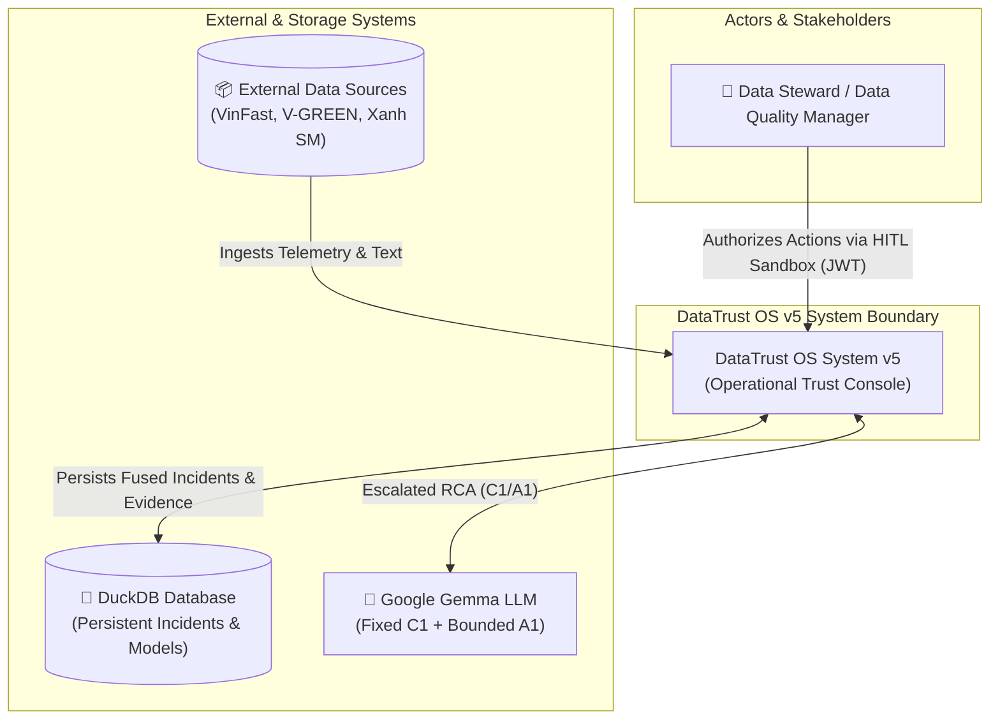
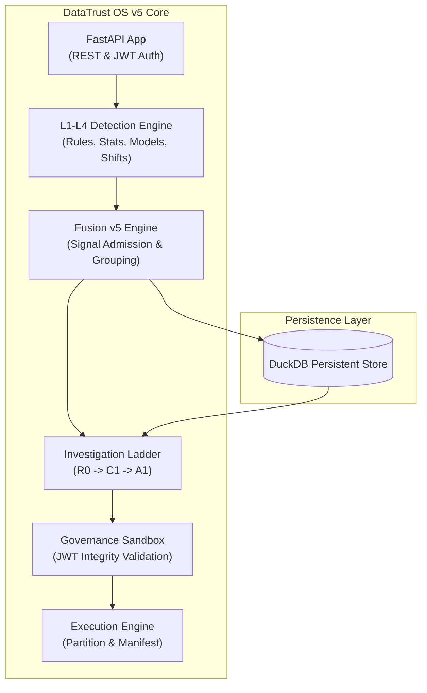

# DataTrust OS v5 — C4 System Architecture Specification

> **Document Status:** Authoritative Architectural Specification  
> **System Name:** DataTrust OS v5 (Operational Trust Console)  
> **Last Updated:** 2026-08-11  
> **Architecture Model:** C4 Model (Context, Container, Component)  

---

## 🏛️ Executive Architecture Overview

**DataTrust OS v5** shifts from the v4 agent-first chatbot interface into an enterprise-grade **Operational Trust Console**. It introduces a strict, pipelined governance boundary between **Detection (L1-L4)**, **Fusion**, **Investigation (R0/C1/A1)**, and **HITL Governance**.

The architectural philosophy adheres to 4 primary pillars:
1. **Deterministic-First:** AI is treated as an escalation path. R0 (Rules) and C1 (Fixed LLM) precede any A1 (Dynamic Agent) invocation.
2. **Zero-Leakage Detection:** L2 Contextual and L3 Relational detectors are mathematically proven to isolate history (`t < event.t`) and split reference/evaluation windows.
3. **Fail-Closed Governance Sandbox:** Governance execution requires a cryptographically signed JWT hash matching the `ctrl.version_hash`. The AI cannot bypass this sandbox.
4. **Read-Only A1 Tooling:** A1 dynamic agents operate with a strictly typed read-only tool registry, guaranteeing zero side-effects during investigation.

---

## 1. C4 Level 1: System Context Diagram

---

## 2. C4 Level 2: Container Diagram

---

## 3. C4 Level 3: Component Diagram

### 3.1 Detection & Fusion
- **L1 (Deterministic):** Constraints, SLAs, schemas.
- **L2 (Contextual):** MAD Z-scores. Zero-leakage.
- **L3 (Relational):** Isolation Forest, Linear Residuals.
- **L4 (Change-Point):** CUSUM / PELT.
- **Fusion v5:** Deduplicates `Signals` into `Incidents` via deterministic rule admission.

### 3.2 Investigation Ladder
- **R0 Resolver:** Diagnostic lookup matching.
- **C1 Fixed Analyzer:** Fixed context bundle (history, profile, changes) into a single structured LLM call. Output mapped to `LLMAnalysisResult`.
- **A1 Bounded Agent:** Iterative ReAct loop with `fetch_telemetry`, `fetch_charging_history`, etc. Can output `ABSTAIN` on low evidence.

### 3.3 Governance & Execution
- **Governance:** `PreventiveControlManager` maps actions to `PREVENTIVE_DATA_CONTROL` or `OPERATIONAL_RECOMMENDATION`.
- **Execution:** Validates JWT `auth.payload_hash == ctrl.version_hash`. Generates final SHA-256 manifest.

---
*DataTrust OS v5 — C4 Architecture Specification*
