# DataTrust OS v4 Database Schema Documentation

This document describes the complete relational database schema for **DataTrust OS v4**, backed by **DuckDB**. The schema handles data ingestion, snapshot profiling, AI-proposed quality rule generation, quarantine tracking, lineage/audit logging, agent execution tracing, automated dataset scheduling, and domain-specific dataset tables.

---

## 1. Entity Relationship Diagram (ERD)

The diagram below illustrates the logical relationships between the core architecture components, snapshot management, quality/quarantine subsystem, automation scheduling, and domain dataset tables.

```mermaid
erDiagram
    raw_snapshots {
        VARCHAR id PK
        VARCHAR source_name
        VARCHAR file_path
        VARCHAR sha256_hash
        INT row_count
        INT column_count
        TIMESTAMP ingested_at
    }

    datasets {
        VARCHAR dataset_key PK
        VARCHAR file_path
        TIMESTAMP registered_at
    }

    profile_results {
        VARCHAR id PK
        VARCHAR snapshot_id FK
        VARCHAR column_name
        VARCHAR dtype
        INT null_count
        FLOAT null_pct
        INT unique_count
        VARCHAR min_val
        VARCHAR max_val
        FLOAT mean_val
        FLOAT std_val
        TIMESTAMP profiled_at
    }

    quality_rules {
        VARCHAR id PK
        VARCHAR snapshot_id FK
        VARCHAR rule_name
        VARCHAR rule_type
        VARCHAR rule_expression
        FLOAT confidence
        VARCHAR status
        VARCHAR proposed_by
        VARCHAR approved_by
        TIMESTAMP created_at
        TIMESTAMP approved_at
    }

    quarantine {
        VARCHAR id PK
        VARCHAR snapshot_id FK
        VARCHAR source_table
        INT source_row_id
        VARCHAR rule_id FK
        VARCHAR rule_version_id
        VARCHAR reason
        JSON original_data
        TIMESTAMP quarantined_at
        VARCHAR lineage_hash
    }

    xanhsm_feedback {
        INTEGER id PK
        VARCHAR review_text
        VARCHAR normalized_text
        FLOAT rating
        VARCHAR location
        TIMESTAMP timestamp
        VARCHAR source
        JSON aspects
        VARCHAR snapshot_id FK
    }

    vgreen_telemetry {
        INTEGER id PK
        VARCHAR station_id
        VARCHAR station_name
        FLOAT temperature_celsius
        FLOAT voltage
        FLOAT current_amps
        FLOAT duty_cycle
        VARCHAR status
        VARCHAR fault_code
        TIMESTAMP timestamp
        VARCHAR snapshot_id FK
    }

    vinfast_bms {
        INTEGER id PK
        VARCHAR vehicle_id
        FLOAT battery_soc
        FLOAT battery_voltage
        FLOAT cell_temp_max
        FLOAT cell_temp_min
        VARCHAR bms_fault_code
        VARCHAR charging_station_id
        TIMESTAMP timestamp
        VARCHAR snapshot_id FK
    }

    xanhsm_trips {
        INTEGER id PK
        VARCHAR trip_id
        VARCHAR driver_id
        VARCHAR pickup_location
        VARCHAR dropoff_location
        FLOAT distance_km
        FLOAT fare_vnd
        FLOAT duration_minutes
        FLOAT rating
        TIMESTAMP timestamp
        VARCHAR snapshot_id FK
    }

    schedules {
        VARCHAR id PK
        VARCHAR dataset_key FK
        VARCHAR cron_expression
        BOOLEAN is_active
        TIMESTAMP created_at
        TIMESTAMP next_run_at
        VARCHAR name
        VARCHAR schedule_type
        INT interval_seconds
        VARCHAR action
    }

    job_runs {
        VARCHAR id PK
        VARCHAR schedule_id FK
        VARCHAR dataset_key FK
        VARCHAR status
        JSON result_summary
        TIMESTAMP started_at
        TIMESTAMP completed_at
    }

    execution_authorizations {
        VARCHAR id PK
        VARCHAR dataset_key FK
        JSON rule_ids
        VARCHAR actor
        VARCHAR payload_hash
        TIMESTAMP authorized_at
    }

    audit_log {
        VARCHAR id PK
        VARCHAR action
        VARCHAR actor
        VARCHAR target_table
        VARCHAR target_id
        JSON details
        TIMESTAMP timestamp
        VARCHAR previous_event_hash
        VARCHAR event_hash
    }

    agent_traces {
        VARCHAR id PK
        VARCHAR session_id
        VARCHAR agent_type
        INT step_index
        VARCHAR thought
        VARCHAR action
        VARCHAR tool_name
        JSON tool_input
        JSON tool_output
        VARCHAR observation
        INT tokens_used
        FLOAT cost_usd
        INT duration_ms
        TIMESTAMP timestamp
    }

    messages {
        VARCHAR id PK
        VARCHAR session_id
        VARCHAR type
        VARCHAR agent_id
        VARCHAR content
        VARCHAR metadata_json
        VARCHAR timestamp
    }

    raw_snapshots ||--o{ profile_results : "profiled in"
    raw_snapshots ||--o{ quality_rules : "governed by"
    raw_snapshots ||--o{ quarantine : "isolates errors for"
    raw_snapshots ||--o{ xanhsm_feedback : "originates"
    raw_snapshots ||--o{ vgreen_telemetry : "originates"
    raw_snapshots ||--o{ vinfast_bms : "originates"
    raw_snapshots ||--o{ xanhsm_trips : "originates"
    quality_rules ||--o{ quarantine : "triggers isolation"

    datasets ||--o{ schedules : "scheduled via"
    datasets ||--o{ job_runs : "processed by"
    datasets ||--o{ execution_authorizations : "authorized for"
    schedules ||--o{ job_runs : "spawns"
```

---

## 2. Core Ingestion & Profiling Tables

### 2.1 `raw_snapshots`
Stores ingestion metadata for incoming raw data files and datasets.

| Column | DuckDB Type | Constraints | Description |
| :--- | :--- | :--- | :--- |
| `id` | `VARCHAR` | `PRIMARY KEY` | Unique snapshot identifier (UUID/hash). |
| `source_name` | `VARCHAR` | None | Name of the source dataset or pipeline step. |
| `file_path` | `VARCHAR` | None | Storage file path (e.g. Parquet/CSV location). |
| `sha256_hash` | `VARCHAR` | None | SHA256 integrity hash of the ingested raw file. |
| `row_count` | `INT` | None | Total row count in the raw snapshot. |
| `column_count` | `INT` | None | Total column count in the raw snapshot. |
| `ingested_at` | `TIMESTAMP` | `DEFAULT CURRENT_TIMESTAMP` | Ingestion timestamp. |

### 2.2 `profile_results`
Stores automated statistical profiles generated for each column of a snapshot.

| Column | DuckDB Type | Constraints | Description |
| :--- | :--- | :--- | :--- |
| `id` | `VARCHAR` | `PRIMARY KEY` | Profile result record identifier. |
| `snapshot_id` | `VARCHAR` | `FK -> raw_snapshots.id` | Target snapshot identifier. |
| `column_name` | `VARCHAR` | None | Profiled column name. |
| `dtype` | `VARCHAR` | None | Detected data type of the column. |
| `null_count` | `INT` | None | Count of null/missing values. |
| `null_pct` | `FLOAT` | None | Percentage of null values (0.0 - 100.0). |
| `unique_count` | `INT` | None | Count of distinct unique values. |
| `min_val` | `VARCHAR` | None | Minimum observed value formatted as string. |
| `max_val` | `VARCHAR` | None | Maximum observed value formatted as string. |
| `mean_val` | `FLOAT` | None | Numeric mean value (NULL for non-numeric columns). |
| `std_val` | `FLOAT` | None | Standard deviation (NULL for non-numeric columns). |
| `profiled_at` | `TIMESTAMP` | `DEFAULT CURRENT_TIMESTAMP` | Profiling completion timestamp. |

---

## 3. Governance, Rules & Isolation Tables

### 3.1 `quality_rules`
Defines quality rules proposed by AI agents or human operators and their approval status.

| Column | DuckDB Type | Constraints | Description |
| :--- | :--- | :--- | :--- |
| `id` | `VARCHAR` | `PRIMARY KEY` | Rule identifier. |
| `snapshot_id` | `VARCHAR` | `FK -> raw_snapshots.id` | Snapshot on which rule was inferred/proposed. |
| `rule_name` | `VARCHAR` | None | Human-readable name of the quality rule. |
| `rule_type` | `VARCHAR` | None | Rule category (e.g., `null_check`, `range_check`, `regex_check`). |
| `rule_expression` | `VARCHAR` | None | SQL or logical expression evaluated against rows. |
| `confidence` | `FLOAT` | None | Agent confidence score (0.0 to 1.0). |
| `status` | `VARCHAR` | `DEFAULT 'proposed'` | Lifecycle status (`proposed`, `approved`, `rejected`). |
| `proposed_by` | `VARCHAR` | None | Agent ID or user identity proposing the rule. |
| `approved_by` | `VARCHAR` | None | Human supervisor or system identity approving the rule. |
| `created_at` | `TIMESTAMP` | `DEFAULT CURRENT_TIMESTAMP` | Rule creation timestamp. |
| `approved_at` | `TIMESTAMP` | None | Rule approval timestamp. |

### 3.2 `quarantine`
Holds quarantined bad rows failing quality constraints to prevent downstream corruption.

| Column | DuckDB Type | Constraints | Description |
| :--- | :--- | :--- | :--- |
| `id` | `VARCHAR` | `PRIMARY KEY` | Quarantine record ID. |
| `snapshot_id` | `VARCHAR` | `FK -> raw_snapshots.id` | Source snapshot ID. |
| `source_table` | `VARCHAR` | None | Target source table name where violation occurred. |
| `source_row_id` | `INT` | None | Row index/ID from the source file or table. |
| `rule_id` | `VARCHAR` | `FK -> quality_rules.id` | Violating quality rule ID. |
| `rule_version_id` | `VARCHAR` | None | Version hash or ID of the applied quality rule. |
| `reason` | `VARCHAR` | None | Failure explanation or expression violation details. |
| `original_data` | `JSON` | None | Full raw row contents preserved as JSON. |
| `quarantined_at` | `TIMESTAMP` | `DEFAULT CURRENT_TIMESTAMP` | Quarantine insertion timestamp. |
| `lineage_hash` | `VARCHAR` | None | Cryptographic lineage trace hash. |

**Uniqueness & Idempotency Constraint:**
- `UNIQUE (snapshot_id, rule_version_id, source_row_id)`
- Unique Index: `idx_quarantine_idempotency` ON `quarantine (snapshot_id, rule_version_id, source_row_id)`

---

## 4. Datasets, Scheduling & Execution Engine Tables

### 4.1 `datasets`
Registry of datasets managed by DataTrust OS.

| Column | DuckDB Type | Constraints | Description |
| :--- | :--- | :--- | :--- |
| `dataset_key` | `VARCHAR` | `PRIMARY KEY` | Unique dataset key identifier. |
| `file_path` | `VARCHAR` | None | Path to the underlying dataset file. |
| `registered_at` | `TIMESTAMP` | `DEFAULT CURRENT_TIMESTAMP` | Registration timestamp. |

### 4.2 `schedules`
Cron and interval schedule configurations for dataset profiling and pipeline processing.

| Column | DuckDB Type | Constraints | Description |
| :--- | :--- | :--- | :--- |
| `id` | `VARCHAR` | `PRIMARY KEY` | Schedule entry ID. |
| `dataset_key` | `VARCHAR` | `FK -> datasets.dataset_key` | Associated dataset key. |
| `cron_expression` | `VARCHAR` | None | Standard 5-part cron expression string. |
| `is_active` | `BOOLEAN` | `DEFAULT TRUE` | Active/Inactive flag. |
| `created_at` | `TIMESTAMP` | `DEFAULT CURRENT_TIMESTAMP` | Creation timestamp. |
| `next_run_at` | `TIMESTAMP` | None | Scheduled time for the next execution. |
| `name` | `VARCHAR` | None | Friendly schedule name. |
| `schedule_type` | `VARCHAR` | None | Type (`cron` or `interval`). |
| `interval_seconds` | `INT` | None | Second interval if `schedule_type` is interval. |
| `action` | `VARCHAR` | None | Action payload / task identifier to run. |

### 4.3 `job_runs`
Execution history for scheduled data governance and profiling jobs.

| Column | DuckDB Type | Constraints | Description |
| :--- | :--- | :--- | :--- |
| `id` | `VARCHAR` | `PRIMARY KEY` | Job run ID. |
| `schedule_id` | `VARCHAR` | `FK -> schedules.id` | Triggering schedule ID. |
| `dataset_key` | `VARCHAR` | `FK -> datasets.dataset_key` | Dataset targeted by the run. |
| `status` | `VARCHAR` | None | Status (`running`, `success`, `failed`). |
| `result_summary` | `JSON` | None | Detailed execution results stored as JSON. |
| `started_at` | `TIMESTAMP` | `DEFAULT CURRENT_TIMESTAMP` | Run start timestamp. |
| `completed_at` | `TIMESTAMP` | None | Run completion timestamp. |

### 4.4 `execution_authorizations`
Security and authorization records granting approval to execute rule enforcement pipelines.

| Column | DuckDB Type | Constraints | Description |
| :--- | :--- | :--- | :--- |
| `id` | `VARCHAR` | `PRIMARY KEY` | Authorization ID. |
| `dataset_key` | `VARCHAR` | `FK -> datasets.dataset_key` | Target dataset key. |
| `rule_ids` | `JSON` | None | List of authorized rule IDs stored as JSON array. |
| `actor` | `VARCHAR` | None | Identity authorizing the execution. |
| `payload_hash` | `VARCHAR` | None | Hash of the authorized payload for verification. |
| `authorized_at` | `TIMESTAMP` | `DEFAULT CURRENT_TIMESTAMP` | Timestamp of authorization. |

---

## 5. Auditability, Messaging & Agent Traceability Tables

### 5.1 `audit_log`
Immutable, tamper-evident hash-chained audit trail of all governance operations.

| Column | DuckDB Type | Constraints | Description |
| :--- | :--- | :--- | :--- |
| `id` | `VARCHAR` | `PRIMARY KEY` | Audit record ID. |
| `action` | `VARCHAR` | None | System or user action executed. |
| `actor` | `VARCHAR` | None | User or agent identity initiating the action. |
| `target_table` | `VARCHAR` | None | Table modified or targeted. |
| `target_id` | `VARCHAR` | None | Primary key ID of the target resource. |
| `details` | `JSON` | None | Change metadata and context JSON. |
| `timestamp` | `TIMESTAMP` | `DEFAULT CURRENT_TIMESTAMP` | Action timestamp. |
| `previous_event_hash` | `VARCHAR` | None | Cryptographic hash of the prior audit record. |
| `event_hash` | `VARCHAR` | None | Cryptographic hash of the current event. |

### 5.2 `agent_traces`
Detailed execution step traces for autonomous agent reasoning loops.

| Column | DuckDB Type | Constraints | Description |
| :--- | :--- | :--- | :--- |
| `id` | `VARCHAR` | `PRIMARY KEY` | Trace step ID. |
| `session_id` | `VARCHAR` | None | Agent execution session identifier. |
| `agent_type` | `VARCHAR` | None | Class/type of agent (e.g. `ProfilerAgent`, `RulePlanner`). |
| `step_index` | `INT` | None | Ordinal step number within the session. |
| `thought` | `VARCHAR` | None | Agent internal reasoning / thought text. |
| `action` | `VARCHAR` | None | High-level action name. |
| `tool_name` | `VARCHAR` | None | Tool invoked by the agent step. |
| `tool_input` | `JSON` | None | Parameters passed to the tool as JSON. |
| `tool_output` | `JSON` | None | Return output from the tool as JSON. |
| `observation` | `VARCHAR` | None | Agent observation following tool execution. |
| `tokens_used` | `INT` | None | LLM tokens consumed in this step. |
| `cost_usd` | `FLOAT` | None | Estimated USD cost of the LLM call. |
| `duration_ms` | `INT` | None | Step execution wall-clock time in milliseconds. |
| `timestamp` | `TIMESTAMP` | `DEFAULT CURRENT_TIMESTAMP` | Step recording timestamp. |

### 5.3 `messages`
Session messaging store for agent communication and interactive chat histories.

| Column | DuckDB Type | Constraints | Description |
| :--- | :--- | :--- | :--- |
| `id` | `VARCHAR` | `PRIMARY KEY` | Message ID. |
| `session_id` | `VARCHAR` | `NOT NULL` | Agent session identifier. |
| `type` | `VARCHAR` | `NOT NULL` | Message type (e.g., `user`, `assistant`, `system`). |
| `agent_id` | `VARCHAR` | None | Sender agent ID if applicable. |
| `content` | `VARCHAR` | `NOT NULL` | Message body content text. |
| `metadata_json` | `VARCHAR` | None | Optional JSON string containing message metadata. |
| `timestamp` | `VARCHAR` | `NOT NULL` | ISO timestamp string. |

**Performance Index:**
- `CREATE INDEX IF NOT EXISTS idx_messages_session ON messages(session_id, timestamp);`

---

## 6. Domain-Specific Data Tables

### 6.1 `xanhsm_feedback`
Customer review and sentiment dataset from Xanh SM electric taxi services.

| Column | DuckDB Type | Constraints | Description |
| :--- | :--- | :--- | :--- |
| `id` | `INTEGER` | `PRIMARY KEY` | Feedback record ID. |
| `review_text` | `VARCHAR` | None | Raw text review content. |
| `normalized_text` | `VARCHAR` | None | Cleaned / normalized text for NLP analysis. |
| `rating` | `FLOAT` | None | Numerical rating (1.0 to 5.0). |
| `location` | `VARCHAR` | None | Geographic location or city. |
| `timestamp` | `TIMESTAMP` | None | Timestamp of review creation. |
| `source` | `VARCHAR` | None | Source platform/channel. |
| `aspects` | `JSON` | None | Extracted sentiment aspects stored as JSON. |
| `snapshot_id` | `VARCHAR` | `FK -> raw_snapshots.id` | Source snapshot ID. |

### 6.2 `vgreen_telemetry`
Charging station telemetry data for VGreen EV charging infrastructure.

| Column | DuckDB Type | Constraints | Description |
| :--- | :--- | :--- | :--- |
| `id` | `INTEGER` | `PRIMARY KEY` | Telemetry record ID. |
| `station_id` | `VARCHAR` | None | Unique station identifier. |
| `station_name` | `VARCHAR` | None | Name of the charging station. |
| `temperature_celsius` | `FLOAT` | None | Operating temperature reading (°C). |
| `voltage` | `FLOAT` | None | Electrical voltage reading (V). |
| `current_amps` | `FLOAT` | None | Electrical current reading (A). |
| `duty_cycle` | `FLOAT` | None | Operating duty cycle ratio. |
| `status` | `VARCHAR` | None | Station status (`online`, `offline`, `fault`). |
| `fault_code` | `VARCHAR` | None | Reported fault error code if present. |
| `timestamp` | `TIMESTAMP` | None | Telemetry timestamp. |
| `snapshot_id` | `VARCHAR` | `FK -> raw_snapshots.id` | Source snapshot ID. |

### 6.3 `vinfast_bms`
Battery Management System (BMS) telemetry from VinFast electric vehicles.

| Column | DuckDB Type | Constraints | Description |
| :--- | :--- | :--- | :--- |
| `id` | `INTEGER` | `PRIMARY KEY` | BMS telemetry record ID. |
| `vehicle_id` | `VARCHAR` | None | Vehicle Identification Number (VIN). |
| `battery_soc` | `FLOAT` | None | State of Charge percentage (0.0 - 100.0%). |
| `battery_voltage` | `FLOAT` | None | Pack voltage reading (V). |
| `cell_temp_max` | `FLOAT` | None | Maximum cell temperature (°C). |
| `cell_temp_min` | `FLOAT` | None | Minimum cell temperature (°C). |
| `bms_fault_code` | `VARCHAR` | None | Active BMS diagnostic trouble code. |
| `charging_station_id` | `VARCHAR` | None | Active charging station connection ID. |
| `timestamp` | `TIMESTAMP` | None | Telemetry recording timestamp. |
| `snapshot_id` | `VARCHAR` | `FK -> raw_snapshots.id` | Source snapshot ID. |

### 6.4 `xanhsm_trips`
Ride-hailing trip records for Xanh SM taxi operations.

| Column | DuckDB Type | Constraints | Description |
| :--- | :--- | :--- | :--- |
| `id` | `INTEGER` | `PRIMARY KEY` | Trip record ID. |
| `trip_id` | `VARCHAR` | None | Unique trip identifier. |
| `driver_id` | `VARCHAR` | None | Assigned driver identifier. |
| `pickup_location` | `VARCHAR` | None | Pickup coordinates or address. |
| `dropoff_location` | `VARCHAR` | None | Dropoff coordinates or address. |
| `distance_km` | `FLOAT` | None | Total trip distance in kilometers. |
| `fare_vnd` | `FLOAT` | None | Calculated fare amount in VND. |
| `duration_minutes` | `FLOAT` | None | Trip duration in minutes. |
| `rating` | `FLOAT` | None | Trip rating score given by passenger. |
| `timestamp` | `TIMESTAMP` | None | Trip completion timestamp. |
| `snapshot_id` | `VARCHAR` | `FK -> raw_snapshots.id` | Source snapshot ID. |

---

## 7. Indices & Idempotency Constraints Summary

1. **`idx_quarantine_idempotency`**:
   - SQL: `CREATE UNIQUE INDEX IF NOT EXISTS idx_quarantine_idempotency ON quarantine (snapshot_id, rule_version_id, source_row_id);`
   - Purpose: Guarantees idempotency when isolating invalid data rows, preventing duplicate quarantine records across re-runs.

2. **`idx_messages_session`**:
   - SQL: `CREATE INDEX IF NOT EXISTS idx_messages_session ON messages(session_id, timestamp);`
   - Purpose: Accelerates message retrieval by session ordering for fast chat history fetching.
