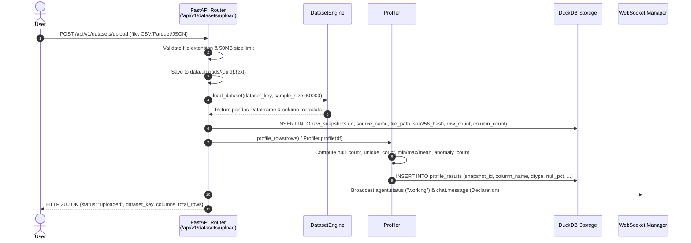
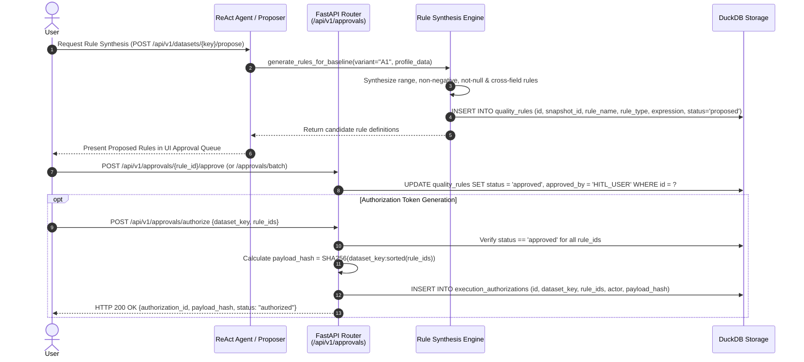
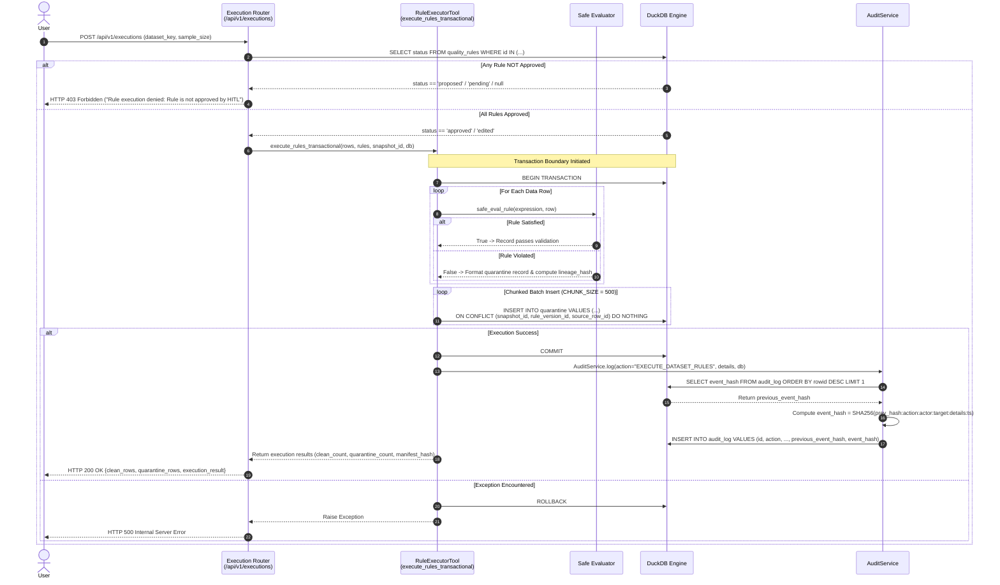

# DataTrust OS v4 — Data Pipeline & Execution Flow Architecture

This document details the end-to-end data pipeline, sequence flows, transaction isolation mechanics, idempotency controls, and cryptographic audit hashing in **DataTrust OS v4**.

---

## 1. Overview & Architecture Summary

DataTrust OS v4 operates an AI-augmented data trust and governance pipeline designed around zero-trust execution boundaries, Human-in-the-Loop (HITL) gatekeeping, and immutable cryptographic lineage.

The pipeline comprises three core phases:
1. **Dataset Upload & Profiling**: Ingesting raw datasets, computing statistical profiles, and storing baseline metadata.
2. **Rule Proposal & HITL Approval**: Autonomous AI rule synthesis followed by mandatory human authorization.
3. **Transactional Execution & Quarantine**: Batch transactional enforcement, chunked quarantine insertion with idempotency, and SHA-256 hash-chained audit logging.

```
┌──────────────────────────┐      ┌──────────────────────────┐      ┌──────────────────────────┐
│   Sequence 1: Ingest     │ ───► │  Sequence 2: Synthesis   │ ───► │   Sequence 3: Execution  │
│  Upload & Profiling      │      │  Proposal & HITL Gate    │      │  Quarantine & Audit Log  │
└──────────────────────────┘      └──────────────────────────┘      └──────────────────────────┘
```

---

## 2. Sequence 1: Dataset Upload & Profiling

The Dataset Upload and Profiling flow accepts user dataset files (`.csv`, `.parquet`, `.json`), validates payloads, derives schema characteristics, generates column-level statistical metrics, and persists baseline records in DuckDB (`raw_snapshots` and `profile_results`).



### Detailed Flow Explanation

1. **Ingestion & Validation**:
   - `POST /api/v1/datasets/upload` receives the binary stream.
   - The endpoint checks file extensions (`.csv`, `.parquet`, `.json`) and enforces a 50 MB file size limit (`MAX_FILE_SIZE`).
   - Upon validation, the raw payload is written to `data/uploads/<uuid>.<ext>` and registered under a unique `dataset_key` (`uploaded_<clean_name>`).
2. **Snapshot Persistence**:
   - Baseline metadata (source file path, payload SHA-256 checksum, total row count, column count) is saved into the DuckDB `raw_snapshots` table.
3. **Statistical Profiling**:
   - `DatasetEngine.profile_rows` inspects column types (`DATETIME`, `INTEGER`, `FLOAT`, `STRING`).
   - Computes null ratios, cardinality (distinct/unique counts), range boundaries (min/max), mean/std-dev, and negative/zero anomaly indicators.
   - Metrics are written into DuckDB `profile_results`.
4. **Real-time Event Broadcasting**:
   - The system triggers WebSocket notifications (`ws_manager.broadcast`) delivering execution declarations to UI subscribers.

---

## 3. Sequence 2: Rule Proposal & HITL Approval

Data quality rules are proposed autonomously by the ReAct Orchestrator Agent (or synthesized via profile analysis) and staged into DuckDB (`quality_rules`) in a `proposed` or `pending` status. Execution is strictly blocked until explicit Human-in-the-Loop (HITL) approval.



### Detailed Flow Explanation

1. **Rule Synthesis**:
   - `generate_rules_for_baseline` accepts profile telemetry and baseline mode configuration (`C0`: Null checks, `C1`: Null + Range, `A1`: Full cross-field & semantic checks).
   - Generated rules include expression conditions (e.g., `battery_soc >= 0`, `dropoff_datetime >= pickup_datetime`, `latitude BETWEEN -90 AND 90`).
2. **Staging in DuckDB**:
   - Candidate rules are inserted into `quality_rules` with default `status = 'proposed'` or `'pending'`.
3. **HITL Review & Decision**:
   - Approvers review rules via `GET /api/v1/approvals`.
   - Approving via `POST /api/v1/approvals/{rule_id}/approve` or `POST /api/v1/approvals/batch` transitions `status` to `'approved'`. Rejecting updates `status` to `'rejected'`.
4. **Execution Authorization Gate**:
   - Before runtime, `POST /api/v1/approvals/authorize` validates that every target rule carries `'approved'` status.
   - An immutable token is stored in `execution_authorizations` containing the cryptographic hash of `(dataset_key + sorted(rule_ids))`.

---

## 4. Sequence 3: Transactional Rule Execution & Quarantine

When rule execution is invoked (`POST /api/v1/executions` or `execute_rules_transactional`), the system enforces HITL verification, initiates an explicit database transaction, evaluates data rows, inserts failing rows into `quarantine` in 500-row chunks with conflict resolution, appends a SHA-256 hash-chained audit record, and commits the transaction.



### Detailed Flow Explanation

1. **HITL Authorization Verification**:
   - The execution handler queries `quality_rules` for all requested rule IDs.
   - If any rule is missing or has a status other than `'approved'` or `'edited'`, execution is immediately aborted with HTTP 403 (`Rule execution denied: Rule is not approved by HITL`).
2. **Transaction Initialization**:
   - `execute_rules_transactional` issues `BEGIN TRANSACTION` to DuckDB, ensuring atomic processing.
3. **Row Evaluation & Partitioning**:
   - Every input record is tested against compiled rule expressions via AST/safe python parsing (`safe_eval_rule`).
   - Clean records are processed and return success.
   - Records triggering violations generate structured quarantine tuples containing `q_id`, `snapshot_id`, `source_table`, `source_row_id`, `rule_id`, `reason`, `original_data` JSON, and `lineage_hash` (`SHA256(snapshot_id:rule_version_id:source_row_id)`).
4. **Chunked 500-Row Batch Insertion**:
   - Quarantine records are sliced into chunks of 500 (`CHUNK_SIZE = 500`).
   - Chunks are executed via `conn.executemany(...)` using parameterized SQL:
     ```sql
     INSERT INTO quarantine (
         id, snapshot_id, source_table, source_row_id, rule_id, rule_version_id, reason, original_data, lineage_hash
     ) VALUES (?, ?, ?, ?, ?, ?, ?, ?, ?)
     ON CONFLICT (snapshot_id, rule_version_id, source_row_id) DO NOTHING
     ```
5. **Commit & Cryptographic Audit Logging**:
   - Upon successful chunk insertion, `conn.execute("COMMIT")` commits data changes.
   - `AuditService.log` fetches the previous `event_hash` from `audit_log`, calculates the chained SHA-256 event signature, and persists the audit record.
   - If an error occurs prior to commit, `ROLLBACK` is executed to keep database state consistent.

---

## 5. Core Architecture Principles

### 5.1. Transaction Isolation & Atomicity
DataTrust OS enforces strict ACID properties during rule execution:
- **Explicit Boundaries**: Rules execute inside explicit `BEGIN TRANSACTION` ... `COMMIT` / `ROLLBACK` blocks in `dataset_engine.py`.
- **Single-Writer Safety**: DuckDB transaction management guarantees that clean dataset outputs and quarantine records are either fully written or entirely discarded if a system fault occurs.

### 5.2. Idempotency & Conflict Resolution
Re-executing a quality pipeline against the same snapshot must never produce duplicate quarantine records:
- **Composite Unique Constraint**: DuckDB table `quarantine` enforces:
  ```sql
  UNIQUE (snapshot_id, rule_version_id, source_row_id)
  ```
  backed by explicit index `idx_quarantine_idempotency`.
- **Conflict Strategy**: Batch insertions use `ON CONFLICT (snapshot_id, rule_version_id, source_row_id) DO NOTHING`. Re-running execution on previously processed datasets cleanly skips existing records without raising constraint violation errors.

### 5.3. Cryptographic SHA-256 Audit Trail Chaining
All high-privilege governance actions (`EXECUTE_DATASET_RULES`, `APPROVE_RULE`, `UPLOAD_DATASET`) are appended to an immutable audit ledger:

```
┌──────────────────────────────────────┐     ┌──────────────────────────────────────┐
│ Audit Record N - 1                   │     │ Audit Record N                       │
├──────────────────────────────────────┤     ├──────────────────────────────────────┤
│ event_hash: "a3f8b1..."              │ ──► │ previous_event_hash: "a3f8b1..."     │
└──────────────────────────────────────┘     │ event_hash: SHA256(prev + payload)   │
                                             └──────────────────────────────────────┘
```

#### Hash Calculation Formula
```python
canonical_details = json.dumps(details, sort_keys=True)
payload = f"{previous_event_hash}:{action}:{actor}:{target_table}:{target_id}:{canonical_details}:{timestamp}"
event_hash = hashlib.sha256(payload.encode("utf-8")).hexdigest()
```

#### Genesis Block & Integrity Audit
- If no prior audit entries exist, `previous_event_hash` defaults to `0` * 64 (`"0000000000000000000000000000000000000000000000000000000000000000"`).
- `AuditService.verify_chain_integrity()` iterates sequentially over `audit_log` rows, verifying that `previous_event_hash` matches the preceding row's `event_hash` and recalculating each record signature to detect tampering.

---

## 6. Data Schema Mapping Reference

### `raw_snapshots`
| Column | Type | Description |
|---|---|---|
| `id` | VARCHAR PRIMARY KEY | Unique snapshot identifier (`snap_xxx`) |
| `source_name` | VARCHAR | Dataset identifier or original filename |
| `file_path` | VARCHAR | Storage path relative to workspace |
| `sha256_hash` | VARCHAR | Payload SHA-256 checksum |
| `row_count` | INT | Total rows ingested |
| `column_count` | INT | Total columns present |
| `ingested_at` | TIMESTAMP | UTC ingestion timestamp |

### `profile_results`
| Column | Type | Description |
|---|---|---|
| `id` | VARCHAR PRIMARY KEY | Profile entry UUID |
| `snapshot_id` | VARCHAR | Foreign reference to `raw_snapshots.id` |
| `column_name` | VARCHAR | Targeted column name |
| `dtype` | VARCHAR | Inferred type (`INTEGER`, `FLOAT`, `STRING`, `DATETIME`) |
| `null_count` / `null_pct` | INT / FLOAT | Null metric counts and ratios |
| `unique_count` | INT | Distinct value count |
| `min_val` / `max_val` / `mean_val` | VARCHAR / FLOAT | Column range summary metrics |

### `quality_rules`
| Column | Type | Description |
|---|---|---|
| `id` | VARCHAR PRIMARY KEY | Rule identifier (`R001`, `R1_A1`) |
| `snapshot_id` | VARCHAR | Foreign reference to `raw_snapshots.id` |
| `rule_name` | VARCHAR | Human-readable check title |
| `rule_type` | VARCHAR | Rule category (`range`, `not_null`, `cross_field`, `semantic`) |
| `rule_expression` | VARCHAR | Executable expression string |
| `confidence` | FLOAT | Proposer confidence score (0.0 - 1.0) |
| `status` | VARCHAR | State (`proposed`, `pending`, `approved`, `rejected`, `edited`) |
| `approved_by` | VARCHAR | Actor ID of HITL reviewer |

### `quarantine`
| Column | Type | Description |
|---|---|---|
| `id` | VARCHAR PRIMARY KEY | Quarantine entry ID |
| `snapshot_id` | VARCHAR | Snapshot reference |
| `source_table` | VARCHAR | Target database table name |
| `source_row_id` | INT | Original row index |
| `rule_id` | VARCHAR | Triggering rule ID |
| `rule_version_id` | VARCHAR | Version string (`v1`) |
| `reason` | VARCHAR | Detailed violation rationale |
| `original_data` | JSON | Raw record snapshot payload |
| `lineage_hash` | VARCHAR | Lineage cryptographic SHA-256 prefix |

### `audit_log`
| Column | Type | Description |
|---|---|---|
| `id` | VARCHAR PRIMARY KEY | Audit event UUID |
| `action` | VARCHAR | Governance operation (`EXECUTE_DATASET_RULES`, etc.) |
| `actor` | VARCHAR | Triggering user or agent (`agent`, `HITL_USER`) |
| `target_table` / `target_id` | VARCHAR | Resource affected |
| `details` | JSON | Canonical JSON string payload |
| `timestamp` | TIMESTAMP | ISO event timestamp |
| `previous_event_hash` | VARCHAR | Parent record SHA-256 hash |
| `event_hash` | VARCHAR | Current record SHA-256 signature |
