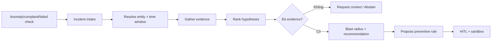

# TÀI LIỆU YÊU CẦU SẢN PHẨM (PRD)

## DataTrust OS — Enterprise Data Reliability Control Plane

| Trường | Giá trị |
|---|---|
| Mã đề bài | DATA-02 — AI Agent xây dựng, kiểm tra Data Quality và phát hiện bất thường |
| Phiên bản PRD | **v4.2 — Source-aligned** |
| Ngày cập nhật | **05/08/2026** |
| Nguồn cập nhật | Repository snapshot `P-086-4(3).zip` |
| Trạng thái | Working product contract — cần mentor xác nhận các quyết định mở |
| Feature lock dự kiến | 23:59, 26/08/2026 |
| Nhóm | Thanh — Product/Evaluation; Ngân — Schema/AI; Dũng — Data Plane/Tools; Huyền — UX/Integration |

> **Lưu ý phiên bản:** API trong mã nguồn khai báo `4.2.0`, `PLAN.md` vẫn ghi v4.0 và `ARCHITECTURE.md` còn mô tả v3.0. PRD này là tài liệu sản phẩm chuẩn hóa mới; nó không mặc định rằng mọi yêu cầu bên dưới đã được triển khai hoàn chỉnh.

---

# 1. TÓM TẮT ĐIỀU HÀNH

## 1.1 Sản phẩm là gì?

**DataTrust OS** là một **Enterprise Data Reliability Control Plane** giúp đội dữ liệu chuyển từ:

```text
Nguồn dữ liệu mới / sự cố dữ liệu
→ quan sát và kiểm tra
→ phát hiện bất thường
→ giải thích bằng chứng
→ đề xuất biện pháp kiểm soát
→ con người phê duyệt
→ thực thi tất định
→ CleanDB / Quarantine / Audit
```

Hệ thống không mặc định rằng mọi bài toán cần AI Agent. Nó sử dụng **mức tự chủ thấp nhất nhưng đủ hiệu quả**:

```text
R0 — deterministic rules/tools
  ↓ chỉ nâng cấp khi không đủ
C1 — LLM trong workflow cố định
  ↓ chỉ nâng cấp khi observation phải thay đổi tool/đường đi
A1 — một bounded agent tự chọn tool và điểm dừng
  ↓ chỉ nâng cấp khi error analysis chứng minh cần phản biện độc lập
A2 — multi-agent planner/verifier
```

## 1.2 Điều gì thay đổi so với PRD v3?

| PRD v3 | PRD v4.2 |
|---|---|
| “AI Agent tự động kiểm tra và làm sạch dữ liệu” | “Control plane phát hiện, giải thích, phê duyệt và phòng ngừa sự cố dữ liệu” |
| Rule generation là trọng tâm | Rule generation là nền tảng; anomaly và incident RCA là workflow giá trị cao |
| A1 phải thắng C1 | R0/C1/A1/A2 cạnh tranh trung lập; A1 có thể bị loại |
| Chat-first | Workflow-first; chat chỉ là trợ lý theo ngữ cảnh |
| Approve trong UI có thể là trạng thái cục bộ | Approval phải là transaction ở backend và gắn với execution authorization |
| Dữ liệu proxy được trình bày như hệ sinh thái thật | Dữ liệu public/semi-synthetic phải ghi provenance trung thực; RCA cần shared incident IDs hoặc causal digital twin |
| Multi-agent là kiến trúc mặc định | Một orchestrator là mặc định; multi-agent chỉ dùng khi benchmark chứng minh giá trị |

## 1.3 Luận điểm sản phẩm

> **AI không được quyền sửa dữ liệu. AI chỉ được quyền đề xuất, điều tra và trình bày bằng chứng. Con người phê duyệt; deterministic compiler/executor mới được thực thi.**

---

# 2. VẤN ĐỀ CẦN GIẢI QUYẾT

## 2.1 Pain point doanh nghiệp

Khi onboarding một nguồn dữ liệu mới hoặc khi một data incident xảy ra, đội dữ liệu thường phải:

1. kiểm tra schema, null, duplicate, range và định dạng;
2. hiểu ý nghĩa nghiệp vụ của các cột;
3. viết và sửa rule thủ công;
4. nối nhiều nguồn dữ liệu để tìm nguyên nhân;
5. trao đổi giữa Data Engineer, Analyst, Steward và Business Owner;
6. ghi lại quyết định, lineage và tác động;
7. chạy lại pipeline và xác minh không làm mất dữ liệu.

Các công cụ deterministic giải quyết tốt rule đã biết, nhưng yếu ở:

- ngôn ngữ tự nhiên và tiếng Việt không chuẩn;
- rule ngữ nghĩa/cross-field;
- tìm kiếm thông tin từ nhiều nguồn không biết trước;
- điều tra có nhiều giả thuyết cạnh tranh;
- quyết định tiếp tục, đổi tool hay abstain dựa trên observation.

LLM đơn lẻ xử lý ngữ nghĩa tốt hơn nhưng có rủi ro:

- hallucination;
- sinh rule không compile được;
- kết luận không có bằng chứng;
- tự tin quá mức khi context thiếu;
- thiếu audit và quyền phê duyệt.

## 2.2 Problem statement chuẩn hóa

> **Làm thế nào DataTrust OS có thể giúp một đội dữ liệu phát hiện, điều tra và phòng ngừa lỗi dữ liệu trên các nguồn có cấu trúc và phản hồi tiếng Việt, trong khi vẫn duy trì execution tất định, approval có quản trị, provenance đầy đủ và khả năng chứng minh khi nào AI Agent thực sự cần thiết?**

## 2.3 Các giả thuyết cần kiểm chứng

- **H1 — Rule productivity:** C1 hoặc A1 giảm active human minutes để tạo một data contract được chấp nhận so với R0/manual.
- **H2 — Semantic coverage:** A1 tăng recall của rule ngữ nghĩa/cross-source so với C1.
- **H3 — Incident efficiency:** A1 giảm thời gian điều tra các case có đường tool động so với fixed workflow.
- **H4 — Safety:** HITL + execution authorization + deterministic compiler ngăn mọi unauthorized mutation.
- **H5 — Complexity tax:** Nếu A1 không tạo lợi ích định lượng đáng kể, C1 là sản phẩm được phát hành.

---

# 3. ĐỊNH VỊ VÀ GIÁ TRỊ SẢN PHẨM

## 3.1 Định vị

> **DataTrust OS là lớp điều khiển độ tin cậy dữ liệu dành cho đội dữ liệu cần triển khai AI nhưng không thể giao quyền thay đổi dữ liệu trực tiếp cho AI.**

## 3.2 Giá trị cốt lõi

1. **Faster onboarding:** biến profile và business context thành rule proposal có thể review.
2. **Earlier detection:** phát hiện anomaly và data-contract violation trước khi business user báo lỗi.
3. **Evidence-grounded diagnosis:** hiển thị evidence, uncertainty và contradictory evidence thay vì chỉ sinh kết luận.
4. **Governed action:** mọi thay đổi cần approval và authorization có hash.
5. **Reproducibility:** raw snapshot, rule version, plan, output và audit có thể tái tạo.
6. **Conditional autonomy:** không trả complexity tax của agent nếu deterministic/fixed workflow đã đủ.

## 3.3 North-star metric

> **Human active minutes per accepted and safely executed control**

Một “control” có thể là data-quality rule, quarantine policy, schedule, alert hoặc preventive rule sau incident.

---

# 4. NGƯỜI DÙNG VÀ JOBS TO BE DONE

## 4.1 Data Steward — Primary user

**Mục tiêu:** bảo đảm rule phù hợp nghiệp vụ và mọi thay đổi có trách nhiệm.

**JTBD:**

- Khi AI đề xuất rule, tôi cần thấy evidence và tác động để approve/edit/reject nhanh.
- Khi có anomaly, tôi cần hiểu dữ liệu/asset nào bị ảnh hưởng và điều gì chưa chắc chắn.
- Khi thực thi, tôi cần biết đúng rule version nào đã được chạy.

## 4.2 Data Engineer / Analytics Engineer

**Mục tiêu:** giảm thời gian viết rule, debug và duy trì pipeline.

**JTBD:**

- Profile một source mà không viết notebook thủ công.
- Compile approved RuleSpec thành plan deterministic.
- Xem quarantine, failure codes, manifest và lineage.
- Tái chạy cùng snapshot + plan và nhận cùng output.

## 4.3 Reliability / Platform Operator

**Mục tiêu:** phát hiện và xử lý incident trước khi ảnh hưởng người dùng nghiệp vụ.

**JTBD:**

- Theo dõi scheduled checks và alert.
- Mở Incident Workspace từ anomaly.
- Xem ranked hypotheses, evidence, blast radius và next action.

## 4.4 Auditor / Risk / Compliance

**Mục tiêu:** xác minh ai đã quyết định gì và hệ thống đã làm gì.

**JTBD:**

- Xem append-only audit chain.
- Truy xuất approval, authorization, plan, checksum và output.
- Xác minh không có raw mutation hoặc execution ngoài whitelist.

## 4.5 Admin

**Mục tiêu:** quản trị người dùng, scope và cấu hình hệ thống.

**Giới hạn:** Admin không được tự động trở thành business approver chỉ vì có quyền hệ thống.

## 4.6 Viewer / Business Owner

**Mục tiêu:** xem health, incident impact và outcome mà không thay đổi dữ liệu.

---

# 5. NGUYÊN TẮC SẢN PHẨM VÀ AI

## P1 — Probabilistic proposal, deterministic execution

LLM/agent được phép tạo hypothesis, mapping, RuleSpec và recommendation. Chỉ compiler/executor whitelist được thay đổi output data.

## P2 — Minimum sufficient autonomy

R0 → C1 → A1 → A2 là thang leo có điều kiện, không phải roadmap bắt buộc.

## P3 — Human approval at risky boundaries

Drop, impute, quarantine policy, activation và execution phải có approval server-side.

## P4 — Immutable raw input

Raw snapshot có SHA-256 và không bị cập nhật in-place.

## P5 — Evidence before confidence

Mọi root-cause hypothesis và semantic rule phải dẫn tới evidence refs. Confidence không có evidence là không hợp lệ.

## P6 — Fail closed

Không đủ context → request context hoặc abstain. Row không đạt rule → quarantine/flag, không silent drop.

## P7 — Version-bound governance

Approval phải gắn với proposal version; authorization phải gắn với approved version và compiled plan hash.

## P8 — UX-first governance

Người dùng không cần biết prompt hoặc agent internals để hoàn thành công việc. Chat không phải navigation chính.

## P9 — Honest provenance

Public proxy, synthetic và semi-synthetic data phải được gắn nhãn rõ. Không gọi là dữ liệu vận hành của VinGroup nếu không có bằng chứng/quyền sử dụng.

## P10 — Agentic claim is empirical

Không dùng từ “agentic” trong kết luận sản phẩm nếu A1 chưa vượt baseline theo benchmark pre-registered.

---

# 6. PHẠM VI SẢN PHẨM

## 6.1 P0 — Bắt buộc cho phiên bản demo/release

- Ingest CSV/Parquet/JSON/JSONL theo read-only snapshot.
- Dataset registry và provenance.
- Deterministic profiling.
- Rule proposal theo R0/C1/A1 selectable mode.
- Rule validation và compilation.
- Server-persisted approve/edit/reject.
- Execution authorization.
- Deterministic execution → CleanDB + Quarantine.
- Audit chain, manifest và checksums.
- Anomaly detection theo ít nhất Z-score/IQR; Isolation Forest là tùy chọn nếu có benchmark.
- Incident Workspace cho anomaly/RCA cases.
- Vietnamese normalization và aspect/entity extraction có metric.
- Scheduled checks và alert cơ bản.
- R0/C1/A1 benchmark thực thi code thật.
- Dockerized reproducible demo.

## 6.2 P1 — Chỉ thực hiện khi P0 ổn định

- Cross-domain incident investigation.
- Change-history/lineage retrieval.
- Blast-radius estimation.
- Preventive rule generation sau incident.
- Sandbox validation trước activation.
- A2 verifier/planner.
- Tenant/project isolation hoàn chỉnh.

## 6.3 Ngoài phạm vi hiện tại

- AI tự remediation production.
- Arbitrary Python/SQL do LLM sinh và chạy.
- Spark/Flink/distributed streaming.
- Full enterprise IAM/SSO production.
- Multi-region high availability.
- Fine-tuning trên critical path.
- Claim production-ready cho dữ liệu doanh nghiệp thật khi chỉ dùng proxy/semi-synthetic data.

---

# 7. TRẢI NGHIỆM NGƯỜI DÙNG ĐÍCH

## 7.1 Information architecture

```text
Reliability Portfolio
├── Data Sources
├── Dataset Control Room
│   ├── Profile
│   ├── Rules
│   ├── Runs
│   └── Clean / Quarantine Diff
├── Incidents
│   ├── Timeline
│   ├── Evidence
│   ├── Hypotheses
│   └── Preventive Control
├── Governance Review
│   ├── Pending approvals
│   ├── Impact preview
│   └── Authorization
└── Audit & Reporting
```

## 7.2 Golden path — Dataset onboarding

```mermaid
flowchart LR
    A[Chọn/tải source] --> B[Tạo immutable snapshot]
    B --> C[Profile]
    C --> D[Chọn R0/C1/A1 hoặc Auto]
    D --> E[Rule proposals + evidence]
    E --> F[Approve/Edit/Reject]
    F --> G[Compile + sandbox test]
    G --> H[Execution authorization]
    H --> I[Deterministic execution]
    I --> J[CleanDB + Quarantine + Manifest]
```



## 7.3 Golden path — Incident investigation



## 7.4 Mỗi màn hình phải trả lời

1. Chuyện gì đã xảy ra?
2. Dữ liệu/asset nào bị ảnh hưởng?
3. Evidence nào hỗ trợ kết luận?
4. Điều gì chưa chắc chắn?
5. Ai cần ra quyết định?
6. Hành động nào sẽ xảy ra sau approval?

## 7.5 Chat assistant

Chat được phép:

- giải thích profile/rule/anomaly hiện tại;
- mở đúng workspace;
- yêu cầu chạy một workflow;
- tóm tắt evidence.

Chat không được:

- là nguồn authority của approval;
- tự tạo execution authorization;
- che giấu state transition;
- hiển thị reasoning nội bộ dài như bằng chứng.

---

# 8. YÊU CẦU CHỨC NĂNG

## EPIC A — Data Source & Snapshot

### FR-A1 — Đăng ký nguồn dữ liệu

Hệ thống phải nhận CSV, Parquet, JSON và JSONL; file type và size phải được kiểm tra server-side.

### FR-A2 — Immutable snapshot

Mỗi ingestion tạo:

- `snapshot_id`;
- source name/path;
- SHA-256;
- row/column count;
- ingestion timestamp;
- provenance label: real/public-proxy/semi-synthetic/synthetic.

### FR-A3 — Dataset isolation

Dataset và run phải có project/tenant/session scope. Browser state không được là nguồn sự thật.

---

## EPIC B — Profiling & Data Contract

### FR-B1 — Deterministic profile

Profile phải gồm:

- schema và inferred types;
- null count/rate;
- unique/cardinality;
- min/max/mean/median/std khi phù hợp;
- duplicates;
- patterns;
- candidate keys;
- sample policy.

### FR-B2 — Target schema và mapping

Người dùng có thể nhập/chọn target schema. Mapping phải có confidence, evidence và trạng thái review.

### FR-B3 — RuleSpec

Rule phải dùng typed schema, không raw executable SQL.

Tối thiểu:

```yaml
rule_id:
version:
target_field:
family:
parameters:
severity:
action:
failure_behavior:
evidence_refs:
confidence:
source:
```

---

## EPIC C — Rule Discovery và Conditional Autonomy

### FR-C1 — R0

Deterministic rules/profiling cho known patterns; zero LLM cost.

### FR-C2 — C1

Fixed workflow có các bước được định trước:

```text
profile → structured LLM proposal → validator → review
```

### FR-C3 — A1

A1 chỉ được dùng khi task cần dynamic tool selection. Agent phải có:

- tool allowlist;
- max steps;
- token/time budget;
- stop/continue/abstain;
- typed observations;
- trace thực tế;
- không direct mutation.

### FR-C4 — A2

A2 chỉ kích hoạt theo policy hoặc benchmark subset cần verifier/planner. Không dùng mặc định.

### FR-C5 — Auto mode

Auto mode chọn tier thấp nhất dựa trên task class và policy; quyết định tier phải được audit.

---

## EPIC D — Anomaly & Incident Reliability

### FR-D1 — Anomaly detection

Hỗ trợ:

- Z-score;
- IQR/MAD;
- schema drift;
- volume/freshness;
- Isolation Forest nếu có đủ dữ liệu và metric.

Kết quả phải có severity, affected rows/window và detector evidence.

### FR-D2 — Incident creation

Anomaly, failed rule, alert hoặc complaint có thể tạo incident.

### FR-D3 — Root-cause hypothesis

Mỗi hypothesis phải có:

- supporting evidence;
- contradicting evidence;
- source/tool refs;
- confidence reason;
- missing evidence;
- status.

### FR-D4 — Context sufficiency

Không resolve được entity/time/source linkage → hệ thống phải request context hoặc abstain.

### FR-D5 — Data requirement cho RCA

Cross-domain RCA chỉ được đánh giá trên incident có shared IDs/time windows và ground truth. Independent public datasets không được coi là causal evidence.

---

## EPIC E — HITL, Approval và Authorization

### FR-E1 — Persisted review

Approve/edit/reject phải được lưu ở backend với:

- actor identity;
- role;
- timestamp;
- proposal ID/version;
- before/after;
- reason;
- event hash.

### FR-E2 — Impact preview

Trước approval, UI hiển thị:

- affected rows;
- clean/quarantine projection;
- destructive actions;
- uncertainty;
- validation failures.

### FR-E3 — Execution authorization

Execution chỉ nhận `authorization_id`, không nhận arbitrary rules từ client để chạy trực tiếp.

Authorization phải bind:

```text
snapshot + approved rule versions + compiled plan hash + actor + expiry
```

### FR-E4 — Separation of duties

Admin không mặc định là Steward approver. Role permissions phải được enforce ở backend.

---

## EPIC F — Compiler, Sandbox và Execution

### FR-F1 — Validation

Validator kiểm tra schema compatibility, types, allowed parameters và action policy.

### FR-F2 — Compiler

Compiler chỉ sinh steps từ whitelist; không nội suy raw rule expression vào SQL/Python.

### FR-F3 — Sandbox test

Approved/edited rules phải qua dry-run/sandbox trước authorization cho destructive hoặc high-risk actions.

### FR-F4 — Idempotent execution

Cùng snapshot + rule versions + plan phải tạo cùng output/checksum.

### FR-F5 — Output

- CleanDB/result;
- Quarantine có reason và rule version;
- manifest;
- metrics;
- audit events.

---

## EPIC G — Scheduler, Alert và Operations

### FR-G1 — Schedule

Hỗ trợ interval/cron cho profiling, rule check hoặc anomaly scan.

### FR-G2 — Durable job run

Mỗi run có status, start/end, result summary và failure reason.

### FR-G3 — Alert

Alert có severity, owner, acknowledge/resolve states và evidence link.

### FR-G4 — Webhook security

Webhook phải có URL allowlist/denylist, chống SSRF, timeout và retry policy.

---

## EPIC H — Audit, Lineage và Reporting

### FR-H1 — Append-only audit chain

Mỗi event có `previous_event_hash` và `event_hash`.

### FR-H2 — Traceability

Từ output row hoặc incident phải truy ngược được:

```text
source snapshot → profile → proposal → review → authorization → plan → execution
```

### FR-H3 — Evidence ledger

Agent trace không đồng nghĩa evidence. Evidence phải trỏ tới typed tool output hoặc source artifact.

### FR-H4 — Export

Cho phép export manifest, audit summary và evaluation report.

---

# 9. YÊU CẦU AI VÀ MÔ HÌNH

## 9.1 Model adapter

- Provider-agnostic.
- Structured output bắt buộc.
- Timeout và retry có giới hạn.
- Provider error phải fail rõ; production không silent fallback sang mock.
- Model ID/config phải được lấy từ validated environment config.

## 9.2 Privacy

Mặc định chỉ gửi:

- schema;
- aggregate statistics;
- sampled/redacted patterns;
- business context được phép.

Raw rows chỉ được dùng khi policy cho phép và phải được audit.

## 9.3 Vietnamese NLP

NLP phải benchmark riêng:

- teen-code normalization accuracy;
- aspect extraction F1;
- entity-resolution F1;
- domain category accuracy.

Dictionary, deterministic classifier và LLM phải được so sánh; dùng phương án rẻ nhất đạt threshold.

## 9.4 Abstention

Agent/LLM phải abstain khi:

- context không đủ;
- validation fail sau giới hạn repair;
- evidence xung đột chưa giải quyết;
- confidence dưới threshold;
- vượt token/time/tool budget.

---

# 10. YÊU CẦU PHI CHỨC NĂNG

| Nhóm | Yêu cầu |
|---|---|
| Bảo mật | Không default Admin; token/identity được xác minh server-side; WebSocket authenticated và session-scoped |
| Hiệu năng | Profile <100 MB hoặc <1M rows trong ≤30s trên môi trường demo; AI call ≤60s/attempt |
| Tin cậy | Raw immutable; idempotent execution; fail-closed |
| Khả dụng | Docker Compose khởi động được bằng một lệnh; health check đúng service |
| Audit | Mọi state transition và governance action được persist |
| UX | Người mới hoàn thành golden path không cần biết prompt/command |
| Accessibility | Keyboard navigation, focus states, contrast và labels cho action quan trọng |
| Internationalization | Vietnamese là ngôn ngữ demo chính; English có thể là P1 |
| Observability | Structured logs, run IDs, tool latency, LLM usage và error codes |
| Maintainability | Một canonical API version, một canonical frontend, một canonical run state machine |

---

# 11. METRICS VÀ ĐÁNH GIÁ

## 11.1 Product metrics

- Time to first accepted rule.
- Human active minutes per accepted control.
- Proposal approval/edit/reject rates.
- Time from anomaly to incident resolution.
- Percentage of incidents with sufficient evidence.
- Preventive-rule acceptance rate.

## 11.2 Quality metrics

- Rule precision/recall/F1.
- Semantic-rule recall.
- Compile first-pass rate.
- Validation/test pass rate.
- Entity-resolution F1.
- Top-1/Top-3 RCA accuracy.
- Evidence precision/recall.
- Unsupported-claim rate.
- Abstention precision/recall.

## 11.3 Safety metrics

- Unauthorized mutation count = **0**.
- Execution without valid authorization = **0**.
- Raw snapshot mutation = **0**.
- Cross-session/tenant leakage = **0**.
- Unlogged approval/execution = **0**.

## 11.4 Agentic gate

A1 được phát hành khi ít nhất một value condition đạt:

- semantic recall ≥ C1 + 10 điểm phần trăm; hoặc
- correction time ≤ 75% C1; hoặc
- incident evidence coverage ≥ C1 + 15 điểm phần trăm.

Và tất cả guardrails đạt:

- precision ≥ 80%;
- evidence precision ≥ 90% cho RCA;
- unsupported-claim rate ≤ 5%;
- cost ≤ 2× C1;
- zero unauthorized mutation.

A2 chỉ được giữ nếu tăng chất lượng đủ lớn so với A1 và vẫn nằm trong cost/latency budget.

## 11.5 Benchmark validity requirements

Không chấp nhận benchmark trong đó tier được hard-code “có thể phát hiện” fault family nào. Mỗi tier phải chạy implementation thật trên cùng hidden ground truth và cùng context budget.

Human time saved không được suy ra trực tiếp từ recall; phải đo hoặc dùng protocol được định nghĩa trước.

---

# 12. ACCEPTANCE CRITERIA CHO RELEASE

## Gate 1 — Product truth

- Problem statement, user, scope và non-goals được mentor xác nhận.
- Dataset provenance được ghi rõ.
- Không claim real enterprise causality từ independent public datasets.

## Gate 2 — Governed vertical slice

Một người dùng có thể:

```text
upload/register source
→ profile
→ generate proposals
→ review
→ sandbox
→ authorize
→ execute
→ inspect CleanDB/Quarantine/Audit
```

Không có bước approval chỉ tồn tại ở browser.

## Gate 3 — Security

- Missing credentials không trở thành Admin.
- Viewer không ghi dữ liệu.
- WebSocket không broadcast cross-session.
- Upload chống path traversal và có size/type limit.
- Webhook chống SSRF.
- Execution yêu cầu valid authorization.

## Gate 4 — Evaluation

- R0/C1/A1 chạy code thật.
- Kết quả sinh từ ground truth, không simulated constants.
- Báo cáo gồm confidence intervals hoặc raw case-level results.
- A1 có thể fail gate và product vẫn ship C1.

## Gate 5 — Demo reliability

- Docker build/run thành công.
- Reset <60s.
- Ba dry runs không P0 failure.
- Demo ≤12 phút.

---

# 13. TRẠNG THÁI SOURCE HIỆN TẠI

## 13.1 Đã có trong repository

- FastAPI API và WebSocket.
- DuckDB schema, dataset registry và snapshots.
- React/Vite workspace cho Profile, Rules, Anomaly và Audit.
- Profiler, validator, compiler, executor và quarantine.
- Vietnamese NLP dictionary/ontology.
- Z-score/IQR/Isolation Forest components.
- Scheduler, alerts và webhook path.
- R0/C1/A1/A2 baseline classes.
- Approval endpoints và `execution_authorizations` table.
- Audit hash-chain fields.
- Khoảng **325 test functions** được phát hiện tĩnh.

## 13.2 Có nhưng chưa đạt product contract

| Capability | Current source | Requirement gap |
|---|---|---|
| Approval | Backend endpoints + local Zustand proposal state | Cần proposal version, actor/reason, unified transaction |
| Authorization | Có table và endpoint | Execution paths chưa bắt buộc dùng authorization ID ở mọi nơi |
| RBAC | Header/mock token roles | Cần verified identity; frontend đang default Admin khi thiếu role |
| WebSocket | Có session ID | Cần authenticated room isolation và authorization |
| UX | Chat + workspace tabs | Cần workflow-first portfolio/control-room/incident navigation |
| Agent | Có ReAct engine và sub-agents | Main production path vẫn có fixed/keyword routing và duplicate engines |
| Benchmark | Có fault cases và computed metrics | Tier detectability vẫn hard-code; chưa phải empirical execution |
| RCA | Có diagnosis/anomaly modules | Chưa có causally linked incident ground truth |
| Deployment | Docker assets tồn tại | Có nhiều canonical UI/API paths và version drift |

## 13.3 Không được tuyên bố là hoàn thành

- Agentic Gate passed.
- Production-grade multi-agent RCA.
- Enterprise IAM/RBAC.
- Real VinGroup operational integration.
- Cross-domain causal diagnosis trên independent public datasets.
- Fully persisted governance workflow.

---

# 14. ROADMAP TỪ SOURCE HIỆN TẠI

## Sprint A — Governance & security convergence

- Unified proposal/review/authorization state model.
- Authorization-only execution.
- Remove frontend default Admin.
- Authenticate/scoped WebSocket.
- Upload/webhook protections.

## Sprint B — UX-first vertical slice

- Reliability Portfolio.
- Dataset Control Room.
- Governance Review queue.
- Persisted workspace/run state.
- Real CleanDB/Quarantine Diff.

## Sprint C — Valid evaluation

- Replace tier-detectability benchmark.
- Hidden ground-truth cases.
- Real R0/C1/A1 execution.
- Human correction-time protocol.
- Honest Agentic Go/No-Go.

## Sprint D — Incident reliability

- Incident schema và evidence ledger.
- Causal digital twin hoặc linked dataset.
- Entity/time resolution.
- Hypothesis/evidence workspace.
- Preventive control + sandbox.

## Sprint E — Freeze & demo

- One canonical frontend/API path.
- Docker, reset, observability.
- Red-team, dry runs, report và rehearsal.

---

# 15. OWNERSHIP

| Workstream | Owner | Accountable outcome |
|---|---|---|
| Product, benchmark, provenance | Thanh | PRD, honest metrics, mentor decisions |
| Schema, NLP, AI tiers | Ngân | RuleSpec, R0/C1/A1/A2 behavior, abstention |
| Data plane, governance backend, security | Dũng | snapshots, tools, authorization, executor |
| UX, HITL, integration, demo | Huyền | workflow-first UI, persisted review, E2E |

---

# 16. QUYẾT ĐỊNH MỞ CẦN CHỐT

1. Canonical product version là v4.2 hay v5?
2. Demo dùng onboarding flow hay incident RCA làm hero journey?
3. Có linked operational data không, hay cần causal digital twin?
4. User approver chính là Data Steward hay Domain Owner?
5. Destructive action nào luôn cần dual approval?
6. A1 dùng một orchestrator hay LangGraph; có cần A2 verifier không?
7. React/Vite hiện tại là canonical frontend hay tiếp tục Next.js plan?
8. Một API base path duy nhất là `/api/v1`?
9. Authentication demo dùng signed JWT local hay external identity provider?
10. Metric nào là release decision chính: semantic recall, correction time hay incident TTD?

---

# 17. DEFINITION OF DONE CỦA PRD

PRD được xem là chốt khi:

- team và mentor đồng ý problem statement;
- P0/P1/non-goals được ký xác nhận;
- golden paths và acceptance gates được dùng làm test plan;
- source status không bị nhầm với target requirement;
- benchmark cho phép kết luận “không cần agent”;
- mọi execution path có governance invariant:

```text
Execute
⇒ authenticated actor
∧ approved proposal version
∧ validated/compiled plan
∧ valid execution authorization
∧ immutable audit event
```
