# DataTrust OS v4 - React Component Topology & Architecture Spec

## Executive Summary
This document provides the authoritative structural topology, state management model, data flow pipeline, and component prop/event contracts for the **DataTrust OS v4** web application interface.

---

## 1. Component Tree Hierarchy

The frontend architecture follows a modular hierarchy rooted in `App.tsx`, providing route-level separation between the core operational cockpit (**CommandCenter** / `AppShell`) and the executive reporting view (**ExecutiveDashboard** / `DashboardPage`).

```mermaid
graph TD
    App["App.tsx (Root Router & Error Boundary)"]
    EB["ErrorBoundary"]
    BR["BrowserRouter (basename: /v3)"]

    App --> EB
    EB --> BR

    BR -->|Route: /| AppShell["AppShell (CommandCenter / Cockpit)"]
    BR -->|Route: /dashboard| ExecutiveDashboard["ExecutiveDashboard (DashboardPage.tsx)"]

    subgraph CommandCenter ["CommandCenter Layout (AppShell)"]
        TopBar["TopBar (Header HUD & Controls)"]
        Sidebar["Sidebar (Navigation Menu)"]
        ChatContainer["ChatContainer (ChatPanel.tsx)"]
        WorkspacePanel["WorkspacePanel (Multi-View Cockpit)"]
        AgentStatusBar["AgentStatusBar (Agent Network Bar)"]

        AppShell --> TopBar
        AppShell --> Sidebar
        AppShell --> ChatContainer
        AppShell --> WorkspacePanel
        AppShell --> AgentStatusBar

        subgraph ChatContainerTree ["Chat Container Sub-tree"]
            BatchApprovalBar["BatchApprovalBar (HITL Batch Header)"]
            ChatMessage["ChatMessage (Message Router)"]
            UserMessage["UserMessage"]
            AgentMessage["AgentMessage"]
            SystemMessage["SystemMessage"]
            TypingIndicator["TypingIndicator"]
            ChatInput["ChatInput (Query & Command Bar)"]

            AgentAvatar["AgentAvatar"]
            ProposalPanel["ProposalPanel / RuleProposalCard (HITL Card)"]
            ApprovalSummary["ApprovalSummary"]

            ChatContainer --> BatchApprovalBar
            ChatContainer --> ChatMessage
            ChatMessage --> UserMessage
            ChatMessage --> AgentMessage
            ChatMessage --> SystemMessage
            AgentMessage --> AgentAvatar
            AgentMessage --> ProposalPanel
            AgentMessage --> ApprovalSummary
            ChatContainer --> TypingIndicator
            ChatContainer --> ChatInput
        end

        subgraph WorkspaceTree ["Workspace Sub-tree"]
            ProfileWorkspace["ProfileWorkspace (Data Profiler)"]
            RuleWorkspace["RuleWorkspace (Quality Rules)"]
            AnomalyWorkspace["AnomalyWorkspace (Incident Detector)"]
            AuditWorkspace["AuditWorkspace (Audit Trail)"]
            DiffPlaceholder["DiffPlaceholder (Diff Comparison)"]

            WorkspacePanel --> ProfileWorkspace
            WorkspacePanel --> RuleWorkspace
            WorkspacePanel --> AnomalyWorkspace
            WorkspacePanel --> AuditWorkspace
            WorkspacePanel --> DiffPlaceholder
        end
    end

    subgraph ExecutiveDashboardTree ["Executive Dashboard Layout"]
        HeaderHUD["Header HUD (Search & Nav)"]
        KpiCardGrid["KpiCardGrid (Total Anomalies, Rate, Avg Resolution)"]
        AidDiagnosisSection["AI Diagnosis & Root Cause Section"]
        ActivityFeed["AI Activity Feed"]
        GovernanceBanner["Governance Execution Summary"]

        ExecutiveDashboard --> HeaderHUD
        ExecutiveDashboard --> KpiCardGrid
        ExecutiveDashboard --> AidDiagnosisSection
        ExecutiveDashboard --> ActivityFeed
        ExecutiveDashboard --> GovernanceBanner
    end
```



---

## 2. State & Data Flow Architecture

DataTrust OS v4 decouples UI presentation from asynchronous background operations using Zustand reactive stores, REST API endpoints configured with RBAC headers, and a persistent WebSocket stream for real-time agent event propagation.

```mermaid
graph TD
    subgraph UI ["React Component Layer"]
        TopBarUI["TopBar Component"]
        ChatUI["ChatPanel & ChatInput"]
        HITLUI["RuleProposalCard / BatchApprovalBar"]
        DashUI["DashboardPage / KpiCardGrid"]
        WorkUI["Workspace Panels (Profile/Rule/Anomaly/Audit)"]
    end

    subgraph StateStore ["Zustand State Stores"]
        AppStore["appStore\n- role: UserRole\n- sidebarCollapsed: boolean\n- workspacePanelVisible: boolean"]
        ChatStore["chatStore\n- messages: ChatMessage[]\n- isConnected: boolean\n- agentStatuses: Record<AgentId, AgentStatus>\n- activeWorkspace: WorkspaceView\n- pendingProposals: RuleProposal[]\n- profileData / anomalyData / auditData"]
        DashStore["dashboardStore\n- metrics: DashboardMetrics\n- insights: AIInsight[]\n- activityFeed: ActivityItem[]"]
    end

    subgraph Services ["Service Infrastructure Layer"]
        APIClient["API Client (services/api.ts)\n- Header: X-User-Role\n- Base URL: /api/v1"]
        WSClient["WebSocket Client (services/websocket.ts)\n- Connection: /ws\n- Heartbeat & Reconnect Backoff"]
    end

    subgraph Backend ["Backend API & WebSocket Server"]
        HTTPEndpoints["FastAPI HTTP Endpoints\n- /api/v1/auth/*\n- /api/v1/datasets/*\n- /api/v1/approvals/*"]
        WSEndpoint["WebSocket Gate (/ws)\n- Broadcasts agent events"]
    end

    %% User interaction to state/API
    TopBarUI -->|setRole / toggleSidebar / uploadDatasetFile| AppStore
    TopBarUI -->|uploadDatasetFile(file)| APIClient
    ChatUI -->|sendChatMessage(msg, session)| APIClient
    HITLUI -->|updateProposalStatus / batchApprove| ChatStore
    HITLUI -->|sendChatMessage(pipelineCmd)| APIClient
    DashUI -->|fetchDashboardData()| DashStore
    DashStore -->|getStats()| APIClient

    %% API Client interactions
    APIClient -->|Requests with X-User-Role header| HTTPEndpoints
    HTTPEndpoints -->|JSON Responses| APIClient
    APIClient -->|Set State / Update Messages| ChatStore
    APIClient -->|Set Stats| DashStore

    %% WebSocket interactions
    WSEndpoint <-->|Bi-directional WS Frames| WSClient
    WSClient -->|parseDecisionRecord & handleEvent| ChatStore
    ChatStore -->|Real-time UI Re-render| ChatUI
    ChatStore -->|Auto-switch Workspace & Proposals| WorkUI
    ChatStore -->|Agent Status Glows| TopBarUI
```

### Key Data Flow Mechanisms
1. **RBAC Header Context (`X-User-Role`)**: Every HTTP request originated from `services/api.ts` dynamically attaches `X-User-Role: Admin|Steward|Viewer` based on the active selection stored in `localStorage` / `appStore`.
2. **WebSocket Ingestion Engine (`AgentWebSocket`)**:
   - Maintains heartbeat (`ping`/`pong` every 15s) and automatic exponential backoff reconnection with jitter.
   - Listens for server event types (`agent.status`, `chat.message`, `chat.stream_chunk`, `chat.stream_thought`, `agent.proposal`, `workspace.update`).
   - Parses streaming agent thoughts and chain-of-thought traces into structured `DecisionRecord` objects (`action`, `evidence`, `confidence`, `status`).
3. **Workspace Message Sync (`syncWorkspaceFromMessages`)**:
   - As agent responses arrive via chat or WebSocket, `chatStore` scans JSON observation blocks embedded in markdown code blocks.
   - Automatically populates `profileData`, `pendingProposals`, `anomalyData`, and `auditData` and triggers appropriate workspace tab switches.

---

## 3. Prop & Event Contracts

Below is the definitive matrix mapping all primary components, their props, internal and emitted actions, and associated backend API / WebSocket integration points.

| Major Component | Props Contract | Emitted Actions / State Triggers | Backend API / WS Endpoints |
|---|---|---|---|
| **`App.tsx`** | `None` | Initializes `BrowserRouter` with `/v3` base path; wraps app in `ErrorBoundary`. | `N/A` |
| **`AppShell`** | `None` | Reads `workspacePanelVisible`, `sidebarCollapsed` from `appStore`. Renders TopBar, Sidebar, ChatPanel, WorkspacePanel, AgentStatusBar. | `N/A` |
| **`TopBar`** | `None` | - `toggleSidebar()`<br>- `setRole(role)`<br>- `setWorkspacePanelVisible(bool)`<br>- `toggleLang()`<br>- Navigates to `/dashboard` or `/`<br>- `uploadDatasetFile(file)` | - `POST /api/v1/datasets/upload`<br>- Emits agent status updates via `useChatStore` |
| **`ChatPanel`** | `None` | - Connects WebSocket (`agentSocket.connect()`) on mount<br>- Auto-scrolls message list<br>- Shows `TypingIndicator` when agents are active | - WS: `ws://localhost:8000/ws` |
| **`ChatInput`** | `None` | - `setInput()`<br>- `handleSend()` on Enter or click<br>- Triggers WebSocket message | - WS: `ws://localhost:8000/ws` |
| **`ChatMessage`** | `message: ChatMessage` | Routes rendering to `UserMessage`, `AgentMessage`, or `SystemMessage` based on `message.type`. | `N/A` |
| **`AgentMessage`** | `message: ChatMessage` | Displays agent reasoning metadata, markdown content, `AgentAvatar`, `ProposalPanel` if proposals present, and `ApprovalSummary`. | `N/A` |
| **`RuleProposalCard`** (`ProposalPanel`) | `proposal: RuleProposal` | - `updateProposalStatus(id, 'approved' \| 'rejected')`<br>- If autonomous pipeline gate: triggers WebSocket message | - `POST /api/v1/approvals/{id}/approve`<br>- `POST /api/v1/approvals/{id}/reject` |
| **`BatchApprovalBar`** | `None` | - `approveAll()`: updates status for all pending proposals to approved<br>- `rejectAll()`: updates status for all pending proposals to rejected | `POST /api/v1/approvals/batch` |
| **`ApprovalSummary`** | `approved: number`<br>`rejected: number`<br>`total: number` | Pure presentation of HITL approval progress and metrics. | `N/A` |
| **`WorkspacePanel`** | `None` | - `setWorkspace(view: WorkspaceView)`<br>- Switches active view between `profile`, `rules`, `anomaly`, `audit`, `diff` | `N/A` |
| **`ProfileWorkspace`** | `None` | Reads `profileData` from `chatStore`. Displays column schema, null rates, data types, and uniqueness. | `POST /api/v1/datasets/{key}/profile` |
| **`RuleWorkspace`** | `None` | Reads `pendingProposals` & executed rules. Renders quality rule expressions & severity tags. | `POST /api/v1/datasets/{key}/propose` |
| **`AnomalyWorkspace`** | `None` | Reads `anomalyData` from `chatStore`. Displays anomaly scores, affected rows, and flag explanations. | `POST /api/v1/datasets/{key}/execute` |
| **`AuditWorkspace`** | `None` | Reads `auditData` from `chatStore`. Displays immutable execution logs, timestamped telemetry, and decision records. | `GET /api/v1/approvals` |
| **`DashboardPage`** (`ExecutiveDashboard`) | `None` | - `fetchDashboardData()` on mount<br>- Navigates back to `/`<br>- Filters telemetry via global search input | (Uses `datasets` or internal state) |
| **`KpiCardGrid`** | Rendered inside `DashboardPage` | Renders `totalAnomalies`, `anomalyRate`, and `avgResolutionTime` metrics from `dashboardStore`. | (Uses `datasets` or internal state) |
| **`AgentStatusBar`** | `None` | Displays live multi-agent network status bar (`orchestrator`, `profiler`, `ruleProposer`, `anomalyDetector`, `diagnosis`). | WS: `agent.status` events |

---
*DataTrust OS v4 Technical Documentation — Maintained by Core Engineering & Design Systems*
