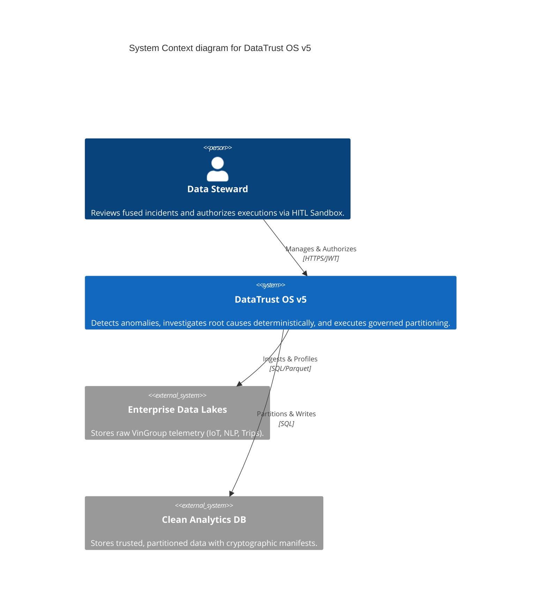
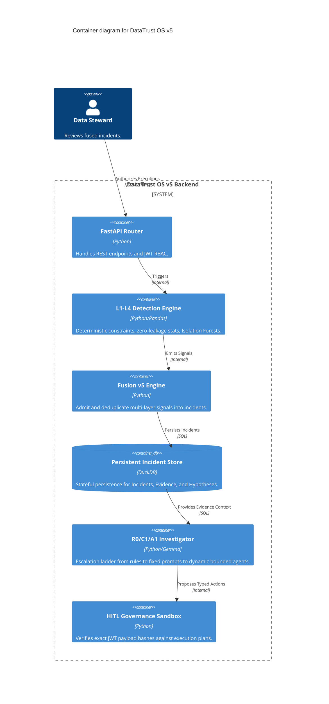

# 🧩 DataTrust OS v5 — Component Topology (C4 Model)

> **Document Status:** Official Production Component Topology  
> **Target Version:** DataTrust OS v5 (Operational Trust Console)  
> **Last Updated:** 2026-08-11  

---

## 1. System Context

**DataTrust OS v5** acts as the operational trust boundary between raw ingested telemetry (VinFast, V-GREEN, Xanh SM) and downstream clean analytics systems. Unlike previous iterations, it is not an open-ended multi-agent chat system; it is a strict, pipeline-driven governance console.

---

## 2. Container Topology

The backend topology enforces physical and logical separation between Detection, Fusion, Investigation, and Execution.

---

## 3. Core Component Boundaries

### 3.1 Detection Engine (L1 - L4)
- **Component:** `src/reliability/detectors/`
- **Responsibility:** Identify specific statistical or relational deviations.
- **Constraints:** Must NEVER look ahead. Must separate `ref_df` from `eval_df`.
- **Outputs:** `Signal` objects.

### 3.2 Fusion v5 Engine
- **Component:** `src/reliability/fusion.py`
- **Responsibility:** Group signals by entity and time. Reduce alert fatigue.
- **Constraints:** Zero LLM usage. Purely deterministic logic.
- **Outputs:** `Incident` objects persisted to DuckDB.

### 3.3 Dynamic Investigation Ladder (R0 $\rightarrow$ C1 $\rightarrow$ A1)
- **Component:** `src/reliability/investigation/`
- **Responsibility:** Find the root cause of an Incident.
- **Constraints:** R0 and C1 run first. A1 only runs on ambiguous results. A1 uses strictly typed, read-only tools. A1 must `ABSTAIN` if evidence is lacking.
- **Outputs:** `Hypothesis` and `Recommendation` objects.

### 3.4 Governance & Execution
- **Component:** `src/reliability/governance/preventive_controls.py`
- **Responsibility:** Safely execute a recommendation.
- **Constraints:** Requires user cryptographically signed JWT hash matching the `ctrl.version_hash`. AI cannot bypass.
- **Outputs:** Clean partition / Quarantined records.

---
*DataTrust OS v5 — Component Topology*
