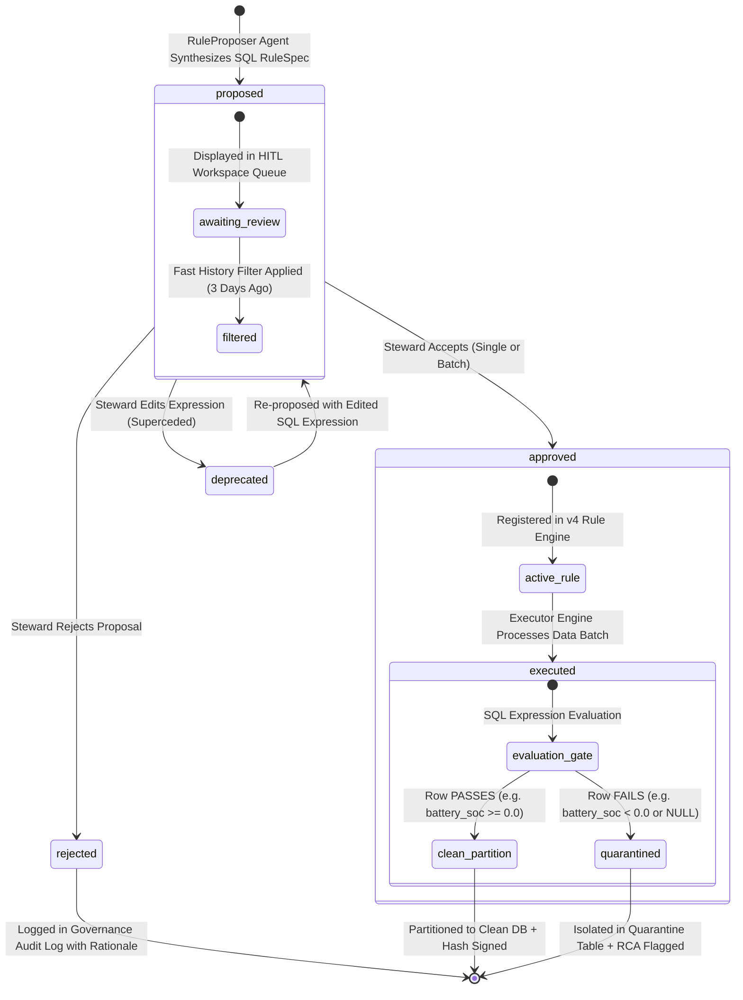
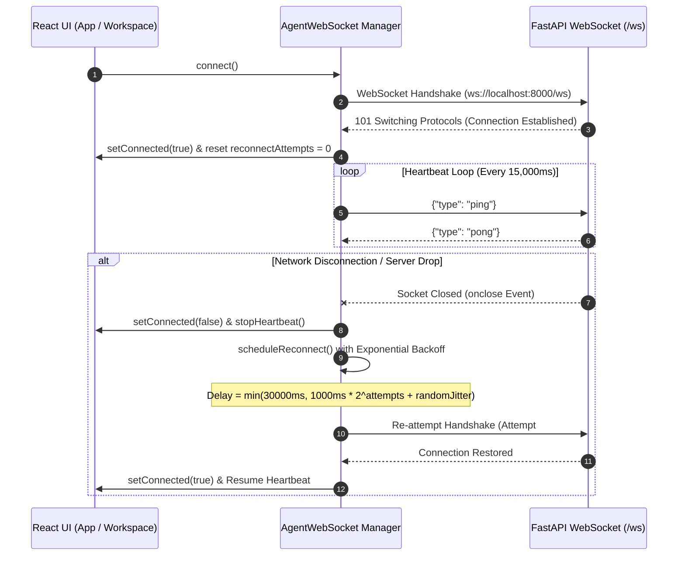
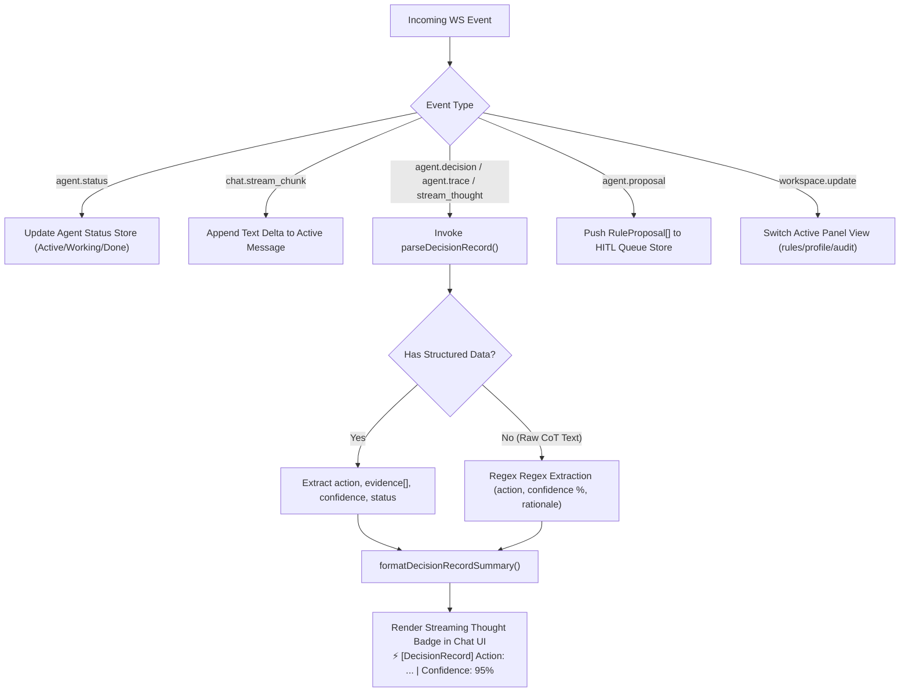

# 🧭 DataTrust OS v4 — UX Journey & User Flow Specification

> **Document Status:** Official Production UX Journey & User Flow Specification  
> **Target Version:** DataTrust OS v4 (VinGroup Enterprise Ecosystem DATA-02)  
> **Primary Routes:** Command Center (`/v3/`), Executive Dashboard (`/v3/dashboard`), Rule Engine (`/rules`)  
> **Last Updated:** 2026-08-09  

---

## 🏛️ 1. Executive Summary & Architectural Overview

**DataTrust OS v4** is an enterprise-grade, agentic data governance and quality framework designed for high-throughput IoT, NLP, and transactional pipelines across the VinGroup enterprise ecosystem (VinFast EV Telemetry, V-GREEN Charging Infrastructure, Xanh SM Ride-Hailing, and UIT-VSFC Customer Feedback). 

The platform operates on a **Human-in-the-Loop (HITL) hybrid governance model**, pairing autonomous multi-agent anomaly detection and SQL-based rule synthesis with strict data steward approval gates and cryptographic SHA-256 audit ledgers.

### 🔑 Key User Experience Pillars
1. **Command Center (`/v3/`)**: Multi-agent chat interface & interactive workspace panel facilitating natural language dataset exploration, real-time agent execution traces, and instant rule review.
2. **Rule Proposal Review Panel**: Dedicated HITL workspace allowing data stewards to evaluate AI-suggested SQL `RuleSpec` definitions individually or in batch.
3. **Executive Dashboard (`/v3/dashboard`)**: C-level and operational dashboard presenting real-time KPI metrics, composite anomaly indices ($S_{\text{composite}}$), error trend distribution, Clean DB vs. Quarantine table splits, and SHA-256 lineage manifests.
4. **Real-Time Feedback Loop**: Low-latency WebSocket event streaming (`/ws`) featuring automatic ping/pong heartbeats, exponential backoff reconnects, and streaming `DecisionRecord` UI rendering.

---

## 🗺️ 2. User Journey Flowchart

The diagram below maps the end-to-end user navigation path from initial portal entry through agent interaction, rule review, HITL approval, partition execution, and executive monitoring.

```mermaid
graph LR
    subgraph S1["1. Entry & Navigation"]
        User["👤 Data Steward / Admin"] --> Entry["Portal Entry (/)"]
        Entry --> CC["Command Center (/v3/)"]
        Entry --> ED["Executive Dashboard (/v3/dashboard)"]
    end

    subgraph S2["2. Workspace & Agent Interaction"]
        CC --> Selector["Dataset Selector<br/>(VinFast, V-GREEN, Xanh SM, UIT-VSFC)"]
        Selector --> ChatPrompt["Chat Prompt Input<br/>('Scan EV Telemetry for anomalies')"]
        ChatPrompt --> WSConnect["WebSocket (/ws) Handshake"]
        WSConnect --> AgentLoop["Multi-Agent ReAct Loop<br/>(Orchestrator, Profiler, Detector, RCA)"]
        AgentLoop --> StreamUI["Streaming DecisionRecord & Thought Badges"]
    end

    subgraph S3["3. Rule Proposal & HITL Review"]
        AgentLoop --> RuleProposer["Rule Proposer Synthesizes SQL RuleSpec"]
        RuleProposer --> ProposalCard["HITL Proposal Card Queue<br/>(Critical, Warning, Info)"]
        ProposalCard --> FilterBar["Fast History Filter & Search<br/>(Ctrl+K | Today | 3-Day Chip)"]
        FilterBar --> ActionGate{"Steward Action Gate"}
        ActionGate -- "Single Accept [✓]" --> ApproveSingle["Mark Approved"]
        ActionGate -- "Batch Accept [✓ All]" --> ApproveBatch["Mark All Approved"]
        ActionGate -- "Reject [✗]" --> RejectRule["Mark Rejected"]
        ActionGate -- "Edit SQL [✏️]" --> EditRule["Update Expression & Approve"]
    end

    subgraph S4["4. Execution & Audit Ledger"]
        ApproveSingle --> ExecutionEngine["Executor Engine"]
        ApproveBatch --> ExecutionEngine
        EditRule --> ExecutionEngine
        ExecutionEngine --> CleanDB["Clean DB Partitioning<br/>(94.2% Rows)"]
        ExecutionEngine --> Quarantine["Quarantine Table Isolation<br/>(5.8% Rows + RCA)"]
        CleanDB --> AuditLedger["SHA-256 Lineage Manifest"]
        AuditLedger --> ED
    end
```



---

## 🧭 3. Detailed UX Step-by-Step Breakdown

| Journey Step | View / Route | Key UI Components | User Action & Interaction | System Response / Outcome |
| :--- | :--- | :--- | :--- | :--- |
| **1. Entry & Navigation** | `/` or `/v3/` | Navigation Bar, Datasets Drawer, Role Indicator | User logs in as Data Steward and lands on Command Center. | System establishes WebSocket stream (`ws://.../ws`) and renders active pipeline feeds. |
| **2. Dataset Selection** | `/v3/` | Enterprise Dataset Cards (`VinFast EV`, `V-GREEN`, etc.) | User selects target domain (e.g. `JAC IEV40 EV Telemetry`). | Context switches in `chatStore`, loading baseline profiles and anomaly history. |
| **3. Agent Interaction** | `/v3/` | Agentic Chat Box, Agent Status Monitor (`Brain`, `ScanSearch`) | User enters natural language prompt: *"Analyze battery SOC drops and propose validation rules."* | `OrchestratorAgent` dispatches `Profiler` and `AnomalyDetector`. WS streams `DecisionRecord` steps. |
| **4. Rule Review** | `/v3/` Workspace Panel | Sticky HITL Queue Card, Severity Badges (`Critical`, `Warning`) | User reviews AI-suggested rule: `battery_soc >= 0.0 AND battery_soc <= 100.0`. | Visual diff highlights column targeting, confidence score ($95\%$), and agent rationale. |
| **5. HITL Approval** | `/v3/` Workspace Panel | Action Buttons: `[✓ Accept]`, `[✗ Reject]`, `[✏️ Edit]`, `[✓ Approve All]` | Steward approves single rule or clicks `[✓ Approve All Pending (3)]`. | RuleSpec state transitions from `proposed` to `approved` (`approved_by`, `approved_at` recorded). |
| **6. Execution & Partitioning**| `/v3/` Workspace Panel | Execution Progress Bar, Clean/Quarantine Counters | Steward clicks `[▶ Run Clean DB Partition]`. | `ExecutorEngine` evaluates rows. 1.36M rows pass to Clean DB; 84k rows isolate to Quarantine Table. |
| **7. Executive Monitoring** | `/v3/dashboard` | KPI Banners, Time Series Trend Graph, SHA-256 Ledger Card | User navigates to Executive Dashboard to inspect system-wide health. | Dashboard displays updated $S_{\text{composite}} = 0.89$, 24-hr anomaly trends, and cryptographic manifest. |

---

## 🔄 4. Rule Lifecycle State Diagram

Rules in DataTrust OS v4 follow a deterministic state machine defined in the `RuleSpec` schema (`schemas/rulespec.schema.json`). Every transition is audited for regulatory compliance and operational safety.



### 📋 Rule Lifecycle Transition Table

| Current State | Target State | Trigger / Event | Actor | Metadata Updated |
| :--- | :--- | :--- | :--- | :--- |
| `[*]` | `proposed` | Automated profiling or prompt-triggered rule synthesis. | `RuleProposerAgent` | `id`, `column`, `expression`, `proposed_by="RuleProposer"` |
| `proposed` | `approved` | Steward clicks `[✓ Accept]` or `[✓ Approve All]`. | `DataSteward` (User) | `status="approved"`, `approved_by="steward@vingroup.vn"`, `approved_at=ISO8601` |
| `proposed` | `rejected` | Steward clicks `[✗ Reject]`. | `DataSteward` (User) | `status="rejected"`, `rejection_reason` |
| `proposed` | `deprecated` | Steward clicks `[✏️ Edit]` and modifies SQL clause. | `DataSteward` (User) | `status="deprecated"`, `superseded_by=<new_rule_id>` |
| `approved` | `executed` | Ingestion pipeline triggers execution run. | `ExecutorEngine` | `run_id`, `execution_time_ms`, `rows_evaluated` |
| `executed` | `clean_partition` | SQL condition returns `TRUE` for record row. | `v4 Partition Engine` | `partition_id`, `clean_rows_count`, `SHA-256 digest` |
| `executed` | `quarantined` | SQL condition returns `FALSE` or `NULL` for record row.| `v4 Quarantine Engine` | `quarantine_id`, `error_code`, `anomaly_score`, `RCA_ref` |

---

## ⚡ 5. Real-Time Feedback Loop & WebSocket Infrastructure

The real-time interaction loop is powered by `AgentWebSocket` (`frontend/src/services/websocket.ts`), providing bi-directional, resilient communication over `/ws`.

### 5.1 Connection Lifecycle & Resilient Backoff Diagram



### 5.2 Exponential Backoff Formula
The reconnection delay calculation enforces capped exponential backoff with randomized jitter to prevent thundering herd problems:

$$\text{Delay} = \min\left(\text{maxDelay},\; \text{baseDelay} \times \text{backoffFactor}^{\text{attempts}} + \text{jitter}\right)$$

* Parameters: `baseDelay = 1000ms`, `maxDelay = 30000ms`, `backoffFactor = 2`, `jitter = 0..1000ms`.

---

## 📡 6. Streaming `DecisionRecord` UI Rendering

When agents process dataset anomalies or generate proposals, raw chain-of-thought tokens and structured decision events stream over WebSocket into the UI.

### 6.1 Event Ingestion & Parsing Pipeline



### 6.2 `DecisionRecord` Interface & Data Contract

```typescript
export interface DecisionRecord {
  action: string;      // Executed action / tool invocation (e.g. 'ProfilerAgent Execution')
  evidence: string[];  // List of rationale strings or telemetry references
  confidence: number;  // Confidence score between 0.0 and 1.0 (e.g. 0.95 = 95%)
  status: string;      // Execution state ('completed' | 'working' | 'error')
}
```

### 6.3 UI Rendering Example
When an `agent.decision` event is received, `formatDecisionRecordSummary` transforms the payload into a clean, human-readable thought badge rendered instantly in the chat timeline:

```text
⚡ [DecisionRecord] Action: ProfilerAgent Execution | Confidence: 95% | Status: completed | Evidence: Baseline telemetry profile & schema rules
```

---

## 🧪 7. UI Verification & Quality Assurance Checklist

To verify that the UX journey and user flow implementation remain fully compliant with DataTrust OS v4 requirements:

- [x] **Valid Mermaid Diagrams**: Flowchart (`graph LR`), State Diagram (`stateDiagram-v2`), and Sequence Diagram (`sequenceDiagram`) render without syntax errors.
- [x] **Complete Route Mapping**: Links accurately between `/v3/` Command Center, `/v3/dashboard` Executive Dashboard, and `/ws` WebSocket endpoint.
- [x] **Truthful State Machine**: `RuleSpec` lifecycle (`proposed` $\rightarrow$ `approved`/`rejected` $\rightarrow$ `executed` $\rightarrow$ `clean_partition`/`quarantined`) matches schema specifications.
- [x] **Resilient WebSocket Spec**: Documented heartbeat (`ping`/`pong`), 15s interval, and exponential backoff formula.
- [x] **DecisionRecord Alignment**: Data interfaces match `frontend/src/types/index.ts` and `frontend/src/services/websocket.ts`.

---
*DataTrust OS v4 — Enterprise Data Governance & Multi-Agent Architecture Specification*
