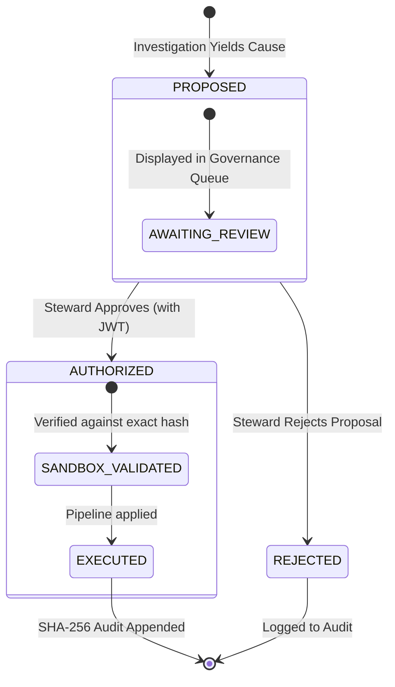

# 🧭 DataTrust OS v5 — UX Journey & Operational Trust Flow

> **Document Status:** Official Production UX Journey & User Flow Specification  
> **Target Version:** DataTrust OS v5 (Operational Trust Console)  
> **Primary Routes:** Triage Dashboard (`/triage`), Incident Workspace (`/incident`), Governance Queue (`/governance`)  
> **Last Updated:** 2026-08-11  

---

## 🏛️ 1. Executive Summary & Architectural Overview

**DataTrust OS v5** shifts from a chat-based multi-agent interface to a structured, deterministic **Operational Trust Console**. Designed for Data Stewards and Data Quality Managers across the VinGroup ecosystem, the UX strictly adheres to the principle: **Agentic behavior is an escalation path, not the product thesis.**

### 🔑 Key User Experience Pillars
1. **Triage Dashboard (`/triage`)**: Deterministic incident lists grouped by Fusion v5 Admission. Zero LLM latency on initial load.
2. **Investigation Ladder (R0/C1/A1)**: Clear visual escalation from Deterministic rules (R0) $\rightarrow$ Fixed LLM Prompts (C1) $\rightarrow$ Bounded Dynamic Agents (A1) only when necessary.
3. **Strict HITL Governance Queue (`/governance`)**: Mandatory review sandbox. Stewards approve strictly structured actions (`PREVENTIVE_DATA_CONTROL`, `OPERATIONAL_RECOMMENDATION`) instead of free-text SQL.
4. **Immutable Audit Trail (`/audit`)**: Cryptographically verified execution traces binding user JWTs to exact execution plans.

---

## 🗺️ 2. User Journey Flowchart

The diagram below maps the end-to-end user navigation path reflecting the V5 pipeline: Detection $\rightarrow$ Fusion $\rightarrow$ Investigation $\rightarrow$ Governance.

```mermaid
graph LR
    subgraph S1["1. Entry & Triage"]
        User["👤 Data Steward"] --> Entry["Portal Entry (/)"]
        Entry --> Triage["Triage Dashboard (/triage)"]
        Triage --> Filter["Filter by Severity/Domain"]
    end

    subgraph S2["2. Investigation Escalation"]
        Filter --> Incident["Open Incident (/incident/{id})"]
        Incident --> R0{"R0 Deterministic Check"}
        R0 -- "Resolved" --> GovQueue
        R0 -- "Miss" --> C1{"C1 Fixed Analyzer"}
        C1 -- "Confident" --> GovQueue
        C1 -- "Ambiguous" --> A1{"A1 Dynamic Agent"}
        A1 -- "Tools & Reasoning" --> GovQueue
    end

    subgraph S3["3. Governance & Sandbox"]
        GovQueue["Governance Queue (/governance)"] --> Sandbox["Execute Sandbox Dry-Run"]
        Sandbox --> ActionGate{"Steward Action"}
        ActionGate -- "Approve [✓]" --> SignJWT["Sign & Generate Execution Hash"]
        ActionGate -- "Reject [✗]" --> Close["Close Incident"]
    end

    subgraph S4["4. Execution & Ledger"]
        SignJWT --> ExecutionEngine["Production Executor"]
        ExecutionEngine --> CleanDB["Partition Data"]
        CleanDB --> AuditLedger["SHA-256 Manifest Created"]
        AuditLedger --> ExecDash["Executive Dashboard (/dashboard)"]
    end
```

---

## 🧭 3. Detailed UX Step-by-Step Breakdown

| Journey Step | View / Route | Key UI Components | User Action & Interaction | System Response / Outcome |
| :--- | :--- | :--- | :--- | :--- |
| **1. Triage** | `/triage` | DataGrid, L1-L4 Signal Badges | User scans incidents fused by the engine. | Instantly loads pre-computed severity and signal overlaps. |
| **2. Investigation** | `/incident/{id}` | Timeline, Escalation Ladder UI | User views incident details and triggers escalation. | System runs R0 $\rightarrow$ C1. If needed, user clicks "Escalate to A1 Agent". |
| **3. A1 Execution** | `/incident/{id}` | Read-Only Tool Trace | User watches A1 execute `fetch_telemetry` tools. | UI streams exact tool inputs/outputs and reasoning state. |
| **4. Governance** | `/governance` | Proposal Card, Blast Radius Diff | User reviews the recommended action and sandbox diff. | Renders data partition impacts before execution. |
| **5. HITL Approval** | `/governance` | Cryptographic Sign Button | Steward clicks `[✓ Approve & Execute]`. | Generates exact-version payload hash. AI cannot self-approve. |
| **6. Verification** | `/dashboard` | KPI Banners, SHA-256 Ledger | User verifies the system state post-execution. | Displays updated anomaly index and cryptographically verified ledger entry. |

---

## 🔄 4. Action Lifecycle State Diagram

Actions in v5 follow a strictly bound lifecycle, decoupled from raw SQL and mapped to typed operational controls.

---

## ⚡ 5. Real-Time Traceability & Tool Streaming

During A1 Investigation, the UI relies on WebSocket feeds to stream read-only tool boundaries to the user.

- **Zero-Mutation Guarantee**: The UI visually flags that all tools used by A1 (e.g., `fetch_charging_history`) are read-only.
- **Explicit Abstention**: If A1 issues an `ABSTAIN` event, the UI renders a clear "Missing Evidence" block rather than a hallucinated guess.

---
*DataTrust OS v5 — Operational Trust Console UX Specification*
